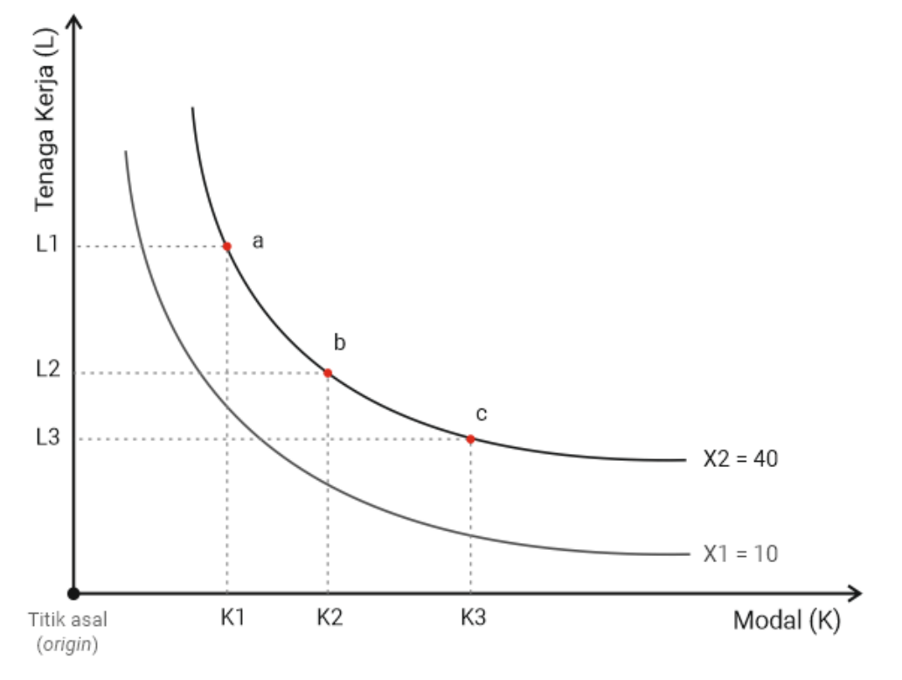
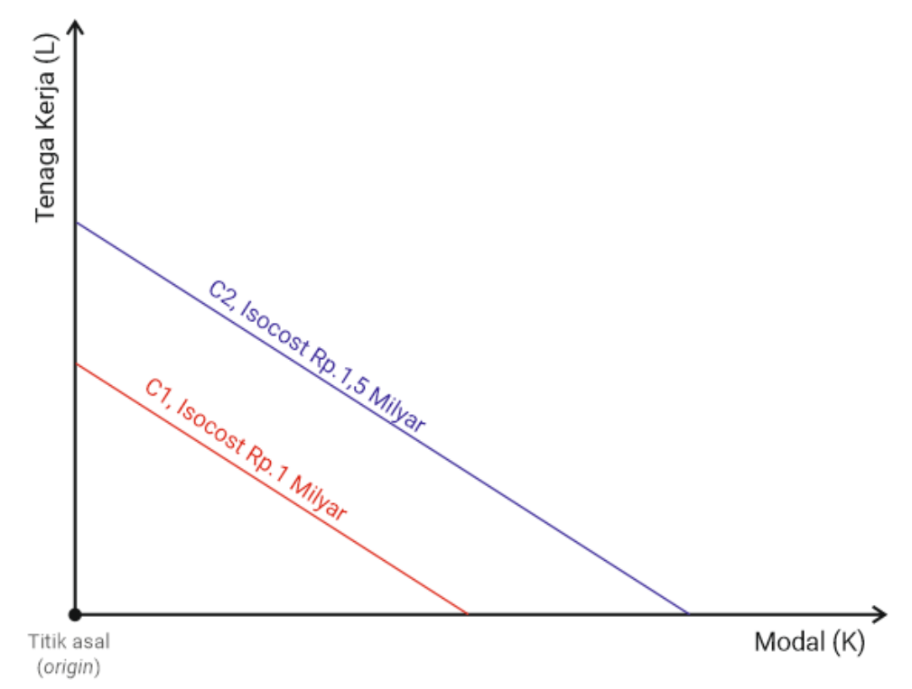
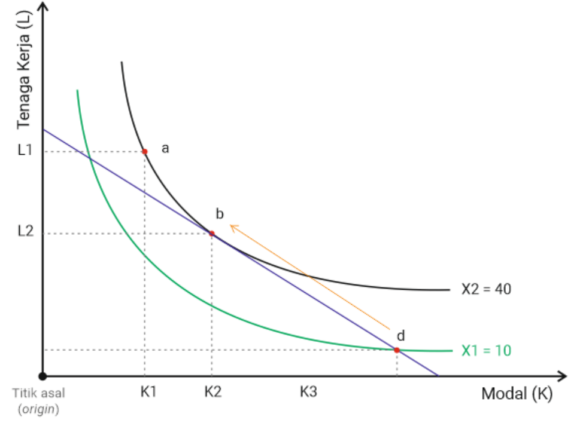
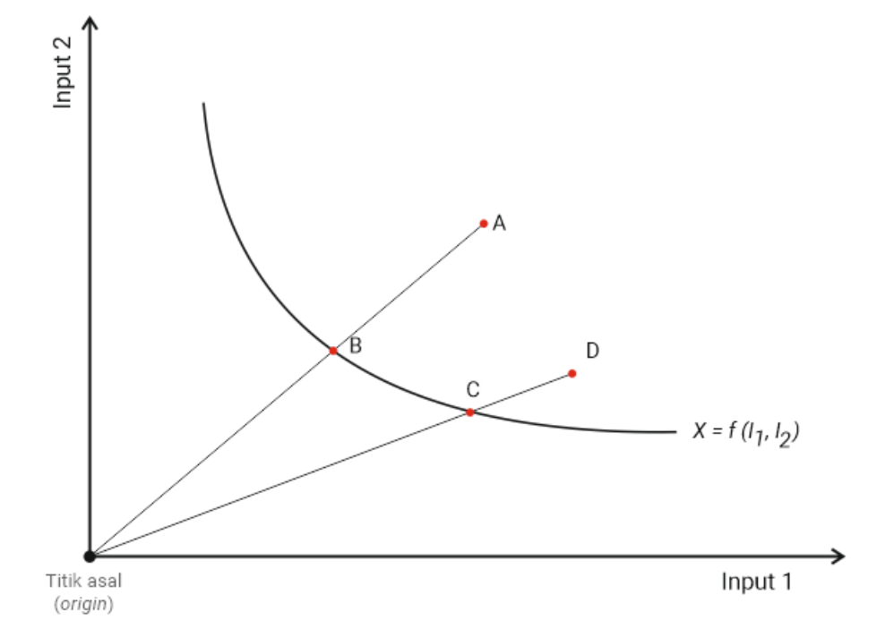

# Dasar-Dasar Efisiensi {#sec-dasar}

## Latar Belakang

Pengeluaran biaya di sektor kesehatan kini semakin meningkat dan tidak terbendung. Oleh sebab itu, sistem kesehatan harus bisa berjalan secara efisien agar semua uang yang dikeluarkan dapat menghasilkan manfaat sebesar-besarnya. Di era pandemi Covid-19, penelitian terkait efisiensi menjadi krusial karena terbatasnya sumber daya. Beberapa penelitian tersebut mengukur efisiensi atas penggunaan sumber daya untuk mitigasi transmisi, dan meminimalisasi kematian di tingkat global sehingga dapat menjadi pembelajaran bersama (Breitenbach, Ngobeni, dan Aye, 2021; Su *et al*., 2021; Ordu, Kirli Akin, dan Demir, 2021; Aydin dan Yurdakul, 2020). Investigasi bagaimana penanganan Covid-19 juga dilakukan di tingkat negara untuk membandingkan antardaerah dan fasilitas kesehatan, sebagai contoh di Malaysia, India, dan Iran (Md Hamzah, Yu, dan See, 2021; Maity, Ghosh, dan Barlaskar, 2020; Seddighi *et al*., 2021).

Pada tahun 2002 sampai 2014, total biaya kesehatan per kapita di Indonesia mengalami peningkatan dari 20 USD menjadi 100 USD, lebih tinggi jika dibandingkan dengan negara-negara berkembang lainnya (*The World Bank*, 2018). Selain karena adanya inflasi, teknologi baru, dan perubahan demografi, adanya inefisiensi fasilitas kesehatan juga dipercaya berkontribusi besar terhadap peningkatan tersebut (Hajialiafzali, Moss, dan Mahmood, 2007; Jacobs, Smith, dan Street, 2006). Secara global, rumah sakit merupakan penyumbang pengeluaran kesehatan paling besar dibandingkan aspek lainnya karena mencapai 50% (Barnum dan Kutzin, 1993). Bahkan, angka lebih besar ditemukan di negara-negara Asia-Pasifik, termasuk Indonesia yang biaya rumah sakit dan layanan rawat jalannya menghabiskan hingga 80% dari pengeluaran biaya kesehatan (Soewondo *et al*., 2011).

Salah satu bukti yang mengindikasikan inefisiensi tersebut adalah terjadinya kenaikan biaya pelayanan di fasilitas kesehatan yang tidak disertai dengan peningkatan pemanfaatannya. *Bed occupancy rate* (tingkat hunian tempat tidur) di rumah sakit hanya sekitar 60% dan di puskesmas tidak sampai 30% (Firdaus Hafidz, Ensor, dan Tubeuf, 2018a; Mahendradhata *et al*., 2017). Angka ini masih jauh dari ideal jika dibandingkan dengan rekomendasi *World Health Organization* (WHO), yaitu mencapai 85% (Chisholm dan Evans, 2010).

Tidak hanya layanan rawat inap, rata-rata *contact rate* di fasilitas kesehatan tingkat primer di Indonesia hanya satu kunjungan per orang per tahun, lebih rendah dibandingkan dengan negara tetangga, seperti Malaysia, Vietnam, dan Thailand yang telah mencapai dua hingga tiga kunjungan orang per tahun (OECD/WHO, 2014; Ensor dan Indradjaya, 2012; Cashin, Borowitz, dan Zuess, 2002). Rendahnya pemanfaatan fasilitas kesehatan ini mengindikasikan adanya inefisiensi pada pelayanan kesehatan di Indonesia (Rokx, 2009). Beberapa studi menunjukkan bahwa kapasitas fasilitas kesehatan yang tidak sesuai dan adanya hambatan untuk mengakses fasilitas kesehatan memengaruhi efisiensi fasilitas kesehatan (Chalidyanto, 2013; Chisholm dan Evans, 2010; Weaver dan Deolalikar, 2004).

Adanya keterbatasan sumber daya kesehatan menjadikan penilaian efisiensi fasilitas kesehatan sebagai hal yang penting dari sudut pandang kebijakan. Selain itu, dengan diterapkannya pola pembayaran prospektif di era Jaminan Kesehatan Nasional (JKN), fasilitas kesehatan mau tidak mau harus bisa beroperasi secara efisien. Sementara itu, dari sisi pemerintah, ada kepentingan untuk memastikan keberlanjutan program JKN dari sisi pembiayaan. Oleh karena itu, kajian mengenai pengukuran efisiensi fasilitas kesehatan menjadi sangat relevan, termasuk mencoba mempelajari faktor-faktor yang memengaruhi efisiensi tersebut. Bab ini akan menjelaskan konsep produksi, konsep efisiensi, hingga gambaran umum mengenai metodologi pengukuran efisiensi, terutama dalam konteks fasilitas kesehatan.

## Konsep Produksi

Kita harus terlebih dahulu memahami apa itu produksi, untuk memahami konsep efisiensi. Secara umum, produksi merupakan proses mengombinasikan dan mengubah berbagai sumber daya (*input*) menjadi produk yang bisa dikonsumsi, baik itu barang maupun jasa (*output*) (Goolsbee, Levitt, dan Syverson, 2013; Morris, Devlin, dan Parkin, 2007).[^1]

Secara konsep, menurut Perloff (2014) terdapat tiga kategori *input*. *Pertama*, modal (*capital*), yaitu barang berwujud, sebagai contoh tanah, gedung, dan peralatan. *Kedua*, tenaga kerja (*labor*) yang terdiri atas tenaga manusia yang memberikan layanan, baik tenaga terampil, seperti dokter dan perawat maupun tenaga kurang terampil, seperti penjaga dan tenaga kebersihan. *Ketiga*, material, termasuk bahan mentah, seperti obat dan bahan habis pakai. Sebagai catatan, beberapa literatur menggunakan istilah faktor produksi untuk menyebut *input* dan produk untuk menyebut *output*.

Dalam konteks fasilitas kesehatan, baik rumah sakit maupun puskesmas, *input* yang dimaksud ialah modal (misalnya jumlah tempat tidur dan nilai bangunan), tenaga kerja (misalnya jumlah dokter, jumlah perawat, dan tenaga administrasi), dan material (misalnya obat dan bahan medis habis pakai). Sementara itu, *output* dapat diasosiasikan sebagai luaran menengah (*intermediate output*) yang meliputi jumlah kunjungan rawat jalan, hari rawat inap, dan jumlah operasi; atau luaran akhir (*final outcome*), contohnya jumlah kematian dan angka harapan hidup (Palmer dan Torgerson, 1999).

Hubungan antara kombinasi *input* yang digunakan untuk menghasilkan *output* dengan batasan teknologi dan pengelolaan kelembagaan yang dimiliki oleh suatu organisasi dapat dinyatakan dalam sebuah fungsi produksi (Perloff, 2014; Goolsbee, Levitt, dan Syverson, 2013; Pindyck dan Rubinfeld, 2008; Morris, Devlin, dan Parkin, 2007; Nicholson dan Snyder, 2007). Dengan demikian, *output* dapat diformulasikan sebagai hasil dari sebuah fungsi produksi atas *input-input* yang ada. Secara matematis, fungsi produksi dapat dirumuskan sebagai berikut.

$$q = f(L, K)$$ {#eq-1-1}

Adapun *q* adalah *output* yang diproduksi menggunakan *input* berupa tenaga kerja (*L*, *labor*) dan modal (*K*, *capital*). Persamaan (1.1) dapat diartikan bahwa variasi dari *input* menyebabkan variasi *output*, tetapi variasi *output* tidak menyebabkan variasi *input* (Perloff, 2014; Archibald dan Lipsey, 1982). Pada konteks fasilitas kesehatan, mereka dapat mengubah kedua jenis *input*, baik yang bersifat tetap (misalnya jumlah tempat tidur dan nilai bangunan) maupun tidak tetap (misalnya jumlah tenaga kerja dan jumlah bahan medis habis pakai) untuk meningkatkan produksi layanan kesehatan (Perloff, 2014).

Selanjutnya, untuk melihat hubungan antara teori produksi dengan efisiensi suatu fasilitas kesehatan, akan dijelaskan konsep *isoquant* dan *isocost* sebagai berikut.

### *Isoquant*

*Isoquant* (berasal dari kata *iso* yang berarti ‘sama’ dan *quant* yang berarti ‘kuantitas’) adalah sebuah kurva yang menggambarkan suatu proses produksi yang secara teknis efisien (*technically efficient*) karena fasilitas kesehatan tidak dapat lagi menambah *output* tanpa menambah *input* terlebih dahulu. Misalnya, suatu fasilitas kesehatan memproduksi satu jenis jasa layanan (satu *output*) dengan dua *input* berupa modal (*K*), seperti gedung serta tenaga kerja (*L*), misalnya dokter. Dengan keterbatasan teknis yang dimiliki, suatu fasilitas kesehatan dapat memaksimalkan produksinya menggunakan kombinasi yang berbeda dari *input-input* yang dimiliki untuk menghasilkan sejumlah *output* yang sama (*q*, *quantity*).

Kita bisa melihat @fig-1-1 berikut untuk memberikan gambaran lebih praktis.

{#fig-1-1}

Sumbu vertikal menunjukkan jumlah tenaga kerja (*L*), sedangkan sumbu horizontal menunjukkan modal (*K*) yang digunakan oleh suatu fasilitas kesehatan. Dalam hal ini, anggaplah dengan teknologi yang ada, fungsi produksi fasilitas kesehatan tersebut mengikuti sebuah kurva *isoquant* X~2~. Pada fasilitas kesehatan tersebut, kombinasi *input* pada titik a, b, maupun c akan menghasilkan *output* yang sama, yaitu 40 unit (*q* = 40). Kita bisa melihat bahwa dengan mengurangi *L* dari *L*~1~ ke *L*~2~, fasilitas kesehatan tersebut dapat menghasilkan *output* yang sama jika melakukan penambahan kapital dari K~1~ menjadi K~2~.

Secara teoretis, *isoquant* diasumsikan memiliki tiga sifat berikut.

1. Semakin jauh suatu *isoquant* dari titik asal (*origin*) maka semakin tinggi tingkat *output*-nya.

2. *Isoquant* tidak bersilangan.

3. *Isoquant* memiliki kemiringan ke bawah (*downward slope*).

### *Isocost*

Setelah memahami konsep *isoquant*, selanjutnya kita akan mempelajari konsep *isocost* (*iso* berarti ‘sama’, *cost* berarti ‘biaya’) . Secara sederhana, *isocost* dapat dipahami sebagai kombinasi *input* yang bisa dimiliki oleh suatu fasilitas kesehatan dengan jumlah total biaya yang sama. Jika fasilitas kesehatan tersebut memiliki total anggaran sejumlah *C* maka berapa jumlah tenaga kerja (*L*) dengan gaji tertentu (*w*, biasanya dinyatakan sebagai gaji per jam) dan berapa jumlah modal (*K*) dengan harga tertentu per satuan (*r*, tergantung satuan modalnya) akan mengikuti persamaan berikut.

$$C = wL + rK$$ {#eq-1-2}

Persamaan (1.2) dapat diterjemahkan menjadi sebuah garis *isocost* pada @fig-1-2 berikut.

{#fig-1-2}

Berdasarkan gambar tersebut, kita bisa mengetahui bahwa kurva *isocost* memiliki tiga sifat (Perloff, 2014), yaitu:

1. Jika garis *isocost* menyentuh salah satu garis sumbu, hal itu berarti fasilitas kesehatan hanya menggunakan salah satu dari tenaga kerja atau kapital.

2. Garis *isocost* yang jauh dari titik asal (*origin*) (contoh *C*~2~) mengindikasikan total biaya yang lebih tinggi dibandingkan dengan garis *isocost* yang lebih dekat ke titik asal (contoh *C*~1~).

3. Garis *isocost* memiliki kemiringan (*slope*) yang ditentukan oleh faktor rasio harga.

Jika diasumsikan bahwa tujuan dari suatu fasilitas kesehatan adalah untuk memaksimalkan keuntungan, fasilitas kesehatan tersebut harus menggunakan total anggaran yang dimilikinya (diwakili oleh garis *isoquant*) untuk menghasilkan *output* sebanyak-banyaknya (diwakili oleh kurva *isoquant* yang paling tinggi). Berdasarkan dua informasi tersebut, bisa diketahui menggunakan kombinasi *input* yang menunjukkan bagaimana suatu fasilitas kesehatan dapat menghasilkan *output* paling optimal.

{#fig-1-3}

Pada @fig-1-3, dimisalkan bahwa kemampuan produksi suatu fasilitas kesehatan mengikuti dua kurva *isoquant* yang masing-masing memproduksi *X*~1~ = 10 dan *X*~2~ = 40, sedangkan kemampuan anggarannya mengikuti satu garis *isocost* (*C*~2~). Titik d ada pada *isoquant* yang memproduksi *X*~1~ sehingga kombinasi L dan *K* pada titik tersebut dapat dikatakan efisien secara teknis. Akan tetapi, pada garis *isocost C*~2~ dapat juga dihasilkan *output* yang lebih banyak dengan kombinasi *input* yang berbeda, yaitu pada titik b, yang bersinggungan dengan *isoquant X*~2~ yang menghasilkan 40 unit. Maksimalisasi *output* berdasarkan biaya tertentu dapat disebut efisiensi produktif.

Setelah memahami konsep produksi, berikutnya kita akan membahas mengenai konsep efisiensi, terutama dalam konteks fasilitas kesehatan.

## Konsep Efisiensi

Pada bagian sebelumnya, terminologi efisiensi sudah sedikit disinggung ketika kita membahas tentang konsep produksi. Pada buku ini, efisiensi diartikan sebagai jumlah *output* yang dapat diproduksi menggunakan *input* tertentu dengan meminimalisasi usaha atau biaya yang terbuang secara percuma (Jacobs, Smith, dan Street, 2006; Mas-Colell, Whinston, dan Green, 1995). Secara umum, terdapat tiga konsep utama dalam efisiensi, yakni efisiensi teknis, efisiensi produktif, dan efisiensi alokatif (Palmer dan Torgerson, 1999). Pada buku ini, konsep efisiensi yang akan dibahas terutama ialah konsep efisiensi teknis. Akan tetapi, penjelasan singkat tentang konsep efisiensi yang lain juga akan diberikan.

### Efisiensi Teknis

Efisiensi teknis merupakan kemampuan organisasi yang menggunakan *input* sedikit mungkin untuk memproduksi *output* dengan jumlah tertentu atau sebaliknya dan untuk memaksimalkan *output* menggunakan sumber daya *input* yang tersedia (Coelli *et al*., 2005; Palmer dan Torgerson, 1999). Sebagai contoh, diketahui sebuah *frontier*[^2] X yang menggambarkan kombinasi *input* minimal untuk menghasilkan suatu *output*. Terdapat empat organisasi A, B, C, dan D yang memproduksi *output* yang sama menggunakan kombinasi *input* 1 dan *input* 2 (lihat @fig-1-4). Dalam hal ini, fasilitas kesehatan B dan C dapat dikatakan efisien secara teknis. Sementara itu, fasilitas kesehatan A dan D dapat dikatakan inefisien karena menggunakan kombinasi *input* yang lebih banyak untuk menghasilkan suatu *output* yang sama.

### Efisiensi Produktif

Efisiensi produktif diartikan memaksimalkan *output* dengan total biaya tertentu atau meminimalkan biaya dengan jumlah *output* tertentu. Jika memaksimalkan *output* merupakan tujuan utama, kombinasi harga dari *input* menjadi bahan pertimbangan utama untuk meminimalkan total biaya (Glied dan Smith, 2011).

{#fig-1-4}

### Efisiensi Alokatif

Efisiensi alokatif adalah kondisi ketika kemampuan organisasi tidak hanya mempertimbangkan efisiensi produktif saja, tetapi juga mengalokasikan kombinasi *input* atau *output* untuk memaksimalkan kesejahteraan sosial (Glied dan Smith, 2011; Palmer dan Torgerson, 1999). Dengan demikian, efisiensi alokatif tidak hanya memaksimalkan keuntungan, tetapi juga memastikan *outcome* terdistribusi secara merata atau untuk tujuan keadilan (*equity*) sosial.

### Orientasi

Terlepas dari teknik yang digunakan, hasil pengukuran efisiensi dapat diinterpretasikan dengan berbagai cara, tergantung pada orientasinya (Hussey *et al*., 2009). Pengukuran efisiensi produksi dapat berorientasi terhadap *input* maupun *output*. Penulis menemukan bahwa penelitian yang menggunakan orientasi *input* maupun *output* jumlahnya seimbang. Contoh dari hasil penilaian efisiensi dengan orientasi *input* adalah adanya rekomendasi untuk melakukan realokasi kelebihan tenaga medis dan mengurangi kapasitas fasilitas kesehatan agar semakin efisien. Akan tetapi, dari sudut pandang etika, ini mungkin bukan cara yang tepat untuk konteks fasilitas kesehatan di negara berkembang yang masih menghadapi kesulitan terkait ketersediaan sumber daya (Marschall dan Flessa, 2011; Kirigia *et al*., 2008).

Orientasi *output* (contohnya meningkatkan kegiatan penjangkauan, mengurangi hambatan fisik dan keuangan, meningkatkan tingkat pemanfaatan, dan lain-lain) mungkin dapat menjadi sikap yang lebih dapat diterima dalam konteks negara berkembang. Selain itu, orientasi *input* bisa sangat sulit diterapkan di fasilitas kesehatan yang dimiliki oleh pemerintah. Proses birokrasi dapat membuat prosedur perekrutan atau pemberhentian karyawan dan pembelian atau pembuangan aset menjadi rumit serta memakan waktu. Namun, jenis orientasi ini mungkin dapat dilakukan jika fasilitas tersebut diberikan peningkatan otonomi sehubungan dengan keputusan manajemen sumber daya.

## Simulasi R: memahami efisiensi dengan data buatan

Bagian ini adalah tambahan edisi daring. Angka di bawah dibuat untuk belajar, bukan data rumah sakit nyata. Jalankan kode secara berurutan di RStudio. Kode membuat grafik yang serupa dengan @fig-1-1 sampai @fig-1-4 agar pembaca dapat mengubah asumsi dan melihat akibatnya.

::: {.callout-note}
## Catatan edisi daring

Edisi cetak memakai ilustrasi statis pada @fig-1-1 sampai @fig-1-4. Edisi daring menambahkan simulasi R yang menghasilkan ilustrasi sejenis; bentuk kurva, angka, dan titiknya sengaja disederhanakan untuk pembelajaran.
:::

### Langkah 1. Isoquant dan isocost

**Masalah:** pengelola ingin menghasilkan 40 layanan dengan kombinasi tempat tidur dan tenaga yang berbeda. **Tujuan:** melihat bahwa beberapa kombinasi input dapat menghasilkan output yang sama. **Metode:** fungsi produksi sederhana $q=2\sqrt{KL}$, dengan $K$ = tempat tidur dan $L$ = FTE tenaga. `seq()` membuat deret nilai, sedangkan `curve()` menggambar fungsi.

```{r}
# Chunk B1.01 — persiapan mandiri Bab I.
source("R/chunk_helpers.R")
book_begin_chapter("Bab 1")
# Data buatan dan kurva isoquant q = 40.
K <- seq(10, 100, length.out = 200)        # modal: tempat tidur
L_iso <- 400 / K                            # tenaga yang diperlukan saat q = 40
plot(K, L_iso, type = "l", lwd = 2, col = "#0072B2",
     xlab = "Modal: tempat tidur (K)", ylab = "Tenaga: FTE (L)",
     main = "Isoquant: 40 layanan")
points(c(20, 40, 80), c(20, 10, 5), pch = 19)
text(c(20, 40, 80), c(20, 10, 5), labels = c("a", "b", "c"), pos = 3)

# Garis isocost: anggaran 240, biaya FTE = 8 dan tempat tidur = 2.
plot(K, (240 - 2 * K) / 8, type = "l", ylim = c(0, 30), lwd = 2,
     col = "#D55E00", xlab = "Modal: tempat tidur (K)",
     ylab = "Tenaga: FTE (L)", main = "Isocost: anggaran yang sama")
abline(h = 0, v = 0, col = "grey70")
```

**Hasil yang diharapkan:** grafik pertama melengkung ke bawah; titik a, b, dan c berada pada kurva yang sama. Grafik kedua berupa garis lurus. **Interpretasi:** titik pada isoquant menggunakan kombinasi input yang secara teknis cukup untuk menghasilkan 40 layanan; belum tentu paling murah karena harga tenaga dan tempat tidur belum dipertimbangkan.

### Langkah 2. Efisiensi teknis, produktif, dan alokatif

**Masalah:** dua rumah sakit dapat menghasilkan layanan yang sama, tetapi memakai input dan biaya berbeda. **Tujuan:** membedakan tiga istilah yang sering tertukar. **Metode:** titik `A` memakai input berlebih; `B` berada pada isoquant sehingga teknis efisien; `C` berada pada titik singgung isoquant-isocost sehingga juga produktif dan alokatif untuk harga yang diasumsikan.

```{r}
# Chunk B1.02 — memakai objek K dan L_iso dari Chunk B1.01.
book_require("B1.02", c("K", "L_iso"))
# Tiga rumah sakit buatan untuk satu output q = 40.
tutorial_rs <- data.frame(rs = c("A", "B", "C"), beds = c(60, 40, 20),
                 fte = c(20, 10, 20))
# Skor input-oriented sederhana: kebutuhan tenaga pada isoquant / tenaga aktual.
tutorial_rs$fte_minimum <- 400 / tutorial_rs$beds
tutorial_rs$efisiensi_teknis <- tutorial_rs$fte_minimum / tutorial_rs$fte
tutorial_rs$biaya <- 2 * tutorial_rs$beds + 8 * tutorial_rs$fte
tutorial_rs

plot(K, L_iso, type = "l", lwd = 2, xlim = c(0, 80), ylim = c(0, 30),
     xlab = "Tempat tidur", ylab = "FTE", main = "Tiga bentuk efisiensi")
points(tutorial_rs$beds, tutorial_rs$fte, pch = 19, col = c("#D55E00", "#0072B2", "#009E73"))
text(tutorial_rs$beds, tutorial_rs$fte, labels = tutorial_rs$rs, pos = 3)
abline(a = 30, b = -2/8, lty = 2)           # isocost melalui C
legend("topright", legend = c("A: inefisien teknis", "B: teknis", "C: produktif/alokatif"),
       pch = 19, col = c("#D55E00", "#0072B2", "#009E73"), bty = "n")
```

**Hasil yang diharapkan:** tabel menunjukkan `efisiensi_teknis` A kurang dari 1, sedangkan B dan C sama dengan 1. **Interpretasi:** efisiensi teknis hanya bertanya apakah input dapat dikurangi untuk output yang sama. Efisiensi produktif menambahkan pertanyaan biaya terendah. Efisiensi alokatif menambahkan tujuan sosial: kombinasi layanan dan input yang hemat belum otomatis adil; akses kelompok terpencil, mutu, dan kebutuhan pasien tetap harus dipertimbangkan.

### Langkah 3. Menghitung kebutuhan perbaikan secara sederhana

Untuk titik A, skor efisiensi teknis orientasi input menunjukkan proporsi FTE yang masih diperlukan bila tempat tidur tetap. Nilai di bawah 1 bukan persentase keberhasilan, melainkan faktor pengurangan input pada model sederhana ini.

```{r}
# Chunk B1.03 — memakai tabel tutorial_rs dari Chunk B1.02.
book_require("B1.03", "tutorial_rs")
A <- subset(tutorial_rs, tutorial_rs$rs == "A")
A$fte_target <- A$fte * A$efisiensi_teknis
A$fte_dapat_dialihkan <- A$fte - A$fte_target
A[c("rs", "fte", "fte_target", "fte_dapat_dialihkan", "efisiensi_teknis")]
```

**Hasil yang diharapkan:** A memerlukan 6,67 FTE untuk mencapai isoquant pada 60 tempat tidur, sehingga sekitar 13,33 FTE merupakan potensi pengalihan dalam ilustrasi ini. **Interpretasi:** hasil bukan rekomendasi mengurangi staf. Dalam fasilitas kesehatan, tenaga dapat dialihkan untuk memperluas layanan, menurunkan waktu tunggu, atau meningkatkan mutu; keputusan nyata membutuhkan data kebutuhan dan keselamatan pasien.
## Kesimpulan

- Produksi adalah suatu proses yang dilakukan oleh organisasi atau badan usaha untuk menghasilkan sesuatu menggunakan kombinasi *input* tertentu.

- Dalam konteks produksi, fasilitas kesehatan menggunakan *input* berupa modal (misalnya lahan, gedung, alat medis) dan tenaga kerja (misalnya dokter, perawat, dan lain-lain) untuk menghasilkan *output* berupa layanan kesehatan, seperti kunjungan rawat jalan, hari rawat inap, dan operasi.

- Efisiensi terdiri atas efisiensi teknis, produktif, dan alokatif.

- Dalam konsep produksi, diagram *isoquant* dan *isocos*t digunakan untuk melihat efisiensi dengan menghubungkan antara sumber daya yang digunakan dan luaran yang dicapai.

[^1]: Untuk selanjutnya, istilah *input* dan *output* akan digunakan sesuai dengan definisi ini.

[^2]: Garis batas produksi.
