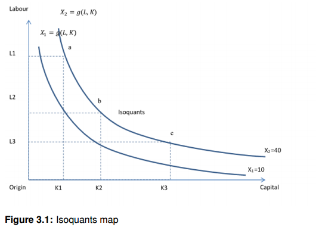
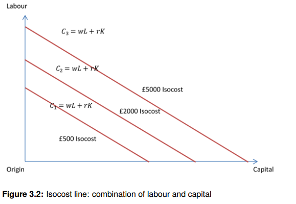
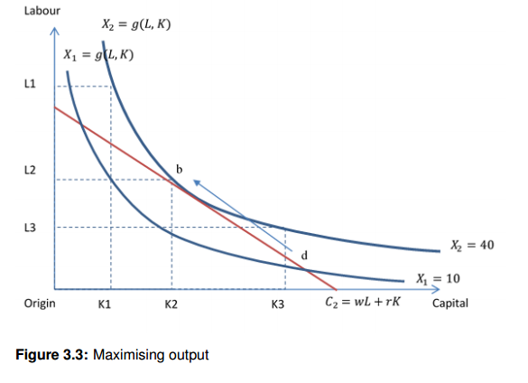
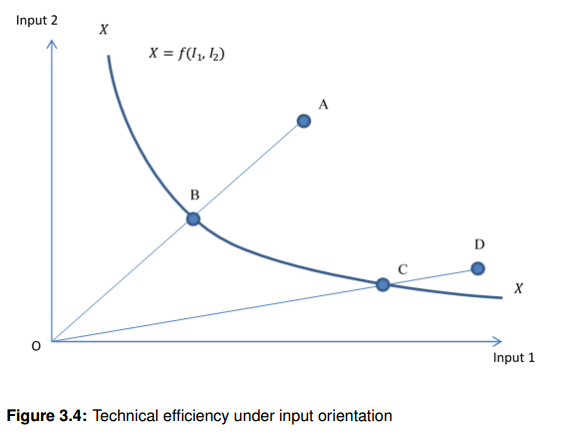
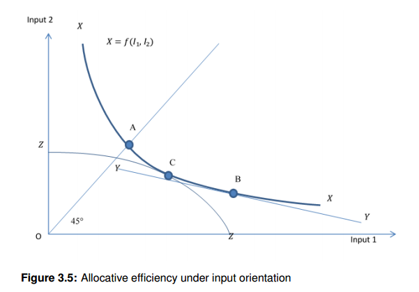
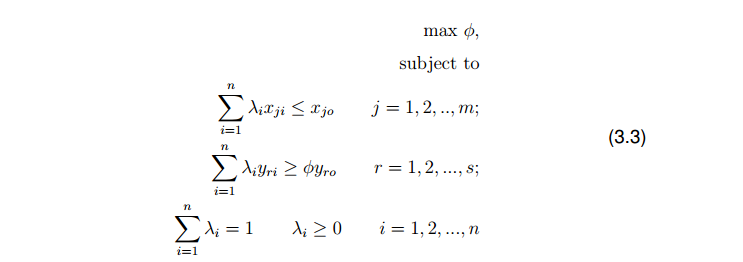
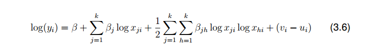
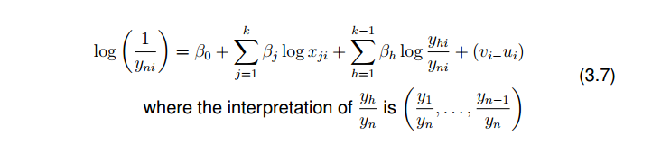
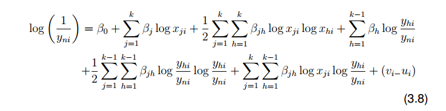
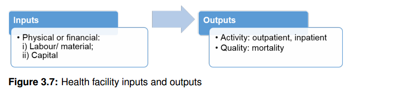

# Dasar-Dasar Efisiensi {#sec-dasar}

## Pengantar

Peniliaian atas efisiensi saat ini menjadi perhatian dalam layanan kesehatan. Sistem kesehatan yang berjalan secara efisien menjadi esensial untuk mencegah peningkatan biaya kesehatan yang tajam. Di antara tahun 2002 hingga 2014, total biaya kesehatan per kapita di Indonesia meningkat dari 20 USD hingga hampir 100 USD, lebih tinggi rata-rata per tahun dibandingkan negara berkembang lainnya (Bank, 2018). Inefisiensi fasilitas kesehatan dipercaya berkontribusi besar terhadap peningkatan biaya kesehatan, selain inflasi, teknologi baru dan perubahan demografi (Jacobs et al., 2006; Hajialiafzali et al., 2007). Biaya atas fasilitas kesehatan memiliki proporsi yang paling besar dalam pengeluaran biaya kesehatan. Secara global, rumah sakit mengkonsumsi biaya layanan kesehatan hingga 50% (Barnum and Joseph Kutzin, 1993). Sedangkan di wilayah Asia-Pasifik, termasuk Indonesia, biaya rumah sakit dan layanan rawat jalan mengkonsumsi hingga 80% dari pengeluaran biaya kesehatan (Soewondo et al., 2011).

Kenaikan biaya fasilitas kesehatan tidak dibarengi dengan peningkatan pemanfaatannya di Indonesia. Bed occupancy rate di rumah sakit hanya di sekitar 60% dan di Puskesmas tidak sampai 30% (Mahendradhata et al., 2017; F. Hafidz et al., 2018). Angka ini masih jauh dari ideal dibandingkan dengan rekomendasi World Health Organizations (WHO) yakni mencapai 85% (Chisholm and Evans, 2010). Tidak hanya layanan rawat inap, rata-rata *contact rate* di fasilitas kesehatan tingkat primer di Indonesia hanya satu kunjungan per orang per tahun, lebih rendah dibandingkan dengan negara tetangga seperti Malaysia, Vietnam dan Thailand yang telah mencapai dua hingga tiga kunjungan per orang per tahun (Cashin et al., 2002; Ensor and Indradjaya, 2012; OECD/World Health Organization, 2014). Rendahnya pemanfaatan fasilitas kesehatan dijadikan sebagai indikasi inefisiensi atas pelayanan kesehatna di Indonesia (Rokx, 2009). Beberapa studi menunjukkan bahwa kapasitas fasilitas kesehatan yang tidak sesuai dan rintangan untuk mengakses fasilitas kesehatan mempengaruhi efisiensi fasilitas kesehatan (Weaver and Deolalikar, 2004; Chisholm and Evans, 2010; Chalidyanto, 2013).

Keterbatasan sumber daya kesehatan menyebabkan evaluasi efisiensi fasilitas kesehatan menjadi penting untuk kebijakan kesehatan. Saat ini, di era jaminan kesehatan nasional, fasilitas kesehatan memiliki kepentingan untuk beroperasi secara efisien akibat mekanisme pembayaran secara prospektif. Sedangkan pemerintah memiliki kepentingan untuk memastikan keberlanjutan program jaminan kesehatan nasional dan biaya yang dikucurkan dimanfaatkan secara maksimal. Oleh karena itu penelitian untuk mengukur efisiensi menjadi sangat relevan termasuk menentukan faktor-faktor yang mempengaruhinya.

## Konsep produksi

Produksi melibatkan metode dan proses untuk mengkombinasikan dan merubah segala sumber daya (*input*) yang berwujud maupun tidak (e.g. informasi, pengetahuan) menjadi produk yang bisa dikonsumsi, termasuk barang dan jasa (*output*) yang memiliki nilai tukar (Morris et al., 2007; Goolsbee et al., 2013). Secara konsep, terdapat tiga kategori *input*, yaitu 1) modal, barang berwujud sebagai contoh tanah, gedung dan peralatan; 2) tenaga kerja, yagn terdiri dari tenaga manusia yang memberikan layanan baik tenaga terampil seperti dokter dan perawat, maupun kurang terampil seperti penjaga dan janitor; dan 3) material termasuk bahan mentah, sebagai contoh obat dan bahan habis pakai (Perloff, 2014).

Dalam konteks organisasi layanan kesehatan, rumah sakit atau Puskesmas membutuhkan *input* untuk menghasilkan *output. Input* yang dimaksud adalah modal (e.g. jumlah tempat tidur, nilai bangunan), tenaga kerja (e.g. jumlah dokter, jumlah perawat, dan tenaga administrasi), dan material (e.g. obat dan bahan medis habis pakai). Sedangkan *output* dapat diasosiasikan sebagai *intermediate output* antara lain jumlah kunjungan rawat jalan, hari rawta inap, dan jumlah operasi; atau *final outcome* sebagai contoh jumlah kematian dan angka harapan hidup (Palmer and Torgerson, 1999). Namun demikian, pengukuran *final outcome* seperti status kesehatan akan sulit diukur karena membutuhkan waktu untuk mengukur perubahan, banyaknya faktor yang mempengaruhi dan ketersediaan data (Masiye, 2007).

Sebagai tambahan, melayani pasien merupakan tujuan dari fasilitas kesehatan, oleh karena itu *intermediate output* digunakan sebagai upaya untuk meningkatkan status kesehatan, atau mencegah orang menjadi sakit (Morris et al., 2007; Blank and Valdmanis, 2010). Hubungan antara kombinasi *input* yang digunakan untuk memproduksi *output* dengan pengetahuan atas teknologi dan organisasi dideskripsikan dalam sebuah fungsi produksi (Morris et al., 2007; Nicholson and Snyder, 2007; Pindyck and Rubinfeld, 2008; Goolsbee et al., 2013; Perloff, 2014). Output dapat diformulasikan sebagai hasil dari sebuah fungsi produksi sebagai berikut:

$$q = f(L,K)$$

Dimana, $q$ adalah *output* yang diproduksi menggunakan $L$, tenaga kerja dan $K$, modal sebagai *input*. Variasi dari *input* menyebabkan variasi *output*, tetapi variasi *output* tidak menyebabkan variasi *input* (Archibald and Lipsey, 1982; Perloff, 2014). Fasilitas kesehatan dapat lebih mudah merubah kedua *input*, baik yang cenderung tetap (e.g. jumlah tempat tidur, nilai bangunan) dan berubah (e.g. jumlah tenaga kerja, jumlah bahan medis habis pakai) untuk meningkatkan produksi dalam jangka panjang daripada jangka pendek (Perloff, 2014). Dalam praktek, fasilitas kesehatan bereaksi untuk memastikan layanan kesehatan dilakukan secara efisien setelah pengenalan reformasi sistem pembayaran secara prospektif (Acemoglu and Finkelstein, 2008).

Pada tahapan ini, kita bisa menganggap bahwa satu fasilitas kesehatan memproduksi satu jenis jasa dengan dua input berupa kapital (termasuk lahan) sebagai input tetap (*fixed input)*, dan tenaga kerja/*labor* (termasuk material) sebagai input tak tetap (*variable input*). Kombinasi dari input-input untuk menghasilkan sejumlah output tertentu (*Quantity*) dapat dinyatakan sebagai *isoquant* (iso=sama, quant=kuantitas). Sebuah isoquant menunjukkan kombinasi input yang secara teknis efisien (technically efficient) untuk menproduksi output dalam jumlah tertentu. Tingkat yang efisien secara teknis dicapai ketika suatu firma tidak bisa lagi memproduksi lebih banyak jasa tanpa perlu penambahan input.

Sebagai contoh, anggap sebuah isoquant memproduksi output X2=40 (lihat gambar 3.1) dan tiga alternative kombinasi dari tenaga kerja dan kapital yang diberi nama a, b, dan c. Jika jumlah tenaga kerja dikurangi dari L1 ke L3, jumlah output X2 yang sama dapat dihasilkan di c jika tenaga kerja disubtitusi dengan penambahan kapital dari K1 ke K3. Isoquant diasumsikan memiliki tiga sifat. Pertama, semakin jauh suatu *isoquant* dari titik asal (*origin*), maka semakin tinggi tingkat outputnya; kedua, isoquant tidak bersilangan; dan ketiga, isoquant memiliki kemiringan kebawah (*downward slope*).

{width="88%" fig-align="center"}

Misal, diketahui C adalah total biaya dari suatu fasilitas kesehatan hipotetikal

*C = wL + rK*

Nilai C didapatkan dari perkalian antara kuantitas masing-masing input dengan harga masing-masing: dalam hal ini w sebagai upah per jam dan r merupakan biaya kapital (*capital cost*). Dengan munggunakan anggaran tertentu, semua kombinasi yang mungkin dari sejumlah tenaga kerja (L) dan kapital (K) dapat digambarkan sebagai kurva isocost (Gambar 3.2). Kurva isocost memiliki tiga sifat: pertama, jika isocost menyentuh salah sat ugaris sumbu, hal itu berarti provider hanya menggunakan salah satu dari tenaga kerja atau kapital saja. Kedua, garis isocost yang jauh dari titik asal (origin) (contoh C3) mengindikasikan total biaya yang lebih tinggi dibandingkan dengan garis isocost yang lebih dekat ke titik asal (contoh C1). Ketiga, garis isocost memiliki kemiringan yang sama yang ditentukan oleh faktor rasio harga (Perloff, 2014).

{width="96%" fig-align="center"}

Diasumsikan bahwa tujuan dari suatu provider adalah untuk memaksimalkan keuntungan, dan dalam konteks pelayanan kesehatan, fasilitas kesehatan memaksimalkan luaran kesehatan berdasarkan sumber daya yang dialokasikan. Dengan menggabungkan informasi pada biaya di garis *isocost* dan garis produksi yang efisien pada kurva *isoquant*, kombinasi optimal dari jumlah tenaga kerja dan kapital untuk memproduksi pelayanan dalam jumlah tertentu dapat ditentukan.

Sebagai contoh, terdapat dua isoquant yang masing-masing memproduksi X1=10 dan X2=40 dan satu garis isocost (C2) (lihat Gambar 3.3). Titik d ada pada isoquant yang memprouksi X1 sehingga kombinasi L dan K pada titik tersebut dapat dikatakan efisien secara teknis. Akan tetapi, pada garis isocost C2 dapat juga dihasilkan output yang lebih banyak dengan kombinasi input yang berbeda yaitu pada titik b, yang bersinggungan dengan isoquant X2 yang menghasilkan 40 unit. Maksimalisasi output berdasarkan biaya tertentu dapat disebut efisiensi produktif.

{width="97%" fig-align="center"}

## Konsep efisiensi

Penilaian efisiensi menjadi kunci penting dalam mengevaluasi kinerja layanan kesehatan dengan keterbatasan sumber daya. Efisiensi diartikan sebagai jumlah *output* yang dapat diproduksi menggunakan *input* dengan meminimalisasi usaha atau biaya yang terbuang secara percuma (Mas-Colell et al., 1995; Jacobs et al., 2006). Terdapat tiga konsep utama dalam efisiensi, yakni *technical effiicency*, *productive efficiency*, dan *allocative efficiency* (Palmer and Torgerson, 1999).

*Technical efficiency* adalah kemampuan organisasi untuk menggunakan *input* sedikit mungkin untuk memproduksi *output* dengan jumlah tertentu, atau sebaliknya untuk memaksimalkan *output* dengan menggunakan sumber daya *input* yang tersedia (Palmer and Torgerson, 1999; Coelli et al., 2005). Sebagai contoh, diketahui sebuah garis frontier yang menggambarkan konsep dari produksi output yang mungkin (*feasible production of output*) dengan empat badan/firma (lihat Gambar 3.4).

{width="96%" fig-align="center"}

*Productive efficiency* diartikan sebagai memaksimalkan *output* dengan total biaya, atau meminimalkan biaya dengan jumlah *output* tertentu. Jika memaksimalkan *output* adalah tujuan utama, kombinasi harga dari *input* menjadi bahan pertimbangan utama untuk meminimalkan total biaya (Glied and Smith, 2011). *Allocative efficiency* adalah kemampuan organisasi, tidak hanya mempertimbangkan *productive efficiency*, namun juga mengalokasikan kombinasi *input* atau *output* untuk memaksimalkan kesejahteraan sosial (Palmer and Torgerson, 1999; Glied and Smith, 2011). Sehingga *allocative efficiency* tidak hanya memaksimalkan keuntungan, tetap juga memastikan *outcome* terdistribusi secara merata atau untuk tujuan *equity* sosial.

{width="100%" fig-align="center"}

## Pengukuran efisiensi

Proses pengukuran efisiensi secara umum terbagi menjadi tiga tahap, yakni: 1) memilih teknik pengukuran efisiensi; 2) pemilihan input dan output; 3) menentukan faktor-faktor yang mempengaruhi efisiensi (variabel kontekstual) (Worthington, 2004). Berdasarkan hasil studi literatur, terdapat dua teknik utama dalam pengukuran efisiensi fasilitas kesehatan di negara berkembang, yakni *ratio analysis* dan *frontier analysis*.

*Ratio analysis* mengukur efisiensi dengan membandingkan rasio *input* dan *output* di antara fasilitas kesehatan (Firdaus Hafidz et al., 2018). Sementara, analisis *frontier* menggunakan pendekatan estimasi *production frontier* untuk mengetahui badan usaha/provider yang paling efisien sehingga bisa dijadikan pembanding (pengukuran efisiensi relative). Prosedur yang paling banyak digunakan dalam literatur adalah teknik non-parametrik yaitu *Data Envelopment Analysis (DEA)* atau teknik parametrik berupa *Stochastic Frontier Analysis (SFA)* (Hollingsworth dkk).

### Jenis-Jenis Teknik Pengukuran Efisiensi

#### Analisis Rasio

Analisis Rasio (AR) mengukur fisiensi dengan membandingkan rasio *input* dan *output* di antara fasilitas kesehatan (Firdaus Hafidz et al., 2018). Pada umumnya, pengukuran menggunakan teknik ini terbatas pada satu jenis input dan output. Sebagai contoh *bed occupancy rate*, yang menggunakan rasio jumlah hari rawat inap dan ketersediaan tempat tidur dalam periode tertentu.

Metode Pabon-Lasso model dapat mengakomodasi *ratio analysis* yang berbeda secara simultan (Lasso, 1986). Metode ini menggunakan teknik dengan cara memplotkan fasilitas kesehatan pada suatu grafik dan membaginya menjadi empat bagian sebagai indikator efisiensi. Secara umum, terdapat tiga indikator yang dinilai, yakni rerata *bed occupancy rate*, rerata *bed turnover rate*, dan rerata hari rawat inap.

Terdapat dua tipe dari *ratio analysis* yakni rasio *technical efficiency* dan rasio *economic efficiency* (Bitran, 1992). Rasio *technical efficiency* mengukur rasio dengan menggunakan input fisik sebagai contoh jumlah tempat tidur yang telah dijelaskan sebelumnya. Sedangkan rasio *economic efficiency* mengukur kinerja fasilitas kesehatan dengan menggunakan input biaya, sehingga rasio dalam bentuk satuan biaya per layanan. Membandingkan rerata satuan biaya per layanan di antara fasilitas kesehatan yang memiliki peran dan jenis sama sangat bermanfaat untuk evaluasi kinerja (Barnum and Josph Kutzin, 1993). Menurunkan rerata satuan biaya per layanan dengan tetap mempertahankan utilisasi mengindikasikan peningkatan efisiensi atas tingginya biaya tetap (Milsum et al., 1973). Namun demikian, variasi dari satuan biaya dari layanan di antara fasilitas kesehatan mesti diinterpretasikan secara hati-hati karena perbedaan harga *input* (Morris et al., 2007).

#### Analisis Frontier

Seperti sudah dijelaskan sebelumnya, terdapat dua jenis analisis frontier yang umum dipakai, yaitu DEA dan SFA. DEA dikembangkan oleh Charnes et al (1978) dengan menggunakan suatu program matematika untuk membangun suatu garis frontier sehingga tidak ada titik pengamatan yang berada di luar garis tersebut. Teknik ini dapat mengidentifikasi kinerja faskes dengan cara melakukan benchmarking dengan faskes yang efisien penuh yang ada pada garis frontier (Coelli ). DEA dapat diukur dengan menggunakan pendekatan berorientasi input (input-oriented) maupun output (output-oriented). Efisiensi berorientasi input didapatkan jika suatu faskes dapat menekan jumlah output yang dipakai untuk menghasilkan jumlah atau tingkat layanan yang sama. Sedangkan pada asumsi efisiensi berorientasi output, masing-masing faskes diharapkan dapat memaksimalkan output yang bisa diproduksi dengan menggunakan sumberdaya yang sama.

Secara matematis, hal tersebut dapat dirumuskan sebagai berikut:

{width="100%" fig-align="center"}

Dengan i=RUmah Sakit; xji adalah unput ke I, j=1,2,3... m adalah jumlah input; yri = output ke-i, r=1,2,...,s adalah jumlah output; lambda-i = himpunan pembobotan, untuk masing-masing rumah sakit, jumlah lambda adalah satu; theta = efisiensi rumah sakit. Sisi kanan rumus adalah satu dari n rumah sakit yang sedang dievaluasi; rumus sisi kiri adalah kombinasi konveks dari nilai-nilai yang teramati dari input dan output.

Baik pendekatan berorientasi input maupun output menggunakan angka satu (1) untuk menandakan faskes yang paling efisien. Inefisiens pada model berorientasi input memiliki nilai kurang dari 1 sedangkan pada model berorientasi output memiliki nilai lebih dari 1. Oleh karena itu, untuk dapat membandingkan secara langsung DEA berorientasi input, digunakanlah resiprokal dari skor DEA berorientsi output pada studi empiris.

Garis-garis frontier DEA berbeda tergantung dengan asumsi terkait skala (Scales) yang dipakai. Secara umum, terdapat dua asumsi yaitu constant return to scale (CRS) dan variable Return to Scale (VRS). CRS digunakan jika suatu faskes bisa meningkatkan output yang mereka hasilkan proporsional (secara linear) jika melakukan penambahan input. Dengan asumsi seperti ini, garis frontier akan berupa garis lurus dengan satu DMU/faskes yang ada pada garis tersebut. Sementara itu, VRS dapat lebih fleksibel, artinya penambahan output tidak selalu proporsional dengan penambahan input, dan seringkali sesuai dengan apa yang terjadi karena suatu faskes berada pada Batasan finansial, peraturan, juga keterbatasan-keterbatasan lain yang mengakibatkan mereka beroperasi secara sub-optimal. Akan tetapi, asumsi VRS dapat menyebabkan lebih sedikit faskes yang dinilai inefisien, khususnya ketika ada variasi ukuran faskes yang cukup besar.

DEA dianggap sebagai metode yang dominan dalam studi-studi pengukuran efisiensi dikarenakan kemampuannya untuk mengakomodasi inout dan output yang tipikal pada setting pelayanan kesehatan (Hollingsworth ...). Akan tetapi, DEA tidak dapat mengakomodasi eror, outlier, atau noise pada pengukuran, sehingga, dengan memasukkan faskes yang input dan output nya berada di regio outlier, hasil dari pengukuran efisiensi dapat terpengaruh (Coelli)

SFA berbeda dengan DEA karena pendekatan ini menggunakan metode *Least Square (regresi linear)* untuk menjelaskan hubungan fungsional antara satu variabel dependen dengan beberapa variabel independent (Aigner). Metode ini mendekomppisis error menjadi dua komponen yaitu: random noise (heterogenitas yang tidak teramati) dan inefisiensi yang sesungguhnya (*true inefficiency)*.

Dengan demikian, SFA seringkali lebih disukai karena dapat menangani *noise* yang ada dalam data seperti kesalahan pengukuran, epidemi, atau faktor lainnya, sedangkan noise tersebut akan mempengaruhi penempatan garis perbatasan di DEA (Giuffrida & Gravelle, 2001). Sekitar 18% dari studi telah menggunakan SFA dan trennya meningkat (Hollingsworth, 2008). Namun, SFA memiliki sejumlah kelemahan: itu memerlukan asumsi tentang bentuk fungsional dan distribusi kesalahan, dan rentan terhadap ukuran sampel kecil (Giuffrida & Gravelle, 2001; Coelli et al., 2005).

Model SFA menggabungkan efisiensi u dengan kesalahan v. Model dasar dapat dituliskan sebagai berikut:

{width="78%" fig-align="center"}

v mewakili sifat stokastik dari proses produksi dan kemungkinan kesalahan pengukuran dari input x dan output y, dan istilah u adalah tingkat potensi ketidakefisienan penyedia. Kami menganggap bahwa istilah v dan u adalah independen. Jika u = 0, fasilitas kesehatan itu 100% efisien, dan, jika u\> 0, maka ada beberapa inefisiensi. N menunjukkan distribusi normal dan N + menunjukkan distribusi setengah normal.

Empat model SFA yang berbeda digunakan dalam studi empiris: fungsi produksi Cobb-Douglas, fungsi Translog, fungsi jarak, dan fungsi jarak Translog. Fungsi Cobb-Douglas mewakili elastisitas kesatuan pengganti dan ditulis sebagai berikut:

{width="100%" fig-align="center"}

Dimana j mewakili jumlah variabel independen, i fasilitas kesehatan, yi output dari fasilitas kesehatan ke-i, xi input j dari fasilitas kesehatan ke-i, β parameter yang akan diperkirakan, vi kesalahan acak simetris untuk akun untuk kebisingan statistik, dan ui variabel acak non-negatif yang terkait dengan inefisiensi teknis fasilitas kesehatan i.

Namun, fungsi Cobb-Douglas memiliki satu kelemahan; semua turunan orde pertama dari fungsi linier adalah konstanta, dan semua turunan orde kedua adalah nol (Bogetoft & Otto, 2010). Fungsi Translog menawarkan bentuk fungsional yang memberikan perkiraan orde kedua dan ditulis sebagai berikut:

{width="100%" fig-align="center"}

*log xji log xhi* mewakili interaksi input yang sesuai j dan h dari fasilitas ke-i. Baik formulir Cobb-Douglas dan Translog dalam model SFA standar hanya terbatas pada satu keluaran. Jumlah dari jumlah pasien yang dirawat, y dalam Persamaan. 3.5 dan 3.6, mungkin tidak sesuai karena jenis output yang berbeda. Oleh karena itu, kami memperkirakan fungsi jarak multi-output dan fungsi jarak Translog. Model bentuk fungsi jarak dapat ditulis sebagai berikut:

{width="100%" fig-align="center"}

Fungsi jarak translog dengan multi-input:

{width="100%" fig-align="center"}

Sebagaimana dibahas, DEA dan SFA memiliki kelebihan dan kekurangan masing-masing; oleh karena itu tidak ada \'metode terbaik\' untuk memperkirakan batas efisiensi (Jacobs et al., 2006). Kedua metode sesuai jika semua kondisi terpenuhi dan jika metode memungkinkan peneliti (s) untuk mencapai tujuan penelitian (Jacobs et al., 2006).

### Pemilihan Variabel

#### Variabel input dan output

Setelah mengetahui teknik-teknik dalam pengukuran efisiensi, identifikasi spesifikasi input dan output perlu dilakukan. Banyak variabel yang dapat digunakan untuk mengukur input dan output dari suatu faskes dan tidak ada satu cara yang pasti untuk memilih variabel-variabel tersebut. Akan tetapi, ada beberapa pertimbangan yang penting untuk diperhatikan.

Input dapat diukur secara fisik maupun finansial. Menggunakan input fisik dapat menjawab pertanyaan terkait apakah output bisa dimaksimalkan dengan menggunakan kombinasi antara tenaga kerja (labor) dan modal (kapital) yang optimal? (Hussey 2009). Input fisik memiliki kelebihan yaitu kemudahan dalam perhitungan dan komparabilitas (keterbandingan), akan tetapi ada juga kekurangan yang dimiliki yaitu tidak selalu bisa menangkap aspek keuangan/moneter seperti pengeluaran faskes (Hadji 2014). Dalam hal ini, input finansial dapat menjawab pertanyaan apakah suatu output dapat diproduksi dengan biaya yang lebih rendah dengan penggunaan input yang lebih efisien atau substitusi dari input-input yang lebih mahal? (Hessey et al 2009). Oleh karena ada perbedaan yang besar antara gaji dan biaya pelayanan, input finansial tidak dapat digunakan untuk perbandingan, khususnya secara internasional (Hadji 2014)

{width="100%" fig-align="center"}

Studi empiris sebelumnya telah menunjukkan bahwa input fisik seperti jumlah anggota staf (tenaga kerja) dan jumlah ranjang (*proxy of capital*) menjadi input yang sering digunakan (Hollingsworth, 2003; Worthington, 2004; Hollingsworth, 2008). Jumlah tempat tidur digunakan dalam penelitian sebelumnya untuk mewakili variabel modal/kapital (Mobley & Magnussen, 1998; Besstremyannaya, 2013; Gok & Sezen, 2013; Kirigia & Asbu, 2013; Mitropoulos et al., 2013; Varabyova & Schreyogg, 2013; Chowdhury et al., 2014; Ding, 2014; Ineveld et al., 2015; Matranga & Sapienzab, 2015; Yang & Zeng, 2014). Namun, Mobley & Magnussen (1998) berpendapat bahwa tempat tidur mungkin tidak mencerminkan variasi yang tepat terkait dengan kepemilikan teknologi antar fasilitas kesehatan. Oleh karena itu, sejumlah penelitian menggunakan proxy lain untuk modal/kapital seperti ketersediaan ruang dan peralatan khusus sebagai faktor produksi utama (Heimeshoff et al., 2014).

Terdapat pula penelitian yang menggunakan input berupa variabel keuangan seperti total biaya modal, atau nilai peralatan (Jacobs, 2001; Besstremyannaya, 2013; Mutter et al., 2013; Chowdhury et al., 2014). Dalam hal tenaga kerja dan material, penelitian sebelumnya telah menggunakan jumlah setara waktu penuh (*full-time equivalent,* FTE) dari input fisik (dokter, perawat, campuran staf medis, spesialis, dan staf administrasi lainnya) serta input keuangan (pengeluaran untuk staf, obat-obatan dan persediaan medis, serta harga ruang kantor) (Mobley & Magnussen, 1998; Besstremyannaya, 2013; Gok & Sezen, 2013; Kirigia & Asbu, 2013; Mitropoulos et al., 2013; Nedelea & Fannin, 2013; Varabyova & Schreyogg, 2013; Chowdhury dkk., 2014; Cordero Ferrera dkk., 2014; Heimeshoff dkk., 2014; Shreay dkk., 2014; Yang & Zeng, 2014; Ineveld dkk., 2015; Matranga & Sapienzab , 2015).

Saat ini, ada dua pandangan yang bertentangan mengenai jenis output yang harus digunakan untuk mengevaluasi efisiensi fasilitas kesehatan (Morris et al., 2007). Argumen pertama menyatakan bahwa karena kesehatan adalah hasil akhir dari sektor kesehatan, setiap kegiatan di sektor kesehatan harus dievaluasi dalam hal perubahan tingkat kesehatan yang dihasilkan. Hal ini bisa menyesatkan karena perubahan tingkat kesehatan mungkin tidak mencerminkan jumlah layanan yang diberikan. Selain itu, kesehatan bukanlah hal yang dapat diperdagangkan secara langsung, membuat konsep ini sulit digunakan dalam menganalisis pasar pelayanan kesehatan. Hasil akhir kesehatan seperti status kesehatan juga diakui sebagai hasil yang tidak praktis karena dampak intervensi pelayanan kesehatan hanya dapat dilihat bertahun-tahun kemudian.

Pandangan lain menyatakan bahwa luaran antara (*ntermediate output*), yang kemudian dapat digunakan oleh individu untuk menghasilkan kesehatan sebagai hasil akhir, juga dapat digunakan. Output antara kemudian dapat dipisahkan lebih lanjut menjadi dua kelompok utama: indikator aktivitas (misalnya jumlah perawatan yang diberikan), dengan atau tanpa penyesuaian kualitas, dan output keuangan (misalnya pendapatan fasilitas kesehatan) (Worthington, 2004; Hollingsworth, 2008; Hadji et al. , 2014). Output kegiatan seperti jumlah kunjungan rawat jalan hingga jumlah hari rawat inap merupakan output yang sebagian besar digunakan dalam studi pengukuran efisiensi kesehatan (Hollingsworth et al., 1999; Hollingsworth, 2003; Worthington, 2004; Hollingsworth, 2008). Namun, menggunakan variabel-variabel sebagai output dapat mengakibatkan kurangnya pandangan tentang tujuan utama pelayanan kesehatan, yaitu untuk menghasilkan kesehatan. Selain itu, perlu dicatat bahwa pengukuran ini secara implisit mengasumsikan bahwa tidak ada perbedaan dalam efektivitas layanan kesehatan di antara fasilitas kesehatan. Oleh karena itu beberapa penelitian mencoba menggunakan output kualitas seperti tingkat kematian (Varabyova & Schreyogg, 2013; Ding, 2014; Yang & Zeng, 2014; Matranga & Sapienzab, 2015), komplikasi (Ineveld et al., 2015), atau tingkat readmisi (Ding, 2014) sebagai variabel kontrol.

#### Variabel Kontekstual

Terlepas dari variabel input dan output, faktor-faktor di luar kendali fasilitas kesehatan (variabel kontekstual) perlu dipertimbangkan dan dampaknya terhadap efisiensi dievaluasi (Worthington, 2004). Variabel kontekstual dipisahkan menjadi dua kelompok: (1) faktor internal: elemen dalam karakteristik penyedia yang memengaruhi efisiensi fasilitas (mis. Kepemilikan, kapasitas, dan kualitas); dan (2) faktor-faktor eksternal: faktor-faktor di luar pengaruh penyedia yang dapat memengaruhi estimasi efisiensi (misalnya status ekonomi daerah, tingkat pendidikan populasi, dan geografi) (Mobley & Magnussen, 1998; Herr, 2008; OECD, 2010; Besstremyannaya, 2013; Gok & Sezen, 2013; Kirigia & Asbu, 2013; Nedelea & Fannin, 2013; Varabyova & Schreyogg, 2013; Cordero Ferrera dkk., 2014; Ding, 2014; Heimeshoff dkk., 2014; Shreay dkk., 2014; Yang & Zeng, 2014; Matranga & Sapienzab, 2015).

Sejumlah besar variabel kontekstual yang tersedia dalam dataset berpotensi sangat berkorelasi dan dapat menyebabkan masalah pada saat dilakukan analisis regresi multivariat (Everitt & Hothorn, 2011). Untuk mengatasi masalah ini, *Principle Component Analysis* (PCA) digunakan untuk membuat lebih sedikit variabel baru yang tidak saling berkorelasi (Jolliffe & Cadima, 2016). Tes Bartlett untuk kebulatan dan uji kecukupan sampel Kaiser-Meyer-Olkin (KMO) digunakan untuk memverifikasi kecukupan PCA untuk mengurangi jumlah variabel. Komponen diekstraksi dengan nilai eigen kurang dari satu dalam matriks korelasi (Everitt & Hothorn, 2011). Kami menentukan pengelompokan variabel sebelum analisis PCA untuk tujuan interpretasi dalam hasil akhir. Variabel diubah menjadi variabel indeks baru berdasarkan kategori (yaitu indeks gangguan fasilitas kesehatan, indeks manajemen kualitas, indeks kemiskinan, indeks akses ke fasilitas kesehatan dan indeks pendidikan penduduk).

Untuk menentukan hubungan variabel kontekstual dengan efisiensi, analisis DEA tahap kedua diterapkan. Prosedur pendekatan dua tahap telah diimplementasikan secara luas (Hollingsworth, 2008). Pertama, skor efisiensi teknis relatif dari fasilitas kesehatan diperkirakan menggunakan DEA. Selanjutnya, skor efisiensi yang diperoleh dari analisis perbatasan diperlakukan sebagai variabel dependen yang ditentukan oleh jumlah variabel kontekstual. Ada beberapa perdebatan mengenai regresi dalam analisis tahap kedua (Hoff, 2007; McDonald, 2009; Simar & Wilson, 2011). Karena skor efisiensi di atas 1 tidak dimungkinkan, maka perlu menggunakan model regresi terpotong untuk menyelidiki hubungan antara skor efisiensi DEA yang dihitung pada tahap pertama dan vektor faktor kontekstual. Masalah dengan dua tahap yang digunakan dalam model adalah bahwa skor DEA mungkin berkorelasi seri (Simar, 2007). Metode alternatif untuk mengatasi masalah ini adalah dengan menggunakan bootstrap dan regresi estimasi bootstrap pada variabel kontekstual z untuk memberikan kesimpulan tentang β (Simar, 2007; Bogetoft & Otto, 2010). Gagasan bootstrap adalah untuk mengambil sampel pengamatan dengan penggantian dari set data seseorang dan dengan demikian membuat set data acak baru dengan ukuran yang sama dengan aslinya. Kami melakukan bootstrap menggunakan 100 replikasi untuk menghitung estimasi efisiensi yang bias diperbaiki φ. Kami menemukan rata-rata bias yang dikoreksi dan interval kepercayaan dari estimasi efisiensi tidak berbeda secara signifikan dibandingkan dengan jumlah replikasi yang lebih besar. DEA tahap kedua dapat ditulis sebagai berikut

{width="100%" fig-align="center"}

Di mana dalam kasus ini φˆ adalah estimasi skor DEA yang dikoreksi bias yang dihasilkan dari prosedur bootstrap, diasumsikan dipotong, β adalah koefisien yang tidak diketahui, z adalah vektor variabel kontekstual, dan ε adalah variabel acak.

Prosedur dua tahap dalam model SFA juga telah ditemukan menjadi bias karena distribusi yang tidak ditentukan atau kurang tersebar (Battese & Coelli, 1995; Wang & Schmidt, 2002; Kumbhakar et al., 2015). Kami menerapkan prosedur satu langkah untuk mempelajari faktor-faktor penentu yang mempengaruhi efisiensi menggunakan vektor variabel kontekstual yang sama dengan analisis tahap kedua dalam DEA.

SFA satu tahap dapat ditulis sebagai berikut:

{width="100%" fig-align="center"}

Di mana u adalah efek inefisiensi teknis dalam model SFA (persamaan 3.4), δ adalah koefisien yang tidak diketahui, dan W adalah variabel acak.

## Kesimpulan
