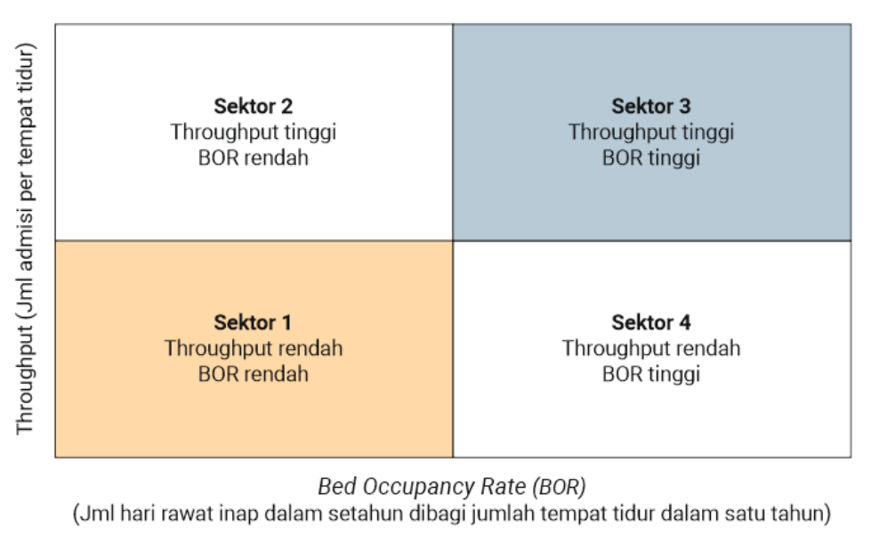
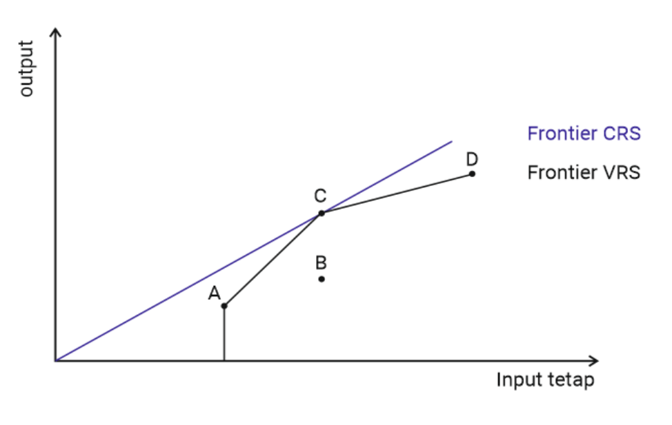
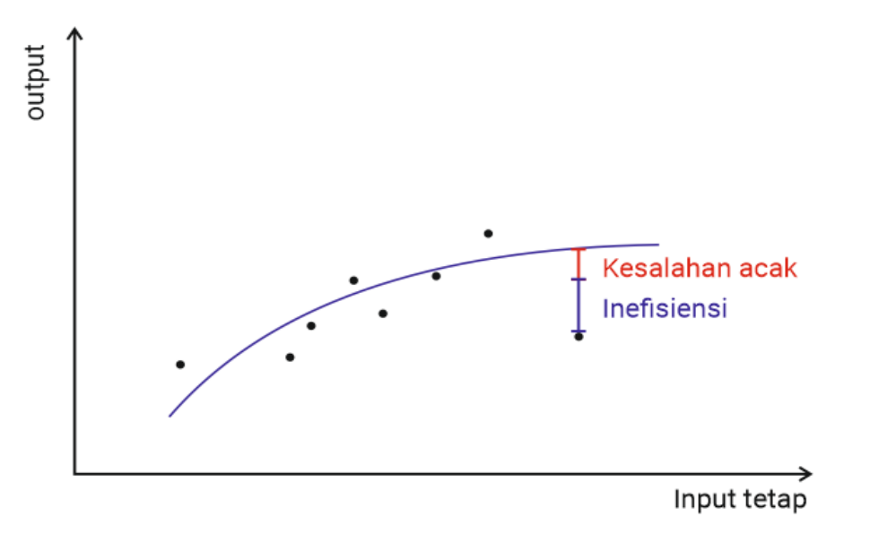
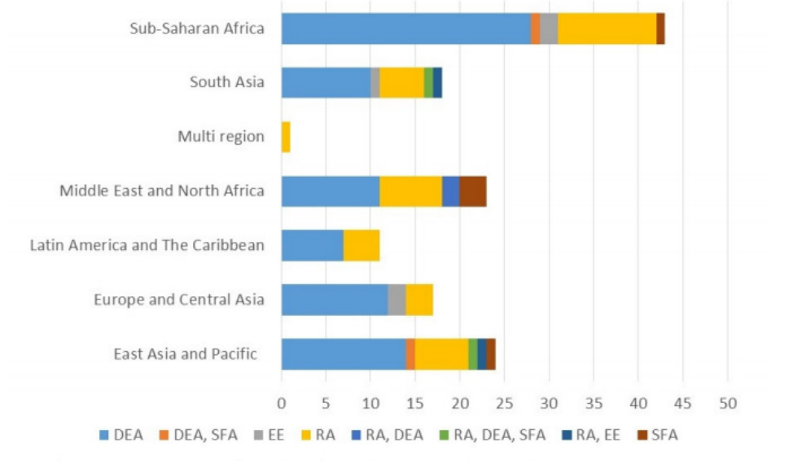
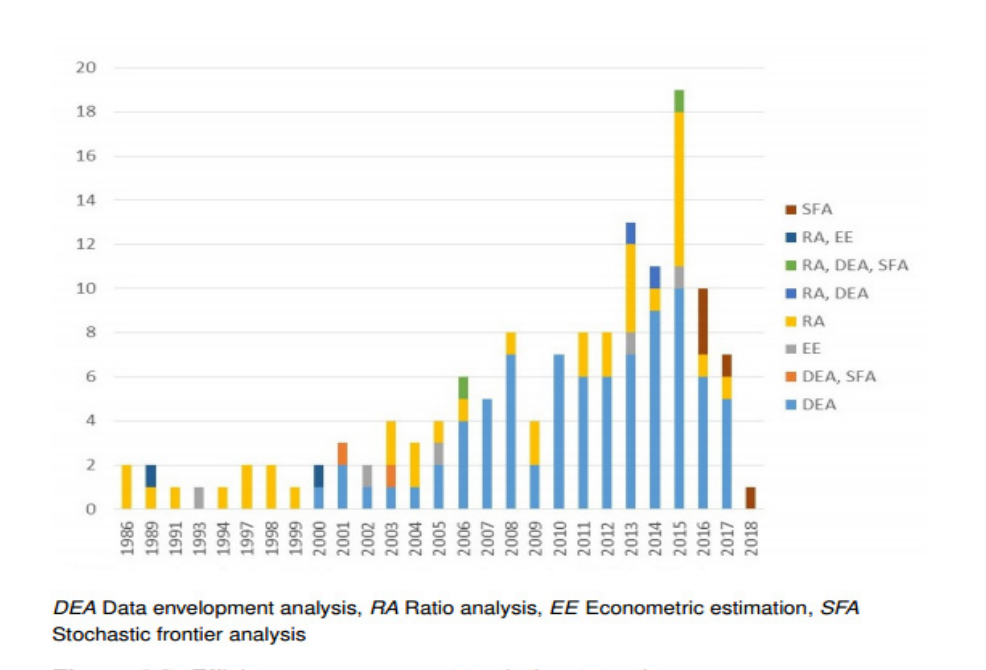
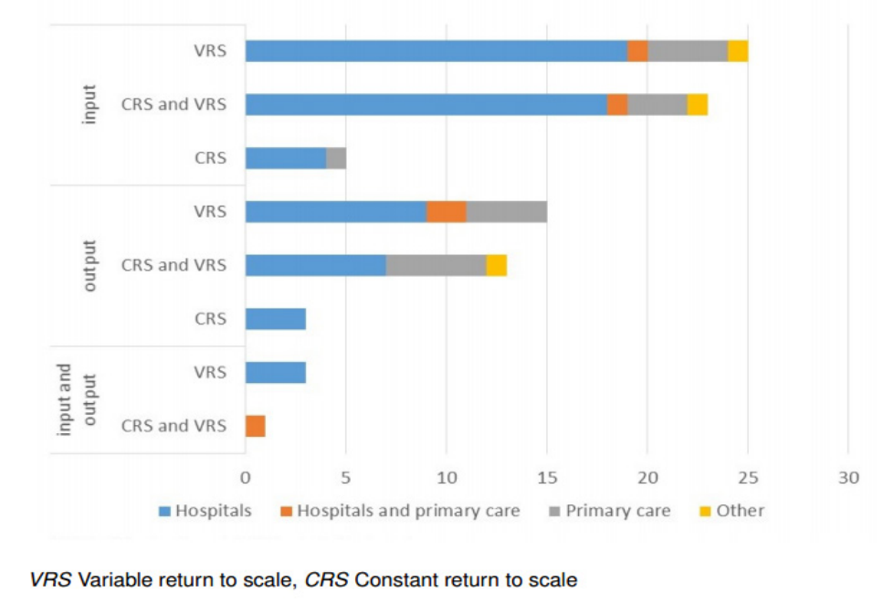
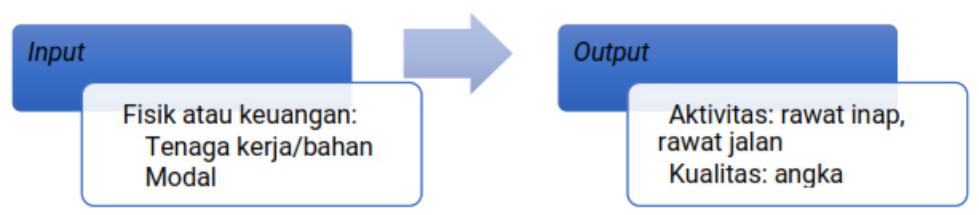
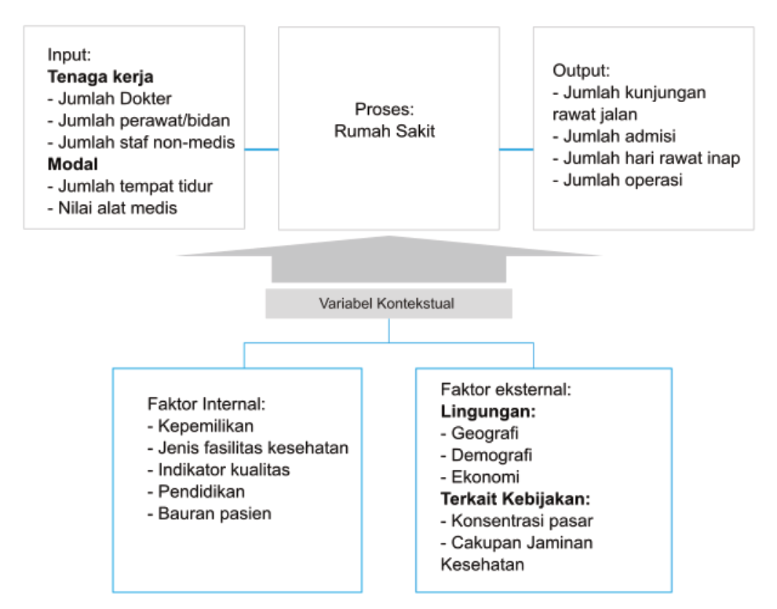

# Pengukuran Efisiensi {#sec-pengukuran}

## Pengukuran Efisiensi di Negara Berkembang

Mengingat pentingnya efisiensi pada fasilitas kesehatan, upaya pengukuran efisiensi kesehatan telah rutin dilakukan di berbagai negara, terutama di negara-negara maju. Sementara itu, pada konteks negara berkembang, jumlah studi mengenai efisiensi fasilitas kesehatan masih sedikit. Berdasarkan tinjauan literatur yang dilakukan oleh Firdaus Hafidz, Ensor, dan Tubeuf (2018b), sebagian besar dari studi tersebut (31%) berasal dari negara-negara sub-Sahara, terutama dari Ghana, Kenya, dan Afrika Selatan. Bab ini akan membahas tentang tahap-tahap pengukuran efisiensi serta gambaran proses yang dilakukan di negara-negara berkembang.

## Tahap-Tahap Pengukuran Efisiensi

Setelah memahami konsep efisiensi, kita akan membahas bagaimana efisiensi suatu organisasi, dalam hal ini fasilitas kesehatan, dapat diukur. Proses pengukuran efisiensi secara umum dapat dibagi menjadi tiga tahap, yaitu:

1. memilih teknik pengukuran efisiensi,

2. memilih variabel *input* dan *output*, dan

3. memilih faktor-faktor yang memengaruhi efisiensi.

{#fig-2-1}

Tahap *pertama* yang perlu dilakukan adalah memilih teknik pengukuran efisiensi. Hal ini tergantung pada tujuan dan ketersediaan data yang dimiliki. Masing-masing teknik yang bisa digunakan pada tahap ini akan dibahas secara lebih terperinci pada Bagian C, sedangkan pertimbangan apa yang perlu digunakan akan dijelaskan pada Bagian D.

Tahap *kedua*, yakni kita harus memilih variabel *input* dan *output* apa saja yang akan dimasukkan dalam analisis. Penjelasan lebih lanjut tentang tahapan ini akan dibahas pada Bagian E.

Sementara itu, untuk mengetahui faktor-faktor apa saja yang dapat memengaruhi tingkat efisiensi, kita juga harus bisa mengidentifikasi, mengukur, dan memilih faktor-faktor tersebut. Tahap ini akan dijelaskan secara lebih terperinci pada Bagian F.

## Teknik-Teknik Pengukuran Efisiensi

Secara umum, terdapat dua teknik utama pengukuran efisiensi fasilitas kesehatan, yakni analisis rasio dan analisis *frontier*. Analisis rasio mengukur efisiensi dengan membandingkan besaran *input* dan *output* di antara berbagai fasilitas kesehatan. Sementara itu, analisis *frontier* menggunakan pendekatan estimasi garis batas produksi (*production frontier*) untuk mengetahui fasilitas kesehatan mana yang paling efisien untuk dijadikan pembanding (pengukuran efisiensi relatif).

### Analisis Rasio

Analisis rasio (AR) merupakan cara pengukuran efisiensi yang paling sederhana. Analisis ini dilakukan dengan menghitung rasio *input* yang digunakan oleh fasilitas kesehatan dengan *output* yang dihasilkannya (Firdaus Hafidz, Ensor, dan Tubeuf, 2018b). Pengukuran menggunakan teknik ini terbatas pada satu jenis *input* dan *output*.

Berdasarkan jenis *input* yang digunakan, AR dapat dibagi menjadi dua, yaitu rasio efisiensi teknis dan rasio efisiensi ekonomi (Ricardo Bitran, 1992). Rasio efisiensi teknis mengukur rasio menggunakan *input* fisik, misalnya jumlah tempat tidur yang tersedia. Adapun rasio efisiensi ekonomi mengukur kinerja fasilitas kesehatan menggunakan *input* biaya.

Salah satu contoh analisis rasio efisiensi teknis, yaitu angka hunian tempat tidur atau *bed occupancy rate* (BOR) yang diukur dengan cara membagi jumlah hari perawatan dengan jumlah tempat tidur dikali jumlah hari dalam periode tertentu. Selain itu, ada juga indikator lain yang bisa dipakai, yaitu *bed turnover rate* (jumlah pemulangan pasien dengan jumlah tempat tidur dalam periode tertentu) dan rerata lama rawat inap (total hari perawatan dibagi dengan jumlah tempat tidur yang tersedia). Untuk aplikasinya, AR dapat dikerjakan dengan setidaknya dua metode, yaitu metode Pabon-Lasso dan metode analisis biaya yang akan dijelaskan sebagai berikut.

### Metode Pabon-Lasso

Metode Pabon-Lasso adalah salah satu metode analisis rasio yang menggabungkan beberapa ukuran indikator sekaligus (Lasso, 1986). Metode ini menggunakan pendekatan grafis, yaitu dengan cara menempatkan fasilitas kesehatan pada suatu diagram berdasarkan dua atau lebih indikator efisiensi dan membaginya menjadi empat (atau lebih) kelompok. Model Pabon-Lasso yang ditunjukkan pada @fig-2-2 menggunakan indikator *bed turnover rate* (BTR) atau juga disebut sebagai *throughput* dan indikator BOR di mana *throughput* digunakan sebagai sumbu vertikal (y) dan BOR sebagai sumbu horizontal (x).

Semua rumah sakit yang akan dianalisis efisiensi relatifnya kemudian di-*plotting* pada bagan ini sesuai dengan BTR dan BOR-nya. Setelah itu, dibuat suatu garis pada sumbu vertikal maupun horizontal yang membagi model Pabon-Lasso menjadi empat bagian. Cara yang paling umum untuk menentukan garis tersebut, yaitu menggunakan rerata BOR dan BTR. Dengan demikian, dapat dijelaskan bahwa fasilitas kesehatan di sektor 1 (kiri bawah) memiliki *throughput* (luaran antara) yang rendah (jumlah admisi per tempat tidur) dan durasi kekosongan tempat tidur yang panjang; fasilitas kesehatan di sektor 2 (kiri atas) memiliki jumlah pasien yang banyak, tetapi memiliki waktu kekosongan tempat tidur yang panjang; fasilitas kesehatan di sektor 3 (kanan atas) memiliki *throughput* tinggi dan tingkat hunian tinggi; sementara fasilitas kesehatan di sektor 4 memiliki tempat tidur dengan *throughput* yang rendah, tetapi pasien tinggal lebih lama.

{#fig-2-2}

### Analisis Biaya

Selain menggunakan model Pabon-Lasso yang melihat bagaimana tingkat efisiensi rumah sakit berdasarkan BOR dan BTR-nya, terdapat cara lain yang bisa dilakukan, yakni dengan melihat efisiensi ekonominya. Indikator tersebut dapat diukur dalam bentuk satuan biaya per layanan (Barnum dan Kutzin, 1993). Satuan biaya per layanan dapat disebut sebagai sebuah indikator rasio karena merupakan hasil pembagian dari total biaya yang dikeluarkan oleh suatu rumah sakit untuk menyediakan satu jenis pelayanan dibagi dengan jumlah layanan yang dihasilkan.

Suatu rumah sakit yang mampu menurunkan rerata satuan biaya per layanan dengan tetap mempertahankan utilisasi mengindikasikan terjadinya peningkatan efisiensi (Milsum, Turban, dan Vertinsky, 1973). Meskipun demikian, adanya variasi dari satuan biaya per layanan di antara berbagai fasilitas kesehatan harus diinterpretasikan secara hati-hati karena besar kemungkinan terdapat perbedaan harga dari *input* yang diperlukan (Morris *et al*., 2007). Penggunaan analisis rasio dan panduan analisis praktisnya untuk menilai efisiensi rumah sakit di Indonesia akan dijelaskan lebih lanjut pada Bab [III](#sec-pengantar-r).

### Analisis *Frontier*

Terdapat dua jenis analisis *frontier* yang umum dipakai, yaitu *data envelopment analysis* (DEA) dan *stochastic frontier analysis* (SFA), yang dijelaskan sebagai berikut.

### *Data Envelopment Analysis* (DEA)

DEA dikembangkan oleh Charnes, Cooper, dan Rhodes (1978) menggunakan suatu program matematika untuk membangun suatu garis batas (*frontier*) di mana tidak ada titik pengamatan yang berada di luar garis tersebut. Teknik ini dapat mengidentifikasi kinerja fasilitas kesehatan dengan cara melakukan *benchmarking* dengan fasilitas kesehatan yang efisien penuh, yaitu fasilitas kesehatan yang berada pada garis *frontier* (Coelli *et al*., 2005). Secara matematis, program DEA dapat dirumuskan sebagai berikut.

$$
\begin{aligned}
&\max_{\phi,\lambda}\ \phi,\\
&\sum_{i=1}^{n}\lambda_i x_{ji} \le x_{jo}, \quad j = 1,2,\ldots,m;\\
&\sum_{i=1}^{n}\lambda_i y_{ri} \ge \phi\, y_{ro}, \quad r = 1,2,\ldots,s;\\
&\sum_{i=1}^{n}\lambda_i = 1, \quad \lambda_i \ge 0, \quad i = 1,2,\ldots,n;
\end{aligned}
$$ {#eq-2-1}

Keterangan: *i* = rumah sakit; *x*~ji~ = *input* ke-*j*, dengan *j* = 1, 2, 3 …, *m* adalah jumlah *input*; *y*~ri~ = *output* ke-*r*, dengan r = 1, 2, …, *s* adalah jumlah *output*; *λ*~i~ = nilai pembobotan (*weight*) untuk masing-masing rumah sakit dengan jumlah total 1; *Ø* = nilai efisiensi rumah sakit.

Persamaan tersebut merupakan suatu model matematika untuk mencari nilai maksimum dari efisiensi masing-masing fasilitas kesehatan (Ø). Nilai tersebut dapat dicari dengan menyelesaikan program matematika berdasarkan interpretasi sebagai berikut.

1. Jumlah *input* terbobot (*weighted sum of an input*) dari semua rumah sakit yang diukur lebih kurang atau sama dengan nilai *input* dari rumah sakit yang sedang dievaluasi (*x*~jo~).

2. Jumlah *output* terbobot (*weighted sum of an output*) dari semua rumah sakit yang diukur lebih besar atau sama dengan nilai *output* dari rumah sakit yang dievaluasi (*y*~ro~) dikalikan dengan nilai efisiensi.

3. Setiap rumah sakit memiliki bobot tersendiri (*λ*~i~), dan jumlah semuanya sama dengan 1.

Rumus sisi kanan adalah satu dari *n* rumah sakit yang sedang dievaluasi. Rumus sisi kiri adalah kombinasi konveks dari nilai-nilai yang teramati dari *input* dan *output*.

Baik pendekatan berorientasi *input* maupun *output* menggunakan angka satu (1) untuk menandakan fasilitas kesehatan yang paling efisien. Inefisiensi pada model berorientasi *input* memiliki nilai kurang dari 1, sedangkan pada model berorientasi *output* memiliki nilai lebih dari 1. Oleh karena itu, untuk dapat membandingkan secara langsung DEA berorientasi *input*, digunakanlah nilai resiprokal dari skor DEA yang berorientasi *output*.

Garis *frontier* DEA berbeda tergantung pada asumsi terkait skala ekonomi (*scales*) yang dipakai. Secara umum, terdapat dua asumsi, yaitu *constant return to scale* (CRS) dan *variable return to scale* (VRS) (ilustrasi CRS dan VRS dapat dilihat pada @fig-2-3). CRS digunakan jika suatu fasilitas kesehatan bisa meningkatkan *output* yang mereka hasilkan proporsional (secara linear) jika melakukan penambahan *input*. Dengan asumsi seperti ini, garis *frontier* akan berupa garis lurus dengan satu fasilitas kesehatan yang ada pada garis tersebut.

{#fig-2-3}

Sementara itu, VRS dapat lebih fleksibel, artinya penambahan *output* tidak selalu proporsional dengan penambahan *input*, dan sering kali sesuai dengan apa yang terjadi karena suatu fasilitas kesehatan berada pada batasan finansial, peraturan, juga keterbatasan-keterbatasan lain yang mengakibatkan mereka beroperasi secara sub-optimal. Akan tetapi, asumsi VRS dapat menyebabkan lebih sedikit fasilitas kesehatan yang dinilai inefisien, khususnya ketika ada variasi ukuran fasilitas kesehatan yang cukup besar.

### *Stochastic Frontier Analysis* (SFA)

*Stochastic frontier analysis* (SFA) adalah suatu metode pengukuran efisiensi dengan pendekatan parametrik. Artinya, nilai *output* dari masing-masing rumah sakit dapat dijelaskan berdasarkan nilai *input*, faktor-faktor lain yang memengaruhinya, dan suatu nilai acak. Nilai acak tersebut kemudian diasumsikan berasal dari komponen kesalahan acak murni (*v*) dan komponen inefisiensi (*u*). Dengan demikian, secara matematis model SFA dapat dituliskan sebagai berikut.

$$Q = f(K, L) + v - u$$ {#eq-2-2}

Adapun *Q* adalah *output* yang diproduksi menggunakan *input* berupa tenaga kerja (*L*, *labor*) dan modal (*K*, *capital*); *v* mewakili sifat acak (*stochastic*) dari proses produksi yang kemungkinan berasal dari kesalahan pengukuran ataupun faktor lain yang tidak teramati, sedangkan huruf u mewakili tingkat ketidakefisienan fasilitas kesehatan. Penulis menganggap bahwa nilai dari *v* dan *u* bersifat independen satu sama lain (tidak ada korelasi antara *v* dan *u*). Dengan demikian, jika *u* = 0, dapat dikatakan bahwa suatu fasilitas kesehatan memiliki efisiensi 100%. Sementara itu, jika *u* > 0 maka terdapat inefisiensi pada fasilitas kesehatan tersebut.

Secara diagramatik, persamaan tersebut dapat dijelaskan pada @fig-2-4 berikut.

{#fig-2-4}

Pada model SFA, beberapa bentuk fungsi produksi (*functional form*) dapat digunakan, di antaranya yang paling sering adalah fungsi produksi Cobb-Douglas, fungsi *translog*, fungsi jarak, dan fungsi jarak *translog*.

1. Fungsi Cobb-Douglas

Fungsi ini menggunakan bentuk log pada *output* (*y*~i~) dan *input* (*x*~ji~) atau bisa juga diartikan sebagai fungsi elastisitas. Fungsi tersebut dapat dituliskan sebagai berikut.

$$\log(y_i) = \beta_0 + \sum_{j=1}^{k}\beta_j \log x_{ji} + (v_i - u_i)$$ {#eq-2-3}

Adapun *j* mewakili jumlah variabel independen, *i* fasilitas kesehatan, *y*~i~ *output* dari fasilitas kesehatan ke-*i*, *x*~ji~ *input j* dari fasilitas kesehatan ke-*i*, *β* parameter yang akan diperkirakan, *v*~i~ kesalahan acak, dan *u*~i~ adalah nilai acak non-negatif yang terkait dengan inefisiensi teknis fasilitas kesehatan *i*.

2. Fungsi *translog*

Fungsi Cobb-Douglas diketahui memiliki satu kelemahan, yaitu kurang fleksibel karena semua turunan orde pertama dari fungsi linier adalah konstanta dan semua turunan orde kedua bernilai nol (Bogetoft dan Otto, 2010). Salah satu fungsi lain yang dapat mengatasi kelemahan tersebut adalah fungsi *translog*. Fungsi ini menawarkan bentuk fungsional yang memiliki turunan orde pertama yang tidak konstan.

Artinya, korelasi dari penambahan suatu variabel *input* dengan *output* yang dihasilkan dapat dipengaruhi oleh nilai *input* itu sendiri. Hal ini dapat dianalogikan dengan dampak penambahan seorang dokter umum ketika kondisi awalnya baru ada dua dokter, akan berbeda dengan kondisi jika awalnya jumlah dokter sudah sepuluh. Secara matematis, fungsi tersebut dapat ditulis sebagai berikut.

$$
\log(y_i) = \beta + \sum_{j=1}^{k}\beta_j \log x_{ji}
+ \frac{1}{2}\sum_{j=1}^{k}\sum_{h=1}^{k}\beta_{jh}\log x_{ji}\log x_{hi} + (v_i - u_i)
$$ {#eq-2-4}

Adapun *log x*~ji~ *log x*~hi~ mewakili interaksi *input* yang *j* dan *h* dari fasilitas kesehatan ke-*i*.

3. Fungsi jarak *translog* dan fungsi jarak *translog multi-output*

Baik fungsi Cobb-Douglas maupun *translog* dalam model SFA standar hanya terbatas pada pengukuran efisiensi dengan satu *output*. Oleh karena itu, fungsi jarak *multi-output* dan fungsi jarak *translog* dapat menjadi alternatif pilihan. Model fungsi jarak dapat ditulis sebagai berikut.

$$
\log\left(\frac{1}{y_{ni}}\right) = \beta_0 + \sum_{j=1}^{k}\beta_j \log x_{ji}
+ \sum_{h=1}^{k-1}\beta_h \log\frac{y_{hi}}{y_{ni}} + (v_i - u_i)
$$ {#eq-2-5}

Interpretasi dari $y_h / y_{ni}$ adalah $\left(\frac{y_1}{y_n}, \ldots, \frac{y_{n-1}}{y_n}\right)$.

Sementara itu, fungsi jarak *translog multi-output* dapat ditulis sebagai berikut.

$$
\begin{aligned}
\log\left(\frac{1}{y_{ni}}\right) ={}& \beta_0 + \sum_{j=1}^{k}\beta_j \log x_{ji}
+ \frac{1}{2}\sum_{j=1}^{k}\sum_{h=1}^{k}\beta_{jh}\log x_{ji}\log x_{hi}\\
&+ \sum_{h=1}^{k-1}\beta_h \log\frac{y_{hi}}{y_{ni}}
+ \frac{1}{2}\sum_{j=1}^{k-1}\sum_{h=1}^{k-1}\beta_{jh}\log\frac{y_{ji}}{y_{ni}}\log\frac{y_{hi}}{y_{ni}}\\
&+ \sum_{j=1}^{k}\sum_{h=1}^{k-1}\beta_{jh}\log x_{ji}\log\frac{y_{hi}}{y_{ni}} + (v_i - u_i)
\end{aligned}
$$ {#eq-2-6}

## Pertimbangan Pemilihan Teknik Pengukuran Efisiensi

Secara umum, teknik pengukuran yang paling banyak digunakan pada studi-studi pengukuran efisiensi adalah teknik nonparametrik, yaitu *data envelopment analysis* (DEA) dan teknik parametrik berupa *stochastic frontier analysis* (SFA) (Hafidz, Ensor, dan Tubeuf, 2018; Asmild, Hollingsworth, dan Birch, 2013). Dalam konteks negara berkembang (@fig-2-5), DEA merupakan teknik yang paling sering digunakan untuk pengukuran efisiensi, dan hal ini terjadi hampir di semua negara. Sementara itu, AR digunakan di sebagian besar wilayah, tetapi tidak di Eropa dan Asia Tengah, sedangkan hanya sejumlah kecil studi yang menerapkan SFA dan EE (estimasi ekonometrik)[^1]. SFA hanya digunakan dalam studi di sub-Sahara Afrika, Timur Tengah, dan Afrika Utara serta kawasan Asia Timur dan Pasifik, sedangkan EE digunakan dalam studi di Asia Selatan, Eropa, dan Asia Tengah.

Selain itu, tinjauan literatur oleh Hafidz, Ensor, dan Tubeuf (2018b) menunjukkan bahwa sekitar sepertiga dari penelitian-penelitian tentang efisiensi di negara berkembang menggunakan teknik AR, baik dengan perhitungan rasio *input* dan *output* fisik (efisiensi teknis) maupun perhitungan rasio *input* biaya terhadap *output* (efisiensi ekonomi). Beberapa contoh dari analisis efisiensi teknis, yaitu pengukuran tingkat pergantian tempat tidur (*bed turnover ratio*) dan tingkat hunian tempat tidur (*bed occupancy ratio*), sedangkan contoh dari analisis efisiensi ekonomi, yaitu perhitungan biaya rata-rata per admisi atau biaya rata-rata per kunjungan rawat jalan. Sisanya, yaitu 65% dari penelitian-penelitian yang dikumpulkan diketahui menggunakan teknik SFA, DEA, atau campuran berbagai metode; dan hanya kurang dari 3% penelitian yang menggunakan teknik estimasi ekonometrika.

{#fig-2-5}

Selanjutnya, aspek penting yang harus dipertimbangkan ketika memilih teknik pengukuran efisiensi adalah tingkat kerumitannya. Dalam hal ini, AR dinilai sebagai teknik yang paling sederhana, mudah dihitung, berbiaya rendah, dan dapat dilakukan dengan sampel yang sedikit (Bitran, 1992). Selain itu, meskipun AR tidak menampilkan variabel *output*, AR dapat digunakan untuk mendeteksi terjadinya inefisiensi. Dengan demikian, dalam keadaan tertentu yang melibatkan keterbatasan waktu, data, keahlian, atau anggaran, pembuat kebijakan dan peneliti cenderung lebih memilih AR untuk menilai efisiensi di berbagai fasilitas kesehatan. Oleh karena itu, teknik ini banyak digunakan di masa lalu (Hussey *et al*., 2009). Akan tetapi, perlu disadari bahwa AR memiliki beberapa keterbatasan, antara lain diperlukannya asumsi mengenai alokasi biaya dan kesulitan dalam mendeteksi variasi kualitas serta campuran kasus antarfasilitas kesehatan (Bitran, 1992).

{#fig-2-6}

Guna mengatasi keterbatasan tersebut, peneliti di negara maju maupun berkembang kemudian lebih memilih menggunakan teknik DEA, terutama terlihat pada artikel-artikel yang diterbitkan sejak tahun 2000 (Hollingsworth, 2008; Hussey *et al*., 2009). DEA sendiri dianggap memiliki kelebihan karena mampu mengakomodasi banyak variabel *input* dan *output* serta tidak memerlukan asumsi terkait bentuk fungsional (*functional form*) dari fungsi produksi. Dari 137 studi yang teridentifikasi menggunakan teknik DEA, 82 studi hanya menggunakan DEA atau dilengkapi dengan teknik DEA dua tahap (akan dijelaskan lebih lanjut pada bagian pemilihan variabel kontekstual). Namun, perlu diperhatikan bahwa baik AR maupun DEA dapat bermasalah jika terdapat bias pada data.

Para peneliti kemudian mengembangkan teknik Estimasi Ekonometrika (EE) yang bisa menganalisis pengaruh perubahan *input* terhadap *output* atau jenis pelayanan menggunakan suatu pemodelan tertentu. Teknik ini sudah mulai digunakan di negara maju sejak tahun 1970-an, tetapi baru mulai digunakan di negara berkembang pada akhir tahun 1980-an (Bitran, 1992). Kendala utama dari penggunaan teknik ini, yaitu diperlukannya data yang cukup banyak sehingga muncul permasalahan terkait ketersediaan dan konsistensi data di antara berbagai fasilitas layanan kesehatan. Selain itu, EE juga tidak dapat memisahkan antara inefisiensi yang sesungguhnya dan kesalahan acak (Barnum dan Kutzin, 1993; Schmidt, 2008). Sebagian besar studi yang menerapkan EE pada negara maju menggunakan fungsi biaya (*cost function*) sebagai metode pemodelannya. Sementara itu, penggunaannya di negara berkembang jarang dilakukan karena kurangnya data terkait biaya dan harga (Conteh dan Walker, 2004).

Kemudian, studi efisiensi baik di negara maju maupun negara berkembang cenderung semakin menggunakan SFA. Namun, DEA tetap merupakan teknik yang dominan (Hollingsworth, 2003, 2008) karena SFA memerlukan sumber data yang besar dan terperinci, terutama terkait harga dan informasi keuangan lainnya. SFA mengandalkan sumber yang besar dan terperinci untuk data, terutama harga *input* dan informasi keuangan lainnya. Fungsi biaya lebih umum digunakan pada teknik SFA dibandingkan fungsi produksi karena variabel biaya dapat dengan mudah digabungkan menjadi ukuran tunggal yang diperlukan untuk memperkirakan garis batas (*frontier*) SFA (Cylus *et al*., 2016). Di sisi lain, kebutuhan data yang besar ini membatasi pengaplikasian teknik SFA, khususnya di negara-negara berkembang.

Terakhir, penting untuk digarisbawahi bahwa masih sedikit studi yang hanya menggunakan teknik SFA. Biasanya, SFA juga dikombinasikan dengan teknik lain sebagai pembanding. Selain itu, kompleksitas pada teknik SFA juga membuat hasilnya relatif sulit dipahami oleh pengambil kebijakan. Dengan demikian, dapat dikatakan bahwa tiap teknik memiliki kelebihan dan kekurangan masing-masing dan tidak ada konsensus yang jelas mengenai teknik mana yang paling baik. AR dan DEA tampaknya masih menjadi teknik yang lebih dipilih untuk mengukur efisiensi di negara-negara berkembang karena pembuat kebijakan membutuhkan bukti yang cepat, jelas, sederhana, dan praktis, di tengah ketersediaan data pembiayaan rutin yang masih terbatas.

### Perbandingan antara DEA dan SFA

Sampai saat ini, DEA masih merupakan teknik yang dominan karena kemampuannya mengakomodasi variabel *input* dan *output* yang umum pada *setting* pelayanan kesehatan (Hollingsworth, 2003). Akan tetapi, DEA tidak dapat mengakomodasi adanya nilai ekstrem, baik karena *error*, *outlier*, maupun *noise* pada pengukuran. Oleh karena itu, jika fasilitas kesehatan yang merupakan *outlier* tetap dimasukkan, hasil pengukuran efisiensi bisa sangat terpengaruh (Battese dan Coelli, 1995). Pada konteks ini, SFA berbeda dari DEA karena dapat mendekomposisi *error* menjadi dua komponen, yaitu *random noise* (heterogenitas yang tidak teramati) dan inefisiensi yang sesungguhnya (*true inefficiency)*.

Dengan demikian, SFA sering kali lebih disukai karena dapat menangani *noise* yang ada dalam data, seperti kesalahan pengukuran, faktor epidemiologi, ataupun faktor lainnya, sedangkan *noise* tersebut diketahui memengaruhi penempatan garis *frontier* pada DEA (Giuffrida dan Gravelle, 2001). Pada literatur, diketahui sekitar 18% dari studi telah menggunakan SFA dan trennya cenderung meningkat (Hollingsworth, 2008). Selain membutuhkan data yang lebih terperinci, hasil SFA juga bisa sangat dipengaruhi oleh asumsi terkait bentuk fungsional dan distribusi *error* ketika memodelkan proses produksi. Selain itu, sampel yang kecil juga bisa bermasalah karena mengurangi tingkat akurasi dari proses pemodelan (Coelli *et al*., 2005; Giuffrida dan Gravelle, 2001).

Berdasarkan penjelasan di atas, dapat dikatakan bahwa DEA dan SFA memiliki kelebihan dan kekurangan masing-masing. Oleh karena itu, tidak ada “metode terbaik” untuk memperkirakan batas (*frontier*) efisiensi (Jacobs *et al*., 2006). Kedua teknik ini dapat digunakan jika semua syaratnya terpenuhi dan teknik tersebut memungkinkan peneliti untuk mencapai tujuan penelitian (Jacobs *et al*., 2006).

### Pemilihan Orientasi Pengukuran dan Asumsi Skala Produksi

Selain adanya variasi terkait teknik yang dipakai, kita juga dapat melihat bahwa ada variasi dari orientasi pengukuran yang dilakukan. Berdasarkan @fig-2-7, sebagian besar penelitian tentang efisiensi melihat pada orientasi *input* dan hanya sedikit yang mengombinasikan keduanya. Hal tersebut kemungkinan didasari oleh kecenderungan pada penelitian-penelitian efisiensi untuk mengetahui apakah penambahan *input* memungkinkan untuk meningkatkan kapasitas produksi layanan kesehatan dan memperbaiki efisiensi yang ada. Sementara itu, dari sisi pilihan skala produksi, sebagian besar penelitian yang ditemukan menggunakan asumsi *variable return to scale* (VRS). Asumsi VRS dianggap lebih realistis dalam menggambarkan proses produksi secara umum.

{#fig-2-7}

Keterangan: VRS: *Variable Return to Scale* CR*S: Constant Return to Sc*ale

### Perkembangan Mutakhir: Produktivitas Multi-periode dan Kritik O'Donnell (2018)

Dalam analisis antarwaktu (*panel data*), studi efisiensi kesehatan umumnya mengandalkan indeks Malmquist konvensional. Namun, O’Donnell (2018) mengajukan telaah kritis mendasar mengenai keabsahan aksiomatik indeks Malmquist:
1. **Kegagalan Transitivitas (*Transitivity Failure*)**: Indeks Malmquist standar tidak memenuhi uji sirkularitas/transitivitas. Artinya, membandingkan fasilitas kesehatan antar-tahun atau antar-wilayah secara rantai (*chaining*) menghasilkan inkonsistensi matematis yang bergantung pada periode dasar yang dipilih.
2. **Indeks Produktivitas yang Tepat (*Proper Productivity Indexes*)**: O’Donnell (2018) merekomendasikan penggunaan indeks yang transitif secara penuh, terutama **indeks Färe-Primont** dan **indeks Lowe**, agar perbandingan produktivitas total (*Total Factor Productivity*, TFP) lintas-fasilitas dan lintas-periode bersifat konsisten dan adil (*multilaterally valid*).
3. **Dekomposisi TFP yang Lengkap**: Dalam kerangka O’Donnell (2018), perubahan TFP tidak hanya dipilah menjadi efisiensi teknis dan perubahan teknologi, tetapi juga memperhitungkan efisiensi skala (*scale efficiency*), efisiensi bauran (*mix efficiency*), dan efek residu skala-bauran (*residual scale-mix efficiency*). Pembahasan dan penerapan praktis pendekatan ini disajikan pada Bab [VIII](#sec-lanjutan).

## Pemilihan Variabel Input dan Output

Setelah teknik pengukuran efisiensi ditentukan maka tahap berikutnya adalah memilih variabel *input* dan *output* apa saja yang akan dimasukkan dalam analisis. Pada @fig-2-8, dapat dilihat bahwa secara umum variabel *input* dapat dibagi menjadi dua, yaitu variabel fisik dan variabel keuangan. Sementara itu, variabel *output* dapat meliputi jumlah aktivitas maupun kualitas pelayanan.

{#fig-2-8}

### Pertimbangan Pemilihan Variabel *Input*

Tidak ada satu cara yang pasti untuk memilih variabel-variabel tersebut, tetapi ada beberapa pertimbangan yang bisa digunakan. Sebagai contoh, penggunaan variabel *input* fisik dapat menjawab pertanyaan terkait apakah *output* bisa dimaksimalkan menggunakan kombinasi antara tenaga kerja dan modal yang optimal (Hussey *et al*., 2009). *Input* fisik memiliki kelebihan, yaitu kemudahan dalam perhitungan dan komparabilitas (keterbandingan). Di sisi lain, ada juga kekurangan yang dimiliki, yaitu tidak selalu bisa menangkap aspek keuangan/moneter seperti pengeluaran fasilitas kesehatan (Hadji, Meyer, Melikeche, Escalon, dan Degoulet, 2014). Dalam hal ini, *input* keuangan dianggap mampu menjawab pertanyaan apakah suatu *output* dapat diproduksi dengan biaya yang lebih rendah dengan penggunaan *input* yang lebih efisien (Hussey *et al*., 2009). Terakhir, karena adanya variasi yang lebar pada gaji dan biaya pelayanan, *input* finansial tidak dapat digunakan untuk perbandingan antartempat, khususnya secara internasional (Hadji *et al*., 2014).

Studi empiris sebelumnya menunjukkan bahwa *input* fisik seperti jumlah tenaga kerja dan jumlah tempat tidur (mewakili variabel modal) merupakan variabel yang paling sering digunakan. Namun, beberapa peneliti berpendapat bahwa tempat tidur mungkin tidak mencerminkan variasi yang tepat terkait dengan kepemilikan teknologi antarfasilitas kesehatan (Mobley dan Magnussen, 1998). Oleh karena itu, sejumlah penelitian menggunakan variabel lain untuk mewakili (proksi) nilai modal/kapital, seperti ketersediaan ruang dan peralatan khusus sebagai faktor produksi utama (Heimeshoff *et al*., 2014).

Terdapat pula penelitian yang menggunakan *input* berupa variabel keuangan seperti total biaya modal atau nilai peralatan (Jacobs, 2001; Besstremyannaya, 2013; Mutter *et al*., 2013; Chowdhury *et al*., 2014). Dalam hal tenaga kerja dan material, penelitian sebelumnya telah menggunakan jumlah setara waktu penuh (*full-time equivalent*, FTE) dari *input* fisik (dokter, perawat, komposisi tenaga medis, dokter spesialis, dan staf administrasi lainnya), serta *input* keuangan (pengeluaran untuk staf, obat-obatan dan persediaan medis, serta biaya gedung/ruangan) (Mobley dan Magnussen, 1998; Besstremyannaya, 2013; Gok dan Sezen, 2013; Kirigia dan Asbu, 2013; Mitropoulos *et al*., 2013; Nedelea dan Fannin, 2013; Varabyova dan Schreyogg, 2013; Chowdhury dkk., 2014; Cordero Ferrera dkk., 2014; Heimeshoff dkk., 2014; Shreay dkk., 2014; Yang dan Zeng, 2014; Ineveld dkk., 2015; Matranga dan Sapienzab, 2015). Secara terperinci, variabel *input* yang digunakan dalam penelitian-penelitian sebelumnya dapat dilihat pada @tbl-2-1.

| Variabel *input* | Rumah Sakit n | Rumah Sakit % | FKTP n | FKTP % | Rumah Sakit dan FKTP n | Rumah Sakit dan FKTP % | Lainnya n | Lainnya % | Total n | Total % |
|:--|--:|--:|--:|--:|--:|--:|--:|--:|--:|--:|
| **Fisik** | | | | | | | | | | |
| **Modal** | | | | | | | | | | |
| Tempat tidur | 73 | 27,7 | 5 | 6,4 | 7 | 20 | 1 | 6,3 | 86 | 21,9 |
| Ukuran faskes | 1 | 0,4 | 6 | 7,7 | 1 | 2,9 | 0 | 0 | 8 | 2 |
| Peralatan medis | 2 | 0,8 | 2 | 2,6 | 0 | 0 | 2 | 12,5 | 6 | 1,5 |
| Departemen/bagian | 1 | 0,4 | 2 | 2,6 | 1 | 2,9 | 0 | 0 | 4 | 1 |
| Jumlah fasilitas kesehatan | 0 | 0 | 0 | 0 | 1 | 2,9 | 0 | 0 | 1 | 0,3 |
| **Tenaga kerja/material** | | | | | | | | | | |
| Dokter | 47 | 17,8 | 5 | 6,4 | 7 | 20 | 3 | 18,8 | 62 | 15,8 |
| Perawat/bidan | 34 | 12,9 | 5 | 6,4 | 5 | 14,3 | 2 | 12,5 | 46 | 11,7 |
| Staf nonmedis | 20 | 7,6 | 7 | 9 | 4 | 11,4 | 1 | 6,3 | 32 | 8,1 |
| Total tenaga kerja | 12 | 4,5 | 5 | 6,4 | 1 | 2,9 | 0 | 0 | 18 | 4,6 |
| Teknisi/paramedis | 17 | 6,4 | 3 | 3,8 | 2 | 5,7 | 0 | 0 | 22 | 5,6 |
| Tenaga medis | 10 | 3,8 | 5 | 6,4 | 3 | 8,6 | 0 | 0 | 18 | 4,6 |
| Jumlah jam kerja | 1 | 0,4 | 2 | 2,6 | 0 | 0 | 3 | 18,8 | 6 | 1,5 |
| Obat dan alat kesehatan | 3 | 1,1 | 4 | 5,1 | 0 | 0 | 0 | 0 | 7 | 1,8 |
| Alat nonkesehatan | 1 | 0,4 | 0 | 0 | 0 | 0 | 0 | 0 | 1 | 0,3 |
| **Keuangan/Finansial** | | | | | | | | | | |
| Pengeluaran total | 22 | 8,3 | 11 | 14,1 | 0 | 0 | 3 | 18,8 | 36 | 9,2 |
| Nilai modal | 4 | 1,5 | 4 | 5,1 | 0 | 0 | 0 | 0 | 8 | 2 |
| **Tenaga kerja/material** | | | | | | | | | | |
| Pengeluaran untuk pelayanan khusus/tertentu | 7 | 2,7 | 7 | 9 | 0 | 0 | 1 | 6,3 | 15 | 3,8 |
| Pengeluaran untuk gaji | 6 | 2,3 | 5 | 6,4 | 2 | 5,7 | 0 | 0 | 13 | 3,3 |
| **Lainnya** | | | | | | | | | | |
| Casemix | 2 | 0,8 | 0 | 0 | 0 | 0 | 0 | 0 | 2 | 0,5 |
| Kualitas manajemen | 1 | 0,4 | 0 | 0 | 1 | 2,9 | 0 | 0 | 2 | 0,5 |
| **Total** | **264** | **100** | **78** | **100** | **35** | **100** | **16** | **100** | **393** | **100** |

:  {#tbl-2-1}

| Variabel *input* | Rumah Sakit n | Rumah Sakit % | FKTP n | FKTP % | Rumah Sakit dan FKTP n | Rumah Sakit dan FKTP % | Lainnya n | Lainnya % | Total n | Total % |
|:--|--:|--:|--:|--:|--:|--:|--:|--:|--:|--:|
| **Fisik** | | | | | | | | | | |
| **Modal** | | | | | | | | | | |
| Tempat tidur | 73 | 27,7 | 5 | 6,4 | 7 | 20 | 1 | 6,3 | 86 | 21,9 |
| Ukuran faskes | 1 | 0,4 | 6 | 7,7 | 1 | 2,9 | 0 | 0 | 8 | 2 |
| Peralatan medis | 2 | 0,8 | 2 | 2,6 | 0 | 0 | 2 | 12,5 | 6 | 1,5 |
| Departemen/bagian | 1 | 0,4 | 2 | 2,6 | 1 | 2,9 | 0 | 0 | 4 | 1 |
| Jumlah fasilitas kesehatan | 0 | 0 | 0 | 0 | 1 | 2,9 | 0 | 0 | 1 | 0,3 |
| **Tenaga kerja/material** | | | | | | | | | | |
| Dokter | 47 | 17,8 | 5 | 6,4 | 7 | 20 | 3 | 18,8 | 62 | 15,8 |
| Perawat/bidan | 34 | 12,9 | 5 | 6,4 | 5 | 14,3 | 2 | 12,5 | 46 | 11,7 |
| Staf nonmedis | 20 | 7,6 | 7 | 9 | 4 | 11,4 | 1 | 6,3 | 32 | 8,1 |
| Total tenaga kerja | 12 | 4,5 | 5 | 6,4 | 1 | 2,9 | 0 | 0 | 18 | 4,6 |
| Teknisi/paramedis | 17 | 6,4 | 3 | 3,8 | 2 | 5,7 | 0 | 0 | 22 | 5,6 |
| Tenaga medis | 10 | 3,8 | 5 | 6,4 | 3 | 8,6 | 0 | 0 | 18 | 4,6 |
| Jumlah jam kerja | 1 | 0,4 | 2 | 2,6 | 0 | 0 | 3 | 18,8 | 6 | 1,5 |
| Obat dan alat kesehatan | 3 | 1,1 | 4 | 5,1 | 0 | 0 | 0 | 0 | 7 | 1,8 |
| Alat nonkesehatan | 1 | 0,4 | 0 | 0 | 0 | 0 | 0 | 0 | 1 | 0,3 |
| **Keuangan/Finansial** | | | | | | | | | | |
| Pengeluaran total | 22 | 8,3 | 11 | 14,1 | 0 | 0 | 3 | 18,8 | 36 | 9,2 |
| Nilai modal | 4 | 1,5 | 4 | 5,1 | 0 | 0 | 0 | 0 | 8 | 2 |
| **Tenaga kerja/material** | | | | | | | | | | |
| Pengeluaran untuk pelayanan khusus/tertentu | 7 | 2,7 | 7 | 9 | 0 | 0 | 1 | 6,3 | 15 | 3,8 |
| Pengeluaran untuk gaji | 6 | 2,3 | 5 | 6,4 | 2 | 5,7 | 0 | 0 | 13 | 3,3 |
| **Lainnya** | | | | | | | | | | |
| Casemix | 2 | 0,8 | 0 | 0 | 0 | 0 | 0 | 0 | 2 | 0,5 |
| Kualitas manajemen | 1 | 0,4 | 0 | 0 | 1 | 2,9 | 0 | 0 | 2 | 0,5 |
| **Total** | **264** | **100** | **78** | **100** | **35** | **100** | **16** | **100** | **393** | **100** |

:  {#tbl-2-1}

### Pertimbangan Pemilihan Variabel *Output*

Saat ini, terdapat dua pendapat yang bertentangan mengenai jenis *output* yang harus digunakan untuk mengevaluasi efisiensi fasilitas kesehatan (Morris *et al*., 2007). Pendapat pertama menyatakan bahwa karena kesehatan merupakan hasil akhir dari sektor kesehatan maka setiap kegiatan di sektor kesehatan harus dievaluasi dalam hal perubahan tingkat kesehatan yang dihasilkan. Hal ini bisa menyesatkan karena perubahan tingkat kesehatan mungkin tidak mencerminkan jumlah layanan yang diberikan.

Kesehatan juga bukanlah hal yang dapat diperdagangkan secara langsung sehingga konsep ini sulit digunakan dalam menganalisis pasar pelayanan kesehatan. Hasil akhir dari kesehatan, seperti status kesehatan, juga diakui sebagai hasil yang tidak praktis karena dampak intervensi pelayanan kesehatan hanya dapat dilihat bertahun-tahun kemudian. Selain itu, terdapat banyak faktor yang memengaruhi dan adanya permasalahan ketersediaan data (Masiye, 2007).

Pandangan lain menyatakan bahwa luaran antara (*intermediate output*) juga dapat digunakan oleh individu untuk menghasilkan kesehatan sebagai hasil akhir. *Intermediate output* kemudian dapat dipisahkan lebih lanjut menjadi dua kelompok utama, yaitu *output* aktivitas (misalnya jumlah perawatan yang diberikan) dengan atau tanpa penyesuaian kualitas, dan *output* keuangan (misalnya pendapatan fasilitas kesehatan) (Worthington, 2004; Hollingsworth, 2008; Hadji *et al*., 2014). *Output* aktivitas seperti jumlah kunjungan rawat jalan hingga jumlah hari rawat inap merupakan *output* yang sebagian besar digunakan dalam studi pengukuran efisiensi kesehatan (Hollingsworth *et al*., 1999; Hollingsworth, 2003; Worthington, 2004; Hollingsworth, 2008).

Namun, dengan menggunakan variabel tersebut sebagai *output*, gambaran penuh tentang tujuan utama pelayanan kesehatan, yaitu untuk menghasilkan kesehatan, menjadi kurang. Selain itu, perlu dicatat bahwa pengukuran ini secara implisit mengasumsikan bahwa tidak ada perbedaan dalam efektivitas layanan kesehatan antara faskes satu dan yang lainnya. Oleh karena itu, beberapa penelitian mencoba menggunakan *output* kualitas seperti tingkat kematian (Varabyova dan Schreyogg, 2013; Ding, 2014; Yang dan Zeng, 2014; Matranga dan Sapienzab, 2015), komplikasi (Ineveld *et al*., 2015), atau tingkat readmisi (Ding, 2014) sebagai variabel kontrol.

| Variabel *output* | Rumah Sakit n | Rumah Sakit % | FKTP n | FKTP % | Rumah Sakit dan FKTP n | Rumah Sakit dan FKTP % | Lainnya n | Lainnya % | Total n | Total % |
|:--|--:|--:|--:|--:|--:|--:|--:|--:|--:|--:|
| **Output Aktivitas** | | | | | | | | | | |
| Kunjungan rawat jalan | 68 | 24,5 | 44 | 46,8 | 28 | 51,9 | 6 | 31,6 | 146 | 32,9 |
| Admisi/rawat inap | 70 | 25,3 | 3 | 3,2 | 9 | 16,7 | 0 | 0 | 82 | 18,5 |
| Hari rawat inap | 61 | 22 | 0 | 0 | 6 | 11,1 | 0 | 0 | 67 | 15,1 |
| Layanan lain | 21 | 7,6 | 34 | 36,2 | 4 | 7,4 | 8 | 42,1 | 67 | 15,1 |
| Prosedur | 36 | 13 | 6 | 6,4 | 4 | 7,4 | 3 | 15,8 | 49 | 11 |
| Sesi | 3 | 1,1 | 3 | 3,2 | 0 | 0 | 0 | 0 | 6 | 1,4 |
| **Finansial** | | | | | | | | | | |
| Kinerja keuangan | 10 | 3,6 | 2 | 2,1 | 0 | 0 | 1 | 5,3 | 13 | 2,9 |
| **Kualitas Luaran** | | | | | | | | | | |
| Readmisi | 1 | 0,4 | 0 | 0 | 0 | 0 | 0 | 0 | 1 | 0,2 |
| Tingkat kematian | 2 | 0,7 | 0 | 0 | 0 | 0 | 0 | 0 | 2 | 0,5 |
| % tingkat survival | 1 | 0,4 | 0 | 0 | 0 | 0 | 0 | 0 | 1 | 0,2 |
| Kualitas layanan | 4 | 1,4 | 1 | 1,1 | 3 | 5,6 | 1 | 5,3 | 9 | 2 |
| Kepuasan pasien | 0 | 0 | 1 | 1,1 | 0 | 0 | 0 | 0 | 1 | 0,2 |
| **Total** | **277** | **100** | **94** | **100** | **54** | **100** | **19** | **100** | **444** | **100** |

:  {#tbl-2-2}

| Variabel *output* | Rumah Sakit n | Rumah Sakit % | FKTP n | FKTP % | Rumah Sakit dan FKTP n | Rumah Sakit dan FKTP % | Lainnya n | Lainnya % | Total n | Total % |
|:--|--:|--:|--:|--:|--:|--:|--:|--:|--:|--:|
| **Output Aktivitas** | | | | | | | | | | |
| Kunjungan rawat jalan | 68 | 24,5 | 44 | 46,8 | 28 | 51,9 | 6 | 31,6 | 146 | 32,9 |
| Admisi/rawat inap | 70 | 25,3 | 3 | 3,2 | 9 | 16,7 | 0 | 0 | 82 | 18,5 |
| Hari rawat inap | 61 | 22 | 0 | 0 | 6 | 11,1 | 0 | 0 | 67 | 15,1 |
| Layanan lain | 21 | 7,6 | 34 | 36,2 | 4 | 7,4 | 8 | 42,1 | 67 | 15,1 |
| Prosedur | 36 | 13 | 6 | 6,4 | 4 | 7,4 | 3 | 15,8 | 49 | 11 |
| Sesi | 3 | 1,1 | 3 | 3,2 | 0 | 0 | 0 | 0 | 6 | 1,4 |
| **Finansial** | | | | | | | | | | |
| Kinerja keuangan | 10 | 3,6 | 2 | 2,1 | 0 | 0 | 1 | 5,3 | 13 | 2,9 |
| **Kualitas Luaran** | | | | | | | | | | |
| Readmisi | 1 | 0,4 | 0 | 0 | 0 | 0 | 0 | 0 | 1 | 0,2 |
| Tingkat kematian | 2 | 0,7 | 0 | 0 | 0 | 0 | 0 | 0 | 2 | 0,5 |
| % tingkat survival | 1 | 0,4 | 0 | 0 | 0 | 0 | 0 | 0 | 1 | 0,2 |
| Kualitas layanan | 4 | 1,4 | 1 | 1,1 | 3 | 5,6 | 1 | 5,3 | 9 | 2 |
| Kepuasan pasien | 0 | 0 | 1 | 1,1 | 0 | 0 | 0 | 0 | 1 | 0,2 |
| **Total** | **277** | **100** | **94** | **100** | **54** | **100** | **19** | **100** | **444** | **100** |

:  {#tbl-2-2}

Pada @tbl-2-2, dapat dilihat bahwa sebagian besar dari penelitian yang ditemukan oleh penulis menggunakan hitungan sumber daya fisik sebagai variabel *input* (82 dari 37 studi). Adapun sisanya, 23 studi teridentifikasi menggunakan *input* keuangan dan 32 studi lainnya menggunakan keduanya (sumber daya fisik dan keuangan). Variabel *input* fisik yang ditemukan termasuk berbagai jenis barang modal (misalnya jumlah tempat tidur, ukuran fasilitas, dan jumlah peralatan medis yang tersedia) serta berbagai jenis tenaga kerja atau bahan (misalnya jumlah dokter, perawat, obat-obatan, dan persediaan medis).

Untuk *input* keuangan, variabel yang ditemukan berupa total pengeluaran, *input* modal (misalnya biaya untuk merekonstruksi fasilitas kesehatan dan depresiasi peralatan), dan berbagai jenis pengeluaran tenaga kerja/material (misalnya gaji, pengeluaran obat-obatan, dan pengeluaran nontenaga kerja). Jenis *input* lain juga ditemukan, termasuk campuran layanan yang dapat menggambarkan kompleksitas layanan dan kualitas pengelolaan pelayanan.

Sementara itu, untuk variabel *output*, sebagian besar penelitian yang terkumpul (89,1%) menggunakan layanan kesehatan sebagai *output*. *Item* layanan kesehatan yang paling sering digunakan, meliputi (1) jumlah kunjungan rawat jalan, admisi, atau pasien yang dipulangkan; dan (2) jumlah hari rawat inap. Namun, karena sebagian besar studi menggunakan kumpulan *output*, pemisahan layanan berdasarkan departemen menjadi tidak memungkinkan. Penulis juga menemukan empat studi yang melakukan penyesuaian jumlah kasus menggunakan indeks *casemix* sehingga semua layanan bisa dianggap sepadan (Arocena dan Garcıa-Prado, 2007; Jian *et al*., 2009; de Castro Lobo *et al*., 2010; Rajasulochana dan Dash, 2012). Dua penelitian lainnya (Arocena dan Garc ́ıa-Prado, 2007; de Castro Lobo *et al*.,

2010. menggunakan pembobotan kelompok terkait diagnostik (*diagnostic*

*related group*/DRG), dan satu penelitian (Rajasulochana dan Dash, 2012) menggunakan intensitas kasus maternal dan neonatal yang rumit.

Sejauh ini, penulis belum menemukan penelitian yang menggunakan luaran berupa tingkat kesehatan masyarakat, seperti tingkat kematian ibu atau tingkat kematian anak. Dua penelitian oleh Sahin dan Ozcan (2000) serta Yang dan Zeng (2014) menggabungkan luaran pasien seperti tingkat kematian pasien rawat jalan. Kualitas layanan terkadang juga digunakan sebagai faktor penyesuaian (*adjustment factor*) dari variabel *output*. Beberapa di antaranya menggunakan variabel tingkat kunjungan ulang atau readmisi (Arocena dan Garc ́ıa-Prado, 2007) serta tingkat kepuasan pasien (Razzaq *et al*., 2013).

Ukuran *output* lainnya yang dapat digunakan, yaitu kinerja keuangan, yang ditemukan pada enam penelitian sebelumnya. Kinerja keuangan dapat diukur menggunakan tingkat pendapatan fasilitas kesehatan (Zaim *et al*., 2008; Gai *et al*., 2010; Aboagye dan Degboe, 2011; Alaghemandan *et al*., 2014), nilai pembelian (Rattanachotphanit *et al*., 2008), atau hasil investasi dari aset serta keuntungan atau margin operasional (Guerra *et al*., 2012).

Secara keseluruhan, penulis berpendapat bahwa variabel-variabel *output* yang ada masih belum ideal karena belum bisa menunjukkan bahwa pelayanan kesehatan yang diberikan sudah sesuai dengan kebutuhan pasien. Sebagai contoh, sebagian besar studi yang ditemukan oleh penulis belum mampu menjelaskan tingkat keparahan kasus yang dirawat. Padahal, hal tersebut dapat menyebabkan kesalahan interpretasi karena *output* yang tidak dapat saling dibandingkan. Oleh karena itu, indikator kualitas pelayanan (misalnya tingkat kematian, tingkat readmisi, dan indikator bauran kasus atau *casemix*) perlu digunakan sebagai faktor penyesuai atau *adjustment factor* terhadap ukuran *output* yang dianalisis (Hollingsworth, 2008; Mutter *et al*., 2013; Varabyova dan Schreyogg, 2013; Chowdhury *et al*., 2014; Ding, 2014; Yang dan Zeng, 2014; Ineveld *et al*., 2015; Matranga dan Sapienzab, 2015).

Penggunaan indikator kualitas itu sendiri bisa dilakukan dengan berbagai cara. Sebagian besar penelitian yang ada menggunakan nilai *invers* (kebalikan) dari *output* yang tidak diinginkan, misalnya tingkat kematian (Sahin dan Ozcan, 2000; Ramanathan *et al.*, 2003). Selain menggunakan tingkat kematian, terdapat dua penelitian lainnya yang menggunakan nilai indeks komposit untuk mengukur kualitas layanan dan indikator kualitas struktural serta proses (Aduda *et al*., 2015; Obure *et al*., 2016). Indikator kualitas yang diterapkan dalam *setting* negara maju yang berasal dari informasi pasien, seperti rata-rata lamanya rawat inap dan kejadian yang tidak diharapkan (Ding, 2014; Yang dan Zeng, 2014; Matranga dan Sapienzab, 2015) dapat menimbulkan permasalahan jika diterapkan di negara berkembang karena rekam medis yang cenderung tidak lengkap dan kurang akurat (Wong dan Bradley, 2009).

### Variabel Kontekstual

Selain variabel *input* dan *output*, faktor-faktor di luar kendali fasilitas kesehatan juga perlu dipertimbangkan serta diukur dampaknya terhadap efisiensi suatu fasilitas kesehatan (Worthington, 2004). Faktor-faktor tersebut disebut juga sebagai variabel kontekstual yang meliputi (1) faktor internal: karakteristik fasilitas kesehatan yang dapat memengaruhi efisiensi (misalnya kepemilikan, kapasitas, dan kualitas); dan (2) faktor eksternal: faktor-faktor di luar pengaruh fasilitas kesehatan yang dapat memengaruhi tingkat efisiensi (misalnya status ekonomi daerah, tingkat pendidikan populasi, dan aspek geografi) (Mobley dan Magnussen, 1998; Herr, 2008; OECD, 2010; Besstremyannaya, 2013; Gok dan Sezen, 2013; Kirigia dan Asbu, 2013; Nedelea dan Fannin, 2013; Varabyova dan Schreyogg, 2013; Cordero Ferrera dkk., 2014; Ding, 2014; Heimeshoff dkk., 2014; Shreay dkk., 2014; Yang dan Zeng, 2014; Matranga dan Sapienzab, 2015).

### Penggunaan Variabel Kontekstual

Terdapat beberapa aspek teknis yang harus diperhatikan jika variabel kontekstual akan turut dianalisis. Misalnya, pada analisis rasio (AR), tahap pertama yang perlu dilakukan ialah menentukan apakah fasilitas kesehatan yang sedang dievaluasi termasuk efisien (1) atau tidak (0). Setelah itu, analisis statistik lanjutan dapat dilakukan untuk mengetahui bagaimana pengaruh variabel-variabel kontekstual terhadap indikator bahwa suatu fasilitas kesehatan termasuk efisien atau tidak.

Pada DEA, untuk menentukan hubungan variabel kontekstual dengan tingkat efisiensi, perlu dilakukan analisis DEA tahap kedua (Hollingsworth, 2008). Pada intinya, skor efisiensi teknis yang dihasilkan oleh DEA biasa (tahap pertama) akan dijadikan variabel dependen yang dapat dijelaskan oleh variabel-variabel kontekstual yang ada. Sebagai catatan, karena skor efisiensi yang dihasilkan tersebut maksimal bernilai 1 maka analisis *truncated regression* dianggap lebih sesuai karena dapat memberikan estimasi yang konsisten dibandingkan dengan model Tobit atau *ordinary least square* (OLS). Hal itu disebabkan oleh beberapa asumsi yang mendasari bahwa metode Tobit dan OLS dianggap sering tidak dapat terpenuhi (Simar dan Wilson, 2011). Akan tetapi, sebagai pembanding, peneliti bisa juga menampilkan hasil estimasi dari model-model tersebut.

Masalah lainnya ialah adanya kemungkinan korelasi serial pada skor efisiensi yang dihasilkan dari analisis DEA (Simar, 2007). Metode alternatif untuk mengatasi masalah ini, yaitu menggunakan metode *bootstrap* pada perhitungan skor DEA untuk kemudian menggunakan hasilnya sebagai variabel dependen pada analisis tahap kedua (Simar, 2007; Bogetoft dan Otto, 2010). *Bootstrap* adalah suatu metode statistik untuk mengambil sampel secara acak dari data yang ada dan proses ini dilakukan berkali-kali (misalnya 100 kali) sehingga dapat menghitung nilai efisiensi yang terkoreksi dari bias (φ). Dengan demikian, analisis DEA tahap kedua dapat ditulis sebagai berikut.

$$\hat{\phi}_i = \beta z_i + \varepsilon$$ {#eq-2-7}

Dalam kasus ini, $\hat{\phi}_i$ adalah estimasi skor DEA yang dihasilkan dari prosedur *bootstrap* dan diasumsikan terpotong (*truncated* karena nilainya tidak bisa lebih dari 1), *β* adalah koefisien yang dicari, *z*~i~ adalah vektor variabel kontekstual, dan *ε* adalah variabel acak. Secara sederhana, pengaruh dari masing-masing variabel kontekstual pada nilai efisiensi dapat dilihat dari besaran koefisien *β* masing-masing variabel.

Terakhir, pada model SFA dapat digunakan prosedur satu tahap (*one-stage*) karena adanya kemungkinan bias akibat kesalahan spesifikasi (*misspecification*) atau distribusi data yang kurang merata (Battese dan Coelli, 1995; Wang dan Schmidt, 2002; Kumbhakar *et al*., 2015). Dengan demikian, secara matematis, SFA satu tahap dapat ditulis sebagai berikut.

$$u_i = \delta z_i + W_i$$ {#eq-2-8}

Adapun *u* adalah efek inefisiensi teknis dalam model SFA (lihat @eq-2-2), δ adalah koefisien yang tidak diketahui, *z*~i~ adalah vektor variabel kontekstual (sama dengan yang digunakan pada analisis DEA dua tahap), dan *W* adalah variabel acak.

### Pertimbangan Pemilihan Variabel Kontekstual

Pada @tbl-2-3 dapat dilihat bahwa lebih dari setengah studi (61,3%) di negara-negara berkembang melakukan analisis lebih jauh untuk memeriksa faktor-faktor yang memengaruhi efisiensi fasilitas kesehatan. Adapun variabel kontekstual internal yang biasa digunakan, yaitu kepemilikan (contoh: pemerintah atau swasta), tipe fasilitas kesehatan (contoh: fasilitas dokter umum atau spesialis), indikator performa (contoh: tingkat penggunaan tempat tidur, rerata lama rawat inap), indikator kualitas (contoh: kepuasan pasien, tingkat mortalitas), dan layanan kesehatan spesifik. Variabel kontekstual eksternal yang digunakan, yaitu lokasi geografis (misalnya wilayah, perkotaan atau pedesaan), demografi (misalnya cakupan ukuran populasi, tingkat pendidikan penduduk), situasi ekonomi (misalnya pendapatan per kapita provinsi, nilai aset rumah tangga), tren waktu, dan konsentrasi pasar.

Pada studi-studi tersebut, faskes milik pemerintah (publik) umumnya lebih efisien daripada faskes swasta, meskipun temuannya beragam. Jehu-Appiah *et al*. (2014) menemukan bahwa rumah sakit umum berkinerja lebih baik daripada swasta karena rumah sakit umum di negara-negara berkembang bekerja di bawah batasan anggaran yang signifikan sehingga memaksa mereka untuk memberikan perawatan medis dengan biaya lebih rendah. Namun, sebuah studi oleh Hatam *et al*. (2010) di Iran berpendapat bahwa sektor swasta lebih efisien daripada sektor publik karena tidak ada insentif bagi sektor publik untuk meminimalkan pengeluaran.

Sementara itu, menurut Herrera *et al*. (2014), jenis kepemilikan tampaknya tidak memengaruhi efisiensi. Perbedaan yang signifikan pada luaran dan biaya kesehatan hanya ditemukan antara penyedia layanan swasta yang bersifat profit (*private for profit*) dan penyedia swasta nirlaba (*private non-profit*); di mana faskes swasta nirlaba dikatakan lebih efisien. Pada analisis yang sama, tidak ditemukan perbedaan efisiensi yang signifikan antara penyedia layanan publik dan dua kategori penyedia layanan swasta.

| Variabel kontekstual | Rumah Sakit n | Rumah Sakit % | FKTP n | FKTP % | Rumah Sakit dan FKTP n | Rumah Sakit dan FKTP % | Lainnya n | Lainnya % | Total n | Total % |
|:--|--:|--:|--:|--:|--:|--:|--:|--:|--:|--:|
| **Internal** | | | | | | | | | | |
| Kepemilikan | 11 | 4,5 | 9 | 8,7 | 2 | 8 | 3 | 16,7 | 25 | 6,4 |
| Jenis fasilitas kesehatan | 9 | 3,7 | 6 | 5,8 | 4 | 16 | 1 | 5,6 | 20 | 5,1 |
| Indikator kinerja | 19 | 7,8 | 1 | 1 | 2 | 8 | 0 | 0 | 22 | 5,6 |
| Indikator kualitas | 67 | 27,6 | 22 | 21,2 | 10 | 40 | 7 | 38,9 | 106 | 27,2 |
| Pelayanan kesehatan khusus | 16 | 6,6 | 9 | 8,7 | 4 | 16 | 1 | 5,6 | 30 | 7,7 |
| Ukuran fasilitas kesehatan | 17 | 7 | 0 | 0 | 0 | 0 | 0 | 0 | 17 | 4,4 |
| Keuangan | 8 | 3,3 | 4 | 3,8 | 0 | 0 | 0 | 0 | 12 | 3,1 |
| Ketersediaan tenaga kerja | 16 | 6,6 | 3 | 2,9 | 1 | 4 | 0 | 0 | 20 | 5,1 |
| Pendidikan | 9 | 3,7 | 0 | 0 | 0 | 0 | 0 | 0 | 9 | 2,3 |
| Manajemen | 6 | 2,5 | 2 | 1,9 | 0 | 0 | 3 | 16,7 | 11 | 2,8 |
| Bauran pasien | 5 | 2,1 | 1 | 1 | 0 | 0 | 0 | 0 | 6 | 1,5 |
| Pengalaman | 2 | 0,8 | 0 | 0 | 0 | 0 | 1 | 5,6 | 3 | 0,8 |
| **Eksternal** | | | | | | | | | | |
| Geografis | 25 | 10,3 | 18 | 17,3 | 1 | 4 | 1 | 5,6 | 45 | 11,5 |
| Demografis | 11 | 4,5 | 18 | 17,3 | 1 | 4 | 0 | 0 | 30 | 7,7 |
| Ekonomi | 5 | 2,1 | 3 | 2,9 | 0 | 0 | 0 | 0 | 8 | 2,1 |
| Waktu | 4 | 1,6 | 6 | 5,8 | 0 | 0 | 1 | 5,6 | 11 | 2,8 |
| Konsentrasi pasar | 9 | 3,7 | 0 | 0 | 0 | 0 | 0 | 0 | 9 | 2,3 |
| Keamanan | 0 | 0 | 1 | 1 | 0 | 0 | 0 | 0 | 1 | 0,3 |
| Status kesehatan masyarakat | 1 | 0,4 | 0 | 0 | 0 | 0 | 0 | 0 | 1 | 0,3 |
| Cakupan asuransi/jamkes | 3 | 1,2 | 1 | 1 | 0 | 0 | 0 | 0 | 4 | 1 |
| **Total** | **243** | **100** | **104** | **100** | **25** | **100** | **18** | **100** | **390** | **100** |

:  {#tbl-2-3}

| Variabel kontekstual | Rumah Sakit n | Rumah Sakit % | FKTP n | FKTP % | Rumah Sakit dan FKTP n | Rumah Sakit dan FKTP % | Lainnya n | Lainnya % | Total n | Total % |
|:--|--:|--:|--:|--:|--:|--:|--:|--:|--:|--:|
| **Internal** | | | | | | | | | | |
| Kepemilikan | 11 | 4,5 | 9 | 8,7 | 2 | 8 | 3 | 16,7 | 25 | 6,4 |
| Jenis fasilitas kesehatan | 9 | 3,7 | 6 | 5,8 | 4 | 16 | 1 | 5,6 | 20 | 5,1 |
| Indikator kinerja | 19 | 7,8 | 1 | 1 | 2 | 8 | 0 | 0 | 22 | 5,6 |
| Indikator kualitas | 67 | 27,6 | 22 | 21,2 | 10 | 40 | 7 | 38,9 | 106 | 27,2 |
| Pelayanan kesehatan khusus | 16 | 6,6 | 9 | 8,7 | 4 | 16 | 1 | 5,6 | 30 | 7,7 |
| Ukuran fasilitas kesehatan | 17 | 7 | 0 | 0 | 0 | 0 | 0 | 0 | 17 | 4,4 |
| Keuangan | 8 | 3,3 | 4 | 3,8 | 0 | 0 | 0 | 0 | 12 | 3,1 |
| Ketersediaan tenaga kerja | 16 | 6,6 | 3 | 2,9 | 1 | 4 | 0 | 0 | 20 | 5,1 |
| Pendidikan | 9 | 3,7 | 0 | 0 | 0 | 0 | 0 | 0 | 9 | 2,3 |
| Manajemen | 6 | 2,5 | 2 | 1,9 | 0 | 0 | 3 | 16,7 | 11 | 2,8 |
| Bauran pasien | 5 | 2,1 | 1 | 1 | 0 | 0 | 0 | 0 | 6 | 1,5 |
| Pengalaman | 2 | 0,8 | 0 | 0 | 0 | 0 | 1 | 5,6 | 3 | 0,8 |
| **Eksternal** | | | | | | | | | | |
| Geografis | 25 | 10,3 | 18 | 17,3 | 1 | 4 | 1 | 5,6 | 45 | 11,5 |
| Demografis | 11 | 4,5 | 18 | 17,3 | 1 | 4 | 0 | 0 | 30 | 7,7 |
| Ekonomi | 5 | 2,1 | 3 | 2,9 | 0 | 0 | 0 | 0 | 8 | 2,1 |
| Waktu | 4 | 1,6 | 6 | 5,8 | 0 | 0 | 1 | 5,6 | 11 | 2,8 |
| Konsentrasi pasar | 9 | 3,7 | 0 | 0 | 0 | 0 | 0 | 0 | 9 | 2,3 |
| Keamanan | 0 | 0 | 1 | 1 | 0 | 0 | 0 | 0 | 1 | 0,3 |
| Status kesehatan masyarakat | 1 | 0,4 | 0 | 0 | 0 | 0 | 0 | 0 | 1 | 0,3 |
| Cakupan asuransi/jamkes | 3 | 1,2 | 1 | 1 | 0 | 0 | 0 | 0 | 4 | 1 |
| **Total** | **243** | **100** | **104** | **100** | **25** | **100** | **18** | **100** | **390** | **100** |

:  {#tbl-2-3}

Selain kepemilikan, jumlah tempat tidur (untuk menggambarkan ukuran fasilitas kesehatan) juga sering kali dianggap berkaitan dengan tingkat efisiensi. Namun, penelitian yang ada menunjukkan hasil yang beragam. Beberapa penelitian menemukan bahwa ukuran fasilitas kesehatan yang lebih besar memiliki hubungan berlawanan dengan efisiensi (Gok dan Sezen, 2012; Sepehrdust dan Rajabi, 2013; Jehu-Appiah *et al*., 2014; Yang dan Zeng, 2014), dan yang lain menemukan sebaliknya (Lasso, 1986; Masiye, 2007; Rattanachotphanit *et al*., 2008). Kesan yang sama juga didapatkan dari studi-studi di negara maju. Sebagai contoh, sebuah studi di Yunani tidak menemukan hubungan yang signifikan antara ukuran operasional dan efisiensi (Mitropoulos *et al*., 2013), sementara beberapa studi di Amerika Serikat menemukan bahwa ukuran fasilitas kesehatan yang lebih besar berhubungan berlawanan dengan efisiensi (Worthington, 2004; Shreay *et al*., 2014).

Secara keseluruhan, terdapat indikasi bahwa hubungan antara ukuran dan efisiensi berbentuk U, yang mana rumah sakit kecil serta besar memiliki efisiensi yang lebih tinggi daripada rumah sakit menengah (Hadji *et al*., 2014). Selain itu, beberapa studi dari negara maju menunjukkan bahwa efek dari ukuran fasilitas kesehatan kemungkinan berbeda bergantung pada lokasi dan populasi (Lee *et al*., 2008a; Asmild *et al*., 2013). Fasilitas kesehatan yang lebih besar cenderung lebih efisien jika berada di daerah perkotaan, sedangkan fasilitas kesehatan yang lebih kecil cenderung lebih efisien jika berada di daerah pedesaan (Asmild *et al*., 2013).

Terkait dengan lokasi rumah sakit, sejumlah penelitian menemukan bahwa rumah sakit di daerah pedesaan (rural) secara umum lebih efisien. Seperti penelitian di Amerika Serikat menunjukkan bahwa rumah sakit pedesaan cenderung beroperasi dengan biaya yang lebih rendah karena lebih sedikit komplikasi pasien yang timbul (Ding, 2014). Heimeshoff *et al*. (2014) juga berpendapat bahwa fasilitas kesehatan di daerah pedesaan di Jerman secara signifikan lebih efisien karena kepadatan dokter yang lebih rendah sehingga memiliki tingkat hunian yang lebih tinggi. Argumen dari dua penelitian tersebut dapat diterima ketika akses ke fasilitas kesehatan tidak menjadi kendala dan kesadaran masyarakat atas kesehatan secara umum relatif sudah baik.

Selanjutnya, terdapat sekitar sepertiga studi di negara-negara berkembang yang memasukkan indikator kualitas. Variabel yang sering digunakan sebagai proksi tingkat akreditasi, kepuasan pasien, atau tingkat kematian, hingga indeks kualitas gabungan yang mencakup indikator struktural dan proses. Terkait pengaruhnya terhadap tingkat efisiensi, diprediksi bahwa peningkatan kualitas kemungkinan membutuhkan sumber daya tambahan termasuk teknologi medis yang lebih maju dan lebih mahal sehingga mengurangi efisiensi (Worthington, 2004). Akan tetapi, secara empiris, penelitian yang ada menunjukkan kesimpulan yang beragam. Beberapa studi tidak menemukan adanya korelasi antara kualitas dan efisiensi (Somanathan *et al*., 2000; Alhassan *et al*., 2015; Obure *et al*., 2016), sementara yang lain menemukan adanya korelasi, namun arahnya tergantung pada ukuran fasilitas kesehatan (Gok dan Sezen, 2013; Yang dan Zeng, 2014).

Selain faktor-faktor yang sudah dijelaskan di atas, terdapat pula beberapa studi yang menggunakan variabel yang berkaitan dengan struktur pasar sebagai variabel kontekstual, meskipun jumlahnya masih sedikit. Umumnya, struktur pasar diukur menggunakan indeks persaingan pasar. Secara umum, penelitian yang dilakukan di negara maju maupun negara berkembang menemukan arah korelasi yang beragam (Worthington, 2004). Terakhir, beberapa faktor yang juga kemungkinan besar berpengaruh terhadap terjadinya inefisiensi teknis dalam pelayanan kesehatan seperti korupsi dan *fraud* (penipuan) belum pernah dianalisis oleh penelitian-penelitian yang ada, baik di negara maju maupun di negara berkembang (Chisholm dan Evans, 2010).

## Kerangka Konsep

Bagian sebelumnya sudah mendiskusikan tentang variabel *input*, *output*, dan indikator kontekstual yang bisa digunakan serta aplikasinya pada studi-studi ilmiah yang sudah ada. Berdasarkan informasi tersebut serta mempertimbangkan ketersediaan data yang ada, kerangka analisis efisiensi fasilitas kesehatan di Indonesia dapat dirangkum pada @fig-2-9. Secara sederhana, kerangka ini berusaha menjelaskan hubungan antara pilihan *input* dan *output* serta variabel kontekstual yang memengaruhinya.

{#fig-2-9}

Adanya kerangka kerja yang jelas diharapkan dapat membantu kita dalam memahami proses produksi sehingga dapat diterapkan saat melakukan analisis empiris. Dapat dilihat bahwa indikator *input* mewakili berbagai jenis sumber daya di fasilitas kesehatan untuk menyediakan berbagai layanan kesehatan. Selain itu, faktor penentu efisiensi fasilitas kesehatan juga dipengaruhi oleh faktor kontekstual, baik internal maupun eksternal. Faktor internal cenderung dikendalikan oleh pengelola fasilitas kesehatan, sedangkan faktor eksternal cenderung dikendalikan oleh peraturan kebijakan nasional atau bahkan pemangku kepentingan lain di luar sektor kesehatan.

## Kesimpulan

- Sebagian besar penelitian-penelitian terkait efisiensi fasilitas kesehatan di negara berkembang berasal dari negara-negara sub-Sahara di Benua Afrika.

- Pengukuran efisiensi dapat dilakukan dengan tiga tahap, yaitu menentukan teknik pengukuran, menentukan variabel input dan output, serta menentukan variabel kontekstual.

- Variabel input yang paling sering digunakan, yaitu input fisik seperti jumlah tenaga medis dan jumlah tempat tidur. Sementara itu, variabel output yang paling banyak digunakan, yaitu aktivitas pelayanan seperti jumlah rawat jalan, jumlah rawat inap, dan jumlah operasi.

- Variabel kontekstual mencakup faktor internal, seperti jenis kepemilikan dan faktor eksternal seperti lokasi geografis, tingkat pendidikan penduduk, maupun cakupan jaminan kesehatan di wilayah fasilitas kesehatan.

- Teknik pengukuran efisiensi yang paling sering dipakai, yaitu analisis rasio (AR), DEA, dan SFA. Teknik yang paling sering digunakan di negara-negara berkembang, yaitu teknik analisis rasio (AR), tetapi kecenderungan akhir-akhir ini semakin mengarah pada penggunaan analisis frontier seperti DEA dan SFA.

[^1]: Teknik estimasi ekonometrik (EE) tidak dibahas dalam buku ini.
