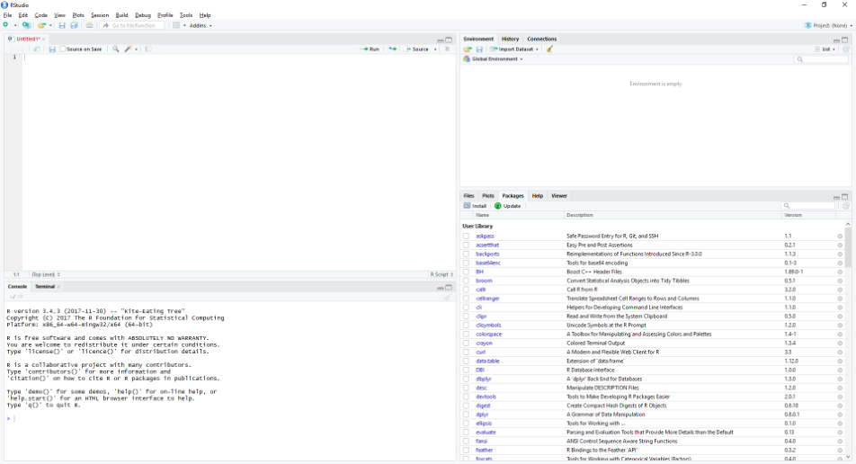
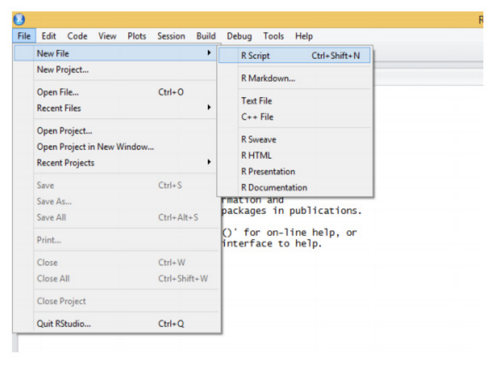
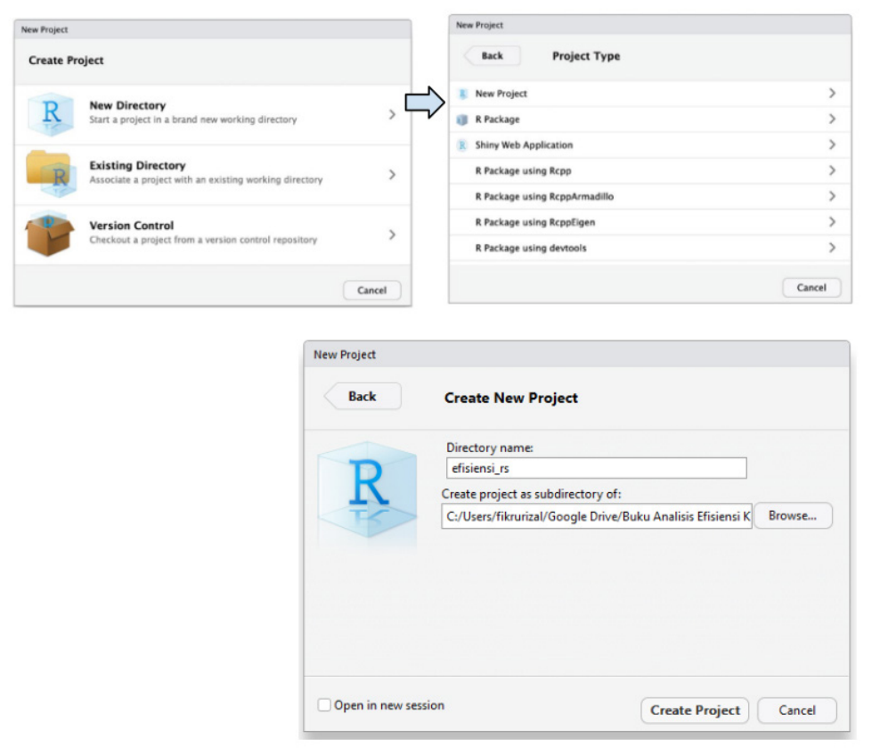
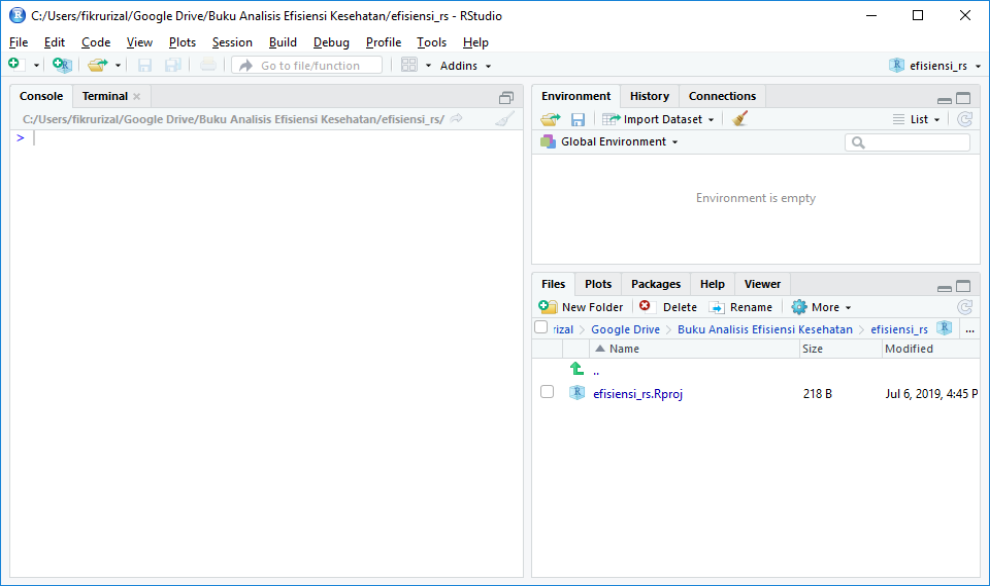
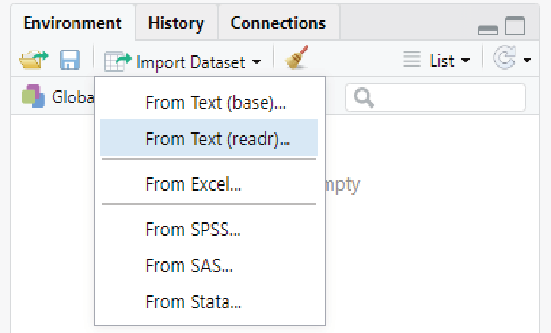
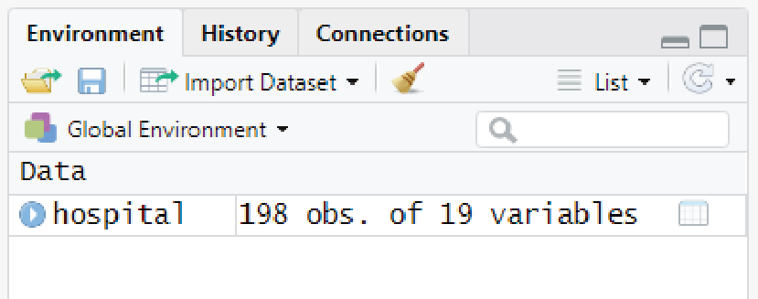
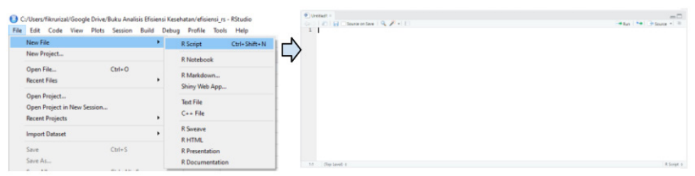
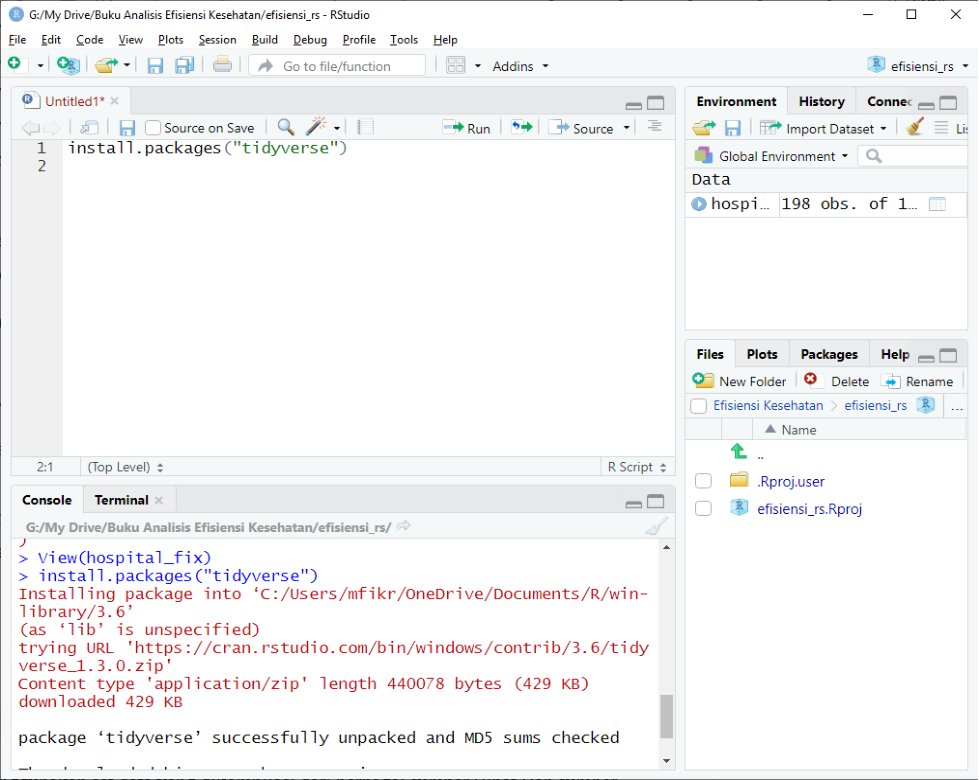
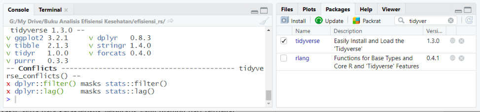

# Menggunakan R, R Studio, dan Pengenalan *Dataset* {#sec-pengantar-r}

```{r}
#| label: setup
#| include: false
source("R/setup.R")
```

Dalam dunia penelitian, banyak dikenal perangkat lunak yang dapat digunakan untuk membantu melakukan pengelolaan, analisis, hingga visualisasi data. Pada buku ini, penulis menggunakan perangkat lunak “R” (selanjutnya disebut R) untuk melakukan analisis data. R memiliki beberapa keunggulan dibandingkan dengan perangkat lunak lainnya.

*Pertama*, dari sisi biaya, R merupakan *free software* atau perangkat lunak gratis di bawah ketentuan Lisensi Publik Umum (*General Public License*, GNU) dalam bentuk kode sumber. *Kedua*, pengguna dapat mengembangkan paket-paket analisis baru. *Ketiga*, R memiliki kemampuan grafis yang baik dan lebih unggul ketika digunakan untuk melakukan simulasi dan analisis yang membutuhkan pemrograman yang intensif. *Keempat*, tersedianya banyak referensi, baik berupa buku, komunitas, maupun tutorial di internet.

Ada juga beberapa kekurangan yang dimiliki oleh R. *Pertama*, tidak terlalu *user-friendly*. Akan tetapi, hal ini dapat diatasi dengan penggunaan *R Studio*, suatu perangkat lunak yang membuat tampilan antarmuka R menjadi lebih mudah dioperasikan. *Kedua*, penggunaan fungsi yang cukup kompleks bagi para pengguna awam sehingga kurva pembelajaran dapat dikatakan cukup menanjak di awal. Untuk versi standar, *R Studio* juga dapat digunakan secara gratis. Oleh karena itu, bab ini bertujuan memberikan panduan praktis untuk menggunakan R dalam melakukan analisis efisiensi fasilitas kesehatan. Bab ini akan menjelaskan tentang bagaimana menginstal R dan *R Studio*, menjelaskan tampilan antarmuka *R Studio*, memberikan gambaran terkait proses pengelolaan data, instalasi dan penggunaan *package*, serta analisis dan visualisasi data sederhana.

## Instalasi R dan R Studio

R dan *R Studio* dapat digunakan pada perangkat berbasis Mac, Windows, dan Linux. Berikut merupakan tahapan-tahapan untuk menginstal R dan *R Studio*, terutama bagi pengguna Windows.

1. Unduh *file* untuk instalasi R di [CRAN](https://cran.r-project.org){target="_blank" rel="noopener"}. Klik salah satu dari “Download R for Linux, Mac, atau Windows” sesuai dengan sistem operasi yang Anda gunakan.

2. Untuk pengguna Windows, ketika Anda sudah mengeklik “Download R for Windows” maka akan muncul beberapa pilihan *file* yang bisa diunduh. Untuk keperluan analisis dasar, pilih “Base”. Setelah itu, di bagian paling atas akan muncul tautan untuk mengunduh R versi terakhir. Klik tautan tersebut dan tunggu hingga proses pengunduhan selesai.

3. Jalankan *file* instalasi dengan *setting default*.

4. Setelah perangkat lunak R selesai di-*instal*, lakukanlah instalasi *R Studio*.

5. Untuk menginstal *R Studio*, pertama buka [https://www.rstudio.com/products/rstudio/download/](https://www.rstudio.com/products/rstudio/download/){target="_blank" rel="noopener"}.

6. Klik “Download” pada paket “RStudio Desktop Open Source License” maka akan muncul berbagai pilihan *file* instalasi.

7. Klik *file* instalasi sesuai sistem operasi yang dimiliki (Windows, Mac, Linux). Contoh: untuk pengguna Windows, *file* yang di-*download* ialah “RStudio-xxx.exe”, sesuai dengan versi terbaru yang disediakan.

8. Setelah *file* instalasi selesai diunduh, lakukan proses instalasi dengan membuka *file* tersebut.

Keterangan: pada saat buku ini ditulis, versi terbaru dari R untuk sistem operasi Windows adalah Versi 4.1.1, sementara untuk *R Studio* adalah Versi 1.4.1717. Laman pengunduhan serta versi dari R dan *R Studio* dapat berubah sewaktu-waktu.

## Tampilan Antarmuka R Studio

Secara bawaan, komponen antarmuka *R Studio* terdiri atas beberapa kotak yang selanjutnya dapat disebut panel atau *window* (@fig-3-1).

{#fig-3-1}

### Panel *R Script* dan *Data View*

*R Script* digunakan untuk menulis segala macam perintah guna pemrograman R. Umumnya, panel ini digunakan untuk mencatat semua pekerjaan yang kita lakukan. Untuk pengguna STATA, panel ini seperti *Do-file*; untuk SPSS, ini seperti *Syntax*; sedangkan pada SAS, ini seperti program SAS. Apabila jendela tersebut tidak muncul saat pertama kali menginstal *R Studio*, langkah yang dapat dilakukan, yaitu (@fig-3-2):

Klik menu “File” → “New File” → “R Script”

{#fig-3-2}

Skrip yang ditulis pada panel ini dapat dijalankan dengan memilih atau mengeblok skrip, kemudian klik Run (Ctrl + Enter). Skrip yang dijalankan dan hasil dari perintah tersebut akan muncul di panel *Console*. Panel *Data View* digunakan untuk melihat *dataset* yang sudah dimasukkan pada sesi R yang sedang berjalan. Baris paling atas berisi nama variabel yang ada dalam *dataset*, sedangkan kolom paling kiri berisi nomor baris (*row number*).

### Panel *Console*

Panel *Console* sebetulnya merupakan tampilan langsung dari setiap proses yang dikerjakan oleh R sehingga selain dengan mencatat terlebih dahulu di panel *Script*, pengguna juga dapat langsung menuliskan perintah pada panel *Console*. Setelah menulis perintah pada panel *Console*, pengguna bisa langsung menekan tombol *enter* dan hasil analisis akan langsung muncul pada baris di bawahnya.

### Panel *Environment*, *History*, dan *Connections*

Panel *Environment* dan *History* dapat dibuka dengan mengeklik *tab* masing-masing yang berada pada panel kanan atas di *R Studio*. Panel *Environment* berisi semua objek, nilai, fungsi, *dataset*, atau apa pun yang kita hasilkan selama sesi R. Sementara itu, panel *History* merekam semua perintah yang sudah dijalankan sebelumnya. Ini biasanya digunakan dalam proses *testing and running*, yaitu mencoba perintah yang kita tulis dan melihat hasilnya ketika dijalankan.

Pada panel ini, pengguna bisa memilih perintah yang diinginkan dan memindah atau menyalin perintah-perintah tersebut ke panel *R Script* untuk mencatat pekerjaan kita. Adapun tab *Connection* merupakan tab khusus yang berkaitan dengan koneksi ke *database* seperti mySQL, postgreSQL, Spark, dan lain-lain.

### Panel *Files*, *Plots*, *Packages*, dan *Help*

Pada bagian kanan bawah antarmuka *R Studio* terdapat pilihan panel *file*, *plots*, *packages*, dan *help*. Panel *package* berisi daftar *add-ons* yang terinstal di *R Studio*. Panel ini merupakan fitur tambahan yang bermanfaat, khususnya dalam manajemen *file*, menampilkan *output command* berupa plot, informasi, dan bantuan dalam penulisan *script* serta *web viewer*. Khusus pada tab *Packages*, kita dapat melihat daftar *library* R yang telah terinstal pada PC kita. Apabila kita ingin menambahkan *library* baru, cukup dengan menekan tombol instal, kemudian mengetikkan nama dari *library* yang ingin diinstal.

## Mengoperasikan R Studio

Terdapat beberapa hal penting yang harus diketahui agar pengguna dapat mengoperasikan *R Studio* dengan lancar, khususnya untuk melakukan analisis yang dicontohkan pada buku ini. Hal tersebut termasuk memahami dan bekerja dengan *R Studio Project*, membuka dan mengimpor data, menjalankan perintah pada *R Script*, serta menginstal dan menggunakan *packages*.

### Bekerja dengan *R Studio Project*

Ketika akan memulai analisis, pengguna dapat terlebih dahulu membuat *R Studio Project*. Fitur ini berguna untuk mengorganisasi semua kode yang ditulis, laporan, maupun komponen-komponen lain yang terkait. Untuk membuat *R Studio Project* baru, klik menu “File” → “New Project”. Setelah itu, akan muncul kotak seperti yang terlihat pada @fig-3-3.

{#fig-3-3}

Pilih “New Directory” untuk membuat folder baru. “Existing Directory” digunakan jika pengguna sudah memiliki *file-file* kode yang akan diteruskan. Sementara “Version Control” digunakan untuk mengelola sistem kontrol versi atau *version control system* seperti perangkat *git* untuk menjalankan *project* yang sudah ada. Setelah itu akan muncul kotak seperti di sebelah kanan. Untuk memulai *project* baru, pilih “New Project”.

{#fig-3-4}

Beri nama *project* yang akan dibuat dengan nama “efisiensi_rs” dan tentukan lokasi folder yang akan dibuat dengan mengeklik “Browse”. @fig-3-4 merupakan tampilan *R Studio* setelah *project* baru selesai dibuat.

### Membuka dan Mengimpor Data

R memiliki fitur untuk dapat membaca atau mengimpor data dari berbagai jenis format, baik dalam bentuk teks (.csv), *dataset* stata (.dta), maupun SAS (.sas). Untuk melakukan impor data, pada panel *Environment* klik “Import Dataset”, kemudian pilih format data yang akan kita impor. Pada buku ini, jenis *file* yang akan kita gunakan ialah .csv sehingga kita dapat memilih “From Text (readr)”. Setelah itu, klik “Browse” untuk memilih *dataset* yang akan kita impor (lihat @fig-3-5). Setelah *dataset* berhasil diimpor maka akan muncul objek dengan jenis “Data” pada panel *Environment* seperti pada @fig-3-6. Terdapat keterangan singkat mengenai objek tersebut yang berupa jumlah observasi (jumlah sampel) dan jumlah variabel yang ada.

{#fig-3-5}

{#fig-3-6}

## R Script

Setelah berhasil mengimpor *dataset*, kita akan belajar menuliskan *R Script*. Secara sederhana, *script* adalah kumpulan perintah atau program yang akan kita jalankan pada R. Untuk membuat *R Script* baru, silakan klik “File” → “New File” → “New Script”. Atau, kita bisa menggunakan *shortcut* Ctrl + Shift + N (pada Windows) dan (Command + Shift + N). Hasilnya, kita akan melihat panel baru di sisi kiri atas dengan judul “Untitled1” (@fig-3-7). Sebelum bekerja menggunakan *R Script*, sebaiknya kita menyimpan dahulu *script* kita dan memberikan judul yang sesuai.

{#fig-3-7}

Cara menyimpan *R Script*, yaitu dengan mengeklik “File” → “Save”. Setelah itu, kita akan dibawa ke folder *project* yang sudah kita buat sebelumnya, kemudian kita bisa menuliskan nama *R Script* kita di situ (seperti menyimpan *file* pada aplikasi Office pada umumnya). Selain menggunakan *script* biasa, *R Studio* juga menyediakan fitur “R Markdown” yang merupakan sebuah bentuk *file* mirip dengan *R Script*, namun dapat digunakan untuk membuat dokumen dinamis dengan menggabungkan *code* (disusun dalam bentuk *chunks*) dan *text* (dengan bahasa *markdown*). Informasi lebih lanjut mengenai fitur ini dapat dibaca pada laman [https://rmarkdown.rstudio.com/index.html](https://rmarkdown.rstudio.com/index.html){target="_blank" rel="noopener"}.

## Menginstal dan Menggunakan Package

R merupakan program yang multifungsi, terutama dengan fleksibilitasnya untuk dapat ditambahkan fitur-fitur tertentu, bahkan fitur-fitur tersebut dapat dikembangkan oleh berbagai pihak karena R bersifat *open source*. Untuk menambahkan fitur tersebut, R mengenalnya dengan *package.*

Beberapa *package* yang perlu diinstal untuk menjalankan analisis pada buku ini, di antaranya: *tidyverse*, *labelled*, *modelsummary*, *gtsummary*, *gt*, *flextable*, *benchmarking*, *frontier*, *AER*, dan *truncreg*. Untuk menambahkan *package* pada program R, kita dapat menuliskan perintah berikut ini pada *R Script*:

```{r}
#| eval: false
install.packages("nama_packages")
```

Lebih khusus, untuk mengerjakan contoh-contoh analisis yang ada di buku ini, berikut merupakan skrip yang dapat digunakan untuk menginstal *packages* tersebut:

```{r}
#| eval: false
install.packages(c("tidyverse", "labelled",
                   "modelsummary", "gtsummary", "gt",
                   "flextable", "Benchmarking", "frontier",
                   "AER", "truncreg"))
```

::: {.callout-note}
## Catatan edisi daring

Nama *package* ditulis dengan huruf besar-kecil yang tepat karena R membedakannya:
`Benchmarking` (bukan `benchmarking`) dan `install.packages()` (bukan `Install.packages()`).
:::

Guna menjalankan *script* tersebut, kita dapat mengeblok *script* tersebut lalu mengeklik ikon “Run” yang ada pada sisi kanan atas panel *script*, atau dengan cara mengeblok *script* yang akan kita jalankan, lalu mengetik tombol Ctrl + Enter pada *keyboard*. Perintah yang kita jalankan akan muncul pada panel *Console* yang berada di bawah panel *Script* tersebut (@fig-3-8). Penting diperhatikan bahwa untuk menginstal *packages* tersebut, pengguna harus tersambung dengan jaringan internet. Adapun cara penggunaan dari masing-masing *package* akan dijelaskan pada bagian yang terkait.

{#fig-3-8}

Pada *software R*, *packages* yang sudah diinstal akan tersimpan secara permanen. Akan tetapi, pengguna harus mengaktifkan *packages* tersebut setiap kali membuka sesi atau lembar kerja baru. Untuk mengaktifkan, cara pertama yang bisa dilakukan, yaitu dengan membuka panel *package* yang ada pada sisi kanan bawah, kemudian cari *package* yang kita ingin aktifkan, kemudian klik pada kotak kecil yang ada di samping nama *package* tersebut. Setelah proses selesai, akan muncul tanda centang di samping nama *package* tersebut (@fig-3-9).

Cara kedua, yaitu dengan menuliskan, lalu menjalankan perintah “library(nama_packages)”. Kedua cara ini akan menghasilkan luaran yang sama. Akan tetapi, untuk kepentingan dokumentasi yang lebih rapi, sebaiknya semua perintah yang kita jalankan di R, termasuk menginstal dan mengaktifkan *package*, dilakukan dengan menuliskan dan menjalankan *R Script.*

{#fig-3-9}

## Dataset

Buku ini akan menggunakan *dataset* yang dikompilasi dari berbagai sumber (lihat Bab [VII](#sec-isu) tentang sumber data) di Indonesia yang menggambarkan situasi *input* dan *output* rumah sakit di Indonesia. Dataset latihan tersedia di repositori buku sebagai [`hospital.csv`](https://raw.githubusercontent.com/fikrurizal/buku-efisiensi/main/data/hospital.csv). Perintah R di bawah membacanya langsung dari sumber tersebut, sehingga tidak memerlukan unduhan manual.

#### Informasi tentang Variabel pada *Dataset* (*Codebook*)

Data yang akan digunakan untuk latihan pada buku ini merupakan data informasi pembiayaan dan pelayanan rumah sakit, serta data karakteristik geografis yang diambil dari berbagai sumber. Adapun penjelasan terkait nama variabel, deskripsi, dan tipe data yang ada pada *dataset* tersebut dijelaskan lebih terperinci pada @tbl-3-1.

| Nama Variabel | Tipe Data | Deskripsi |
|:--|:--|:--|
| `id_rs` | String | Nomor rumah sakit (ID) |
| `gp_FTE` | Kontinu | Jumlah dokter umum penuh-waktu |
| `spec_FTE` | Kontinu | Jumlah dokter spesialis penuh-waktu |
| `nurse_total` | Kontinu | Jumlah perawat |
| `other_prof` | Kontinu | Jumlah tenaga kesehatan lainnya |
| `beds` | Kontinu | Jumlah tempat tidur |
| `outpatients` | Kontinu | Jumlah kunjungan rawat jalan |
| `bed_days` | Kontinu | Jumlah total bed-days |
| `admissions1` | Kontinu | Jumlah admisi rawat inap |
| `bed_occ` | Kontinu | Bed occupancy ratio |
| `throughput` | Kontinu | Bed turnover ratio |
| `alos` | Kontinu | Rerata lama rawat inap |
| `totalcost_op` | Kontinu | Total cost rawat jalan |
| `totalcost_bd` | Kontinu | Total cost per bed days |
| `totalcost_ip` | Kontinu | Total cost rawat inap |
| `publichospital` | Biner | Rumah sakit pemerintah, 1 = ya, 0 = tidak |
| `poorins` | Kontinu | Proporsi peserta jaminan kesehatan bersubsidi di kabupaten/kota |
| `classCD` | Biner | Kelas RS, A/B = 0, C/D = 1 |
| `non_JavaBali` | Biner | Lokasi di Pulau Jawa/Bali = 0, Luar Jawa/Bali = 1 |

: *Codebook dataset* rumah sakit {#tbl-3-1}

## Deskripsi Awal Data

Setelah data yang dibutuhkan disiapkan, hal yang pertama kali perlu dilakukan, yaitu mendeskripsikannya. Tujuannya untuk mengetahui gambaran umum dari data yang akan dianalisis. Langkah pertama yang harus dilakukan, yaitu mengimpor atau memasukkan data ke dalam lembar kerja R.

Karena sumber data yang akan kita gunakan memiliki format “csv” atau *comma separated value*, pengguna membutuhkan fungsi “readr” yang merupakan bagian dari *package* “tidyverse” yang biasa digunakan untuk keperluan sains data (*data science*). Oleh karena itu, *package* ini perlu diaktifkan terlebih dahulu dengan menjalankan perintah di bawah ini.

```{r}
# Mengaktifkan packages
library(tidyverse)
```

Lalu, dilanjutkan dengan membuka data “hospital.csv” menggunakan perintah di bawah ini. Pada proses ini, pengguna dikenalkan dengan “tata bahasa” pada R ketika *package* **“tidyverse”** sudah diaktifkan. Pertama-tama, secara umum bahasa R dapat dibaca seperti kalimat pasif sehingga perintah di bawah ini dapat dibaca sebagai: buatlah sebuah objek bernama “hospital” (hospital <- ) yang diimpor (read_csv) dari dokumen “hospital.csv” di repositori buku, kemudian (%>%) ubahlah jenis objeknya menjadi “tibble” (as_tibble()).

Perintah “%>%” biasa disebut sebagai “pipe” atau pipa yang berfungsi untuk mengaitkan suatu objek atau perintah satu dengan perintah selanjutnya. Sementara itu, “tibble” sendiri merupakan modifikasi dari bentuk dasar “data.frame” (bentuk dasar dari suatu tabel di R) yang bersifat lebih “tertib” mengikuti aturan-aturan terkini dari praktik pengelolaan dan analisis data. Informasi lebih lengkap mengenai *package* “tidyverse” serta komponen-komponen yang ada di dalamnya dapat dilihat pada laman [https://www.tidyverse.org/](https://www.tidyverse.org/){target="_blank" rel="noopener"} dan pada buku “*R for Data Science*” yang bisa diakses di [https://r4ds.had.co.nz/](https://r4ds.had.co.nz/){target="_blank" rel="noopener"}.

```{r}
# Mengimpor data dari format csv
hospital <- read_csv(
  "https://raw.githubusercontent.com/fikrurizal/buku-efisiensi/main/data/hospital.csv"
) %>% as_tibble()
```

Setelah berhasil mengimpor data ke sistem R, selanjutnya diberikan label pada variabel-variabel tersebut dan ditambahkan penjelasan terkait nilai pada variabel yang bersifat kategorik. Pada proses persiapan data (*data cleaning and preparation*), tahap ini penting untuk dilakukan agar pengguna dapat memahami informasi yang ada pada data dengan lebih mudah. Pada R, salah satu *package* yang cukup lengkap, yaitu “labelled”. Sebelum paket ini digunakan, jalankan terlebih dahulu perintah di bawah ini untuk mengaktifkannya. Adapun informasi dan penjelasan lebih terperinci mengenai paket “labelled” dapat dibaca pada laman [https://larmarange.github.io/labelled/index.html](https://larmarange.github.io/labelled/index.html){target="_blank" rel="noopener"}.

```{r}
# Mengaktifkan packages
library(labelled)
```

Selanjutnya, terdapat dua tahap yang perlu dilakukan, yaitu memberi label pada variabel (atau kolom pada *data-frame*), lalu memberi label pada nilai variabel dan mengubahnya menjadi variabel kategorikal atau *factor variable*. Pada prinsipnya, variabel kategorik adalah variabel yang isinya bukan berupa angka, misalnya jenis kelamin, status pernikahan, dan lain-lain. Tahap-tahap tersebut dapat dilakukan dengan menjalankan perintah di bawah ini.

```{r}
# Memberi label variabel
hospital <- hospital %>%
  set_variable_labels(
  id_rs = "ID Rumah Sakit",
  gp_FTE = "Jumlah Dokter Umum",
  spec_FTE = "Jumlah Dokter Spesialis",
  nurse_total = "Jumlah Perawat",
  other_prof = "Jumlah Karyawan Lain",
  beds = "Jumlah Bed",
  outpatients = "Jumlah Kunjungan Rajal",
  bed_days = "Total Bed Days",
  admissions1 = "Jumlah Admisi",
  bed_occ = "Bed Occupancy",
  throughput = "Throughput",
  alos = "Average Length of Stay",
  totalcost_op = "Total Biaya Rajal",
  total_cost_bd = "Total Biaya Bed Days",
  totalcost_ip = "Total Biaya Ranap",
  publichospital = "Kepemilikan",
  poorins = "Proporsi Jamkesmas",
  classCD = "Kelas",
  non_JavaBali = "Lokasi")
# Memberi label pada nilai variabel
hospital <- hospital %>%
  set_value_labels(
  publichospital = c("Pemerintah"=1, "Swasta"=0),
  classCD = c("Kelas C/D"=1, "Kelas A/B"=0),
  non_JavaBali = c("Non Java-Bali"=1, "Java-Bali"=0)) %>%
  to_factor()
```

Selanjutnya, pengguna dapat membuat suatu tabel yang menggambarkan atau merangkum informasi yang ada dalam data. Dalam hal ini, data yang bersifat kontinu akan digambarkan dalam bentuk rerata dan simpang baku (*standard deviation*), sementara data yang bersifat kategorik akan digambarkan dalam bentuk jumlah dan persentase. Berikut merupakan perintah yang bisa dijalankan menggunakan *package* “gtsummary” dan “flextable” dengan hasil pada @tbl-3-2. Fitur utama dari paket “gtsummary” yang digunakan pada buku ini, yaitu “tbl_summary” yang sangat berguna untuk membuat tabel rangkuman statistik atau statistik deskriptif, termasuk juga untuk melakukan analisis bivariat sederhana.

```{r}
#| label: tbl-3-2
#| tbl-cap: "Tabel deskripsi menggunakan *package* “gtsummary”"
# Mengaktifkan packages
library(gtsummary)
library(flextable)
# Mendeskripsikan data
hospital %>% select(-id_rs) %>%
  tbl_summary(digits = all_continuous() ~ 2,
  statistic = all_continuous() ~ "{mean} ({sd})") %>%
  as_flex_table()
```

Pada perintah di atas, fungsi “select()” dari paket “tidyverse” digunakan untuk memilih variabel apa saja dari *dataset hospital* yang akan digunakan. Dalam hal ini yang dipilih, yaitu “-id_rs”. Tanda negatif sebelum variabel “id_rs” menandakan bahwa kita tidak memilih variabel tersebut. Selanjutnya, pada fungsi “tbl_summary()”, terdapat dua parameter pokok yang harus didefinisikan. *Pertama*, “digits” mengatur jumlah digit yang akan ditampilkan; “all_continous() ~ 2” menandakan bahwa semua variabel yang sifatnya kontinu akan ditampilkan dengan dua digit di belakang koma (titik). Sementara itu, parameter “statistic” mengatur ukuran statistik apa yang akan ditampilkan; “all_continuous() ~ “{mean} {sd}”” menandakan bahwa statistik yang akan ditampilkan merupakan rerata (*mean*) dan deviasi standar (*standard deviation, sd*). Jika kedua parameter ini tidak ditentukan maka secara otomatis R akan memilih ukuran statistik apa yang “paling tepat” sesuai dengan distribusi dari data yang ada. *Terakhir*, fungsi “as_flex_table()” bertujuan untuk mengubah format tabel yang dihasilkan agar lebih mudah digunakan pada aplikasi pengolah kata (misalnya Microsoft Word dan yang sejenisnya).

Penjelasan lebih lanjut mengenai fungsi “tbl_summary()” dapat dilihat pada laman [http://www.danieldsjoberg.com/gtsummary/articles/tbl_summary.html](http://www.danieldsjoberg.com/gtsummary/articles/tbl_summary.html){target="_blank" rel="noopener"}. Sementara itu, contoh aplikasinya pada keperluan lain akan dijelaskan pada bagian-bagian selanjutnya.

## Kesimpulan

- R merupakan aplikasi pemrograman multifungsi, termasuk bisa untuk analisis data dan statistik, yang bisa didapatkan dan digunakan secara gratis.

- Untuk dapat menggunakan R dengan lebih mudah, pengguna dapat menginstal aplikasi *R Studio*, sebuah *integrated development environment*.

- Aplikasi R dapat mengenali data yang tersimpan dalam berbagai format yang umum digunakan, seperti .xls/.xlsx (Ms. Excel), .csv, .txt, .dta (Stata), ataupun .sas (SAS).

- *Dataset* yang akan digunakan pada buku ini merupakan data rumah sakit di Indonesia yang sudah disederhanakan.
