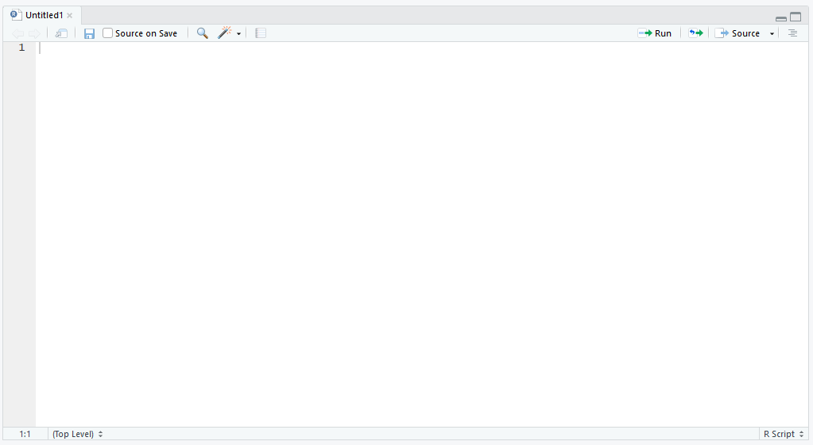
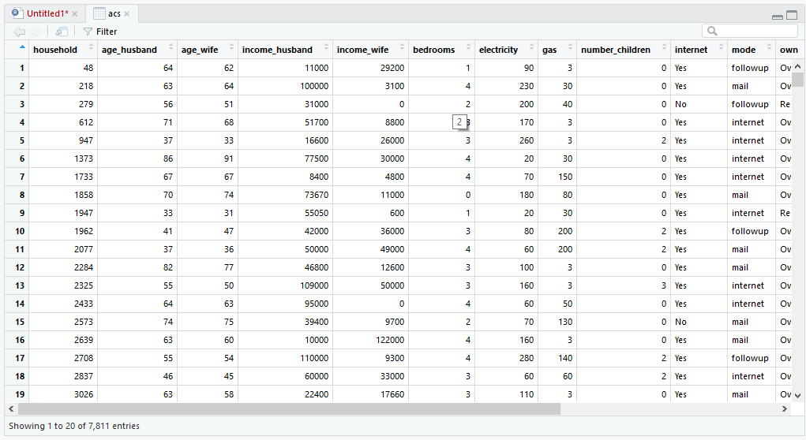
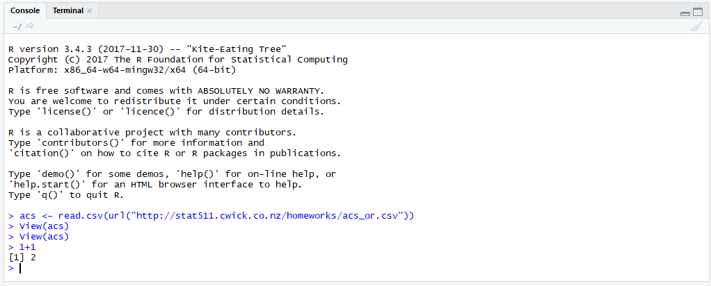
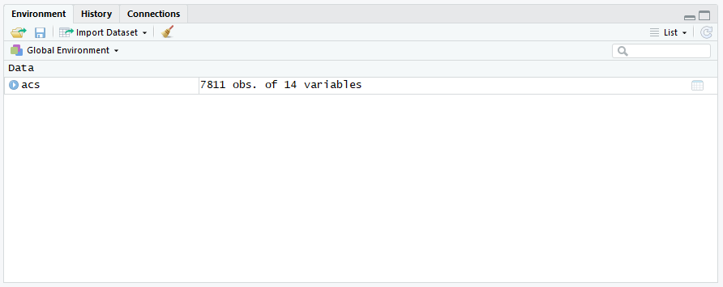
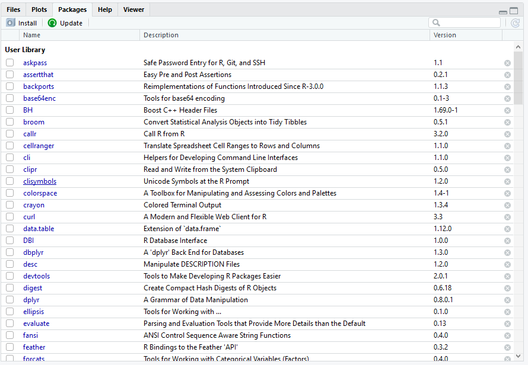

# Pengantar R dan RStudio {#sec-pengantar-r}

## Pengantar

Dalam dunia penelitian, banyak dikenal perangkat lunak yang digunakan untuk membantu melakukan pengelolaan, analisis, hingga visualisasi data. Pada buku ini, penulis menggunakan perangkat lunak "R" (selanjutnya disebut R) untuk melakukan analisis data.

R memiliki keunggulan dibandingkan dengan perangkat lunak lainnya. Pertama, dari sisi biaya, R bersifat open source sehingga dapat digunakan dengan gratis. Kedua, pengguna dapat mengembangkan paket-paket analisis baru. Ketiga, R memiliki kemampuan grafis yang baik dan lebih unggul ketika digunakan untuk melakukan simulasi dan analisis yang membutuhkan pemrograman yang intensif. Keempat, tersedianya banyak referensi baik berupa Buku, komunitas, maupun tutorial di internet. Namun, ada juga beberapa kekurangan yang dimiliki oleh R. Pertama, tidak terlalu *user-friendly*. Akan tetapi hal ini dapat diatasi dengan penggunaan RStudio, suatu perangkat lunak yang membuat tampilan antarmuka R menjadi lebih mudah dioperasikan. Kedua, penggunaan fungsi yang cukup kompleks pagi para pengguna awa, sehingga kurva pembelajaran dapat dikatakan cukup menanjak di awal.

Oleh karena itu, Bab ini bertujuan untuk memberikan panduan praktis untuk menggunakan R dalam melakukan analisis-analisis yang akan dibahas pada buku ini. Bab ini akan menjelaskan tentang bagaimana menginstal R dan RStudio, menjelaskan tampilan antarmuka RStudio, memberikan gambaran terkait proses pengelolaan data, instalasi dan penggunaan *package*, serta analisis dan visualiasi data sederhana.

## Instalasi R dan RStudio

R dan RStudio dapat digunakan untuk perangkat berbasisMac, Windows, maupun Linux. Berikut adalah tahapan-tahapan untuk menginstal R dan RStudio

1.  Unduh file untuk instalasi R di <https://cran.r-project.org/>, Klik salah satu dari Download R for Linux, Mac, atau Windows sesuai dengan sistem operasi yang anda gunakan

2.  Misalkan, ketika anda sudah mengeklik "Download R for Windows" maka akan muncul beberapa pilihan, kemudian klik "base". Setelah itu akan muncul tulisan "Download R 3.6.0 for Windows"

3.  Jalankan file instalasi dengan setting *default*

4.  Setelah perangkat lunak R selesai diinstal, lakukanlah instalasi RStudio

5.  Untuk menginstal RStudio 1.2, pertama-tama buka <https://www.rstudio.com/products/rstudio/download/>

6.  Klik "Download" pada paket "RStudio Desktop Open Source License, maka akan muncul berbagai pilihan file instalasi.

7.  Klik file instalasi sesuai sistem operasi yang dimiliki (Windows, Mac, Linux). Contoh, untuk pengguna windows, file yang didownload

8.  Setelah file instalasi selesai diunduh, lakukan proses instalasi dengan membuka file tersebut

## Tampilan antar-muka RStudio

Files, plots, dan help

Workspace dan History

Console

R Script dan Data View

Secara umum, komponen antarmuka RStudio terdiri dari beberapa kotak yaitu:

1.  *R Script* dan *data view*.

*R Script* digunakan untuk menulis segala macam perintah untuk pemrograman R. Umumnya panel ini kita gunakan untuk mencatat semua pekerjaan yang kita lakukan. Untuk pengguna stata, panel ini seperti do-file sedangkan untuk SPSS ini seperti syntax, sedangkan pada SAS ini seperti program SAS.

{width="100%" fig-align="center"}

Skrip yang ditulis pada panel ini dapat dijalankan dengan memilih atau memblok skrip kemudian mengeklik Run (Ctrl + Enter). Skrip yang dijalankan dan hasil dari perintah tersebut akan muncul di panel *Console*.

Panel *data view* digunakan untuk melihat dataset yang sedang kita pakai. Contohnya, kita bisa membuka contoh dataset online ACS yang merupakan contoh dari data sensus Amerika Serikat. Hal tersebut dapat dilakukan dengan menuliskan perintah di bawah ini:

acs \<- read.csv(url(\"http://stat511.cwick.co.nz/homeworks/acs_or.csv\"))

Baris paling atas berisi nama variabel yang ada di dalam dataset dan kolom paling kiri berisi nomor baris (*row number*).

{width="100%" fig-align="center"}

2.  Console

Selain mencatat terlebih dahulu di panel Script, kita juga dapat langsung menuliskan perintah pada panel *console*. Setelah menulis perintah pada panel konsol kita bisa langsung menekan tombol enter dan hasil analisis akan langsung muncul pada baris di bawahnya. Contoh nya dapat dilihat pada Gambar x di bawah ini.

\>1+1 \[Enter\] 🡪 Perintah

\[1\] 2 🡪 Hasil

{width="100%" fig-align="center"}

3.  Environment dan history

Panel *environment* dan *history* dapat dibuka dengan mengeklik tab masing-masing yang berada pada panel kanan atas di RStudio.

Panel *environment* berisi semua objek, nilai, fungsi, dataset, atau apapun yang kita hasilkan selama sesi R kita. Contohnya, dataset yang tadi sudah kita unduh dan kita buka dapat dilihat pada panel ini. Di situ tertulis juga detail dari objek yang ada. Dalam hal ini dataset ACS memiliki 7811 observasi dan 14 variabel.

{width="100%" fig-align="center"}

Sementara itu, panel *history* merekam semua perintah-perintah yang sudah kita jalankan sebelumnya. Ini biasanya digunakan dalam proses *testing and running*, yaitu mencoba perintah yang kita tulis dan melihat hasilnya ketika dijalankan. Pada panel ini, kita bisa memilih perintah yang kita mau dan memindah atau menyalin perintah-perintah tersebut ke panel *R Script* kita untuk mencatat pekerjaan kita.

4.  Files, plots, packages, and help

Pada bagian kanan bawah antarmuka RStudio, terdapat pilihan panel *file, plots, packages,* and *help*. Panel *package* berisi daftar *add-ons* yang terinstal di RStudio kita.

The package tab shows the list of add-ons included in the installation of RStudio. If checked, the package is loaded into R, if not, any command related to that package won't work, you will need select it. You can also install other add-ons by clicking on the 'Install Packages' icon.

Another way to activate a package is by typing, for example, library(foreign). This will automatically check the \--foreign package (it helps bring data from proprietary formats like Stata, SAS or SPSS).

The plots tab will display the graphs.

{width="100%" fig-align="center"}

## Mengoperasikan RStudio

Mengubah direktori

Membuka dan mengimpor data

Melihat data

Menulis dan menjalankan skrip

Instalasi *package*

Melihat hasil analisis (tabel, grafik dll)

## Kesimpulan
