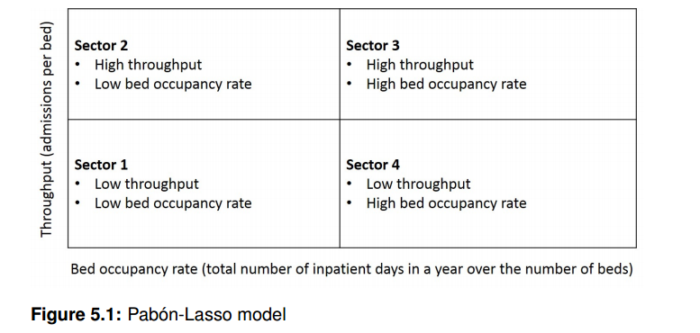
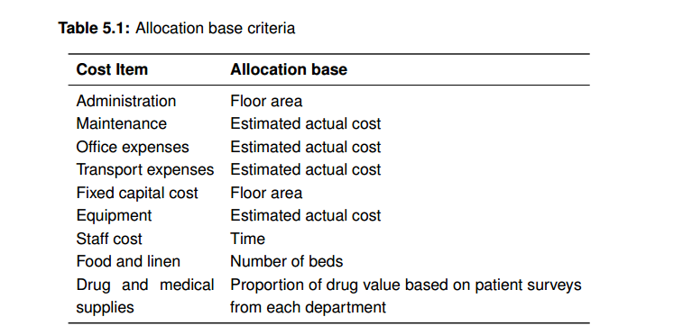
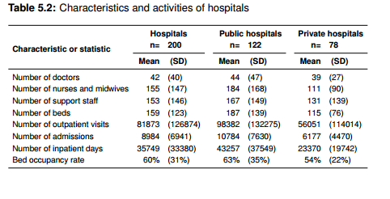
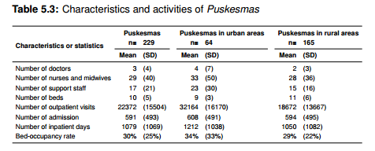
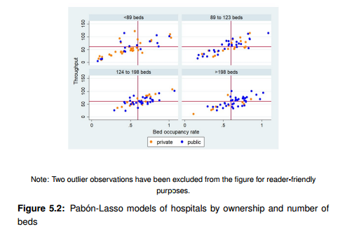
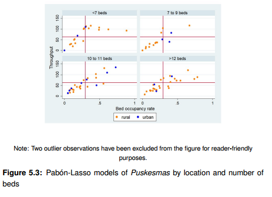
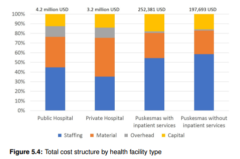

# Analisis Rasio {#sec-rasio}

## Pengantar

Seperti yang dibahas di Bab 2 hampir sepertiga dari studi mengenai efisiensi faskes di negara berpenghasilan rendah dan menengah dilakukan dengan teknik analisis rasio (AR). Terutama pada kondisi ketika ada keterbatasan waktu, data, keahlian, atau anggaran, AR lebih disukai oleh pembuat kebijakan dan peneliti untuk melakukan penilaian efisiensi fasilitas kesehatan.

Bitran (1992) mengkategorikan dua jenis analisis rasio efisiensi: teknis (rasio input fisik ke output) dan ekonomi (rasio input biaya ke output). Fasilitas sering menggunakan rasio sederhana (mis. Tingkat hunian tempat tidur ata *bed occupancy rate* dan jumlah admisi per tempat tidur) untuk mengevaluasi efisiensi teknis fasilitas kesehatan. Lasso (1986) menyarankan untuk menggabungkan tingkat hunian tempat tidur, tingkat turnover tempat tidur, dan rata-rata lama tinggal (*length of stay*) untuk memberikan gambaran yang lebih lengkap tentang kinerja fasilitas kesehatan.

Selain itu, membandingkan indikator kinerja menggunakan analisis rasio pada fasilitas kesehatan dapat sekaligus membantu menilai efisiensi (Barnum & Kutzin, 1993; Flessa, 1998; Adam et al., 2003; Conteh & Walker, 2004). Akuntansi merupakan metode yang tepat untuk mengukur efisiensi ekonomi dan menjelaskan variasi pada rata-rata biaya suatu layanan pada periode waktu tertentu (St-Hilaire & Crepeau, 2000). Informasi mengenai biaya berguna untuk perencanaan dan penganggaran, analisis efektivitas biaya, dan evaluasi kinerja penyediaan layanan kesehatan di Indonesia (Lindelow & Wagstaff, 2003). Unit biaya yang relatif tinggi di fasilitas kesehatan dapat mengindikasikan adanya ketidakefisian, memberikan informasi yang berharga dalam proses pengambilan keputusan kebijakan di fasilitas kesehatan milik pemerintah, baik di tingkat daerah maupun pusat (Barnum & Kutzin, 1993; Witter et al., 2000). Seperti diilustrasikan pada Bab 2, variasi yang lebar pada kinerja fasilitas kesehatan serta heterogenitas di tingkat nasional menunjukkan bahwa ada hal yang bisa dipelakari dari fasilitas kesehatan yang berkinerja lebih baik. Kami menggabungkan kedua jenis analisis rasio untuk mengidentifikasi fasilitas kesehatan yang berkinerja tinggi serta melakukan eksplorasi faktor-faktor yang mendasari kinerja yang relative baik tersebut.

Beberapa penelitian sudah dilakukan untuk mengetahui biaya penyediaan layanan kesehatan di Indonesia (Sulistyorini & Moediarso, 2012; Putra et al., 2013; Sari et al., 2013), akan tetapi, sampai saat ini hanya ada satu studi yang meneliti biaya pelayanan kesehatan primer di Indonesia yang digunakan untuk menilai efisiensi relative mereka (Berman, 1986). Kami menemukan satu penelitian di Indonesia yang menggunakan model Pabon-Lasso untuk menilai kinerja rumah sakit dan mengidentifikasi strategi untuk meningkatkan efisiensi (Iswanto, 2015). Namun, metode ini tidak pernah digunakan untuk menganalisis faktor kontekstual yang memengaruhi fasilitas kesehatan di Indonesia.

## Metode

### Data

Studi ini menilai penyebab efisiensi di fasilitas kesehatan dengan menganalisis data dari empat sumber: 1) studi penetapan biaya fasilitas kesehatan (HFCS), 2) dataset *Indonesia Case-Based Groups* (INA-CBGs), 3) Statistik Sosial Ekonomi Nasional (SUSENAS), dan 4) statistik potensi desa (PODES). ami menggunakan pengidentifikasi rumah sakit untuk menggabungkan dataset HFCS dan INA-CBGs.

Kami menggabungkan dataset SUSENAS menggunakan pengidentifikasi kabupaten/kota dari rumah sakit dan Puskesmas. Dataset PODES digabungkan menggunakan pengidentifikasi kabupaten/kota untuk rumah sakit dan pengidentifikasi kecamatan untuk Puskesmas. Dataset gabungan kami dari empat sumber ini terdiri dari 89 variabel untuk 200 rumah sakit dan 65 variabel untuk 234 Puskesmas. Namun, kami tidak menganalisis 139 Puskesmas tanpa layanan rawat inap karena parameter Model Pabon-Lasso hanya berlaku untuk layanan rawat inap. Tidak ada imputasi multipel untuk data yang tidak ada (*missing value*), selain dari indeks *casemix* yang digunakan untuk menyesuaikan biaya satuan rumah sakit.

### Analisis dengan Model Pabon-Lasso

Lasso (1986) mengembangkan teknik grafis untuk membagi fasilitas kesehatan menjadi empat sektor menggunakan kombinasi indikator efisiensi. Ada tiga indikator utama: (1) tingkat hunian tempat tidur rata-rata (average bed occupancy rate), yang ditunjukkan pada sumbu horizontal dan mengukur persentase waktu dari rata-rata tempat tidur dihuni ; (2) tingkat turnover tempat tidur rata-rata, yang direpresentasikan pada sumbu vertikal dan mengukur jumlah rata-rata pasien dipulangkan per tempat tidur pada tahun tersebut; dan (3) rata-rata lama menginap, yang direpresentasikan oleh gradien garis lurus dari titik asal (origin) ke titik pengamatan dan mengukur durasi rata-rata rawat inap (Lasso, 1986). Kami menerapkan model grafis Pabon-Lasso (1986) untuk menilai efisiensi fasilitas kesehatan dengan memplotkan dua indikator: jumlah admisi per tempat tidur dan tingkat hunian tempat tidur. Indikator-indikator ini membagi grafik menjadi empat sector yang mewakili berbagai tingkat efisiensi (Gambar 5.1): fasilitas kesehatan di Sektor 1 (kiri bawah) memiliki throughput (luaran antara) yang rendah (jumlah admisi per tempat tidur) dan durasi kekosongan tempat tidur yang Panjang; fasilitas kesehatan di sector 2 (kiri atas) memiliki jumlah pasien yang banyak namun memiliki waktu kekosongan tempat tidur yang panjang; fasilitas kesehatan di Sektor 3 (kanan atas) memiliki throughput tinggi dan tingkat hunian tinggi; sementara fasilitas kesehatan di Sektor 4 memiliki tempat tidur dengan throughput yang rendah namun pasien lebih lama tinggal. Kami tidak menunjukkan rata-rata lama rawat inap di gambar namun kami menggunakan model Pabon-Lasso untuk memeriksa variasi kontekstual antar faskes di berbagai setting (mis. ukuran tempat tidur, kepemilikan, dan lokasi).

{width="98%" fig-align="center"}

 

Kami menilai bahwa penggunaan nilai rerata pada tiap axis sebagai cut-off untuk membagi grafik menjadi sektor-sektor adalah ukuran yang masuk akal dengan kecenderungan distribusi faskes pada kedua sisi yang cukup seimbang.

### Metode Perhitungan Biaya

Kami memperkirakan total biaya dan biaya unit rumah sakit dan Puskesmas. Satuan biaya mengacu pada biaya rata-rata untuk memberikan satu layanan. Pendekatan step-down dan bottom-up sama-sama valid untuk memperkirakan unit biaya (Mogyorosy & Smith, 2005). Pemilihan metode yang tepat sering bergantung pada tingkat agregasi data (Smith & Barnett, 2003). Pendekatan bottom-up membutuhkan data yang lebih rinci seperti data pada tingkat pasien, yang kemungkinan tidak bisa diperoleh untuk penelitian ini (Smith & Barnett, 2003). Oleh karena itu, kami menggunakan pendekatan step-down, teknik umum untuk menghitung biaya satuan secara akurat dan praktis (Conteh & Walker, 2004; Mogyorosy & Smith, 2005). Biaya overhead dialokasikan untuk pusat biaya antara dan pusat biaya akhir (mis. kunjungan rawat jalan dan rawat inap) untuk menghitung biaya per kunjungan rawat jalan, biaya per rawat inap, dan biaya per tempat tidur hari (Conteh & Walker, 2004; Mogyorosy & Smith, 2005).

Langkah pertama yang dilakukan adalah dengan melakukan klasifikasi pusat biaya, dengan dua pusat biaya akhir dan beberapa pusat biaya menengah/antara. Pusat biaya akhir adalah unit rawat inap dan rawat jalan; pusat biaya pendukung adalah unit yang memberikan dukungan bagi pelayanan pasien, termasuk administrasi, dukungan non-klinis (mis. dapur, transportasi dan cucian) dan dukungan klinis (mis. radiologi, farmasi dan ruang operasi).

Biaya langsung, termasuk penempatan staf, bahan dan modal, dialokasikan untuk setiap pusat biaya. Biaya kepegawaian mencerminkan gaji pokok dan insentif keuangan unntuk individu seperti asuransi dan tunjangan keluarga. Data terkait biaya untuk bahan, termasuk pasokan medis dan obat-obatan didapatkan dari database Monthly Index of Medical Specialities (MIMS) Indonesia. Studi ini memasukkan bangunan, kendaraan, peralatan dan furnitur sebagai biaya modal, tidak termasuk biaya tanah. Pendekatan ekonomi digunakan untuk memperkirakan biaya modal, yang mencakup penyusutan nilai dan biaya peluang (opportunity cost) untuk investasi (Shepard et al., 2000). Informasi tentang nilai bangunan per meter persegi yang didapatkan dari Dataset Studi Pembiayaan Fasilitas Kesehatan kemudian digunakan untuk memperkirakan nilai bangunan tahunan. Modal biaya dianualisasi dengan menggunakan tingkat diskonto 3%, seperti yang direkomendasikan oleh WHO (Edejer et al., 2003). Dikarenakan tidak adanya informasi terkait masa hidup peralatan dan aset modal di Indonesia, kami memperkirakannya menggunakan Pedoman aset rumah sakit dari *American Hospital Association*, yang memberikan informasi yang lengkap dan terperinci tentang setiap item (AHA, 2008). Masa hidup peralatan bervariasi dari 1 hingga 20 tahun, dengan rata-rata 8,7 tahun.

Biaya langsung dari pusat biaya pendukung kemudian dialokasikan ke pusat biaya akhir. Tabel 5.1 merangkum kriteria terperinci yang digunakan untuk mengalokasikan biaya-biaya tersebut. Semua pusat biaya akhir dibagi dengan jumlah total pasien kunjungan rawat jalan atau rawat inap di fasilitas kesehatan untuk menghitung biaya satuan layanan. Nilai tukar 2011 digunakan untuk mengkonversi rupiah Indonesia (IDR) ke dalam dolar AS (USD) (1 USD = Rp8.733,44) (OANDA, 2015).

{width="100%" fig-align="center"}

### Analisis Karakteristik

Tujuan dari studi empiris ini adalah untuk menganalisis hubungan antara faktor-faktor kontekstual dan efisiensi fasilitas kesehatan, rumah sakit dan Puskesmas yang dipandu oleh kerangka kerja analitis yang telah dibahas pada Bab 4. Untuk mencapai hal ini, analisis bivariat (mis. ANOVA, uji Chi-Square dan regresi linear sederhana) digunakan untuk menjelaskan perbedaan karakteristik fasilitas kesehatan dalam model Pabon-Lasso dan unit biaya. Selain itu, analisis tiga tahap dilakukan untuk mengidentifikasi fasilitas kesehatan yang berkinerja tinggi. Pertama, kombinasi analisis rasio diterapkan; di mana fasilitas kesehatan berkinerja tinggi memiliki unit biaya yang rendah (di bawah rata-rata) dan berlokasi di sektor pemanfaatan tinggi pada model Pabon-Lasso (Sektor 3). Dengan demikian, hasil utama dari analisis ini adalah variabel biner yang mengambil nilai 1 untuk fasilitas kesehatan berkinerja tinggi, dan 0 untuk fasilitas kesehatan berkinerja tinggi.

Kedua, hubungan antara kinerja dan berbagai faktor kontekstual dikuantifikasi menggunakan regresi logistik. Faktor-faktor yang menunjukkan tingkat signifikansi yang dapat diterima (nilai P \<0,25) dalam analisis bivariat dimasukkan dalam analisis regresi logistik multivariat untuk menentukan kontribusi independen mereka terhadap faktor-faktor kinerja fasilitas kesehatan (Sperandei, 2014). Ketiga, dalam analisis multivariat ini, seleksi langkah-maju (forward-stepwise selection) dilakukan: Variabel dimasukkan satu per satu dalam model, menggunakan nilai P \<0,05 sebagai kriteria untuk dimasukkan. Ini menghasilkan model akhir tereduksi (reduced model). Pemeriksaan untuk multikolinieritas juga dilakukan. Faktor varians inflasi (variance inflation factor)\> 10 digunakan untuk menunjukkan multikolinieritas yang signifikan. Area di bawah kurva *Receiver Operating Characteristic* (ROC) digunakan untuk memperkirakan kemampuan model untuk membedakan antara faskes berkinerja tinggi dengnan faskes lainnya. Perhitungan biaya, penyusunan diagram Pabon-Lasso, serta analisis karakteristik dilakukan menggunakan STATA 14 (Stata-Corp, College Station, TX, USA).

## Hasil

### Karakteristik Fasilitas Kesehatan

Tabel 5.2 dan 5.3 menyajikan karakteristik dan aktivitas fasilitas kesehatan yang diteliti. Rata-rata, rumah sakit menerima 81.873 kunjungan rawat jalan dan 8.984 rawat inap. Output ini diproduksi menggunakan rata-rata 42 dokter, 155 perawat, 153 staf pendukung, dan 159 tempat tidur per rumah sakit. Puskesmas, termasuk puskesmas satelit/pembantu, menghasilkan rata-rata 22.372 kunjungan rawat jalan dan 591 admisi/rawat inap. Puskesmas menghasilkan output ini menggunakan 3 dokter, 29 perawat dan bidan, 17 staf pendukung, dan rata-rata 10 tempat tidur. Kami juga menemukan banyak variasi dalam jumlah staf medis di rumah sakit dan Puskesmas. Contohnya, rasio perawat-dokter adalah 4: 1 di rumah sakit dan 10: 1 di Puskesmas.

{width="80%" fig-align="center"}

{width="79%" fig-align="center"}

### Model Pabon-Lasso

#### Rumah Sakit

Gambar 5.2 menunjukkan empat model Pabon-Lasso untuk rumah sakit; garis vertikal dan horizontal mewakili nilai rata-rata dari tingkat hunian tempat tidur (bed occupancy rate) dan tingkat admisi per tempat tidur. Tiga puluh enam persen rumah sakit secara keseluruhan berada di sektor pemanfaatan tinggi pada model Pabon-Lasso (Sektor 3), ini menunjukkan rumah sakit mencapai efisiensi tinggi dengan sisa tempat tidur yang sedikit (minimum waste of beds). Tiga puluh sembilan persen berada di sektor pemanfaatan rendah (Sektor 1), di mana jumlah tempat tidur lebih tinggi relatif terhadap permintaan yang ada. Beberapa rumah sakit kecil (\<89 tempat tidur) di sektor 2 menunjukkan bahwa rata-rata pasien membutuhkan rawat inap jangka pendek dan terjadi kelebihan tempat tidur yang tidak dihuni. Beberapa rumah sakit (\> 198 tempat tidur) yang terletak di sektor 4, menunjukkan banyaknya rawat inap jangka panjang pada, hal ini terjadi terutama dikarenakan jenis penyakit yang ditangani di RS besar cenderung lebih sulit.

Kami menemukan varians yang besar (wide variance) di rumah sakit kecil dan varians yang kecil (narrow variance) di rumah sakit besar. Model Pabon-Lasso menunjukkan bahwa rumah sakit swasta dan RS yang memiliki tempat tidur lebih sedikit memiliki kecenderungan lebih besar untuk berada di sektor pemanfaatan rendah daripada rumah sakit umum dan rumah sakit besar. Rumah sakit di sektor pemanfaatan tinggi cenderung menunjukkan karakteristik tertentu: mereka memiliki dokter medis nonspesialis penuh waktu (full-time-equivalent, fte) yang lebih banyak, memiliki populasi dengan tingkat pendidikan yang lebih rendah, dan berlokasi di Jawa atau Bali (Tabel C.1 dalam Lampiran C).

{width="89%" fig-align="center"}

{width="85%" fig-align="center"}

#### Puskesmas

Gambar 5.3 berisi empat model Pabon-Lasso untuk Puskesmas; 33% dari semua Puskesmas dengan layanan rawat inap berada di sektor pemanfaatan tinggi (Sektor 3), sedangkan 54% berada di sektor pemanfaatan rendah (Sektor 1). Puskesmas sebagian besar berada di sektor 1 yang menunjukkan penggunaan sumber daya yang tidak efisien, terutama di Puskesmas dengan tujuh hingga sembilan tempat tidur. Padahal, Puskesmas yang lebih besar (\> 12 tempat tidur) ternyata lebih efisien. Hanya ada sejumlah kecil Puskesmas yang berlokasi di sektor 4 (ditandai dengan rata-rata lama tinggal) karena peran utama Puskesmas adalah menangani kasus yang tidak terlalu parah. Kami tidak menemukan perbedaan signifikan dalam pemanfaatan berdasarkan lokasi pedesaan / perkotaan atau jumlah tempat tidur dalam model Pabon-Lasso. Namun, Puskesmas di sektor pemanfaatan rendah menghadapi gangguan air yang jauh lebih besar daripada Puskesmas di sektor pemanfaatan tinggi (Tabel C.2 dalam Lampiran C).

### Biaya Total

Gambar 5.4 menunjukkan struktur biaya fasilitas kesehatan. Dari sampel, ditemukan bahwa rata-rata total biaya penyediaan perawatan kesehatan di rumah sakit dan Puskesmas adalah masing-masing sebesar USD 3,8 juta (nilai tengah USD 2,9 juta) dan USD 205.000 USD (nilai tengah USD 189.000) per tahun. Total biaya rumah sakit Kelas A lebih dari 11 kali lipat rumah sakit Kelas D. Struktur biaya bervariasi berdasarkan jenis fasilitas kesehatan. Biaya kepegawaian, termasuk gaji dan insentif, merupakan komponen terbesar dari total biaya di semua jenis fasilitas. Rumah sakit swasta memiliki proporsi terendah dari biaya staf (35%) dan Puskesmas tanpa layanan rawat inap memiliki yang tertinggi (57%).

 

{width="80%" fig-align="center"}

Biaya material, termasuk obat-obatan dan persediaan medis, juga merupakan bagian yang signifikan, mulai dari 24% di Puskesmas tanpa layanan rawat inap hingga 39% di rumah sakit swasta. Biaya modal menyumbang sekitar 14% dari total biaya di rumah sakit dan 19% di Puskesmas. Kami tidak menemukan pola spesifik dalam struktur biaya total berdasarkan ukuran rumah sakit, meskipun Puskesmas dengan dan tanpa layanan rawat inap menunjukkan struktur biaya yang serupa.

### Satuan Biaya Pelayanan Kesehatan

#### Rumah Sakit

Satuan biaya (unit cost) rata-rata per pasien di rumah sakit berdasarkan kunjungan rawat jalan, rawat inap, dan tempat tidur masing-masing adalah USD 44, USD 299, dan USD 82, masing-masing (Tabel 5.4). Satuan biaya cenderung miring ke kanan; dengan demikian, nilai mdedian dari satuan biaya lebih rendah dibandingkan reratanya, yaitu sebesar: USD 24, USD 248, dan USD 68 untuk masing-masing kunjungan rawat jalan, rawat inap, dan hari tidur.

Ada variasi yang penting pada satuan biaya dari layanan berdasarkan jenis kepemilikan rumah sakit. Rumah sakit swasta memiliki satuan biaya yang lebih tinggi yang signifikan secara statistik dibandingkan dengan rumah sakit umum. Biaya layanan rawat jalan di rumah sakit swasta hampir dua kali lipat dari rumah sakit umum; sementara biaya layanan rawat inap dan hari tidur lebih dari 1,2 kali lebih tinggi.

Ukuran rumah sakit juga dikaitkan dengan biaya unit. Rumah sakit besar, seperti rumah sakit Kelas A dan B, memiliki biaya unit yang lebih rendah berdasarkan kunjungan rawat jalan dan tempat tidur dibandingkan dengan rumah sakit Kelas C dan D. Rumah sakit Kelas B memiliki biaya unit yang secara signifikan lebih rendah secara statistik dibandingkan dengan Rumah Sakit Kelas C dan D. Temuan ini bertentangan dengan harapan sejak rumah sakit Kelas B cenderung menangani kasus yang lebih kompleks daripada rumah sakit Kelas C dan D. Mengingat ukuran sampel yang kecil dari rumah sakit Kelas A, biaya unit menunjukkan varians yang luas. Oleh karena itu ukuran rumah sakit dikategorikan kembali menjadi tiga kelompok yang diproksi berdasarkan jumlah tempat tidur (Lasso, 1986; AHRQ, 2013): rumah sakit kecil (dengan kurang dari 100 tempat tidur), rumah sakit menengah (antara 100 dan 199 tempat tidur), dan rumah sakit besar (lebih dari 200 tempat tidur). Rumah sakit besar memiliki biaya unit rawat jalan yang signifikan secara statistik lebih rendah daripada rumah sakit menengah dan kecil. Rumah sakit kecil memiliki biaya unit rawat inap dan tempat tidur yang lebih tinggi, tetapi angka ini tidak signifikan secara statistik. Perbedaan dalam biaya unit campuran kasus menunjukkan bahwa hampir semua jenis rumah sakit merawat pasien dengan kasus yang kurang parah (menunjukkan nilai negatif). Namun, rumah sakit umum Kelas A dan rumah sakit swasta ditemukan untuk mengobati kasus yang lebih parah dibandingkan dengan jenis rumah sakit lainnya. Tabel C.3 dalam Lampiran C menunjukkan hubungan antara biaya unit dan karakteristik rumah sakit.

#### Puskesmas

Median dari unit biaya per pasien di Puskesmas dengan layanan rawat inap untuk kunjungan rawat jalan, rawat inap, dan hari tempat tidur masing-masing adalah USD 11, USD 135, dan USD 83, masing-masing (Tabel 5.5). Biaya satuan condong ke kiri (positively skewed) sehingga rata-rata terkait biaya unit lebih rendah: USD 9, USD 112, dan USD 61 untuk kunjungan rawat jalan, rawat inap, dan tempat tidur. Ketersediaan layanan seperti layanan rawat inap, perawatan kebidanan dasar dan perawatan bayi baru lahir (PONED), dan jam buka malam hari tidak memiliki dampak signifikan pada biaya unit. Namun, ukuran Puskesmas, diproksi dengan jumlah tempat tidur dan ketersediaan layanan darurat ditemukan berkorelasi negatif dengan biaya unit rawat jalan: Puskesmas yang lebih besar memiliki biaya unit rawat jalan yang lebih rendah daripada Puskesmas kecil (Tabel C.4 dalam Lampiran C).

### Karakteristik Fasilitas Kesehatan yang Berperforma Tinggi

Karakteristik faskes diperiksa dengan membandingkan faktor kontekstual dari fasilitas kesehatan berkinerja tinggi dan tidak berkinerja tinggi (lihat Tabel 5.6).

#### Rumah sakit

Analisis bivariat menunjukkan bahwa 40 rumah sakit berkinerja tinggi memiliki karakteristik khusus yang tidak ada di 152 rumah sakit lainnya yaitu mereka cenderung berukuran lebih besar, dimiliki oleh pemerintah, dan bekerja secara nirlaba. Rumah sakit berkinerja tinggi merawat lebih banyak pasien manula dan lebih banyak pasien yang merupakan anggota jaminan kesehatan untuk orang tidak mampu. Dalam hal kualitas, sebagian besar indikator tidak dapat disimpulkan, tetapi rumah sakit yang diakreditasi oleh komisi akreditasi rumah sakit Indonesia berkinerja lebih baik. Mengenai faktor-faktor eksternal, rumah sakit berkinerja tinggi umumnya terletak di daerah yang miskin di mana sebagian besar penduduknya tidak mampu, sebagian kecil penduduknya berpendidikan sekolah menengah atau pendidikan tinggi, dan penduduknya memiliki pengeluaran rumah tangga yang relatif rendah. Selain itu, rumah sakit di daerah dengan cakupan jaminan kesehatan untuk masyarakat miskin yang lebih besar cenderung lebih efisien daripada rumah sakit di daerah lain (Tabel C.5 dalam Lampiran C).

Mengingat banyaknya data yang tersedia dan kerangka kerja yang dikembangkan pada Bab 2 analisis sensitivitas dilakukan dengan mengembangkan dua model regresi logistik yang berbeda untuk mengidentifikasi dan memahami faktor kontekstual yang mendorong rumah sakit berkinerja tinggi (Tabel 5.8). Akreditasi, jumlah pasien lansia yang lebih besar, ukuran rumah sakit yang lebih besar, kepemilikan publik, tingkat pendidikan masyarakat yang lebih rendah dan cakupan jaminan kesehatan bagi masyarakat miskin adalah prediktor independen bagi rumah sakit berkinerja tinggi dalam analisis multivariat. Rumah sakit yang terakreditasi dan memiliki cakupan jaminan kesehatan bagi masyarakat miskin yang lebih besar adalah prediktor pada Model 1. Rumah sakit terakreditasi memiliki tiga kali lipat kemungkinan berkinerja tinggi daripada rumah sakit lain. Untuk setiap tambahan 1% dari populasi yang tercakup dalam skema jaminan kesehatan untuk orang miskin, peluang rumah sakit untuk berkinerja tinggi naik sebesar 3%. Model 2 menunjukkan rumah sakit dengan proporsi pasien lansia yang lebih tinggi, klasifikasi Kelas A atau B, kepemilikan publik dan tingkat pendidikan populasi yang lebih rendah lebih cenderung berada di antara rumah sakit berkinerja tinggi. Untuk setiap 1% tambahan pasien yang lebih tua dari 65, peluang rumah sakit untuk menjadi di antara rumah sakit berkinerja tinggi meningkat sebesar 6%. Rumah sakit Kelas A dan B memiliki peluang 2,6 kali lebih tinggi untuk berkinerja tinggi daripada rumah sakit Kelas C dan D. Rumah sakit umum memiliki peluang empat kali lebih tinggi untuk berkinerja tinggi daripada rumah sakit swasta. Selain itu, untuk setiap tambahan 1% dari populasi dengan hanya tingkat pendidikan dasar, peluang rumah sakit untuk berkinerja tinggi naik sebesar 5%.

Kedua model berguna bagi pemangku kepentingan yang berbeda. Kementerian Kesehatan akan lebih tertarik dengan hasil pada model 1 di mana kualitas rumah sakit dan cakupan asuransi nasional menjadi fokus kebijakan utama. Manajer fasilitas kesehatan cenderung fokus pada hasil model 2 karena mereka memiliki kontrol atas sebagian besar variabel. Untuk menemukan model terbaik, ROC digunakan karena memfasilitasi diskriminasi antar model. Model 2 meningkatkan area ROC menjadi 0,784 dari 0,656 pada Model 1, menunjukkan bahwa model 2 memiliki kesesuaian model yang lebih akurat. Model 2 juga menjelaskan lebih banyak variabel faktor eksternal dan internal rumah sakit. Hasil penelitian menunjukkan bahwa jenis dan kepemilikan rumah sakit terkait dengan akreditasi di mana rumah sakit umum besar lebih cenderung terakreditasi. Juga, proporsi populasi dengan tingkat sekolah dasar yang lebih tinggi mencerminkan populasi yang buruk.

#### Puskesmas

Analisis bivariat menunjukkan bahwa 17 Puskesmas yang berperforma tinggi memiliki karakteristik umum yang berbeda dengan yang ada di 76 Puskesmas yang tidak berperforma tinggi: Puskesmas berkinerja tinggi mengalami lebih sedikit gangguan listrik dan obat-obatan. Mengenai faktor kontekstual eksternal, Puskesmas berkinerja tinggi umumnya berada di daerah di mana proporsi populasi yang lebih rendah memiliki tingkat pendidikan sekolah dasar dan di mana Puskesmas melayani populasi yang lebih besar (lihat Tabel C.6 dalam Lampiran C).

Analisis multivariat menunjukkan ada empat prediktor independen Puskesmas berkinerja tinggi (lihat Tabel 5.9). Puskesmas dengan gangguan listrik lebih sedikit dan gangguan obat memiliki peluang lima kali lebih besar untuk berada di antara Puskesmas berkinerja tinggi daripada yang lain. Untuk setiap tambahan 1 USD pengeluaran rumah tangga per bulan, peluang Puskesmas untuk berkinerja tinggi menurun sebesar 2%. Juga, untuk setiap 10.000 orang tambahan yang ditanggung, peluang Puskesmas untuk berkinerja tinggi naik 25 hingga 40%. Model 1 dan 2 keduanya memiliki kekuatan diskriminatif yang kuat, dengan area ROC 0,8. Namun, mengingat lebih banyak variabel dapat menjelaskan efisiensi fasilitas perawatan primer, model 2 lebih disukai.

## Pembahasan

Analisis rasio, analisis biaya satuan (*unit cost analysis*), dan model Pabon-Lasso adalah metode yang dapat digunakan untuk menilai efisiensi di fasilitas kesehatan (Lasso, 1986; Barnum & Kutzin, 1993). Sejauh pengetahuan kami, penelitian ini adalah yang pertama menggunakan kedua metode, dan karena itu telah menghasilkan hasil yang lebih kuat.

### Penggunaaan layanan / utilisasi

*Bed Occupancy Ratio (BOR)* adalah indikator dasar untuk menilai kinerja fasilitas kesehatan, dengan BOR 80-90% menunjukkan efisiensi yang tinggi (Chisholm & Evans, 2010; Chatterjee et al., 2013). Baik rumah sakit maupun Puskesmas di Indonesia tidak mencapai target itu; tingkat hunian tempat tidur tertinggi ditemukan adalah 60% di rumah sakit Indonesia dan 34% di Puskesmas. Demikian pula, Somanathan et al. (2000) menemukan rata-rata tingkat hunian untuk fasilitas perawatan primer di Sri Lanka berada di bawah 50%. Selain itu, dengan menggunakan model Pabon-Lasso, hanya beberapa fasilitas yang diidentifikasi berada di sektor pemanfaatan tinggi. Studi di Kolombia, Iran, dan Mali telah menunjukkan sekitar 20% hingga 45% fasilitas berada di sektor pemanfaatan tinggi (3) (Lasso, 1986; Mohammadkarim et al., 2011; Asbu et al., 2012; Mehrtak et al ., 2014). Hasil ini menunjukkan kelebihan kapasitas tempat tidur di fasilitas kesehatan mengingat tingkat pemanfaatan saat ini.

Untuk menghindari kelebihan input, sangat penting untuk menemukan ukuran fasilitas kesehatan yang optimal. Kami menemukan bahwa ukuran rumah sakit dan Puskesmas, diproksi dengan jumlah tempat tidur, memang memengaruhi efisiensi. Temuan paling menarik menggunakan model Pabon-Lasso adalah pola ukuran fasilitas kesehatan di setiap sektor: proporsi terbesar dari fasilitas kesehatan berkinerja tinggi adalah ukuran sedang (antara 94 dan 205 tempat tidur).

### Variasi Biaya

Hasil perhitungan biaya yang kami lakukan menunjukkan bahwa fasilitas kesehatan di Indonesia lebih mahal daripada perkiraan WHO, terutama di tingkat rumah sakit (Gkountouras et al., 2011). Biaya per tempat tidur dan kunjungan rawat jalan yang diperkirakan di rumah sakit dalam penelitian ini masing-masing dua dan empat kali lebih tinggi daripada estimasi WHO. Selanjutnya, biaya per kunjungan rawat jalan di fasilitas perawatan primer tanpa layanan rawat inap dalam penelitian ini adalah dua kali lipat estimasi WHO. Namun, biaya kunjungan rawat jalan di fasilitas perawatan primer Indonesia dengan layanan rawat inap serupa dengan estimasi WHO. Ini menunjukkan bahwa ekspektasi biaya layanan kesehatan masih dapat dikurangi melalui efisiensi.

Kepegawaian adalah komponen terbesar dari biaya fasilitas kesehatan. Studi di negara-negara berkembang menunjukkan bahwa biaya personil mencakup antara 41% dan 74% dari semua biaya di seluruh fasilitas kesehatan (Green et al., 2001; Minh et al., 2010). Chatterjee et al. (2013) juga menemukan bahwa rumah sakit swasta di India memiliki biaya staf yang lebih rendah daripada rumah sakit umum. Alasan utama dari proporsi biaya kepegawaian yang lebih rendah di rumah sakit swasta adalah bahwa rumah sakit swasta menawarkan struktur gaji di bawah tingkat pasar, memiliki lebih banyak fleksibilitas dalam menggunakan staf, dan lebih bergantung pada staf kontrak paruh waktu (Ensor & Indradjaya, 2012; Chatterjee et al., 2013) .

Variasi yang luas dalam biaya satuan (*unit cost*) ditemukan di seluruh fasilitas sebagian karena perbedaan pola pemanfaatan. Ini lebih lanjut mendukung temuan biaya unit rawat inap yang tinggi di fasilitas perawatan primer karena tingkat output yang rendah (Somanathan et al., 2000). Somanathan et al. (2000) juga menemukan biaya rawat inap yang lebih tinggi di fasilitas besar karena fasilitas ini menangani kasus yang lebih kompleks; Namun, hasil kami menunjukkan bahwa fasilitas besar cenderung memiliki biaya rawat inap yang lebih rendah terlepas dari campuran kasus.

### Faktor Internal

Kepemilikan sangat penting ketika melakukan pengukuran efisiensi, terutama mengingat perbedaan penting dalam karakteristik yang disorot pada Tabel 5.8. Meskipun ulasan terakhir oleh Herrera et al. (2014) tidak menunjukkan hasil konklusif, apakah rumah sakit umum atau swasta berkinerja lebih baik, kami menemukan bahwa rumah sakit umum lebih sering efisien daripada rumah sakit swasta.

Temuan ini sesuai dengan Herr (2008) yang menemukan bahwa rumah sakit swasta nirlaba dan nirlaba kurang efisien daripada rumah sakit umum. Ada beberapa kemungkinan penjelasan untuk hasil ini. Rumah sakit umum biasanya memiliki lebih banyak sumber daya seperti staf, tempat tidur, dan teknologi medis, dan oleh karena itu mereka dapat merawat lebih banyak pasien daripada rumah sakit swasta (Lee et al., 2008b; Asbu et al., 2012). Penjelasan lain adalah bahwa rumah sakit umum memiliki lebih banyak kesempatan untuk menginvestasikan kembali keuntungan mereka dalam peralatan medis berteknologi tinggi dan melatih tenaga medis, sementara rumah sakit swasta cenderung membayar lebih tinggi daripada publik untuk menarik dan mempertahankan dokter (Helmig & Lapsley, 2001; Lee et al., 2008b). Perbandingan kami dengan rumah sakit umum dan swasta menunjukkan bahwa rumah sakit umum umumnya berlokasi di daerah yang kekurangan dan merawat lebih banyak pasien dengan akses ke skema asuransi untuk masyarakat miskin. Dengan demikian, skema asuransi untuk masyarakat miskin mengurangi hambatan finansial terhadap akses layanan kesehatan dan meningkatkan tingkat pemanfaatan. Selain itu, skema asuransi Indonesia untuk masyarakat miskin menggunakan mekanisme pembayaran prospektif, yang memberikan insentif kuat kepada penyedia layanan kesehatan untuk beroperasi secara efisien (Hsu, 2010). Oleh karena itu, selain melindungi orang yang mungkin menghadapi pengeluaran kesehatan yang sangat besar, cakupan kesehatan universal di Indonesia memengaruhi efisiensi fasilitas kesehatan.

Pengelola layanan kesehatan mungkin berpendapat bahwa memenuhi standar kualitas minimum memerlukan biaya yang lebih tinggi. Namun, penelitian kami membahas kualitas layanan, dan menemukan fasilitas kesehatan yang terakreditasi dan tidak mengalami gangguan listrik untuk berkinerja lebih baik. Untuk meningkatkan efisiensi sistem kesehatannya, Indonesia perlu menghadapi beberapa tantangan. Pada tahun 2011, 18% Puskesmas yang sebagian besar berada di bagian timur negara itu, tidak memiliki listrik; sedikit lebih dari 40% Puskesmas tidak memiliki staf teknis; dan hampir setengah dari rumah sakit di Indonesia belum terakreditasi (Kemenkes, 2012a, b).

### Faktor eksternal

Menilai fasilitas kesehatan berdasarkan lokasi geografis penting untuk pengambilan kebijakan, terutama yang terkait dengan distribusi fasilitas kesehatan suatu negara (Pham, 2011; Pavitra, 2013). Seperti yang dilakukan Barnum & Kutzin (1993), kami menemukan fasilitas kesehatan di Jawa lebih efisien dibandingkan dengan yang ada di pulau-pulau lain. Fasilitas kesehatan berkinerja tinggi efisien di area dengan akses mudah ke fasilitas kesehatan. Faktor-faktor ini menunjukkan bahwa infrastruktur transportasi dan fasilitas kesehatan yang lebih baik penting untuk mengurangi hambatan fisik terhadap akses pelayanan kesehatan.

Pemerintah menyediakan Puskesmas satelit di daerah pedesaan untuk mendekatkan layanan kesehatan kepada penduduk. Namun, investasi infrastruktur besar dalam jaringan Puskesmas tanpa jumlah petugas kesehatan yang memadai akan menyebabkan inefisiensi (Bank Dunia, 2008). Oleh karena itu, sistem ini membutuhkan alokasi sumber daya yang lebih baik, misalnya untuk kegiatan penjangkauan, kendaraan yang sesuai, dan pemeliharaan, untuk meningkatkan efisiensi dalam fasilitas kesehatan (Mills et al., 1993).

Selain itu, konsisten dengan temuan Rosko & Mutter (2010) dan Nedelea & Fannin (2012), kami juga menemukan adanya hubungan negatif antara efisensi faskes dengan pengeluaran rumah tangga. Hasil ini dapat dijelaskan oleh fakta bahwa Puskesmas dan rumah sakit umum cenderung dimanfaatkan oleh populasi berpenghasilan rendah.

## Keterbatasan

Penelitian ini memiliki beberapa keterbatasan karena sifat data dan metode yang digunakan. Pertama, hanya fasilitas kesehatan umum dengan layanan rawat inap yang dimasukkan; dengan demikian, hasilnya mungkin tidak berlaku untuk fasilitas perawatan primer tanpa layanan rawat inap. Kedua, pada tahap ini, analisis karakteristik fasilitas kesehatan dilakukan dengan menggunakan analisis rasio, metode sederhana berdasarkan pemanfaatan untuk membantu memperjelas hubungan antar variabel. Ketiga, kurangnya data hasil kesehatan seperti rasio kematian berarti bahwa analisis yang dilakukan tidak dapat mengukur kualitas layanan dan menyesuaikan output yang sesuai. Kualitas keluaran dibahas pada Bab 7. Dalam penelitian selanjutnya, akan berguna untuk mengidentifikasi apakah inefisiensi berasal dari penggunaan sumber daya yang berlebihan atau dari perawatan medis yang tidak tepat.

Untuk mengurangi keterbatasan yang disebutkan di atas, penggunaan teknik perbatasan dalam pengukuran efisiensi dapat membantu mengidentifikasi inefisiensi dalam berbagai input dan output. Penelitian di masa depan dapat menggunakan analisis regresi untuk mengeksplorasi faktor-faktor yang menyebabkan inefisiensi dan mengusulkan cara praktis untuk mengatasi inefisiensi ini. Studi ini juga harus direplikasi dalam perawatan primer swasta dan menggunakan data longitudinal, yang akan menyoroti perubahan efisiensi karena perubahan kebijakan atau intervensi. Selain itu, data longitudinal akan membantu mengatasi data pencilan dan menentukan apakah pencilan yang diidentifikasi di sini adalah pencilan sejati atau hanya kesalahan pengukuran. Namun, penelitian ini menunjukkan bahwa layak untuk melakukan penilaian tingkat nasional dengan berbagai jenis fasilitas kesehatan menggunakan metode sederhana yang mudah digunakan dan direplikasi.

## Kesimpulan

Studi ini menunjukkan bahwa ada ruang yang cukup besar untuk meningkatkan efisiensi fasilitas kesehatan di Indonesia. Beberapa fasilitas kesehatan berada di sektor pemanfaatan tinggi pada model Pabon-Lasso serta adanya variasi yang luas pada biaya satuan ditemukan. Variasi yang signifikan dalam biaya dan pemanfaatan unit dapat menjadi dasar yang kuat untuk melakukan *benchmarking* dan mengidentifikasi unit yang relatif efisien. Studi ini tidak hanya mengidentifikasi fasilitas kesehatan berkinerja tinggi dan karakteristik khusus mereka, tetapi juga memberikan informasi tentang bagaimana efisiensi dapat ditingkatkan. Benchmarking menggunakan analisis satuan biaya dan teknik model Pabon-Lasso adalah alat penting yang dapat dipahami oleh pembuat kebijakan dengan relatif mudah dan digunakan dalam pemantauan rutin kinerja fasilitas kesehatan.
