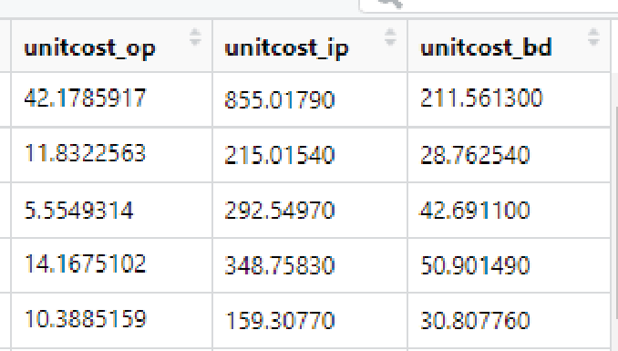

# Analisis Rasio {#sec-rasio}

```{r}
#| label: setup
#| include: false
source("R/setup.R")
```

Seperti yang telah dibahas pada Bab [II](#sec-pengukuran), hampir sepertiga dari studi mengenai efisiensi fasilitas kesehatan di negara berkembang dilakukan dengan teknik analisis rasio (AR). Terutama pada kondisi ketika ada keterbatasan waktu, data, keahlian, atau anggaran, AR lebih disukai oleh pembuat kebijakan dan peneliti untuk melakukan penilaian efisiensi fasilitas kesehatan. Bitran (1992) mengategorikan dua jenis analisis rasio, yaitu efisiensi teknis (rasio *input* fisik ke *output*) dan efisiensi ekonomi (rasio *input* biaya ke *output*).

Fasilitas kesehatan sering kali menggunakan rasio sederhana (misalnya tingkat hunian tempat tidur atau *bed occupancy rate* dan jumlah admisi per tempat tidur) untuk mengevaluasi efisiensi teknisnya. Lasso (1986) menyarankan untuk menggabungkan tingkat hunian tempat tidur, tingkat *turnover* tempat tidur, dan rata-rata lama rawat inap (*length of stay*) untuk memberikan gambaran yang lebih lengkap tentang kinerja fasilitas kesehatan.

Selain itu, perbandingan indikator kinerja menggunakan pendekatan analisis rasio pada fasilitas kesehatan dapat sekaligus digunakan untuk membantu menilai efisiensi (Barnum dan Kutzin, 1993; Flessa, 1998; Adam *et al*., 2003; Conteh dan Walker, 2004). Akuntansi merupakan metode yang tepat untuk mengukur efisiensi ekonomi dan menjelaskan variasi pada rata-rata biaya suatu layanan pada periode waktu tertentu (St-Hilaire dan Crepeau, 2000). Informasi mengenai biaya berguna untuk perencanaan dan penganggaran, analisis efektivitas biaya, dan evaluasi kinerja penyediaan layanan kesehatan di Indonesia (Lindelow dan Wagstaff, 2003).

Biaya satuan yang relatif tinggi di fasilitas kesehatan dapat mengindikasikan adanya ketidakefisienan dan memberikan informasi yang berharga dalam proses pengambilan keputusan kebijakan di fasilitas kesehatan milik pemerintah, baik di tingkat daerah maupun pusat (Barnum dan Kutzin, 1993; Witter *et al*., 2000). Seperti diilustrasikan pada Bab [II](#sec-pengukuran), variasi yang lebar pada kinerja fasilitas kesehatan dan heterogenitas di tingkat nasional menunjukkan bahwa ada hal yang bisa dipelajari dari fasilitas kesehatan yang berkinerja lebih baik. Penulis menggabungkan kedua jenis analisis rasio untuk mengidentifikasi fasilitas kesehatan yang berkinerja tinggi serta melakukan eksplorasi faktor-faktor yang mendasari kinerja yang relatif baik tersebut.

Bab ini akan menjelaskan bagaimana melakukan pengukuran efisiensi rumah sakit di Indonesia menggunakan analisis rasio. Penjelasan pada bab ini akan dibagi menjadi beberapa bagian. Bagian awal akan menjelaskan sumber data yang digunakan dan bagaimana mempersiapkan data tersebut hingga siap untuk dilakukan analisis. Bagian selanjutnya akan menjelaskan model analisis Pabon-Lasso, kemudian dilanjutkan dengan penjelasan tentang metode perhitungan biaya. Terakhir, analisis karakteristik rumah sakit yang memengaruhi tingkat efisiensi akan dibahas lebih terperinci. Untuk memberikan panduan praktis bagi pembaca, setiap bagian pada bab ini akan disertai dengan skrip yang dapat langsung dipraktikkan.

## Analisis Pabon-Lasso

Seperti yang sudah dijelaskan pada Bab [I](#sec-dasar), salah satu jenis analisis rasio (AR) yang dapat digunakan ialah metode Pabon-Lasso (Lasso, 1986). Pada bagian ini, akan dijelaskan bagaimana membangun model Pabon-Lasso dan bagaimana menginterpretasikan hasilnya. Adapun tahapan perintah yang harus dikerjakan pada aplikasi R, yaitu sebagai berikut.

### Tahap 1. Membuka *Dataset*

Pada tahapan ini, pembaca dapat membuka *dataset* “hospital.csv” dan memberi nama objek *dataset* tersebut menjadi “hospital” menggunakan *R Script* berikut.

```{r}
# Mengaktifkan package
library(tidyverse)
# Mengimpor data dari format csv
hospital <- read_csv(
  "https://raw.githubusercontent.com/fikrurizal/buku-efisiensi/main/data/hospital.csv"
)
```

Selanjutnya, pembaca dapat melakukan pelabelan terhadap variabel-variabel dan nilai yang ada pada data tersebut dengan mengikuti langkah-langkah yang telah dijelaskan pada Bab [III](#sec-pengantar-r) bagian D.

```{r}
#| code-fold: true
#| code-summary: "Kode pelabelan data (lihat Bab III)"
hospital <- hospital %>%
  set_variable_labels(
    id_rs = "ID Rumah Sakit", gp_FTE = "Jumlah Dokter Umum",
    spec_FTE = "Jumlah Dokter Spesialis", nurse_total = "Jumlah Perawat",
    other_prof = "Jumlah Karyawan Lain", beds = "Jumlah Bed",
    outpatients = "Jumlah Kunjungan Rajal", bed_days = "Total Bed Days",
    admissions1 = "Jumlah Admisi", bed_occ = "Bed Occupancy",
    throughput = "Throughput", alos = "Average Length of Stay",
    totalcost_op = "Total Biaya Rajal", total_cost_bd = "Total Biaya Bed Days",
    totalcost_ip = "Total Biaya Ranap", publichospital = "Kepemilikan",
    poorins = "Proporsi Jamkesmas", classCD = "Kelas", non_JavaBali = "Lokasi") %>%
  set_value_labels(
    publichospital = c("Pemerintah" = 1, "Swasta" = 0),
    classCD = c("Kelas C/D" = 1, "Kelas A/B" = 0),
    non_JavaBali = c("Non Java-Bali" = 1, "Java-Bali" = 0)) %>%
  to_factor()
```

### Tahap 2. Mengaktifkan *Packages* yang Diperlukan

Untuk membuat grafik Pabon-Lasso, *packages* yang diperlukan adalah “ggplot2” yang merupakan bagian dari paket induk “tidyverse” yang sudah diaktifkan pada tahap sebelumnya. “ggplot2” sendiri dikembangkan untuk menjadi suatu sistem pembuatan grafik atau visualisasi yang didasarkan pada “tata bahasa grafis” atau *The Grammar of Graphics*. Sistem ini memiliki komposisi utama berupa data, *aesthetics* (sumbu, posisi plot), skala, objek geometri/jenis diagram (garis, batang, titik), statistik (rerata dan lain-lain), *facets* (subplot), dan sistem koordinat.

### Tahap 3. Membuat Grafik Pabon-Lasso

Pada tahap ini, paket “ggplot2” akan digunakan untuk membuat grafik Pabon-Lasso seperti pada @fig-4-1. Secara sederhana, grafik ini membandingkan *bed occupancy* (pada sumbu x) dan *bed turnover* (pada sumbu y) dari masing-masing rumah sakit yang dianalisis dalam bentuk diagram titik (atau *scatter plot*). Untuk menambah kedalaman informasi yang disajikan, ukuran rumah sakit (berdasarkan jumlah tempat tidur) digambarkan dengan ukuran titik yang berbeda, sementara kepemilikan rumah sakit (milik pemerintah atau swasta) digambarkan dengan warna titik atau lingkaran yang berbeda. Selanjutnya, masing-masing sumbu dibagi menjadi dua bagian berdasarkan rerata nilai dari variabel *bed occupancy* (sumbu x) dan *bed turnover* (sumbu y). Adapun nilai rerata tersebut akan direkam pada suatu objek dengan nama masing-masing “mean_bor” dan “mean_btr” dapat dihitung menggunakan fungsi “mean()” yang menjadi bawaan dari R. Adapun untuk memilih suatu kolom atau variabel dari sebuah tabel atau *dataframe*, perintah yang digunakan adalah “\$” sehingga “hospital\$bed_occ” mewakili variabel “bed_occ” yang ada pada tabel “hospital”.

```{r}
# Rerata bed turnover dan bed occupancy
mean_btr <-mean(hospital$throughput)
mean_bor <-mean(hospital$bed_occ)
```

Seperti yang dicontohkan pada *script* di bawah ini, perintah untuk membuat grafik dengan “ggplot2” dimulai dengan mendefinisikan data yang digunakan, yaitu data “hospital”. Perintah tersebut berupa “hospital %>% ggplot()” yang artinya “buatlah grafik menggunakan data *hospital*”. Sampai di sini masih belum jelas jenis grafiknya apa, variabel apa saja yang dipakai, juga atribut-atribut lain yang diinginkan. Oleh karena itu, diperlukan lapisan selanjutnya, yaitu jenis diagram yang akan dibuat, pada “ggplot” diagram titik diwakilkan oleh “geom_point()”. Pada fungsi ini, parameter yang perlu ditentukan adalah variabel apa saja yang akan di-*mapping* menjadi bentuk visual (*aesthetics*). Dalam hal ini, variabel x yang diinginkan adalah *bed occupancy* (bed_occ), variabel y adalah *bed turnover* (throughput), *colour* adalah kepemilikan rumah sakit (publichospital), dan *size* adalah jumlah tempat tidur (beds). Parameter kedua yang bisa didefinisikan di sini adalah transparansi warna yang ditunjukkan dengan parameter “alpha=0.5”.

Selanjutnya, garis yang membagi sumbu y dan x dihasilkan dengan menambah lapisan “geom_hline” untuk garis horizontal dan “geom_vline” untuk garis vertikal. Parameter yang perlu didefinisikan, yaitu masing-masing “yintercept” dan “xintercept” yang artinya pada nilai berapa garis tersebut akan memotong sumbu y dan x. Terakhir, untuk memudahkan pembaca, perlu ditambahkan juga lapisan “labs” yang berisi judul utama (*title*), judul untuk sumbu x dan y, serta label untuk keterangan warna dan ukuran.

```{r}
#| label: fig-4-1
#| fig-cap: "Grafik Pabon-Lasso dari data rumah sakit yang dianalisis"
# Menambahkan judul, label, dan keterangan kepemilikan dan ukuran RS
hospital %>% ggplot() +
  geom_point(mapping = aes(x=bed_occ, y=throughput,
  colour=publichospital, size=beds), alpha=0.5) +
  geom_hline(yintercept=mean_btr) +
  geom_vline(xintercept=mean_bor) +
  labs(title="Model Pabon-Lasso",
  x="Bed Occupancy Rate",
  y="Bed Turnover",
  colour="Kepemilikan",
  size= "Jumlah Tempat Tidur")
```

### Tahap 4. Interpretasi Grafik Pabon-Lasso

Berdasarkan grafik Pabon-Lasso di atas, dapat dilihat secara visual bahwa sebagian besar rumah sakit berada pada kuadran 1 dan kuadran 3. Seperti yang sudah dibahas pada Bab [II](#sec-pengukuran), rumah sakit yang berada pada kuadran 1 merupakan rumah sakit dengan *bed occupancy rate* (BOR) dan *bed turnover rate* (BTR) yang rendah (di bawah rata-rata), atau bisa dikatakan tidak efisien. Sementara itu, rumah sakit yang berada pada kuadran 3 termasuk dalam kelompok yang efisien dengan BOR dan BTR yang tinggi (@fig-4-1).

### Tahap 5. Membuat Variabel Sektor pada Masing-Masing Rumah Sakit

Pada tahap ini, kita akan menambahkan informasi atau variabel “sektor” yang merupakan hasil analisis Pabon-Lasso pada *dataset* “hospital” sehingga dapat digunakan dalam analisis selanjutnya. Untuk menambahkan variabel “sector”, paket “dplyr” yang juga merupakan bagian dari paket “tidyverse” akan digunakan, terutama menggunakan fungsi “mutate()”. Fungsi ini bertujuan untuk membuat variabel baru (atau kolom baru pada suatu tabel atau *dataframe*). Sementara itu, fungsi “case_when()” digunakan untuk menentukan prasyarat atau *condition* yang lebih dari satu.

Dalam hal ini, perintah “mutate( sector= case_when(throughput <= mean_btr) & (bed_occ <= mean_bor) ~ 1” dapat diterjemahkan menjadi: “buatlah variabel baru bernama ‘sector’ yang bernilai 1 jika rumah sakit berada pada kuadran kiri bawah di mana nilai BTR kurang dari atau sama dengan reratanya **DAN** nilai BOR kurang dari atau sama dengan reratanya”. Penjelasan yang sama berlaku pada perintah untuk mengidentifikasi sektor-sektor yang lain.

```{r}
# Membuat variabel sektor berdasarkan hasil Analisis Pabon-Lasso
hospital <- hospital %>%
  mutate(sector = case_when (
  (throughput <= mean_btr) & (bed_occ <= mean_bor) ~ 1,
  (throughput > mean_btr) & (bed_occ <= mean_bor) ~ 2,
  (throughput > mean_btr) & (bed_occ > mean_bor) ~ 3,
  (throughput <= mean_btr) & (bed_occ > mean_bor) ~ 4)
)
```

Langkah selanjutnya, yaitu memberikan label pada variabel-variabel yang baru dibuat tersebut serta mengubahnya menjadi variabel kategorikal. Sekali lagi, paket “labelled” akan digunakan untuk menjalankan perintah ini, terutama dengan fungsi “var_label() <-” serta “val_labels() <-” seperti yang ditunjukkan pada perintah di bawah ini.

```{r}
# Mengaktifkan package
library(labelled)
# Label sector pada Model Pabon-Lasso
var_label(hospital$sector) <- "Sektor"
val_labels(hospital$sector) <- c("Sektor 1"=1,
  "Sektor 2"=2,
  "Sektor 3"=3,
  "Sektor 4"=4)
# Ubah menjadi variabel kategorik/factor variable
hospital$sector <- to_factor(hospital$sector)
```

Perintah di bawah ini perlu dijalankan untuk mengetahui secara sekilas berapa jumlah RS yang masuk sektor 1–4. Dalam hal ini fungsi “summary()” yang merupakan bawaan (fungsi dasar atau *base function*) digunakan karena sifatnya yang sederhana dan cocok digunakan untuk melihat rangkuman data secara cepat.

```{r}
# Menampilkan proporsi sektor hasil analisis PL menggunakan fungsi bawaan
summary(hospital$sector)
```

Sementara itu, jika pengguna menginginkan tampilan berupa tabel yang lebih rapi maka fungsi “tbl_summary()” dari paket “gtsummary” dapat digunakan seperti perintah di bawah ini.

```{r}
# Menampilkan proporsi sektor hasil analisis PL menggunakan package tbl_summary
hospital %>% select(sector) %>% tbl_summary() %>%
  as_flex_table()
```

Setelah menjalankan perintah di atas, dapat dilihat bahwa terdapat 77 RS yang berada di sektor 1, 18 RS di sektor 2, 75 RS di sektor 3, serta 28 lainnya berada di sektor 4. Dapat juga diartikan bahwa terdapat 75 rumah sakit (38%) dari 198 rumah sakit yang dapat dikelompokkan sebagai rumah sakit yang efisien berdasarkan analisis Pabon-Lasso.

## Analisis Perhitungan Biaya

Jenis analisis rasio (AR) lainnya yang akan dibahas, yaitu analisis biaya atau *costing analysis.* Menggunakan *dataset* rumah sakit, kita akan menghitung satuan biaya per layanan yang mencakup rawat jalan (*outpatient*), rawat inap (*inpatient*), dan per *bed*/hari (*bed-days*). Pada dasarnya, kita akan membuat variabel (kolom baru) pada *dataset* “hospital” menggunakan perintah “mutate” yang ada dalam *packages* “tidyverse”. Sebagai contoh, kita akan membuat variabel unitcost_ip = “totalcost_ip” (total biaya untuk rawat inap) dibagi dengan “admissions1” (jumlah total admisi rawat inap).

```{r}
# Menghitung unit cost per jenis layanan
hospital <- hospital %>%
  mutate(
  unitcost_op = totalcost_op/outpatients,
  unitcost_ip = totalcost_ip/admissions1,
  unitcost_bd = total_cost_bd/bed_days)
```

Kita bisa menjalankan perintah “view(hospital)” untuk melihat variabel *unitcost* yang baru saja dibuat sehingga akan terlihat tambahan tiga kolom baru pada *dataset* “hospital” seperti @fig-4-2.

{#fig-4-2}

## Kombinasi Model Pabon-Lasso dan Analisis Biaya

Hasil analisis efisiensi pada model Pabon-Lasso dapat dikombinasikan dengan hasil analisis biaya untuk memberikan gambaran yang lebih lengkap. Fasilitas kesehatan dianggap berkinerja tinggi jika berada pada sektor 3 pada grafik Pabon-Lasso dan memiliki satuan biaya pelayanan (*unit cost*) di bawah rata-rata. Di luar itu, rumah sakit dikelompokkan menjadi faskes berkinerja rendah. Dengan demikian, tingkat kinerja rumah sakit dapat dijadikan suatu variabel biner (kinerja tinggi = 1; kinerja rendah = 0) dan bisa dianalisis hubungannya dengan variabel-variabel lain yang relevan.

```{r}
# Menghitung unit cost per jenis layanan
hospital <- hospital %>%
  mutate(
  efisien_ar_ip = if_else((sector == "Sektor 3") &
   (unitcost_ip < mean(hospital$unitcost_ip)), 1, 0),
  efisien_ar_op = if_else((sector == "Sektor 3") &
   (unitcost_op < mean(hospital$unitcost_op)), 1, 0),
  efisien_ar_bd = if_else((sector == "Sektor 3") &
   (unitcost_bd < mean(hospital$unitcost_bd)), 1, 0))
```

::: {.callout-note}
## Catatan edisi daring

Pada edisi cetak, kondisi sektor ditulis `(sector=3)`. Di dalam R, `=` pada posisi
ini adalah **penugasan**, bukan perbandingan, sehingga kondisi sektor selalu dianggap
benar dan hanya biaya satuan yang dibandingkan. Kode di atas memakai perbandingan
`sector == "Sektor 3"` (variabel `sector` sudah diubah menjadi *factor* berlabel).
Akibatnya, jumlah rumah sakit berkinerja tinggi pada tabel berikut lebih kecil
daripada angka pada edisi cetak.
:::

Perintah di atas akan menghasilkan tambahan tiga kolom atau variabel pada data “hospital”. Variabel “efisien_ar_ip” merupakan suatu indikator biner yang bernilai 1 jika rumah sakit termasuk yang berkinerja tinggi (sektor 3 pada analisis PL) dan memiliki satuan biaya rawat inap (*inpatient*) di bawah rata-rata. Demikian juga dengan variabel “efisien_ar_op” dan “efisien_ar_bd” yang mengindikasikan informasi yang sama, namun pada ukuran satuan biaya rawat jalan (*outpatient*) dan *bed-days.* Untuk selanjutnya, hasil perhitungan dapat ditampilkan dalam bentuk tabel dengan menjalankan skrip di bawah ini (memberi label dengan fungsi “set_variable_labels” dari paket “labelled” dan membuat tabel siap pakai dengan fungsi “tbl_summary” dari paket “gtsummary”).

```{r}
# Memberi label pada lebih dari satu variabel
hospital <- hospital %>%
  set_variable_labels(
  efisien_ar_ip="Efisiensi Rawat Inap",
  efisien_ar_op="Efisiensi Rawat Jalan",
  efisien_ar_bd="Efisiensi Bed Days")
# Melihat proporsi/jumlah RS yang efisien pada masing-masing indikator menggunakan package tbl_summary
hospital %>% select(efisien_ar_op, efisien_ar_ip, efisien_ar_bd) %>%
  tbl_summary() %>%
  as_flex_table()
```

Sebagai contoh, pada tabel di atas dapat dilihat bahwa terdapat 144 rumah sakit (73%) yang dapat dikategorikan sebagai rumah sakit berkinerja tinggi (dari analisis PL) dan memiliki satuan biaya di bawah rata-rata (dari analisis satuan biaya) dari segi layanan rawat inapnya.

::: {.callout-note}
## Catatan edisi daring

Angka 144 rumah sakit (73%) di atas berasal dari kode edisi cetak (lihat catatan
sebelumnya). Dengan kode yang telah diperbaiki, rumah sakit berkinerja tinggi dari
segi layanan rawat inap berjumlah `r sum(hospital$efisien_ar_ip)` rumah sakit
(`r round(100 * mean(hospital$efisien_ar_ip))`%). Label “Rawat Inap” dan “Rawat Jalan”
untuk `efisien_ar_ip` dan `efisien_ar_op` juga telah dipertukarkan agar sesuai
dengan isinya (*ip* = *inpatient*, *op* = *outpatient*).
:::

## Analisis Variabel Kontekstual

Setelah mengetahui tingkat efisiensi relatif dari rumah sakit yang dianalisis—baik menggunakan model Pabon-Lasso, analisis biaya, maupun kombinasi keduanya—langkah selanjutnya, yaitu mencari tahu faktor apa saja yang berkaitan dengan tingkat efisiensi tersebut. Oleh karena itu, ada beberapa pendekatan yang dapat dilakukan.

### Analisis Bivariat

Analisis bivariat bertujuan untuk mendapatkan gambaran hubungan (asosiasi) antara dua variabel. Dalam hal ini, kita ingin mengetahui hubungan antara tingkat efisiensi suatu rumah sakit dan masing-masing karakteristiknya secara terpisah. Nilai asosiasi yang diperoleh dari analisis bivariat tidak dapat dikatakan bahwa ada hubungan sebab-akibat, tetapi lebih bersifat deskriptif.

### Gambaran Biaya Satuan Berdasarkan Kelas Rumah Sakit

Sebelum melakukan analisis bivariat terhadap satuan biaya rumah sakit, perlu diperhatikan distribusi datanya. Hal ini karena distribusi dari variabel biaya umumnya cenderung condong (*skew*). Dengan dilakukan transformasi log, variabel unit *cost* dapat dianalisis dengan pemodelan parametrik (lihat @fig-4-3). Sama seperti sebelumnya, fungsi “mutate()” digunakan untuk membuat variabel baru.

```{r}
# Membuat variabel log dari unit cost
## Karena unit cost tidak berdistribusi normal
hospital <- hospital %>% mutate(
  lnuc_ip = log(unitcost_ip),
  lnuc_op = log(unitcost_op),
  lnuc_bd = log(unitcost_bd)
)
```

@fig-4-3 dihasilkan menggunakan paket “ggplot2” dengan objek grafis berupa “geom_histogram” yang—sesuai namanya—digunakan untuk membuat histogram. Dapat dilihat bahwa penggunaan “ggplot2” sama dengan yang sudah dijelaskan pada bagian sebelumnya, hanya pilihan jenis diagramnya saja yang berbeda. Pada histogram bawah, variasi warna bisa dilakukan dengan menambahkan paramater “color” untuk warna garis dan “fill” untuk warna isiannya. Informasi mengenai jenis warna yang bisa dipilih dapat dilihat pada laman https://www.r-graph-gallery.com/ggplot2color.html.

```{r}
#| label: fig-4-3
#| fig-cap: "Histogram dari variabel “unitcost_ip” sebelum (atas) dan sesudah (bawah) ditransformasi dengan fungsi log"
#| fig-subcap:
#|   - "Sebelum transformasi log"
#|   - "Sesudah transformasi log"
#| fig-height: 3.5
# Histogram unitcost_ip dengan ggplot2
hospital %>% ggplot() +
  geom_histogram(mapping = aes(x=unitcost_ip))
# Histogram log unitcost_ip dengan ggplot2, memodifikasi warna
hospital %>% ggplot() +
  geom_histogram(mapping = aes(x=lnuc_ip),
  color="black",
  fill="darkseagreen")
```

Jika belum dilakukan transformasi log, grafik *box-plot* dapat digunakan untuk memvisualisasikan perbedaan median dari nilai unit *cost* berdasarkan variabel tertentu. Dalam hal ini, kita tertarik untuk melihat gambaran tersebut berdasarkan kelas rumah sakit. Grafik ini juga dihasilkan menggunakan paket “ggplot2” dan pilihan jenis diagramnya adalah “geom_boxplot” dengan memberikan judul atau label pada sumbu x dan y untuk memudahkan pembaca.

```{r}
#| label: fig-4-4
#| fig-cap: "Grafik *box-plot* dari variabel biaya satuan rawat inap berdasarkan kelas rumah sakit"
#Boxplot berdasarkan kelas rumah sakit
hospital %>% ggplot() +
  geom_boxplot(mapping = aes(x=classCD, y=unitcost_ip)) +
  labs(x="Kelas Rumah Sakit",
  y="Unit Cost Ranap")
```

Berdasarkan @fig-4-4, dapat dilihat bahwa median (garis tegas di tengah kotak putih) biaya satuan rawat inap lebih tinggi pada rumah sakit kelas C/D, dibandingkan dengan rumah sakit kelas A atau B.

### Uji Statistik

Kita tidak dapat menarik kesimpulan secara statistik hanya dengan melihat grafik sehingga diperlukan suatu uji hipotesis formal. Pada aplikasi R, kita dapat menggunakan *packages* “gtsummary” yang sudah diinstal dan diaktifkan sebelumnya untuk melakukan uji beda rerata antara dua kelompok. Sebagai contoh, perintah di bawah ini melakukan analisis beda rerata antara rumah sakit milik pemerintah dan rumah sakit swasta. Perlu diperhatikan bahwa, berbeda dengan penggunaan fungsi “tbl_summary()” pada bagian sebelumnya, pada perintah kali ini terdapat parameter “by” yang bertujuan untuk menghitung statistik (dalam hal ini rerata dan deviasi standar) dari suatu variabel berdasarkan suatu variabel kategorik (dalam hal ini kepemilikan rumah sakit atau variabel “publichospital”). Perintah ini juga memanfaatkan fungsi “select()” yang ada pada paket “dplyr” untuk memilih variabel-variabel apa saja dari data “hospital” yang akan digunakan dan dianalisis.

```{r}
# Beda rerata berdasarkan kepemilikan RS
hospital %>%
  select(lnuc_op, lnuc_ip, lnuc_bd, publichospital) %>%
  tbl_summary(
  by = publichospital,
  digits = all_continuous() ~ 3,
  statistic = all_continuous() ~ "{mean} ({sd})") %>%
  add_p(test=all_continuous() ~ "t.test") %>%
  as_flex_table()
```

Berdasarkan tabel di atas, dapat dilihat bahwa berdasarkan *Welch Two Sample t-test* atau uji t tidak berpasangan dengan asumsi varian yang tidak sama, didapatkan perbedaan yang secara statistik bermakna (p < 0,05) antara rerata biaya satuan (dalam bentuk log) berdasarkan jenis kepemilikan rumah sakit. Secara umum, terlihat bahwa rumah sakit pemerintah mempunyai satuan biaya yang lebih rendah.

### Analisis Multivariat

Secara teoretis, tidak ada faktor tunggal yang memengaruhi efisiensi suatu fasilitas kesehatan. Oleh karena itu, perlu dilakukan analisis multivariat untuk mengetahui kontribusi dari masing-masing faktor yang secara bersama-sama berpengaruh pada tingkat efisiensi. Beberapa metode estimasi yang bisa digunakan, antara lain regresi linear berganda (model probabilitas linear) dan regresi logistik berganda. Pada contoh di bawah ini, kita akan menggunakan model regresi linear dengan variabel dependen “lnuc_ip” atau log biaya satuan rawat inap dan variabel independen: kelas rumah sakit, kepemilikan, dan lokasi.

```{r}
# Model regresi linear
model_lpm_ip <- lm(lnuc_ip ~ classCD + publichospital + non_JavaBali, data = hospital)
```

Fungsi “lm()” merupakan bawaan dari *software* R yang dapat digunakan untuk melakukan analisis regresi linear, baik dengan satu variabel independen (regresi linear sederhana) maupun dengan banyak variabel independen (regresi linear berganda). Spesifikasi dasar dari fungsi ini adalah “lm(y ~ x, data=”nama_data”)”. Jika variabel independennya lebih dari satu maka “x” diganti dengan “x1 + x2 + x3 + dst.”. Perintah tersebut menghasilkan suatu objek bernama “model_lpm_ip” yang menyimpan hasil estimasi yang telah dilakukan.

Untuk melihat hasil estimasi tersebut (koefisien dan statistik-statistik lainnya), ada banyak alternatif yang bisa dilakukan. *Pertama*, yaitu menggunakan fungsi “summary()” yang merupakan fungsi bawaan dari R. Perintah dan hasil dari fungsi tersebut seperti di bawah ini. Terlihat bahwa hasil yang dikeluarkan masih bersifat “kasar” dan tidak siap pakai.

```{r}
# Hasil regresi dengan fungsi dasar
summary(model_lpm_ip)
```

Alternatif *kedua*, yaitu menggunakan fungsi “tbl_regression()” dari paket “gtsummary”. Dengan perintah yang sederhana seperti yang ada di bawah ini, tabel siap pakai bisa langsung dihasilkan. Akan tetapi, kelemahan fungsi ini terletak pada tampilannya yang tidak bisa banyak diubah.

```{r}
# Tabel regresi menggunakan package gtsummary
tbl_regression(model_lpm_ip) %>%
  as_flex_table()
```

Alternatif *ketiga*, yaitu menggunakan paket “modelsummary”. Paket ini terutama ditujukan untuk menghasilkan tabel (dengan fungsi “modelsummary()”) dan plot (dengan fungsi “modelplot”) dari hasil estimasi suatu model statistik. Kelebihan dari fungsi ini, yaitu fleksibilitas serta cakupan pemodelan yang bisa diakomodasi. Akan tetapi, hal ini menyebabkan kompleksitas penggunaannya yang cukup tinggi serta perlunya mendefinisikan label (menggunakan fungsi “names() <-” dari paket “labelled”) dari masing-masing variabel untuk menghasilkan tabel yang siap pakai.

```{r}
# Tabel regresi menggunakan package modelsummary
## Memberi label koefisien
model_lpm_ip_label <- model_lpm_ip
names(model_lpm_ip_label$coefficients) <- c("Konstanta",
  "Kelas A/B",
  "Swasta", "Java-Bali")
## Membuat tabel
modelsummary(model_lpm_ip_label,
  label="TRUE",
  fmt=3,
  estimate = "{estimate}{stars}",
  gof_omit = ".*",
  output = "flextable")
```

Hasilnya dapat dilihat bahwa koefisien yang secara statistik bermakna adalah kepemilikan rumah sakit. Hasil tersebut dapat diinterpretasikan bahwa secara rata-rata rumah sakit swasta memiliki biaya satuan rawat inap yang lebih kecil, yaitu sebesar 24% dibandingkan dengan rumah sakit milik pemerintah, jika variabel lain dianggap konstan. Hasil ini secara statistik signifikan dengan *p-value* < 0,05.

## Kesimpulan

- Grafik Pabon-Lasso maupun analisis biaya dapat dilakukan menggunakan aplikasi R dengan cukup mudah.

- Analisis bivariat maupun multivariat dapat digunakan untuk menjelaskan faktor-faktor yang memengaruhi tingkat efisiensi rumah sakit.

- Pengambil kebijakan maupun manajemen rumah sakit dapat melihat hasil analisis pada bab ini untuk melakukan penyesuaian kebijakan maupun strategi.
