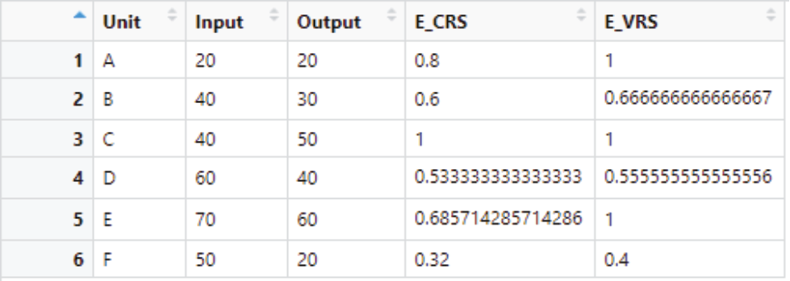
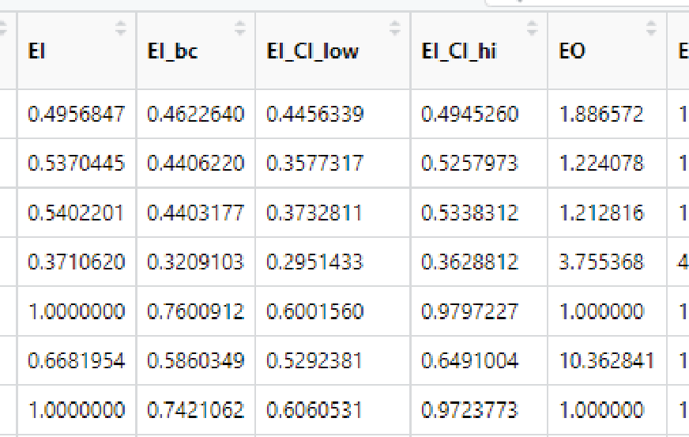

# *Data Envelopment Analysis* {#sec-dea}

```{r}
#| label: setup
#| include: false
# Chunk B5.01
source("R/setup.R")
source("R/chunk_helpers.R")
book_begin_chapter("Bab 5", c("tidyverse", "labelled", "Benchmarking", "frontier"))
```

Meskipun analisis rasio (AR) masih merupakan teknik pengukuran efisiensi yang paling banyak digunakan di negara-negara berkembang, penggunaan analisis *frontier* juga semakin mendapat perhatian. Bab ini akan membahas mengenai aplikasi salah satu jenis analisis *frontier*, yaitu *data envelopment analysis* atau DEA untuk mengetahui tingkat efisiensi rumah sakit serta faktor-faktor yang memengaruhinya. Bab ini akan memberikan gambaran praktis dengan contoh-contoh *script* pada R yang bisa langsung dipraktikkan serta interpretasi sederhana dari hasil analisis.

## Membuat Grafik DEA

Sebelum melakukan analisis DEA menggunakan data rumah sakit, kita akan belajar untuk membuat grafik dengan data contoh dan data yang disediakan pada aplikasi R.

### Tahap 1. Mengaktifkan *Packages* untuk Membuat Grafik DEA

Agar dapat digunakan untuk melakukan analisis DEA, terlebih dahulu kita harus mengaktifkan *packages* yang bernama “Benchmarking” dengan cara menjalankan perintah berikut ini.

```{r}
# Chunk B5.02
# Mengaktifkan packages Benchmarking
library(Benchmarking)
```

### Tahap 2. Melakukan *Input* Data Contoh

Setelah mengaktifkan *packages* “Benchmarking”, selanjutnya kita akan membuat data yang berisi sepasang variabel *input* (x) dan variabel *output* (y). Caranya, yaitu dengan membuat masing-masing suatu matriks 6 × 1 (6 baris dan 1 kolom) seperti pada *script* berikut. Perhatikan bahwa pada tahap ini, fungsi “matrix()” bawaan digunakan untuk membuat matriks secara manual.

```{r}
# Chunk B5.03
# Variabel input
x <- matrix(c(20, 40, 40, 60, 70, 50), ncol=1)
# Variabel output
y <- matrix(c(20, 30, 50, 40, 60, 20), ncol=1)
```

### Tahap 3. Membuat Grafik DEA

Tahap selanjutnya, yaitu membuat suatu grafik atau plot DEA berdasarkan matriks yang sudah kita *input* sebelumnya. Dengan menjalankan perintah yang ada di bawah ini secara berurutan, aplikasi R akan membuat suatu grafik DEA seperti pada @fig-5-1.

```{r}
#| label: fig-5-1
#| fig-cap: "Grafik DEA yang dihasilkan dari perintah R"
# Chunk B5.04
# Membuat label huruf sebanyak baris pada matrix X
txt <- LETTERS[1:dim(x)[1]]
# Membuat plot DEA
## DEA dengan asumsi VRS (garis tegas)
dea.plot.frontier (x,y, RTS = "vrs", main="Basic DEA",
  cex=1.25)
## DEA dengan asumsi CRS (garis putus-putus)
dea.plot (x,y, RTS = "crs", add=TRUE, lty="dashed")
## Memberi label huruf pada grafik DEA
text(x,y, txt, adj=c(-.7,-.2),cex=1.25)
```


### Tahap 4. Menghitung Nilai Efisiensi dari Analisis DEA

Dengan melihat grafik DEA maka secara visual kita dapat mengidentifikasi unit mana yang efisien dan tidak efisien. Ketika asumsi VRS digunakan maka unit A, C, dan E tepat berada pada garis *frontier* sehingga bisa dikatakan relatif efisien jika dibandingkan dengan unit lainnya. Sementara itu, jika asumsi CRS (garis putus-putus) digunakan maka hanya unit C yang dikatakan efisien. Namun, informasi tersebut belum lengkap karena kita belum bisa memberikan nilai efisiensi berupa angka kepada masing-masing unit. Oleh karena itu, langkah selanjutnya, yaitu menghitung nilai efisiensi dari masing-masing unit dengan menjalankan perintah berikut ini.

```{r}
# Chunk B5.05
# Menghitung nilai eisiensi, Input Oriented dengan asumsi VRS
e_vrs <- dea(x,y, RTS="vrs", ORIENTATION="in")
# Menampilkan nilai efisiensi
eff(e_vrs)
# Menghitung nilai eisiensi, Input Oriented dengan asumsi CRS
e_crs <- dea(x,y, RTS="crs", ORIENTATION="in")
# Menampilkan nilai efisiensi
eff(e_crs)
```

Setelah nilai efisiensi (baik dengan asumsi CRS maupun VRS), langkah selanjutnya, yaitu menggabungkan matriks x dan y dengan nilai efisiensinya sehingga menjadi suatu tabel. Dalam hal ini, fungsi yang digunakan adalah “bind_cols()” dari paket “dplyr” yang artinya menggabungkan berbagai kolom menjadi satu tabel. Adapun kolom E_CRS dan E_VRS masing-masing menunjukkan hasil estimasi efisiensi dengan DEA menggunakan asumsi *Constant Return to Scale* (CRS) dan *Variable Return to Scale* (VRS), sedangkan fungsi “c()” digunakan untuk mengubah suatu “array” atau deretan angka menjadi suatu kolom.

```{r}
# Chunk B5.06
# Meng-compile hasil perhitungan skor efisiensi
dea_ff <- bind_cols(
  Unit=txt,
  Input=c(x),
  Output=c(y),
  E_CRS=c(eff(e_crs)),
  E_VRS=c(eff(e_vrs))) %>%
  as_tibble()
```

Untuk menampilkan tabel “dea_ff” yang baru saja dibuat, kita bisa menjalankan perintah “view” berikut ini sehingga pada *R Studio* akan terlihat tampilan seperti pada @fig-5-2.

```{r}
#| eval: false
# Chunk B5.07
# Menampilkan tabel kompilasi
view(dea_ff)
```

{#fig-5-2}

Alternatif lain untuk melihat data “dea_ff”, yaitu menggunakan fungsi “head()” yang merupakan bawaan dari R. Fungsi ini bertujuan untuk menampilkan beberapa baris dari suatu data. Pada perintah di bawah ini, akan ditampilkan lima baris pertama dari data “dea_ff”.

```{r}
# Chunk B5.08
# Menampilkan sekilas tabel kompilasi
dea_ff %>% head(5)
```

### Tahap 5. Melakukan Interpretasi Hasil

Untuk menginterpretasikan hasil analisis DEA, hal pertama yang harus diperhatikan, yaitu orientasi dan asumsi *Return to Scale* yang digunakan. Dalam hal ini, kita menggunakan orientasi *input* dengan asumsi VRS dan CRS. Dengan asumsi CRS, dapat kita katakan bahwa unit C satu-satunya unit yang efisien dengan nilai efisiensi 1 (sama seperti interpretasi dari grafik DEA). Sementara itu, unit F ialah yang paling tidak efisien, yaitu dengan nilai 0,32.

Dengan melihat nilai efisiensi yang menggunakan asumsi VRS, unit F juga merupakan unit yang paling tidak efisien, meskipun nilai efisiensinya sedikit lebih tinggi, yaitu 0,4. Akan tetapi, dapat pula dilihat bahwa baik unit A, C, maupun D terhitung sebagai unit dengan efisiensi penuh. Hal ini sesuai dengan penjelasan pada Bab [I](#sec-dasar) bahwa asumsi VRS bersifat lebih fleksibel dan memungkinkan lebih banyak unit berada pada kondisi efisiensi penuh.

## Analisis DEA dengan Data Rumah Sakit

Setelah berlatih melakukan analisis DEA dengan data contoh yang sederhana, pembaca diharapkan mampu memahami langkah-langkah umum yang perlu dilakukan untuk melakukan analisis DEA serta mampu menginterpretasi hasilnya. Selanjutnya, kita akan berlatih melakukan analisis DEA dengan data rumah sakit, sama seperti yang digunakan pada bab sebelumnya.

### Tahap 1. Membuka *Dataset*

Seperti yang kita lakukan pada saat membuat analisis rasio di bab sebelumnya, kita juga akan membuka/mengimpor *dataset hospital* ke dalam *environment* kerja kita dengan perintah/*script* di bawah ini.

```{r}
# Chunk B5.09
# Mengaktifkan package
library(tidyverse)
# Mengimpor data dari format csv
hospital <- read_csv(
  "https://raw.githubusercontent.com/fikrurizal/buku-efisiensi/main/data/hospital.csv"
)
```

Selanjutnya, pembaca dapat melakukan pelabelan terhadap variabel-variabel dan nilai yang ada pada data tersebut dengan mengikuti langkah yang telah dijelaskan pada Bab [III](#sec-pengantar-r) bagian D.

```{r}
#| code-fold: true
#| code-summary: "Kode pelabelan data (lihat Bab III)"
# Chunk B5.10
hospital <- hospital %>%
  set_variable_labels(
    id_rs = "ID Rumah Sakit", gp_FTE = "Jumlah Dokter Umum",
    spec_FTE = "Jumlah Dokter Spesialis", nurse_total = "Jumlah Perawat",
    other_prof = "Jumlah Karyawan Lain", beds = "Jumlah Bed",
    outpatients = "Jumlah Kunjungan Rajal", bed_days = "Total Bed Days",
    admissions1 = "Jumlah Admisi", bed_occ = "Bed Occupancy",
    throughput = "Throughput", alos = "Average Length of Stay",
    totalcost_op = "Total Biaya Rajal", total_cost_bd = "Total Biaya Bed Days",
    totalcost_ip = "Total Biaya Ranap", publichospital = "Kepemilikan",
    poorins = "Proporsi Jamkesmas", classCD = "Kelas", non_JavaBali = "Lokasi") %>%
  set_value_labels(
    publichospital = c("Pemerintah" = 1, "Swasta" = 0),
    classCD = c("Kelas C/D" = 1, "Kelas A/B" = 0),
    non_JavaBali = c("Non Java-Bali" = 1, "Java-Bali" = 0)) %>%
  to_factor()
```

### Tahap 2. Mengaktifkan *Packages* untuk Analisis DEA

Sama seperti yang sudah dilakukan saat melakukan analisis DEA dengan data contoh, kita juga memerlukan *packages* “Benchmarking” untuk melakukan analisis DEA pada data rumah sakit.

```{r}
# Chunk B5.11
# Mengaktifkan packages untuk analisis DEA dan SFA
library(Benchmarking)
library(frontier)
```

### Tahap 3. Memilih Variabel *Input* dan *Output*

Setelah berhasil membuka *dataset*, langkah selanjutnya adalah memilih variabel *input* (x) dan variabel *output* (y) yang akan digunakan. Perlu diperhatikan bahwa kita bisa memilih lebih dari satu variabel sebagai *input* maupun *output*. Perintah berikut ini memiliki arti sebagai berikut.

- Variabel *input* (x) → Dari data “hospital”, pilih (“%>% select()”) variabel jumlah dokter umum penuh-waktu (gp_FTE), jumlah perawat (nurse_total), jumlah tenaga kesehatan lain (other_prof), dan jumlah tempat tidur (beds), lalu buatlah menjadi bentuk matriks (“%>% as.matrix()”).

- Variabel *output* (y) → Dari data “hospital”, pilih (“%>% select()”) variabel jumlah kunjungan rawat jalan (outpatients) dan jumlah admisi (admissions1), lalu buatlah menjadi bentuk matriks (“%>% as.matrix()”).

Setelah perintah berikut ini dijalankan, kita akan melihat objek berupa x dan y di panel *Environment* (kanan atas).

```{r}
# Chunk B5.12
# Membuat matriks variabel input
x <- hospital %>%
  select(gp_FTE,
  nurse_total,
  other_prof,
  beds) %>%
  as.matrix()
## Membuat matriks variabel output
y <- hospital %>%
  select(outpatients, admissions1) %>% as.matrix()
```

### Tahap 4. Menghitung Nilai Efisiensi

Setelah variabel *input* dan *output* ditentukan, langkah selanjutnya adalah menghitung nilai efisiensi dengan perintah **“dea.boot”.** Perintah ini melakukan analisis DEA dengan metode *bootstrap*. Pada langkah ini kita memakai *bootstrap* dengan repetisi sejumlah 100 kali (NREP = 100), menggunakan asumsi VRS (RTS = “vrs”), dan orientasi *input* (ORIENTATION = “in”). Perintah ini akan menghasilkan sebuah objek berupa *list* dengan nama “dea_input”.

```{r}
# Chunk B5.13
# Menghitung efisiensi berorientasi input
set.seed(2021) # edisi daring: agar hasil bootstrap dapat direplikasi
dea_input <- dea.boot(x,y,NREP=100, RTS = "vrs",
  ORIENTATION = "in")
```

Objek tersebut menyimpan beberapa nilai, salah satunya “eff” yang merupakan nilai efisiensi tanpa *bootstrap*, dan “eff.bc” yang merupakan nilai efisiensi dengan *bootstrap*. Kita dapat melihat ringkasan dari nilai efisiensi tersebut menggunakan perintah “summary” seperti berikut.

```{r}
# Chunk B5.14
# Ringkasan nilai efisiensi (tanpa bootrstrap)
summary(dea_input$eff)
# Ringkasan nilai efisiensi (dengan bootstrap)
summary(dea_input$eff.bc)
```

Selanjutnya, analisis DEA dilakukan pada variabel yang sama, tetapi dengan orientasi *output.*

```{r}
# Chunk B5.15
# Menghitung efisiensi berorientasi output
dea_output <- dea.boot(x,y,NREP=100, RTS = "vrs",
  ORIENTATION = "out")
# Ringkasan nilai efisiensi (tanpa bootrstrap)
summary(dea_output$eff)
# Ringkasan nilai efisiensi (dengan bootstrap)
summary(dea_output$eff.bc)
```

### Tahap 5. Menggabungkan Perhitungan Nilai Efisiensi ke *Dataset*

Langkah selanjutnya, yaitu menggabungkan skor efisiensi (beserta 95% *confidence interval* ataupun *standard error*) menjadi satu dengan *dataset* rumah sakit. Langkah tersebut dapat dijalankan menggunakan fungsi “mutate()” dari paket “dplyr” yang berguna untuk membuat variabel atau kolom baru. Hal yang perlu diperhatikan di sini, yaitu bagaimana mengidentifikasi nilai-nilai variabel efisiensi dari objek “dea_input” dan “dea_output” yang berbentuk *list*. Sebagai contoh, untuk mendapatkan nilai batas bawah dari *confidence interval* dari nilai efisiensi berorientasi *input*, yang diambil adalah “dea_input\$conf.int**[,1]**” karena komponen “conf.inf” merupakan suatu matriks dengan dua kolom, yang mana kolom 1 menandakan batas bawah dan kolom 2 menandakan batas atas.

```{r}
# Chunk B5.16
# Memasukkan hasil perhitungan skor efisiensi ke data Rumah Sakit
hospital_dea <- hospital %>%
  mutate(EI=c(dea_input$eff),
  EI_bc=c(dea_input$eff.bc),
  EI_CI_low=c(dea_input$conf.int[,1]),
  EI_CI_hi=c(dea_input$conf.int[,2]),
  EO=c(dea_output$eff),
  EO_bc=c(dea_output$eff.bc),
  EO_CI_low=c(dea_output$conf.int[,1]),
  EO_CI_hi=c(dea_output$conf.int[,2]))
```

Untuk melihat *data frame* yang baru saja dibuat, kita bisa membukanya dengan menulis perintah **view (hospital_dea)**, lalu geser ke bagian kanan untuk melihat variabel-variabel yang baru saja dimasukkan. Hasilnya akan terlihat seperti @fig-5-3.

{#fig-5-3}

## Analisis Variabel Kontekstual

Pada bagian sebelumnya, kita sudah berhasil membuat suatu tabel dengan level pengamatan pada tingkat rumah sakit, lengkap dengan variabel *input*, *output*, kontekstual, dan skor efisiensi dari hasil analisis DEA. Langkah selanjutnya, yaitu menganalisis hubungan variabel-variabel kontekstual dengan skor efisiensi rumah sakit. Metode ini dikenal juga sebagai analisis tahap kedua pada DEA (*second-stage* DEA).

Pada bagian ini, kita akan berlatih untuk menggunakan model regresi terpotong (*truncated regression*) dan regresi Tobit. Seperti yang sudah dijelaskan pada Bab [II](#sec-pengukuran), regresi terpotong dianggap lebih sesuai untuk analisis DEA tahap kedua. Namun, kita tetap akan belajar menggunakan metode lain, dalam hal ini model Tobit dan regresi linear biasa (OLS) sebagai pembanding.

Pada semua model, kita akan menggunakan variabel jenis kepemilikan rumah sakit (publichospital) dan lokasi rumah sakit (nonJavaBali). Model ini sangat sederhana dan digunakan hanya untuk kepentingan latihan. Dengan demikian, model yang akan kita estimasi ialah sebagai berikut.

$$\hat{\Phi} = \beta_0 + \beta_1\,\text{publichospital} + \beta_2\,\text{nonJavaBali} + \varepsilon$$

Catatan: $\hat{\Phi}$ adalah skor efisiensi dari analisis DEA dengan *bootstrap*, *β*~0~ adalah intersep, *β*~1~ adalah koefisien dari variabel jenis kepemilikan rumah sakit, *β*~2~ adalah koefisien dari variabel lokasi rumah sakit, dan *ε* adalah nilai acak.

### Tahap 1. Instal dan Aktivasi *Packages*

Sebelum melakukan analisis DEA tahap kedua, terdapat beberapa *packages* yang harus diaktifkan, yaitu “AER” dan “Truncreg”.

```{r}
# Chunk B5.17
## Mengaktifkan package untuk analisis Tobit
library(AER)
library(truncreg)
```

### Tahap 2. Melakukan Analisis Regresi Terpotong dan Tobit

Model regresi terpotong dapat dijalankan dengan perintah berikut.

```{r}
# Chunk B5.18
# Estimasi truncated regression
eTrunc <- truncreg(EI_bc ~ publichospital + non_JavaBali,
  data=hospital_dea, point=1, direction = "right")
```

Perhatikan bahwa fungsi Truncreg membutuhkan spesifikasi berupa formula, sumber data, batas potong (*point*), dan sisi yang dipotong (*direction*). Batas potong yang dipakai adalah 1 karena nilai maksimal dari skor efisiensi adalah 1, sementara sisi yang dipotong adalah kanan (*right*) karena nilai 1 adalah batas maksimal. Perintah berikut akan menghasilkan objek berupa *list* dengan nama “eTrunc” yang dapat dilihat di panel *Environment.*

Sementara itu, untuk menggunakan model Tobit, kita bisa menggunakan perintah berikut.

```{r}
# Chunk B5.19
# Estimasi tobit
eTob <- tobit(EI_bc ~ publichospital + non_JavaBali, left=-Inf, right=1, data=hospital_dea)
```

Perhatikan struktur perintah dari fungsi Tobit yang sedikit berbeda jika dibandingkan dengan fungsi Truncreg. Pada fungsi Tobit, komponen yang harus ditulis adalah persamaan regresi (EI_bc ~ publichospital + non_JavaBali), batas kiri (*left*), batas kanan (*right*), dan sumber data (*data*). Kita akan menggunakan batas kiri negatif tak hingga atau “-Inf” (*infinity*) dan batas kanan 1 dengan sumber data “hospital_dea”. Perintah ini akan menghasilkan objek berupa *list* dengan nama “eTob” yang bisa kita lihat di panel *Environment*.

### Tahap 3. Melihat dan Membandingkan Hasil Estimasi

Untuk melihat hasil estimasi dari model Tobit dan regresi terpotong, kita bisa menjalankan perintah “summary(eTob)” dan “summary(eTrunc)”. Hasil dari perintah tersebut dapat dilihat pada kode berikut.

```{r}
# Chunk B5.20
summary(eTrunc)
```

Ringkasan dari hasil estimasi fungsi Tobit dapat dibagi menjadi beberapa bagian. *Pertama*, bagian “Call” menunjukkan fungsi Tobit mana yang ditampilkan. Selanjutnya, “observation” menunjukkan berapa jumlah pengamatan yang digunakan untuk estimasi parameter pada model. Terlihat bahwa terdapat 198 observasi, tanpa ada yang disensor, baik dari sisi kiri maupun kanan. Hal ini berarti nilai variabel dependen kita ( $\hat{\Phi}$ ) semua masuk pada rentang yang sudah kita tetapkan sebelumnya, yaitu $-\infty$ sampai dengan 1.

Kemudian, kita dapat melihat bagian “Coefficients” yang berisi nilai koefisien dari masing-masing variabel independen yang kita masukkan ke dalam model beserta nilai *standard error*, *z-score*, serta *p-value*-nya. Terdapat pula notasi “log(scale)” yang merupakan statistik tambahan yang analog dengan akar kuadrat dari varian residual dalam regresi linear biasa.

Sementara itu, pada bagian paling bawah terdapat keterangan mengenai model yang diestimasi secara keseluruhan. *Gaussian distribution* berarti model mengasumsikan distribusi Gaussian, “Number of iteration” menjelaskan tentang jumlah iterasi yang dilakukan sampai mendapatkan model final (dalam hal ini 3), “log-likelihood” menunjukkan nilai *log-likelihood* dari model final, sementara “wald-statistic” merupakan uji hipotesis apakah koefisien dari model yang diestimasi berbeda dari nol. Nilai *p* dari *wald-statistic* yang menunjukkan kurang dari 0,05 dapat diartikan bahwa koefisien pada model berbeda dari nol dan secara statistik bermakna (pada rentang kepercayaan 95%). Informasi-informasi ini penting untuk membandingkan antarmodel (misalnya dengan model yang berbeda variabel independennya).

```{r}
# Chunk B5.21
summary(eTob)
```

Struktur ringkasan model regresi terpotong hampir sama dengan model Tobit. Hanya saja keterangan tentang jumlah iterasi terletak sebelum daftar koefisien.

### Tahap 4. Membuat Tabel Koefisien

Untuk membuat tabel koefisien yang rapi dan siap pakai, fungsi “modelsummary()” dari paket “modelsummary” dapat digunakan.

```{r}
# Chunk B5.22
# Mengaktifkan package
library(modelsummary)
# Memberi label koefisien
eTrunc_label <- eTrunc
names(eTrunc_label$coefficients) <- c("Konstanta", "Swasta",
  "Jawa-Bali", "Sigma")
eTob_label <- eTob
names(eTob_label$coefficients) <- c("Konstanta", "Swasta",
  "Jawa-Bali")
# Tabel koefisien regresi
modelsummary(list("Truncated Regression" = eTrunc_label,
  "Tobit" = eTob_label),
  fmt = 3,
  estimate = "{estimate}{stars}",
  gof_omit = ".*",
  output = "flextable")
```

Dari perintah tersebut, akan dihasilkan tabel seperti berikut. Keterangan: + p < 0,1, * p < 0,05, ** p < 0,01, *** p < 0,001.

### Tahap 5. Interpretasi Hasil

Pada tabel tersebut, koefisien yang didapatkan dari model regresi terpotong (M1) maupun Tobit (M2) menunjukkan nilai yang tidak jauh berbeda dan tingkat signifikansi statistik yang sama. Hasil estimasi koefisien pada model Tobit dapat dibaca sebagai berikut.

- Secara rata-rata, rumah sakit milik swasta memiliki nilai efisiensi lebih tinggi dibandingkan rumah sakit milik pemerintah, yaitu sebesar 0,063 poin, jika variabel-variabel lain dianggap tetap (*ceteris paribus*). Hasil ini secara statistik signifikan dengan *p-value* < 0,01.

- Secara rata-rata, rumah sakit yang berada di Pulau Jawa dan Bali memiliki nilai efisiensi lebih tinggi dibandingkan rumah sakit yang ada di luar Jawa dan luar Bali, yaitu sebesar 0,071 poin, jika variabel-variabel lain dianggap tetap (*ceteris paribus*). Hasil ini secara statistik signifikan dengan *p-value* < 0,01.

Sementara itu, hasil estimasi dari model regresi terpotong dapat diinterpretasikan sebagai berikut.

- Secara rata-rata, rumah sakit milik swasta memiliki nilai efisiensi lebih tinggi dibandingkan rumah sakit milik pemerintah, yaitu sebesar 0,067 poin, jika variabel-variabel lain dianggap tetap (*ceteris paribus*). Hasil ini secara statistik signifikan dengan *p-value* < 0,01.

- Secara rata-rata, rumah sakit yang berada di Pulau Jawa dan Bali memiliki nilai efisiensi lebih tinggi dibandingkan rumah sakit yang ada di luar Jawa dan luar Bali, yaitu sebesar 0,076 poin, jika variabel-variabel lain dianggap tetap (*ceteris paribus*). Hasil ini secara statistik signifikan dengan *p-value* < 0,01.

Interpretasi tersebut harus dilakukan dengan hati-hati dan tidak melakukan klaim adanya hubungan sebab-akibat. Hal itu disebabkan oleh masih adanya variabel-variabel lain yang kemungkinan memengaruhi efisiensi rumah sakit, tetapi tidak dapat diukur atau belum dimasukkan ke dalam model.

## Kesimpulan

- *Package* yang diperlukan untuk menjalankan analisis DEA, yaitu Benchmarking, AER, dan Truncreg.

- Skor efisiensi dapat diestimasi, baik dengan *bootstrap* maupun tidak. Akan tetapi, untuk mendapatkan rentang kepercayaan (*confidence interval*), harus dilakukan DEA dengan *bootstra*p.

- Analisis faktor-faktor yang memengaruhi efisiensi dengan metode DEA tahap kedua dapat dilakukan dengan berbagai model estimasi, di antaranya yang paling sering digunakan ialah model regresi terpotong dan Tobit.
