# Analisis *Frontier*: Aplikasi untuk Puskesmas {#sec-puskesmas}

## Pendahuluan

Pemanfaatan layanan kesehatan di Indonesia kurang optimal. Tingkat kontak rata-rata di fasilitas layanan primer di Indonesia (Puskesmas) hanya di atas satu kunjungan per orang per tahun dibandingkan dengan 3,5 di Malaysia, 2,3 di Vietnam dan 2,1 di Thailand (Cashin et al., 2002; Ensor & Indradjaya, 2012; OECD / WHO, 2014). Selain itu, hasil kesehatan yang tidak diinginkan di Indonesia lebih umum daripada di negara-negara Asia lainnya dengan PDB per kapita yang sama atau lebih rendah; misalnya, rasio kematian ibu di Indonesia, yaitu 133 per 100.000 kelahiran hidup, lebih buruk dibandingkan dengan 117 di Filipina, 54 di Vietnam, dan 31 di Sri Lanka (Bank Dunia, 2015b). Terlepas dari faktor-faktor lain, seperti distribusi pendapatan dan geografi, pemanfaatan layanan kesehatan dan hasilnya yang kurang optimal di Indonesia menunjukkan ketidakefisienan layanan fasilitas kesehatan (Giokas, 2001). Membuat penggunaan sumber daya perawatan primer yang lebih baik adalah hal yang penting karena fasilitas layanan primer memainkan peran penting dalam mencapai cakupan kesehatan universal dan meningkatkan kesehatan populasi (Hsieh et al., 2013; Ikegami, 2016). Layanan kesehatan primer juga berkontribusi untuk meningkatkan keadilan bagi masyarakat miskin, yang memungkinkan mereka untuk mengakses layanan dengan biaya yang cukup rendah (Starfield et al., 2005; Kruk et al., 2010; Stigler et al., 2016).

Sebagian besar intervensi perawatan dan kesehatan esensial dapat diberikan pada tingkat layanan primer, dan fasilitas layanan primer memiliki tanggung jawab untuk memulai kegiatan pelayanan kesehatan masyarakat, termasuk pencegahan penyakit dan promosi kesehatan (Starfield, 1994). Namun, lebih dari setengah studi tentang efisiensi dalam fasilitas kesehatan di seluruh dunia telah dilakukan di rumah sakit; yang dilakukan di fasilitas layanan primer hanya mewakili 10% hingga 20% (Hollingsworth, 2008; Hussey et al., 2009). Secara umum, dua pendekatan utama telah digunakan dalam literatur untuk mengukur efisiensi: teknik *Data Envelopment Analysis* (DEA) dan *Stochastic Frontier Analysis* (SFA). Sebagian besar penelitian sampai saat ini mengukur efisiensi teknis saja menggunakan teknik tunggal dan tidak termasuk variabel kontekstual (Hollingsworth, 2008; Hussey et al., 2009). Tujuan bab ini adalah: 1) untuk menguji efisiensi relatif dari fasilitas layanan kesehatan primer menggunakan analisis perbatasan, 2) untuk mengidentifikasi faktor-faktor yang menentukan efisiensi relatif dari fasilitas layanan primer, dan 3) untuk menyelidiki kemungkinan penyebab perbedaan dalam skor efisiensi. Kami menerapkan DEA dan AFS untuk mempelajari variasi efisiensi di antara fasilitas layanan primer di Indonesia serta faktor-faktor yang menentukan tingkat efisiensi yang ditemukan.

## Metode

### Data

Studi ini menganalisis data dari tiga sumber yang berbeda. Yang pertama adalah survei fasilitas kesehatan yang dilakukan oleh Departemen Kesehatan Indonesia (Kemenkes) antara Oktober 2010 dan September 2011. Kami menggunakan data ini untuk memperkirakan efisiensi relatif Puskesmas (fasilitas layanan primer berbasis masyarakat) dan mengidentifikasi faktor-faktor internal yang mempengaruhi efisiensi. Kedua, kami menggunakan data dari Survei Sosial Ekonomi Nasional 2011 (SUSENAS) 2011, yang memberikan karakteristik rumah tangga di tingkat kabupaten termasuk tingkat pendidikan semua orang dewasa di rumah tangga dan informasi tentang cakupan asuransi kesehatan. Ketiga, kami menggunakan data dari Statistik Potensi Desa (PODES) 2011, sensus yang memberikan informasi tentang karakteristik desa di seluruh Indonesia seperti ukuran populasi, jenis pekerjaan, dan akses ke fasilitas kesehatan. Kami menggabungkan set data SUSENAS dan data survei fasilitas kesehatan dari Kemenkes yang menggunakan pengidentifikasi kabupaten untuk fasilitas layanan primer; set data PODES digabungkan dengan survei fasilitas kesehatan Kemenkes yang menggunakan pengidentifikasi kecamatan untuk fasilitas layanan primer.

### Variabel Input dan Output

Analisis efisiensi didasarkan pada vektor input yang mengukur tenaga kerja dan modal di fasilitas layanan primer berdasarkan kerangka analisis pada Bab 4. Lima input yang berbeda dipertimbangkan: (1) jumlah dokter, (2) jumlah perawat, ( 3) jumlah bidan, (4) jumlah staf lain, dan (5) nilai aset medis**.** Tiga luaran yang dipertimbangkan adalah: (1) jumlah *bed-days*

\(2\) jumlah pasien rawat jalan di klinik umum, dan (3) jumlah pasien rawat jalan di pelayanan kesehatan ibu dan anak (KIA).

Pilihan input dan output yang diilustrasikan pada Tabel 6.1 dipandu oleh hal-hal yang digunakan dalam studi pengukuran efisiensi sebelumnya yang dilakukan di fasilitas layanan primer (Marschall & Flessa, 2009; Kirigia et al., 2011; Blaakman et al., 2014; Cordero Ferrera et al., 2014; Alhassan et al., 2015) dan mencakup semua input dan output produksi fasilitas layanan primer, peran pekerja kesehatan, dan jenis layanan. Terbatasnya jumlah fasilitas layanan primer dengan layanan rawat inap berarti bahwa analisis akhir kami tidak dapat mencakup jumlah hari tempat tidur per hari (bed-days). Namun, kami tidak menemukan perbedaan yang signifikan antara dua spesifikasi model DEA dengan dan tanpa jumlah hari tempat tidur (*bed-days)*.

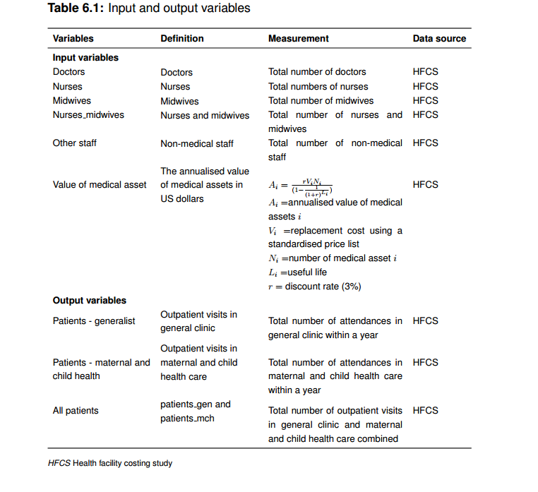{width="92%" fig-align="center"}

### Variabel Kontekstual

Analisis menguji faktor-faktor kontekstual yang mempengaruhi institusi kesehatan dan mengevaluasi dampaknya pada tingkat efisiensi fasilitas (Worthington, 2004). Kami memilih variabel kontekstual dengan berkonsultasi dengan tinjauan literatur sebelumnya di Bab 4 dan sesuai dengan ketersediaan data. Variabel kontekstual dikelompokkan ke dalam dua kategori: (1) faktor internal: elemen khusus untuk penyedia yang memengaruhi efisiensi fasilitas (misalnya ukuran dan kapasitas, kualitas, dan jenis pasien); (2) faktor eksternal: elemen di luar pengaruh penyedia yang dapat berdampak pada efisiensi fasilitas (contohnya status ekonomi, tingkat pendidikan, dan geografi) (Besstremyannaya, 2013; Gok & Sezen, 2013; Kirigia & Asbu, 2013; Mitropoulos et al., 2013; Nedelea & Fannin, 2013; Varabyova & Schreyogg, 2013; Cordero Ferrera et al., 2014; Ding, 2014; Heimeshoff et al., 2014; Shreay et al., 2014; Yang & Zeng, 2014; Matranga & Sapienzab, 2015). Set data besar kami dengan banyak variabel kontekstual yang berpotensi berkorelasi tinggi dapat menyebabkan berbagai masalah dengan penggunaan teknik regresi multivariat (Everitt & Hothorn, 2011). Untuk mengatasi masalah ini, analisis komponen utama (AKU) digunakan untuk membuat lebih sedikit variabel baru yang tidak berkorelasi berdasarkan kategori (Jolliffe & Cadima, 2016). Dengan demikian, kami mengubah 15 variabel menjadi empat variabel indeks yang baru. Hasil AKU disajikan pada Tabel 6.2, dan semua variabel kontekstual tersedia pada Tabel 6.3. Selain variabel AKU, model umum awal berisi semua variabel kontekstual yang teridentifikasi. Kami menjalankan beberapa model, memeriksa multikolinieritas dan menyelesaikan vektor variabel kontekstual.

### DEA

Kami menerapkan DEA dengan prosedur bootstrap untuk memperkirakan skor efisiensi untuk masing-masing penyedia yang ada dalam sampel. Variable return-to-scale (VRS) diterapkan untuk menjalankan model yang berorientasi input dan output untuk memperkirakan skor efisiensi fasilitas layanan primer individu, dengan asumsi bahwa tidak semua fasilitas layanan primer beroperasi pada skala yang optimal. Dalam penelitian ini, orientasi output dipilih untuk mengidentifikasi faktor-faktor yang menentukan efisiensi karena sumber daya kesehatan, termasuk tenaga kerja dan investasi modal di fasilitas layanan primer, cenderung diperbaiki dan dikendalikan oleh pemerintah (Mahendradhata et al., 2017)..

Model DEA empiris disajikan pada Persamaan. 6.1

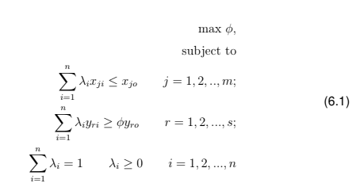{width="65%" fig-align="center"}

di mana i = fasilitas layanan primer; xji adalah input dari i-th, j = 1, 2, .., m adalah jumlah input; yri = output dari i-th, r = 1, 2, \..., s adalah jumlah output; λi = bobot set, sesuai dengan masing-masing fasilitas layanan primer, bahwa jumlah λ sama dengan satu; φ = mewakili efisiensi fasilitas layanan primer. Sisi kanan adalah salah satu dari fasilitas layanan primer *n* yang sedang dievaluasi; sisi kiri mewakili kombinasi konveks dari nilai input dan output yang diamati. Kami mengembangkan sejumlah spesifikasi model alternative yang menggunakan kombinasi input dan output. Model I1, I4, O1 dan O4 menggunakan semua input (modal dan staf medis terpilah), dengan lima input: nilai aset medis, jumlah perawat, jumlah bidan, jumlah dokter, dan jumlah staf lainnya. Karena nilai data aset medis tidak dapat diandalkan dikarenakan variasinya yang luas, model I2, I5, O2 dan O5 menggunakan empat input tanpa modal: jumlah perawat, jumlah bidan, jumlah dokter dan jumlah staf lainnya. Model terbatas (I3, I6, O3 dan O6) menggunakan jumlah perawat dan bidan secara agregat dengan tiga input: dokter, staf lain, dan jumlah agregat perawat dan bidan. Model I1, I2, I3, O1, O2 dan O3 menggunakan dua jenis output yang berbeda: jumlah pasien rawat jalan umum dan layanan KIA. Karena kedua output menyediakan jenis layanan yang serupa, model I4, I5, I6, O4, O5 dan O6 menggunakan satu output: jumlah agregat pasien rawat jalan dan layanan KIA.

### SFA

Dalam studi ini, kami memperkirakan inefisiensi teknis menggunakan fungsi produksi Cobb-Douglas dan Translog. Kami mengumpulkan output dan tidak menggunakan pembobotan karena jenis layanan yang serupa. Seperti disebutkan dalam Bab 3, menggabungkan jumlah total perawatan yang disediakan di berbagai bidang layanan (misalnya jumlah kunjungan rawat jalan umum dan KIA) mungkin tidak sesuai karena perbedaan jenis output.

Karena alasan inilah kami juga mempertimbangkan fungsi jarak Cobb-Douglas dan Translog. Model empiris dari bentuk fungsi Cobb Douglas disajikan pada Persamaan. 6.2.

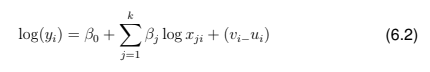{width="75%" fig-align="center"}

di mana j merupakan jumlah variabel independen, i fasilitas layanan primer, yi output dari fasilitas layanan primer ke-i, xi input j dari fasilitas layanan primer ke-i, β parameter yang akan diestimasi, vi simetris kesalahan acak untuk memperhitungkan *statistical noise*, dan ui variabel acak non-negatif yang terkait dengan inefisiensi teknis fasilitas perawatan primer i.

Dengan menggunakan justifikasi yang sama pada Bagian 6.2.4 kami menyesuaikan sejumlah model spesifikasi. Tiga spesifikasi dikembangkan untuk fungsi Cobb-Douglass (C1, C2 dan C3). C1 menggunakan lima input: aset, perawat, bidan, dokter, dan staf lainnya. C2 menggunakan empat input: perawat, bidan, dokter, dan staf lainnya. C3 menggunakan tiga input: dokter, staf lain dan jumlah keseluruhan perawat dan bidan. Semua bentuk fungsi Cobb-Douglas menggunakan satu output: jumlah agregat pasien rawat jalan umum dan layanan KIA.

Model empiris bentuk fungsi Translog ditunjukkan pada Persamaan. 6.3.

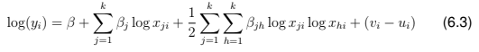{width="92%" fig-align="center"}

log xji log xhi mewakili interaksi input yang sesuai dengan j dan h dari fasilitas layanan primer ke-i. Kami merancang tiga spesifikasi bentuk fungsi Translog (T1, T2 dan T3). T1 menggunakan lima input: aset, perawat, bidan, dokter, dan staf lainnya. T2 menggunakan empat input: perawat, bidan, dokter, dan staf lainnya. T3 menggunakan tiga input: dokter, staf lain dan jumlah keseluruhan perawat dan bidan. Semua bentuk fungsi Translog menggunakan satu output: jumlah agregat pasien rawat jalan umum dan layanan KIA. Model empiris bentuk fungsi jarak multi-output dapat ditulis seperti pada Persamaan. 6.4 di bawah ini.

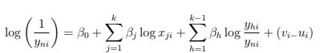{width="89%" fig-align="center"}

di mana intepretasi 

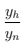{width="6%" fig-align="center"}

adalah 

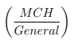{width="22%" fig-align="center"}

Kami menyesuaikan bentuk fungsi jarak multi-output dengan spesifikasi yang berbeda (CD1, CD2 dan CD3). CD1 menggunakan lima input: aset, perawat, bidan, dokter, dan staf lainnya. CD2 menggunakan empat input: perawat, bidan, dokter, dan staf lainnya. CD3 menggunakan tiga input: dokter, staf lain dan jumlah keseluruhan perawat dan bidan. Semua bentuk fungsi jarak multi-output menggunakan dua output: jumlah pasien rawat jalan umum dan jumlah layanan KIA. Model empiris bentuk multi-output bentuk jarak Translog diberikan oleh Persamaan. 6.4.

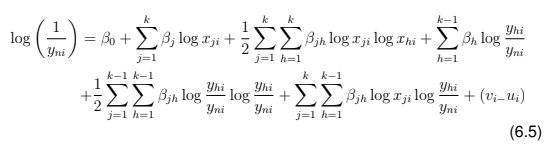{width="92%" fig-align="center"}

Kami merancang bentuk fungsi jarak Translog multi-output dengan spesifikasi berbeda (TD1, TD2 dan TD3). TD1 menggunakan lima input: aset, perawat, bidan, dokter, dan staf lainnya. TD2 menggunakan empat input: perawat, bidan, dokter, dan staf lainnya. TD3 menggunakan tiga input: dokter, staf lain, dan jumlah keseluruhan perawat dan bidan. Semua multi-output bentuk fungsi jarak Translog menggunakan dua output: jumlah pasien rawat jalan umum dan layanan KIA.

### Uji Validitas

Kami menguji validitas internal, dengan fokus pada stabilitas hasil dalam setiap metode, dan validitas eksternal, yang membahas stabilitas hasil yang dicapai antara DEA dan SFA. Berbagai kombinasi variabel input dan output digunakan untuk menguji perubahan dalam estimasi efisiensi (lihat Tabel 6.4). Pengujian validitas internal dua langkah dilakukan sebelum uji validitas eksternal. Dengan DEA, dua model asumsi pertama kali dibandingkan menggunakan uji Kruskal-Wallis untuk menentukan apakah perbedaannya signifikan secara statistik dengan mengurangi jumlah input dan output.

Kedua, uji korelasi Rank Spearman digunakan untuk memperkirakan korelasi antara input dan model berorientasi output DEA. Dengan SFA, uji rasio kemungkinan pertama kali digunakan untuk mendeteksi adanya perbedaan antara SFAdan model *Ordinary Least Square* (OLS) atau regresi linear. Kedua, uji korelasi peringkat Spearman digunakan untuk memperkirakan korelasi antara model SFA (sebagai contoh Cobb-Douglas, fungsi Translog dan jarak). Validitas eksternal diuji dengan membandingkan korelasi skor efisiensi yang diperkirakan antara DEA dan SFA menggunakan variabel input dan output yang sama (Varabyova & Schreyogg, 2013). Uji korelasi Rank Spearman bertingkat dipilih karena kemiringan distribusi data.

### Skor kuadran DEA dan SFA

Karena hasil pendekatan DEA dan SFA tidak selalu sama, tampaknya penting untuk mengidentifikasi fasilitas layanan primer yang terbukti efisien dan tidak efisien dalam kedua pendekatan (Jacobs et al., 2006). Untuk tujuan ini, kami merencanakan skor DEA dan SFA dari fasilitas kesehatan dan membagi plot menjadi empat kuadran yang mewakili tingkat efisiensi yang berbeda.

### Analisis Variabel Kontekstual

#### Analisis DEA Tahap Dua

Prosedur pendekatan dua tahap telah diimplementasikan secara luas (Bernet et al., 2008; Marschall & Flessa, 2009, 2011; Blaakman et al., 2014; Alhassan et al., 2015) untuk menemukan faktor yang menentukan efisiensi. Dalam penelitian ini, kami pertama kali menggunakan bootstrap DEA untuk memperkirakan efisiensi teknis relatif dari fasilitas kesehatan. Selanjutnya, model regresi yang memprediksi skor efisiensi diterapkan sesuai dengan serangkaian variabel kontekstual yang diharapkan dapat mempengaruhi efisiensi teknis fasilitas kesehatan. Ada beberapa perdebatan tentang penggunaan regresi untuk analisis tahap kedua ini (Hoff, 2007; McDonald, 2009; Simar & Wilson, 2011). Karena skor efisiensi di atas 1 tidak dimungkinkan, maka layak untuk menggunakan model regresi terpotong untuk menyelidiki hubungan antara skor efisiensi DEA yang dihitung pada tahap pertama dan vektor faktor kontekstual.

Regresi terpotong (*truncated regression*) ini sesuai karena memberikan estimasi konsisten pada tahap kedua, di mana model menggunakan Tobit atau regresi linear (*Ordinary Least Square* (OLS)) konsisten hanya jika beberapa asumsi berlaku. Pertama, diasumsikan bahwa semua koefisien pada variabel kontekstual adalah non-negatif, yang mungkin tidak menjadi kasus dalam penelitian kami, karena kami tidak memiliki arah apriori dari efek. Kedua, asumsi bahwa input dan variabel kontekstual independen tidak mungkin berlaku; misalnya, layanan primer di daerah perkotaan mungkin menggunakan lebih banyak dokter dan perawat. Ketiga, asumsi varian konstan untuk *noise* tidak mungkin berlaku di sini karena output cenderung lebih bervariasi di fasilitas yang lebih besar daripada di fasilitas kecil yang dibatasi oleh kapasitas (Simar & Wilson, 2011).

DEA tahap kedua ditulis sebagai berikut:

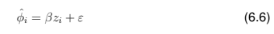{width="76%" fig-align="center"}

di mana dalam hal ini φˆ merepresentasikan estimasi skor DEA dengan bias yang terkoreksi yang dihasilkan dari prosedur bootstrap, diasumsikan terpotong (*truncated*), β adalah koefisien yang tidak diketahui, z adalah vektor variabel kontekstual yang mengacu pada faktor internal dan eksternal yang dapat dilihat pada Tabel 6.3, dan ε adalah variabel acak. Faktor inflasi varians (variance inflation factor) digunakan untuk menunjukkan multikolinieritas yang signifikan, dan kami menemukan berkorelasi sedang dengan koefisien yang kurang dari 2.

#### Analisis SFA satu tahap

Prosedur dua tahap dalam model SFA telah ditemukan bias karena distribusi yang salah spesifikasi atau yang kurang tersebar (*under-dispersed*) (Battese & Coelli, 1995; Wang & Schmidt, 2002; Kumbhakar et al., 2015). Oleh karena itu, prosedur satu tahap diterapkan untuk mempelajari faktor-faktor penentu yang mempengaruhi inefisiensi. Prosedur tersebut dapat didefinisikan sebagai berikut:

{width="92%" fig-align="center"}

di mana u adalah inefisiensi teknis dalam model *stochastic frontier*, δ adalah koefisien tidak diketahui, zi adalah vektor variabel kontekstual yang terkait dengan inefisiensi teknis yang sama seperti yang digunnakan pada analisis DEA tahap kedua (Tabel 6.3) dan W adalah variabel acak.

### Manajemen Data

Data dimanipulasi dan digabungkan dalam STATA 14 (Stata-Corp, College Station, TX, USA), kemudian dipindahkan ke R (http://cran.r-project.org) untuk dianalisis. Skor efisiensi diperoleh dengan menggunakan beberapa paket berbeda; kami melakukan DEA menggunakan Benchmarking Version 0.26 (Bogetoft & Otto, 2010), dan SFA menggunakan frontier Version 1.1-0 (Coelli & Henningsen, 2013). Analisis regresi terpotong (*truncated regression*) diterapkan menggunakan paket truncreg Versi 0.2-4 (Henningsen & Toomet, 2011). Karena skor efisiensi DEA sensitif terhadap keberadaan outlier, metode cloud data diimplementasikan untuk memeriksa outlier menggunakan paket FEAR (Frontier Efficiency Analysis) dalam R versi 2.0.1 (Wilson, 2008). Tes Kruskall-Wallis diterapkan dan tidak ada perbedaan statistic dari skor efisiensi dengan dan tanpa outlier. Kami mengimputasi dengan teknik persamaan rantai dengan *mice library* pada perangkat lunak R statistic (Buuren & Groothuis-Oudshoorn, 2011). Kami menggunakan uji T dan uji Chi-square dan kami menemukan tidak ada perbedaan signifikan secara statistic antara data yang lengkap dan yang terimputasi (lihat Table D.1 pada Lampiran D). Untuk memasukkan 49 pengamatan dari sampel input dan output yang hilang atau sama dengan nol, kami melakukan beberapa imputasi. Berkenaan dengan jumlah minimum pengamatan DEA, kami menerapkan aturan yang mana jumlah fasilitas kesehatan harus melebihi tiga kali jumlah input dan output, dan juga harus melebihi produk dari jumlah input dan output (Bowlin, 1998 ; Bogetoft & Otto, 2010). Kami memiliki 234 fasilitas, yang melebihi sampel minimum dari fasilitas kesehatan yang dibutuhkan

## Hasil

### Gambaran Layanan Primer

Tabel 6.5 menyajikan karakteristik dan kegiatan fasilitas layanan primer. Ada banyak variasi dalam jumlah output dan input. Rata-rata, Puskesmas (fasilitas layanan primer), termasuk jejaringnya di desa, memberikan 18.600 kunjungan rawat jalan umum dan 3.800 kunjungan perawatan KIA. Fasilitas tersebut menghasilkan output ini dengan rata-rata empat dokter, 31 perawat dan bidan, dan 19 staf lainnya.

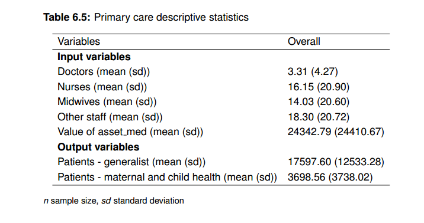{width="92%" fig-align="center"}

### Efisiensi Teknis

Kami menghilangkan fungsi jarak Translog dalam penelitian ini karena tidak cocok dengan data yang kami miliki, karena adanya multikolinieraitas yang hampir sempurna. Tabel 6.6 menunjukkan ringkasan statistik efisiensi dalam berbagai model; skor rata-rata yang lebih kecil menyiratkan efisiensi fasilitas yang lebih rendah. Skor efisiensi rata-rata dalam DEA yang berorientasi output lebih rendah daripada di SFA. Penyebaran efisiensi DEA jauh lebih besar daripada efisiensi SFA. Efisiensi yang berorientasi pada output adalah jumlah maksimal dari layanan (output) yang diberikan jumlah tenaga kesehatan (input). Skor rata-rata 0,3 di DEA (O6) dan 0,6 di SFA (T3) menunjukkan bahwa kita dapat memperluas output sebesar 245% dan 69% tanpa menghabiskan sumber daya tambahan. Secara mutlak, menggunakan DEA dan SFA, fasilitas layanan primer dapat berkembang menjadi 43.000 dan 12.000 kunjungan rawat jalan umum per tahun tanpa menambah jumlah staf kesehatan. Mengenai pengujian validitas internal, uji rasio kemungkinan menunjukkan bahwa semua model SFA menolak hipotesis nol bahwa OLS dan SFA sama pada tingkat 5%. Korelasi Rank Spearman ditemukan antara model DEA mulai dari 0,21 hingga 0,33 dan antara model SFA dari 0,91 hingga 0,99 (lihat Tabel 6.8). Dengan membandingkan semua model, kami menemukan bahwa korelasi antara efisiensi DEA dan SFA berkisar antara 0,63 hingga 0,79. Disagregasi petugas kesehatan serta layanan dalam definisi output mungkin sangat mengurangi korelasi efisiensi. Akhirnya, kami memasukkan dua model (Model O6 dan T3 dalam Tabel 6.8) dengan perkiraan validitas eksternal yang paling kuat. Spesifikasi model yang disukai termasuk jumlah dokter, jumlah perawat dan bidan, dan jumlah staf lain sebagai input, dan jumlah total kunjungan rawat jalan dan perawatan KIA sebagai output.

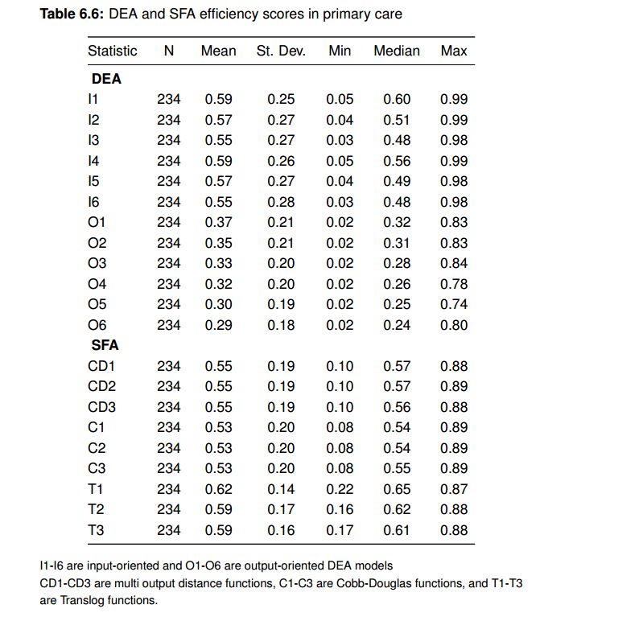{width="92%" fig-align="center"}

Gambar 6.1 memberikan sebaran plot fasilitas layanan primer; garis vertikal dan horizontal mewakili nilai rata-rata DEA dan SFA.

Tampaknya, 41% dari fasilitas layanan primer adalah fasilitas kesehatan berkinerja rendah (di kiri bawah, Kuadran 1), sementara 36% berkinerja tinggi (di kanan atas, Kuadran 3) sesuai dengan kedua teknik. Hasil untuk 23% sisa fasilitas kesehatan tidak dapat disimpulkan (Kuadran 2 dan 4). Statistik skor kuadran antara DEA dan SFA disajikan pada Tabel 6.7.

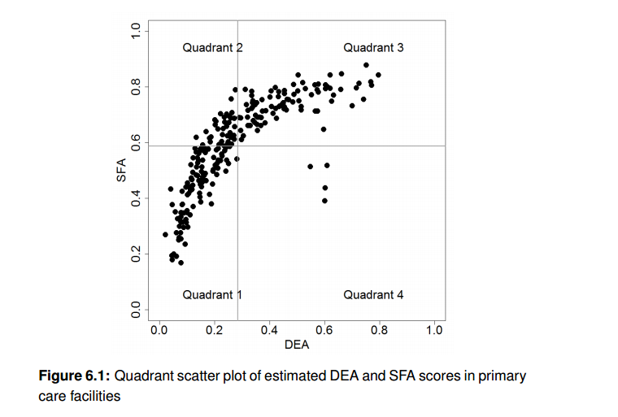{width="92%" fig-align="center"}

### Faktor Kontekstual

Hasil dari model DEA dua tahap dan model SFA satu tahap disajikan pada Tabel 6.9. Tanda-tanda koefisien antara SFA dan DEA konsisten dengan pengecualian proporsi pasien di bawah lima tahun. Indeks gangguan yang lebih sedikit dalam fasilitas kesehatan, indeks manajemen, proporsi pasien di bawah lima tahun, ketersediaan layanan rawat inap, cakupan skema asuransi pegawai negeri, dan pendidikan tidak meyakinkan di semua model. Hasil menunjukkan bahwa karakteristik geografis dan demografis, dan cakupan asuransi kesehatan cenderung mempengaruhi efisiensi. Mengingat banyaknya data yang tersedia dan kerangka kerja yang dikembangkan pada Bab 4, dua model regresi logistik digunakan untuk menjelaskan faktor-faktor yang menentukan efisiensi fasilitas layanan primer. Hasil regresi terpotong untuk skor efisiensi DEA menunjukkan bahwa tidak ada faktor internal yang mempengaruhi efisiensi. Cakupan asuransi kesehatan, lokasi di Jawa atau Bali, lokasi di daerah perkotaan, dan akses ke fasilitas kesehatan berhubungan positif dengan efisiensi. Untuk setiap peningkatan 10% dalam proporsi populasi dengan cakupan skema asuransi yang buruk, ada peningkatan 0,02 (Model 1) dan 0,03 (Model 2) dalam nilai efisiensi yang diperkirakan. Lokasi geografis menghasilkan interpretasi yang berbeda. Nilai prediksi skor efisiensi adalah 0,09 (Model 1 dan Model 2) poin lebih tinggi untuk fasilitas layanan primer di Jawa dan Bali daripada di pulau lainnya. Nilai skor prediksi efisiensi lebih tinggi secara signifikan untuk fasilitas kesehatan pada daerah perkotaan. Peningkatan 10% dalam skema jaminan kesehatan untuk masyarakat miskin menunjukkan peningkatan sekitar 0,10 poin dalam nilai efisiensi yang diperkirakan. Nilai prediksi skor efisiensi juga secara signifikan lebih tinggi untuk fasilitas layanan primer di daerah dengan akses yang lebih baik ke fasilitas kesehatan.

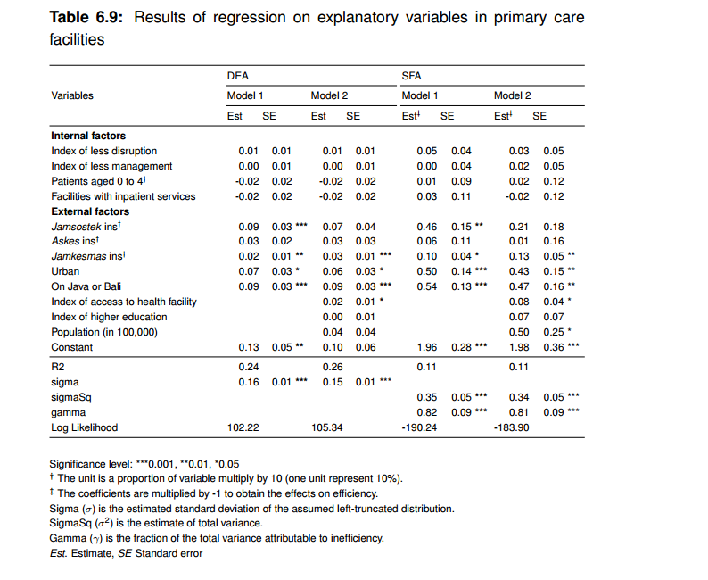{width="92%" fig-align="center"}

## Pembahasan

### Efisiensi Teknis

Pengukuran efisiensi diperlukan untuk memastikan bahwa sumber daya kesehatan untuk layanan dihabiskan seefektif mungkin. Mengingat kelebihan dan kekurangan masing-masing metode, tidak ada konsensus tentang metode mana yang paling baik dalam memperkirakan efisiensi. Giuffrida & Gravelle (2001) berpendapat bahwa pengaturan yang berbeda dari organisasi yang dievaluasi dapat menghasilkan hasil efisiensi yang berbeda dan karena itu penting untuk menyelidiki hasil dan menggunakan lebih dari satu metode sesuai dengan jenis fasilitas kesehatan. Pilihan metode harus bergantung pada tujuan analisis, ukuran sampel, persepsi ketersediaan data, dan karakteristik unit yang dievaluasi (Huang & McLaughlin, 1989). Asumsi dasar yang digunakan untuk spesifikasi model juga dapat mempengaruhi hasil estimasi (Hollingsworth, 2003). Dalam model DEA, telah ditemukan bahwa penerapan VRS dan sejumlah besar input dan output menghasilkan skor efisiensi yang lebih tinggi (Giuffrida & Gravelle, 2001). Giuffrida & Gravelle (2001) menemukan bahwa korelasi skor efisiensi antara DEA dan SFA lebih rendah daripada korelasi antara model DEA yang berbeda. Korelasi berbeda menurut model yang digunakan. Asumsi *return-to-scale* yang digunakan dalam DEA juga mempengaruhi korelasi antara hasil DEA dan SFA, meskipun efeknya beragam. Fasilitas kesehatan seperti yang ditunjukkan pada Gambar 6.1 dapat dikategorikan ke dalam tiga kelompok utama. Kelompok pertama terdiri dari fasilitas kesehatan di mana skor efisiensi sensitif terhadap teknik yang digunakan (Kuadran 2 dan 4), kelompok kedua terdiri dari fasilitas kesehatan yang tampaknya efisien menggunakan kedua teknik (Kuadran 3), dan kelompok terakhir terdiri dari fasilitas kesehatan yang tampak tidak efisien menggunakan kedua teknik (Kuadran 1). Mengacu pada Jacobs et al. (2006), kesimpulan tidak boleh diambil dari fasilitas dalam kelompok pertama atau kedua karena dianggap sebagai outlier. Sementara itu, fasilitas dalam kelompok ketiga harus diberi pengawasan yang lebih kritis, dalam bentuk seperti penilaian kinerja dan faktor-faktor penentu inefisiensi, untuk meningkatkan efisiensinya.

### Variabel Kontekstual yang Mempengaruhi Efisiensi

Kami menggunakan DEA dan SFA untuk memeriksa kekuatan asosiasi variabel kontekstual dengan estimasi efisiensi (Nedelea & Fannin, 2012). Secara keseluruhan, faktor-faktor yang menentukan efisiensi ditemukan serupa. Cakupan asuransi kesehatan, lokasi geografis, dan akses ke fasilitas kesehatan semuanya memiliki dampak signifikan terhadap efisiensi, sementara kualitas (seperti yang ditunjukkan oleh indeks gangguan dan indeks manajemen) dan campuran pasien tidak memiliki pengaruh signifikan terhadap efisiensi di fasilitas kesehatan. Namun, hubungan antara cakupan asuransi kesehatan PNS dan efisiensi tidak konsisten antara SFA dan DEA. Perbedaan ini mungkin kemungkinan disebabkan oleh adanya perbedaan dalam penyusunan *frontier* efisiensi, serta teknik untuk menentukan jarak antara satu pengamatan dengan garis frontier. Pada DEA, semua perbedaan jarak dari garis frontier dengan posisi faskes dilihat sebagai inefisiensi, sementara pada SFA, variasi yang ada dibagi menjadi komponen inefisiensi dan komponen acak (random component) (Jacobs et al., 2006; Varabyova & Schreyogg, 2013).

Dalam studi ini, fasilitas layanan primer berkinerja tinggi paling sering ditemukan di daerah yang makmur, terutama di daerah perkotaan dan di pulau Jawa dan Bali. Seperti yang telah ditunjukkan di tempat lain, fasilitas kesehatan di daerah pedesaan ditemukan memiliki kinerja yang kurang baik dibandingkan dengan di daerah perkotaan (Ramanathan et al., 2003; Pavitra, 2013). Daerah pedesaan dengan kepadatan populasi rendah dan akses yang lebih rendah dikaitkan dengan berkurangnya penggunaan layanan dan efisiensi (Soucat et al., 1997; Ramanathan et al., 2003; Rattanachotphanit et al., 2008; Pavitra, 2013). Namun demikian, penelitian lain menunjukkan bahwa fasilitas layanan primer yang terletak di daerah pedesaan memiliki efisiensi teknis yang lebih tinggi daripada yang berada di daerah perkotaan (Dandona et al., 2005; Alhassan et al., 2015). Ini mungkin disebabkan oleh pemanfaatan yang lebih tinggi dari layanan primer oleh pasien dengan status sosial ekonomi rendah yang sebagian besar meninggali daerah tersebut (Dandona et al., 2005). Fasilitas layanan primer di daerah perkotaan, bagaimanapun, harus bersaing dengan fasilitas kesehatan sektor swasta, yang dipandang memberikan layanan yang lebih baik daripada fasilitas di sektor publik (Alhassan et al., 2015).

Mengenai lokasi geografis, studi Berman et al. (1989) mendukung temuan kami bahwa fasilitas layanan primer yang berkinerja lebih baik ada di Jawa. Jawa adalah pulau terpadat di Indonesia dan memiliki infrastruktur yang lebih maju (BPS, 2015). Fasilitas kesehatan yang ditemukan lebih efisien cenderung berada di daerah dengan sumber daya layanan kesehatan yang lebih baik, ditunjukkan oleh, misalnya, rasio populasi yang kuat terhadap petugas kesehatan dan fasilitas (Puenpatom & Rosenman, 2008). Khususnya populasi di pulau-pulau Jawa dan Bali dan di daerah perkotaan memiliki status pendidikan dan ekonomi yang lebih tinggi. Kami menemukan dampak yang tidak meyakinkan dari pendidikan populasi terhadap efisiensi, tetapi penelitian lain telah membuktikan bahwa pendidikan menjadi input utama untuk kesehatan populasi dan secara positif terkait dengan efisiensi fasilitas kesehatan (Spinks & Hollingsworth, 2009; Varabyova & Schreyogg, 2013).

Hasil kami menunjukkan bahwa hubungan antara fasilitas layanan primer berkinerja tinggi dan cakupan asuransi kesehatan yang tinggi di antara populasi, terutama yang tercakup dalam skema asuransi untuk masyarakat tidak mampu. Asuransi kesehatan melindungi orang dari permasalahan finansial dan mengurangi hambatan finansial terhadap akses layanan kesehatan. Peningkatan cakupan asuransi kesehatan mendorong permintaan pelayanan kesehatan dan meningkatkan efisiensi fasilitas layanan kesehatan dan akses ke layanan, terutama bagi masyarakat yang tidak mampu. Namun, kami tidak menemukan hubungan yang signifikan antara skema asuransi untuk pegawai negeri sipil dan efisiensi fasilitas layanan primer. Alasannya tidak jelas, tetapi mungkin disebabkan oleh perbedaan peraturan antara skema asuransi; pegawai negeri diizinkan untuk mendaftar di fasilitas layanan primer swasta, di mana kualitas perawatan dianggap lebih tinggi (Mundiharno & Thabrany, 2012).

### Dampak pada Kebijakan

Investasi dalam layanan primer untuk program kesehatan masyarakat dan kegiatan preventif akan menyelamatkan banyak jiwa, meningkatkan kualitas hidup, menghasilkan manfaat ekonomi dalam bentuk pengurangan biaya perawatan kesehatan, dan meningkatkan efisiensi (Langenbrunner et al., 2014). Seperti dibahas di atas, pengukuran efisiensi sangat penting dalam proses pengambilan keputusan untuk memastikan bahwa sumber daya yang diinvestasikan dihabiskan sebagaimana mestinya. Ada berbagai metode untuk mengukur efisiensi; pembuat kebijakan perlu memahami kelebihan dan kekurangan dari masing-masing metode ini dan mengintegrasikan pengukuran efisiensi ke dalam pemantauan berkala dari sistem kesehatan Indonesia.

Kami menemukan limbah sumber daya kesehatan di beberapa tingkatan, terutama di fasilitas yang berlokasi di daerah pedesaan. Namun, pengurangan jumlah atau penutupan fasilitas kesehatan tidak praktis atau tidak etis sebagai intervensi: peningkatan kesulitan akses fisik kemungkinan akan mengurangi permintaan secara keseluruhan. Infrastruktur transportasi yang buruk adalah alasan utama tidak memadainya penggunaan fasilitas kesehatan (Marschall & Flessa, 2009). Transportasi yang tidak memadai ke fasilitas kesehatan telah diidentifikasi sebagai penghalang utama untuk layanan ibu, dan pemberian insentif dapat membantu mengurangi biaya transportasi dan meningkatkan penggunaan layanan (Sarma, 2009; Keya et al., 2014; Fleming et al., 2017). Namun, memberikan insentif mungkin bukan strategi yang berkelanjutan; oleh karena itu, investasi di bidang-bidang seperti sistem transportasi umum, perluasan layanan medis dan sistem transportasi rujukan, dapat mengurangi hambatan dalam akses ke layanan kesehatan (Prinja dkk., 2014; Sagrestano dkk., 2014).

Studi kami menunjukkan bahwa kualitas tidak memiliki hubungan yang signifikan dengan efisiensi teknis. Namun, peningkatan kualitas layanan yang berkelanjutan tetap penting; ketersediaan peralatan dasar di fasilitas layanan primer di Indonesia seringkali buruk, terutama di daerah pedesaan (Mahendradhata et al., 2017). Fasilitas kesehatan telah menunjukan bahwa persediaan yang tidak memadai dan staf yang tidak memadai merupakan hambatan untuk meningkatkan efisiensi (Dandona et al., 2005).

## Keterbatasan

Studi ini berfokus pada fasilitas layanan primer publik di Indonesia dan oleh sebab itu tidak mempertimbangkan fasilitas kesehatan swasta. Oleh karena itu, generalisasi temuan untuk NBRM lain, khususnya Afrika, dapat menjadi tantangan di mana fasilitas kesehatan yang dikelola oleh organisasi non-pemerintah lebih sering ditemukan (Vogel et al., 2012; Yagub & Mtshali, 2015). Sejauh mana temuan kami akan berlaku untuk fasilitas swasta tentu memerlukan penyelidikan lebih lanjut. Meskipun ada banyak fasilitas swasta di Indonesia namun kebanyakkan kecil dan mayoritas petugas kesehatan di sana juga bekerja di sektor publik (Heywood & Harahap, 2009).

Tidak semua kegiatan output di fasilitas layanan primer tercakup dalam penelitian ini karena sebagian besar berfokus pada kegiatan perawatan kuratif. Pertimbangan perawatan preventif terbatas pada layanan KIA, termasuk layanan antenatal, perawatan postnatal, dan imunisasi. **Jumlah hari tempat tidur** (*bed-days*) dihilangkan karena kurang dari setengah dari fasilitas layanan primer dalam sampel menawarkan layanan rawat inap. Namun, dimasukkannya **hari tempat tidur (***bed-days*) diuji dalam model dan tidak ada perbedaan yang signifikan antara model dengan atau tanpa **hari tempat tidur (bed-days)** ditemukan. Jenis fasilitas layanan primer juga tidak terkontrol dalam analisis karena diasumsikan bahwa teknologinya homogen.

Data dari tahun 2011 digunakan dalam penelitian ini. Kami menyarankan bahwa penelitian ini harus direplikasi menggunakan data longitudinal untuk menyoroti perubahan efisiensi karena perubahan kebijakan baru-baru ini, terutama reformasi asuransi kesehatan nasional yang dimulai pada tahun 2014.

## Kesimpulan

Hasil penelitian empiris ini menunjukkan variasi yang luas dalam efisiensi di antara fasilitas layanan primer. Lokasi geografis, cakupan asuransi kesehatan penduduk, dan akses ke fasilitas kesehatan adalah faktor utama yang menentukan tingkat efisiensi fasilitas layanan primer. Fasilitas layanan primer berkinerja tinggi umumnya berlokasi di daerah yang makmur atau di daerah dengan cakupan tinggi di bawah skema asuransi untuk masyarakat kurang mampu; mereka yang berada di daerah perkotaan, dan mereka yang berada di pulau Jawa dan Bali juga ditemukan berkinerja lebih baik daripada yang lain. Temuan penting lainnya adalah efisiensi fasilitas kesehatan tidak dapat dijelaskan oleh kualitas atau campuran pasien. Oleh karena itu, pengukuran efisiensi rutin direkomendasikan untuk dimasukkan ke dalam pemantauan sistem kesehatan yang regular.
