# Analisis *Frontier*: Aplikasi untuk Rumah Sakit {#sec-rumah-sakit}

## Pendahuluan

Rumah sakit merupakan penyumbang pengeluaran kesehatan terbesar di Indonesia, yaitu sebesar 38% dari total pengeluaran kesehatan publik (Rokx, 2009). Antara tahun 2005 dan 2014, pengeluaran RS di Indonesia meningkat sebesar 23 pp. Akan tetapi, rerata bed occupancy rate (jumlah hari rawat inap per jumlah tempat duduk) hanya berada di kisaran 60%, sehingga bisa dikatakan lebih rendah dari rekomendasi yang sebesar 85-90% (Kemenes etc)

Ukuran fasilitas kesehatan yang tidak layak, termasuk jumlah bed yang melebihi kapasitas SDM, ditambah alat-alat medis dan mahalnya harga obat dan medical supplies merupakan faktor yang diperkirakan menjadi penyebab utama inefisiensi pada fasilitas kesehatan (Sari, 1999; CHalidyanto, 2013). Sebuah penelitian oleh Chalidyanto (2013) menemukan bahwa kurang dari 35% RS di Indonesia yang efisien secara teknis dan bahwa rerata nilai efisiensi teknis adalah sebesar 80%. Penilaian efisiensi yang lain dilakukan di Jawa Timur menunjukkan bahwa hanya 1 dari 39 RS di Provinsi tersebut yang efisien (Cahyani et al., 2012).

Pada Bab 5 telah dijelaskan bahwa, berdasarkan analisis Pabon-Lasso, 37% RS ada pada sector utilisasi tinggi, sedangkan 37% yang lain ada pada sector utilisasi rendah. Bab 5 juga memberikan bukti adanya variasi performa RS di Indonesia. Bab ini bertujuan untuk menginvestigasi kemungkinan penyebab adanya variasi pada nilai efisiensi RS. Analisis Frontier lebih lanjut telah dilakukan untuk menyediakan Benchmark terhadap efisiensi RS dan untuk menentukan hubungnan fungsional antara efisiensi dengan kemungkinan faktor kontekstualnya.

## Metode

### Data

Penelitian ini menilai determinan dari efisiensi RS dengan menganalisis data dari empat sumber. Sumber pertama adalah Survei Fasilitas Kesehatan yang dilakukan oleh Kementerian Kesehatan antara Oktober 2010 sampai September 2011. Data tersebut digunakan untuk untuk mengestimasi efisiensi relatif dari masing-masing RS dan mengidentifikasi faktor-faktor determinan efisiensi dari sisi internal. Kedua, datai dari Survei Sosioekonomi Nasional (SUSENAS) 2011 digunakan untuk mendapatkan informasi terkait karakteristik rumah tangga di tingkat kabupaten, seperti tingkat pendidikan penduduk dewasa serta cakupan asuransi kesehatan. Ketiga, kami menggunakan data statistic Potensi Desa (PODES), sebuah sensus yang memberikan informasi mengenai karakteristik desa di seluruh Indonesia yang meliputi ukuran populasi, jenis pekerjaan dan akses pada fasilitas kesehatan. Keempat, kami menggunakan data dari Indonesian Case Base Groups (Ina-CBGs) yang merupakan data sampai tingkat pasien untuk digunakan sebagai dasar penilaian Case Mix Index (CMI) dan rasio mortalitas. Kami menggabungkan data SUSENAS da PODES dengan data fasilitas kesehatan menggunakan *identifier* kabupaten tempat RS berada. Dataset INA-CBGs kemudian digabungkan dengan menggunakan *identifier* RS.

### Variabel Input dan Output

Analisis efisiensi didasarkan pada berbagai input yang meliputi tenaga kerja dan kapital dari suatu RS. Pemilihan variabel input dan output mengikuti petunjuk dari studi terkait penilaian efisiensi faskes yang telah dilakukan sebelumya (dijelaskan pada Bab 4) dan memasukan input dan output produksi RS yang dibedakan berdasarkan berbagai peran dari pekerja kesehatan dan tipe layanan (Besstremyannayam 2013; GOk & Sexen , 2013; Krigia & Asbu, 2013, Varabyova & Schreyogg, 2013; Chowdhury et al. 2014; Yang & Zeng, 2014). Uji validitas juga dilakukan untuk menentukan pilihan variabel-variabel input dan output. Kami menemukan bahwa SFA sensitif terhadap output pelayanan rawat jalan karena tidak ditemukan adanya inefisiensi jika output tersebut dipakai dalam analisis. Penjelasan yang mungkin dari temuan ini adalah standar deviasi yang lebar dari pelayanan rawat jalan, yang bisa jadi disebabkan oleh heterogenitas pelayanan rawat jalan, tidak seperti rawat inap yang yang jelas-jelas dibatasi oleh ketersediaan tempat tidur. Kami selanjutnya mengeluarkan layanan rawat jalan dari analisis SF.

Enam input yang dimasukkan meliputi: (1) jumlah dokter (2) jumlah perawat, (3) jumlah staf yang lain, (4) jumlah dokter non-spesialis penuh-waktu, (6) jumlah dokter spesialis penuh waktu, dan (6) jumlah tempat tidur. Delapan output yang dimasukkan meliputi: (1) jumlah kunjungan rawat jalan, (2) jumlah admisi rawat inap yang disesuaikan dengan rasio mortalitas, (4) jumlah operasi, (5) jumlah kunjungan rawat jalan, jumlah admisi yang disesuaikan, dan jumlah operasi, (6) jumlah kunjungan rawat jalan, jumlah hari-tempat tidur yang disesuaikan dengan rasio mortalitas, dan jumlah operasi, (7) jumlah admisi yang disesuaikan dan jumlah operasi, serta (8) jumlah hari-tempat tidur dan jumlah operasi.

Jumlah kunjungan rawat jalan, bed-days, dan jumlah rawat inap disesuaikan dengan Case Mix Index (CMI) masing-masing sebagai proksi terhadap tingkat keparahan kasus. Sementara itu, rasio mortalitas digunakan sebagai proksi untuk menjelaskan kualitas tiap-tiap RS. Penjelasan lebih rinci mengenai penyesuaian terhadap casemix dan kualitas dapat dilihat pada Bagian 3.3.1.

Dikarenakan model SFA standar hanya terbatas pada satu input, pembobotan terhadap masing-masing output dilakukan untuk mendapatkan nilai agregat. Rasio unit biaya dari rawat inap, hari rawat, dan operasi terhadap kunjungan rawat jalan digunakan seabgai proksi untuk pembobotan, yaitu sebesar masing-masing 12.6, 3.5, dan 3.5 (Ensor & Indradjaya, 2012). Pada studi costing sebelumnya di China ditemukan bahwa unit cost operasi dan bed day tidak lah berbeda secara signifikan, sehingga kami menggunakan nilai pembobotan yang sama untuk bed day dan operasi (Adam et al., 2014). Untuk mengatasi keterbatasan dari penggunaan jumlah total pasien yang diobati, kamu juga mempertimbangkan model *multi-output distance function* untuk mengestimasi efisiensi teknis.

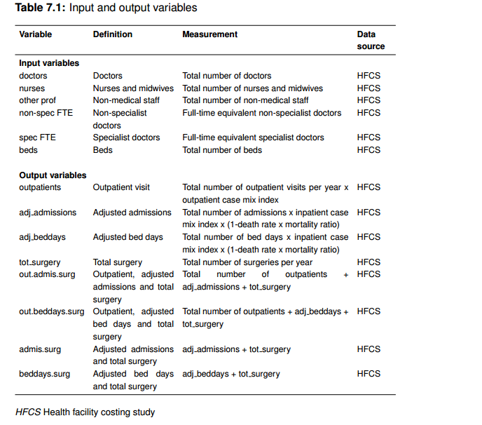{width="100%" fig-align="center"}

### Variabel Konteksutal

Analisis dari faktor internal dan eksternal yang terpilih berdasarkan telaah pustaka di Bab 4, kemudian diukur dampaknya terhadap tingkat efisiensi RS (Worthington, 2004). Variabel kontekstual kemudian dikelompokkan menjadi dua kategori: (1) faktor internal (missal ukuran dan kapasitas, kepemilikan dan jenis pasien) dan (2) faktor eksternal (misal cakupan jaminan kesehatan, tingkat pendidikan masyarakat, dan aspek geografis) (Mobley & Magnussen, 1998; Herr, 2008; Besstremyannaya, 2013; Gok & Sezen, 2013; Kirigia & Asbu, 2013; Mitropoulos et al., 2013; Nedelea & Fannin, 2013; Varabyova & Schreyogg, 2013; Cordero Ferrera et al., 2014; Ding, 2014; Heimeshoff et al., 2014; Shreay et al., 2014; Yang & Zeng, 2014; Matranga & Sapienzab, 2015).

Seperti halnya analisis pada fasilitas kesehatan tingkat pertama (FKTP) di Bab 6, PCA digunakan untuk menghasilkan lebih sedikit variabel baru yang tidak berkorelasi, sehingga menghindari permasalahan yang dapat muncul ketika dilakukan analisis regresi multivariabel (Jolliffe & Cadima, 2016). Dengan cara ini, kami mengubah 16 variabel menjadi lima variabel indeks. Hasil PCA dapat dilihat pada Tabel 7.2.

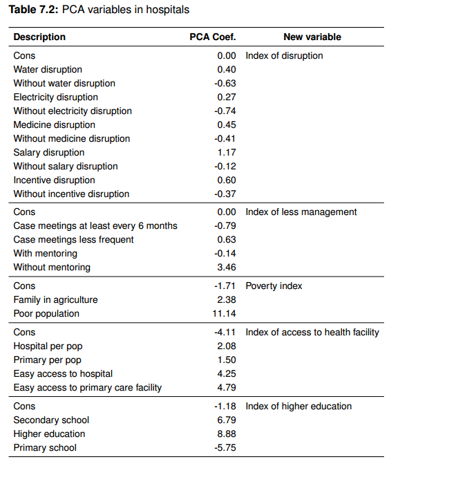{width="100%" fig-align="center"}

Selain variabel PCA, model umum pada awalnya mencakup semua variabel kontekstual yang teridentifikasi yaitu: kelas RS, status pendidikan, kepemilikan, jenis pasien, populasi kabupaten/kota, lokasi geografis, dan cakupan jaminan kesehatan. Kami mencoba beberapa model, memeriksa multi-kolinearitas dan melakukan finalisasi vector dari variabel-variabel kontekstual. Semua variabel kontekstual dimasukkan pada Tabel 7.3.

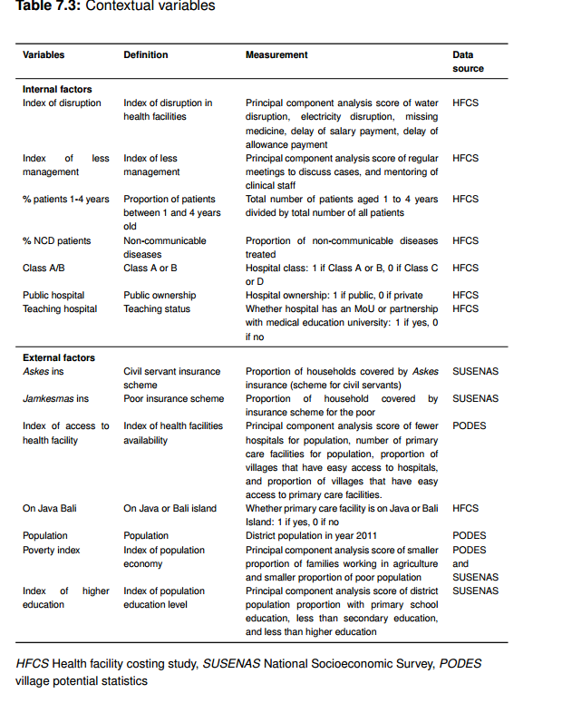{width="100%" fig-align="center"}

### Data Envelopment Analysis (DEA)

Prosedur DEA dengan *bootstrap* dugunakan untuk mengestimasi nilau efisiensi untuk setiap faskes yang ada dalam sampel. *Variable Return to Scale (VRS)* diterapkan untuk menjalankan model yang berorientasi input dan output untuk mengestimasi skor efisiensi setiap rumah sakit. Seperti halnya yang dilakukan pada analisis Faskes primer, kami memilih untuk menggunakan orientsi output untuk mengidentifikasi faktor-faktor yang menentukan efisiensi. Dikarenakan input yang ada seperti tenaga kerja dan modal investasi secara umum tidak berada di bawah kendali langsung manajemen rumah sakit, terutama pada kasus rumah sakit milik pemerintah (Mahendradhata et al 2017), manajemen diharapkan untuk fokus pada pemaksimalan output dengan input yang tersedia.

Rumus empiris untuk model DEA tersebut adalah sebagai berikut:

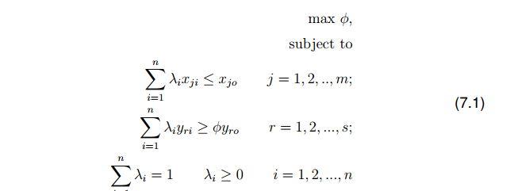{width="100%" fig-align="center"}

Dengan i=Rumah Sakit; xji adalah input dari RS-i, j=1,2,3... m adalah jumlah input; yri = output dari RS-i, r=1,2,...,s adalah jumlah output; lambda-i = himpunan pembobotan, untuk masing-masing rumah sakit, jumlah lambda adalah satu; theta = efisiensi rumah sakit. Sisi kanan rumus adalah satu dari n rumah sakit yang sedang dievaluasi; rumus sisi kiri adalah kombinasi konveks dari nilai-nilai yang teramati dari input dan output.

Kami mengembangkan sejumlah spesifikasi model, menggunakan kombinasi input dan output. Model I1, I2, I4, I5, I7, I8, I10, I11, O1, O2, O4, O5, O7, O8, O10 dan O11 menggunakan semua input (modal dan staf medis terpilah), dengan lima input: jumlah perawat , jumlah staf lain, FTE dokter non-spesialis, FTE dokter spesialis dan jumlah tempat tidur. Model I3, I6, I9, I12, O3, O6, O9 dan O12, menggunakan jumlah agregat dokter, dengan empat input: jumlah dokter, jumlah perawat, jumlah staf lain dan jumlah tempat tidur. Berdasarkan kerangka analitis pada Bab 4, layanan rawat inap terutama diukur dengan menggunakan dua indikator, jumlah hari tidur dan penerimaan. Oleh karena itu, kami merancang dua spesifikasi pertama menggunakan berbagai indikator rawat inap. Model I1 dan O1 menggunakan tiga output: jumlah pasien rawat jalan, jumlah penerimaan disesuaikan dan jumlah operasi. Model I2, I3, O2 dan O3 menggunakan tiga output: jumlah pasien rawat jalan, jumlah hari tempat tidur disesuaikan dan jumlah operasi. Karena SFA standar hanya dapat menggunakan satu output, kami mengumpulkan jumlah output. Model I4 dan O4 menggunakan satu keluaran: jumlah keseluruhan pasien rawat jalan, penerimaan rawat inap dan operasi yang disesuaikan. Model I5, I6, O5 dan O6 menggunakan satu output: jumlah agregat pasien rawat jalan, hari tempat tidur disesuaikan dan operasi. Kami membandingkan suka dengan suka tanpa jumlah kunjungan rawat jalan sehubungan dengan SFA yang gagal mengidentifikasi inefisiensi sebagaimana dibahas dalam Bagian 7.2.2. Model I7 dan O7 menggunakan dua output: jumlah penerimaan disesuaikan dan jumlah operasi. Model I8, I9, O8 dan O9 menggunakan dua output: jumlah hari tempat tidur disesuaikan dan jumlah operasi. Model I10 dan O10 menggunakan satu keluaran: jumlah agregat dari penerimaan dan operasi yang disesuaikan. Model I11, I12, O11 dan O12 menggunakan satu output: jumlah agregat hari rawat (bed days) dan operasi yang telah disesuaikan.

### Stochastic Frontier Analysis (SFA)

Studi ini mengestimasi efisiensi teknikal dengan empat model SFA yang berbeda:

1.  Cobb-douglas production function

2.  Translog

3.  Fungsi jarak (distance function), dan

4.  Fungsi jarak dengan translog.

Fungsi produksi Cobb-Douglas dengan output tunggal pertama-tama diestimasi sesuai dengan formula 7.2 berikut

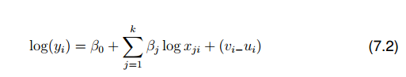{width="85%" fig-align="center"}

Di mana j merepresentasikan jumlah variabel independent, i rumah sakit, yi output dari rumah sakit i, xi input j dari rumah sakit I, beta adalah parameter yang akan diestimasi, vi adalah random eror sistematis dan ui adalah variabel acak non-negatif yang berkaitan dengan efisiensi teknis dari RS i.

Dengan menggunakan justifikasi yang sama pada Bagian 7.2.4, kami menyesuaikan sesuai spesifikasi model. Tiga spesifikasi bentuk fungsi Cobb-Douglass (C1, C2 dan C3). Model C1 dan C2 menggunakan lima input: jumlah perawat, jumlah staf lain, dokter non-spesialis FTE, dokter spesialis FTE dan jumlah tempat tidur. Model C3 menggunakan input empat: jumlah dokter, jumlah perawat, jumlah staf lain dan jumlah tempat tidur). Model C1 menggunakan satu keluaran: jumlah agregat dari penerimaan dan operasi yang disesuaikan. Model C2 dan C3 menggunakan satu output: jumlah hari dan operasi bed disesuaikan. Namun, bentuk Cobb-Douglas terbatas karena mengasumsikan elastisitas substitusi yang konstan. Oleh karena itu kami juga memperkirakan model perbatasan produksi stokastik Translog.

Model empiris bentuk translog dapat dituliskan seperti Persamaan. 7.3 di bawah ini

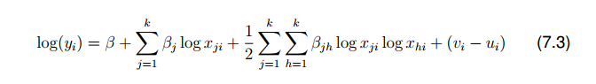{width="100%" fig-align="center"}

.

log xji log xhi mewakili interaksi input yang sesuai j dan h dari fasilitas perawatan primer ke-i. Kami merancang tiga spesifikasi bentuk fungsi translog (T1, T2 dan T3). Model T1 dan T2 menggunakan lima input: jumlah perawat, jumlah staf lain, FTE dokter non-spesialis, FTE dokter spesialis dan jumlah tempat tidur. Model T3 menggunakan empat input: jumlah dokter, jumlah perawat, jumlah staf lain dan jumlah tempat tidur. Model T1 menggunakan satu output: jumlah agregat dari penerimaan dan operasi yang disesuaikan. Model T2 dan T3 menggunakan satu output: jumlah agregat hari dan operasi tempat tidur yang disesuaikan.

Selain itu, untuk mengantisipasi kemungkinan bahwa jumlah pasien yang dirawat dalam fungsi Translog tidak sesuai dengan output kami (mis. Kunjungan rawat jalan dan penerimaan rawat inap), kami memperkirakan fungsi jarak multi-output dan fungsi jarak Translog.

Model empiris dari bentuk fungsi jarak dengan multi-output dapat dijelaskan dengan Persamaan.7.4

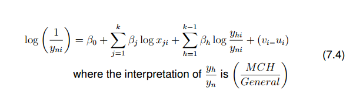{width="100%" fig-align="center"}

Kami merancang tiga spesifikasi bentuk fungsi jarak multi-output (CD1, CD2 dan CD3). Model CD1 dan CD2 menggunakan lima input: jumlah perawat, jumlah staf lain, FTE dokter non-spesialis, FTE dokter spesialis dan jumlah tempat tidur. Model CD3 menggunakan empat input: jumlah dokter, jumlah perawat, jumlah staf lain dan jumlah tempat tidur. Model CD1 menggunakan dua output: jumlah penerimaan disesuaikan dan jumlah operasi. Model CD2 dan CD3 menggunakan dua output: jumlah hari tempat tidur disesuaikan dan jumlah operasi.

Model empiris bentuk multi-output bentuk jarak translog diberikan oleh Persamaan. 7.4.

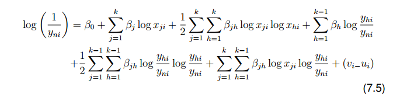{width="100%" fig-align="center"}

Kami merancang tiga spesifikasi bentuk fungsi jarak translog multi-output (TD1, TD2 dan TD3). Model TD1 dan TD2 menggunakan lima input: jumlah perawat, jumlah staf lain, FTE dokter non-spesialis, FTE dokter spesialis dan jumlah tempat tidur. Model TD3 menggunakan empat input: jumlah dokter, jumlah perawat, jumlah staf lain dan jumlah tempat tidur. Model TD1 menggunakan dua output: jumlah penerimaan disesuaikan dan jumlah operasi. Model TD2 dan TD3 menggunakan dua output: jumlah hari tempat tidur disesuaikan dan jumlah operasi.

### Uji Validitas

Kami menguji validitas internal dan eksternal sebagian besar seperti yang dijelaskan dalam Bagian 6.2.6. Tabel 7.5 mengilustrasikan kombinasi variabel input dan output yang digunakan untuk menguji perubahan dalam estimasi efisiensi.

Pada langkah pertama pengujian validitas internal, keberadaan inefisiensi dikonfirmasi oleh tingginya nilai kontribusi inefisiensi (σu) terhadap kesalahan total (γ). Pada langkah kedua, uji korelasi peringkat Spearman digunakan untuk memperkirakan korelasi antara model SFA (mis. Fungsi jarak dan fungsi jarak Translog).

Validitas eksternal diuji dengan membandingkan korelasi skor efisiensi yang diperkirakan antara DEA dan SFA menggunakan variabel input dan output yang sama (Varabyova & Schreyogg, 2013). Uji korelasi peringkat Spearman dipilih karena kemiringan distribusi data, meskipun korelasi Pearson telah digunakan dalam penelitian sebelumnya (Jacobs, 2001).

### Skor Kuadran DEA dan SFA

Untuk alasan yang dijelaskan dalam Bagian 6.2.7 berkenaan dengan fasilitas perawatan primer, kami merencanakan skor DEA dan SFA rumah sakit dan membagi plot menjadi empat kuadran yang mewakili tingkat efisiensi yang berbeda.

### Analisis variabel kontekstual

Analisis DEA tahap dua dan analisis SFA tahap satu dilakukan dan seperti yang sudah dibahas pada Bagian 6.2.8. Analisis DEA tahap dua dapat dituliskan sebagai berikut

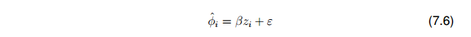{width="100%" fig-align="center"}

Dalam hal ini, *φ*ˆ mewakili estimasi skor DEA yang bias nya sudah dikoreksi dan berasal dari prosedur bootstap, dengan asumsi terpotong (*truncated*), *β* adalah koefisien yang tidak diketahui, *z* adalah vector dari variabel-variabel kontekstual yang meliputi faktor internal dan eksternal yang dapat dilihat pada Tabel 7.3, sedangkan *ε* adalah variabel acak. Faktor inflasi varians (*variance inflation factor*) digunakan untuk menandakan adanya multikolinearitas yang signifikan, dan kami menemukan adanya korelasi sedang dengan koefisien antara 1 dan 5.

Prosedur SFA satu tahap yang digunakan untuk mempelajari determinan yang mempengaruhi inefisiensi dapat dituliskan sebagai berikut

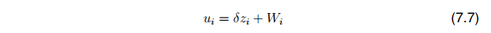{width="100%" fig-align="center"}

Dalam hal ini *u* adalah inefisiensi teknis pada model *frontier* stokastik, *δ* adalah koefisien yang tidak diketahui, *zi* adalah vector dari variabel-variabel kontekstual yang berkaitan dengan inefisiensi teknis, menggunakan daftar yang sama dengan yang digunakan pada analisis DEA tahap dua (Tabel 7.3). Sementara itu, W adalah variabel acak.

### Manajemen Data

Data dalam penelitian ini dikelola sebagaimana dibahas dalam Bagian 6.2.9. Seperti dalam hasil penelitian kami tentang fasilitas perawatan primer di Bab 6, kami tidak menemukan perbedaan yang signifikan dalam skor efisiensi dengan dan tanpa pencilan menggunakan uji Kruskal-Wallis. Oleh karena itu, untuk mencegah hilangnya informasi yang berharga, kami tidak membatalkan pencilan (*outliers*).

Rumah sakit diasumsikan mendapatkan input dan menghasilkan output sesuai dengan angka standar yang disediakan oleh Kementerian Kesehatan Indonesia (Kemenkes, 2014a). Oleh karena itu, kami mengganti nilai nol dengan nilai yang hilang. Data lengkap tersedia untuk 138 rumah sakit dari total 200 rumah sakit (31% hilang). Ketika data hilang, hasilnya mungkin bias karena tidak terwakili, yang dapat menyebabkan salah tafsir dalam kesimpulan kebijakan (Marshall et al., 2009). Tsikriktsis (2005) mengemukakan imputasi regresi sebagai cara yang tepat untuk melanjutkan ketika lebih dari 20% data hilang. Data yang hilang diasumsikan hilang secara acak, di mana kemungkinan hilangnya data tergantung pada data yang diamati. Kami diperhitungkan menggunakan teknik persamaan dirantai dengan perpustakaan \'tikus\' dalam perangkat lunak statistik R (Buuren & Groothuis-Oudshoorn, 2011). Uji-T dan uji Chi-Square digunakan dan tidak ada perbedaan statistik antara data lengkap dan imputasi, dengan pengecualian rasio mortalitas (lihat Tabel E.1 dalam Lampiran E).

Berkenaan dengan jumlah minimum pengamatan untuk melakukan analisis DEA, kami menerapkan aturan di mana jumlah rumah sakit harus melebihi tiga kali jumlah input dan output, dan juga harus melebihi produk dari jumlah input dan output (Bowlin, 1998; Bogetoft & Otto, 2010), yaitu K\> 3 · (m + n) dan K\> m · n di mana K adalah jumlah rumah sakit, m jumlah input dan n jumlah output. Setelah imputasi, terdapat 200 RS yang ada, jumlah ini sudah melebihi sampel minimum yang dibutuhkan.

## Hasil

### Statistik Rumah Sakit

Tabel 7.6 menyajikan karakteristik dan kegiatan rumah sakit. Ada variasi luas dalam jumlah input dan output per fasilitas. Rumah sakit menghasilkan rata-rata 70.586 kunjungan rawat jalan, 8.943 rawat inap, dan 2.017 total operasi dengan rata-rata 42 dokter, 178 perawat dan bidan, dan 139 staf lainnya.

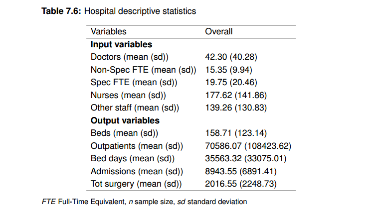{width="88%" fig-align="center"}

### Efisiensi Teknis

Analisis akhirnya menghilangkan fungsi jarak dan fungsi jarak Translog karena nilai inefisiensi kecil dari semua variasi residu; untuk alasan ini, fungsi-fungsi ini gagal untuk menolak hipotesis bahwa SFA tidak berbeda dari kuadrat terkecil biasa (OLS) (Bogetoft & Otto, 2010; Kumbhakar et al., 2015).

Tabel 7.7 menunjukkan ringkasan statistik efisiensi antara dua model; skor rata-rata yang lebih kecil mewakili efisiensi fasilitas yang lebih rendah. Skor efisiensi dalam DEA secara konsisten lebih rendah daripada di SFA; penyebaran kisaran efisiensi DEA hampir identik dengan efisiensi SFA.

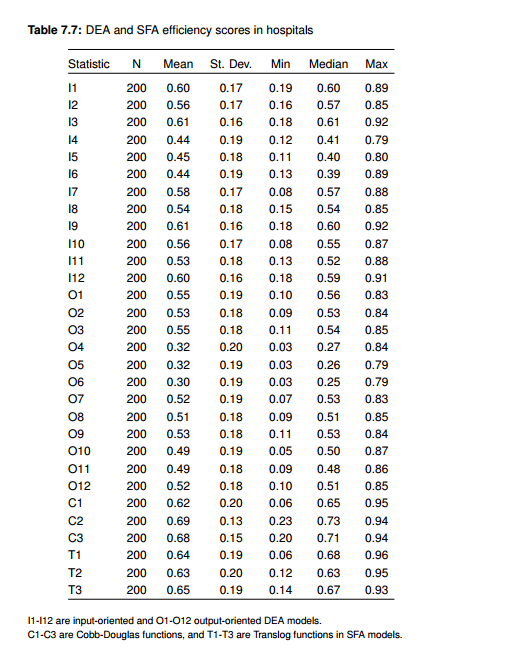{width="86%" fig-align="center"}

Efisiensi berorientasi keluaran adalah jumlah maksimal layanan (keluaran) yang diberikan jumlah tenaga kerja dan modal (input). Skor rata-rata 0,49 di DEA (O10) dan 0,64 di SFA (T1) menunjukkan bahwa kami dapat memperluas output masing-masing sebesar 104% dan 56% dengan tingkat semua sumber daya saat ini. Secara absolut, rumah sakit dapat memperluas kunjungan rawat jalan dengan 73.467 (menurut DEA) atau 39.705 (menurut SFA), serta dengan 9.309 (DEA) atau 5.031 (SFA) penerimaan per tahun, tanpa menambah jumlah staf atau tempat tidur. Kami menemukan bahwa hasil DEA lebih sensitif terhadap perubahan dalam spesifikasi variabel input dan output daripada model SFA, dengan korelasi antara model DEA mulai dari 0,47 hingga 0,83 dan antara model SFA dari 0,90 hingga 0,95 (lihat Tabel 7.8) .

Membandingkan semua model, kami menemukan bahwa korelasi antara orientasi keluaran DEA dan efisiensi SFA berkisar antara 0,16 hingga 0,76. Perkiraan korelasi validitas eksternal menyarankan bahwa disagregasi dokter akan meningkatkan korelasi efisiensi. Akhirnya, kami memasukkan dua model (Model O10 dan T1 dalam Tabel 7.8) dengan masing-masing perkiraan validitas internal yang tinggi dan estimasi validitas eksternal yang tinggi. Spesifikasi input model yang disukai termasuk padanan penuh waktu dari dokter non spesialis, padanan penuh waktu dari dokter spesialis, jumlah perawat dan bidan, jumlah staf lain dan jumlah tempat tidur. Spesifikasi yang lebih disukai adalah jumlah total penerimaan dan jumlah operasi.

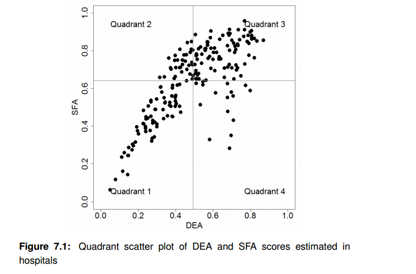{width="100%" fig-align="center"}

Gambar 7.1 menunjukkan sebaran plot rumah sakit; sumbu vertikal dan horizontal mewakili rata-rata menurut DEA dan SFA. Tampaknya 34% rumah sakit memiliki fasilitas kesehatan berkinerja rendah (di kiri bawah, Kuadran 1) sementara 43% berkinerja tinggi (di kanan atas, Kuadran 3) menurut kedua teknik. Skor 24% dari sisa fasilitas kesehatan tidak dapat disimpulkan (Kuadran 2 dan 4). Statistik skor kuadran antara DEA dan SFA disajikan pada Tabel 7.9. Terlepas dari variasi substansial yang ditemukan, rumah sakit di Kuadran 3 umumnya memiliki jumlah output rata-rata yang lebih tinggi daripada rumah sakit di kuadran lain. Adapun output yang dihasilkan, kunjungan rawat jalan dan penerimaan ditemukan memiliki cara yang berbeda secara signifikan di antara empat kuadran. Rumah sakit berkinerja tinggi ditemukan memiliki 2,3 kali lebih banyak penerimaan daripada rumah sakit berkinerja rendah. Rumah sakit di Kuadran 3 rata-rata memiliki tingkat input yang lebih tinggi bila dibandingkan dengan rumah sakit di kuadran lain, dan rumah sakit berkinerja tinggi memiliki 10% lebih banyak tempat tidur dibandingkan dengan rumah sakit berkinerja rendah. Selain itu, rasio penerimaan per dokter di rumah sakit berkinerja tinggi di Kuadran 3 adalah dua kali lipat dari mereka di rumah sakit berkinerja rendah. Kemungkinan hubungan antara karakteristik kontekstual dan skor efisiensi dinilai dalam subbagian berikut.

### Faktor-faktor Kontekstual

Hasil dari model DEA dua tahap dan model SFA satu tahap disajikan pada Tabel 7.10. Secara umum, faktor kontekstual internal dan eksternal ditemukan secara signifikan terkait dalam model DEA dan SFA. Arah koefisien untuk variabel sebagian besar konsisten melalui semua model. Sehubungan dengan faktor internal, ukuran rumah sakit yang lebih besar (Kelas A atau B) ditemukan berhubungan positif dengan skor efisiensi. Kepemilikan ditemukan signifikan hanya dalam model DEA, dengan kepemilikan publik berhubungan negatif dengan efisiensi. Kualitas setiap fasilitas seperti yang ditunjukkan oleh indeks gangguan rumah sakit dan indeks manajemen tidak ditemukan signifikan.

Adapun faktor eksternal, tiga ditemukan terkait dengan efisiensi: lokasi rumah sakit di daerah dengan cakupan asuransi kesehatan populasi tinggi melalui skema untuk pegawai negeri sipil, lokasi rumah sakit di Jawa atau Bali, dan tingkat pendidikan yang lebih rendah. Setiap peningkatan 10% dalam proporsi populasi dengan cakupan skema asuransi pegawai negeri menyebabkan peningkatan 0,09 poin dan 1,43 poin dalam efisiensi yang diprediksi dalam model DEA dan SFA. Peningkatan indeks satu unit dalam pendidikan tinggi dikaitkan dengan penurunan 0,07 poin dan 1,06 masing-masing, dalam efisiensi yang diprediksi menurut DEA dan SFA.

## Pembahasan

### Efisiensi Teknis

Seperti dibahas dalam Bab 6, pengukuran efisiensi diperlukan untuk memastikan bahwa sumber daya kesehatan untuk layanan dihabiskan seefisien mungkin. Mengingat bahwa tidak ada konsensus tentang metode terbaik untuk melakukannya, beberapa spesifikasi harus dikembangkan dan DEA dan SFA diterapkan untuk menentukan apakah hasilnya sensitif terhadap metode analitik (Jacobs, 2001). Meskipun kami menemukan, seperti peneliti sebelumnya (Jacobs, 2001; Xu et al., 2015), bahwa skor efisiensi DEA lebih mungkin berubah daripada model SFA dengan variabel input dan output yang berbeda, kami juga menemukan SFA peka terhadap output spesifik; kami dengan demikian tidak dapat menerapkan spesifikasi yang diterapkan dalam DEA.

Korelasi skor efisiensi antara SFA dan DEA dapat mengungkapkan ketidakkonsistenan, yaitu ketika DEA mengambarkan suatu Rumah Sakit sepenuhnya efisien tetapi SFA menunjukkan bahwa RS tersebut tidak efisien atau sebaliknya (Chirikos & Sear, 2000; Mathiyazhagan, 2007). Perbedaan skor efisiensi mungkin disebabkan oleh banyak faktor seperti sifat variabel lingkungan, kesalahan pengukuran, pencilan (outliers), dan kebisingan acak (random noise) lainnya (Jacobs, 2001; Katharakis et al., 2014).

Studi ini menunjukkan bahwa skor efisiensi SFA cenderung lebih tinggi daripada skor efisiensi DEA. Studi sebelumnya yang dilakukan di China, Thailand, dan Inggris yang menerapkan kedua metode bersama-sama juga menunjukkan efisiensi rata-rata SFA lebih tinggi daripada di DEA (Jacobs, 2001; Xu et al., 2015). Sebaliknya, perbandingan internasional terkait efisiensi teknis menemukan bahwa skor DEA yang dikoreksi dengan bootstrap sedikit lebih tinggi daripada skor SFA (Varabyova & Schreyogg, 2013).

Pada Gambar 7.1, Rumah Sakit dibagi menjadi tiga kelompok utama. Kelompok pertama terdiri dari rumah sakit yang skor efisiensinya sensitif terhadap teknik yang digunakan (Kuadran 2 dan 4), kelompok kedua terdiri dari rumah sakit yang terbukti efisien menggunakan kedua teknik (Kuadran 3), dan kelompok terakhir berisi rumah sakit di mana kedua teknik menunjukkan hasil tidak efisien (Kuadran 1). Kesimpulan tidak harus diambil dari skor rumah sakit yang ditempatkan pada kelompok pertama dan kedua; melainkan, mereka harus dianggap sebagai outlier (Jacobs et al., 2006). Teknik-teknik pengukuran kinerja serta analisis penyebab inefisiensi seharusnya digunakan untuk memperbaiki efisiensi RS yang berada pada kelompok ketiga.

### Variabel Kontekstual yang Mempengaruhi Efisiensi Teknis

Baik DEA maupun SFA digunakan untuk memeriksa ketepatan (robustness) terkait hubungan/asosiasi antara variabel kontekstual dan estimasi efisiensi (Nedelea & Fannin, 2012). Hasil kami menunjukkan bahwa kedua metode tersebut umumnya menghasilkan hasil yang sama terkait faktor-faktor yang menentukan efisiensi. Rumah sakit berkinerja tinggi cenderung memiliki kesamaan pada beberapa karakteristik: sebagian besar berukuran besar; lebih cenderung berada di daerah-daerah miskin dengan tingkat pendidikan yang rendah; dan mereka berlokasi di Jawa atau Bali. Beberapa perbedaan yang tampak pada hasil-hasil tersebut kemungkinan disebabkan oleh perbedaan interpretasi inefisiensi; seperti yang dibahas pada Bab 6, hanya SFA yang mempertimbangkan komponen acak dalam pengukuran (Jacobs et al., 2006; Varabyova & Schreyogg, 2013).

Ukuran rumah sakit adalah salah satu faktor internal yang ditemukan terkait dengan efisiensi. Studi oleh Colombi et al. (2017) dan Xenos et al. (2017) menemukan bahwa rumah sakit besar lebih efisien daripada rumah sakit kecil. Fasilitas kesehatan besar juga ditemukan memiliki pemanfaatan (utilisasi) yang lebih baik dan tingkat hunian tempat tidur (Bed Occupancy Rate) yang lebih tinggi daripada fasilitas kesehatan berukuran kecil (Mobley & Magnussen, 1998). Hasil ini dapat dijelaskan oleh fakta bahwa rumah sakit yang lebih besar cenderung dikelola dengan lebih baik dan mengalokasikan kembali sumber daya manusia secara tepat menggunakan target kinerja; selain itu, mereka memiliki kemampuan teknologi informasi yang lebih baik dan lebih inovatif (Mitropoulos et al., 2013; Shettian, 2017). Namun, Mitropoulos et al. (2013) menemukan tingkat efisiensi yang lebih rendah di rumah sakit menengah dan besar. Hasil yang berbeda di antara studi sebelumnya dapat mendukung argumen bahwa efek dari ukuran fasilitas kesehatan berbeda tergantung pada lokasi, dengan rumah sakit yang lebih besar ditemukan lebih efisien di daerah perkotaan dan rumah sakit yang lebih kecil ditemukan lebih efisien di daerah pedesaan (Asmild et al., 2013).

Mengenai kepemilikan, hasil dalam Bab ini kontras dengan temuan yang kami sajikan di Bab 5, di mana rumah sakit swasta tampak jauh lebih efisien daripada rumah sakit umum. Ada beberapa kemungkinan penjelasan untuk hasil ini. Sebuah studi baru-baru ini menunjukkan bahwa rumah sakit swasta berkinerja lebih baik daripada rumah sakit umum dalam hal efisiensi dan biaya karena sektor swasta memiliki lebih banyak fleksibilitas dalam mengelola pekerja kesehatan serta dalam membeli obat-obatan dan peralatan medis (Guerrini et al., 2017). Rumah sakit swasta juga dapat melakukan penghematan dengan mempekerjakan staf kontrak paruh waktu (Ensor & Indradjaya, 2012; Chatterjee et al., 2013). Temuan penelitian saat ini konsisten dengan ulasan Herrera dkk (2014), yang menunjukkan hasil yang beragam, apakah rumah sakit umum atau swasta berkinerja lebih baik. Perbedaan dalam tingkat efisiensi rumah sakit umum dan swasta mungkin juga disebabkan oleh perbedaan dalam mekanisme pembayaran mereka.

Sebuah studi oleh Barbetta et al. (2007) menemukan konvergensi dalam skor efisiensi rumah sakit swasta nirlaba dan rumah sakit umum setelah mereka melembagakan sistem pembayaran umum berbasis DRG.

Selain kepemilikan, klasifikasi rumah sakit pendidikan ditemukan memiliki hubungan negatif dengan skor efisiensi, meskipun tidak signifikan. Namun, pelayanan kesehatan bukan satu-satunya tujuan dari rumah sakit pendidikan, yang juga bertanggung jawab untuk pengajaran dan penelitian; pengobatan di rumah sakit pendidikan terkadang bisa lebih lama dari yang dibutuhkan secara medis (Xenos et al., 2017). Hasil ini konsisten dengan temuan penelitian lain di mana biaya rumah sakit pendidikan lebih tinggi daripada rumah sakit non-pendidikan karena mereka memberikan layanan kesehatan sub-spesialisasi, kasus parah yang dirujuk dari rumah sakit lain, dan jumlah residensi yang besar dan tidak proporsional (Lopez-Casasnovas & Saez, 1999; Medin et al., 2011). Karena itu hasil ini harus ditafsirkan dengan hati-hati. Indikator tambahan seperti biaya pengajaran dan penelitian, jumlah kutipan, dan publikasi harus dipertimbangkan untuk menilai tingkat efisiensi rumah sakit pendidikan (Medin et al., 2011).

Studi ini tidak menemukan hubungan antara proporsi pasien dengan Penyakit Tidak Menular (PTM) dan efisiensi. Mengobati PTM menuntut lebih banyak sumber daya kesehatan karena kompleksitas dan keparahan kondisi pasien (Herr, 2008; Medin et al., 2011), selain itu juga ada peningkatan prevalensi penyakit kronis seperti penyakit kardiovaskular dan diabetes mellitus. Sebagian besar pasien dengan penyakit tersebut memerlukan kunjungan tindak lanjut dan rawat inap secara teratur, yang umumnya meningkatkan pemanfaatan (Gonc¸alves dkk., 2015; IHME, 2016; Khanal, 2017). Satu penjelasan yang sesuai untuk hasil yang kami temukan mungkin terkait kesadaran yang lebih rendah dari bagian pasien dengan PTM kronis bahwa mereka memiliki kebutuhan untuk melakukan pemeriksaan kesehatan secara rutin.

Sehubungan dengan faktor eksternal, hasil kami mengenai lokasi geografis sesuai dengan studi sebelumnya oleh Barnum (1987) dan Berman et al. (1989) di mana rumah sakit Jawa ditemukan berkinerja lebih baik daripada rumah sakit di pulau-pulau lain. Hasil ini menunjukkan bahwa infrastruktur transportasi dan fasilitas kesehatan yang relatif baik di Jawa penting untuk mengurangi hambatan fisik terhadap akses perawatan kesehatan. Selain itu, kinerja yang buruk di pulau-pulau lain mungkin berasal dari permintaan pelayanan kesehatan yang rendah, kecenderungan untuk pergi ke layanan alternatif selain rumah sakit, kualitas layanan yang rendah, atau jumlah tempat tidur yang terlalu banyak (Over-bedding) (Barnum & Kutzin, 1993).

Temuan penting lain dari penelitian ini adalah hubungan positif antara cakupan asuransi kesehatan dan efisiensi; karena dengan hasil yang serupa pada Bab 5 dan 6 tetapi skema asuransi yang berbeda, ini menunjukkan bahwa asuransi kesehatan mengurangi hambatan keuangan untuk akses perawatan kesehatan dan meningkatkan pemanfaatan. Aspek lain yang perlu dipertimbangkan adalah kenyataan bahwa rawat inap berkaitan secara positif dengan tingkat pendidikan yang kurang dan mereka yang berada dalam tingkat ekonomi yang lebih lemah, karena pasien dalam kelompok-kelompok ini lebih sering menghadapi faktor risiko seperti obesitas, merokok dan gaya hidup menetap (Gonc¸alves et al. , 2015). Namun, penelitian oleh Rosko & Mutter (2010) dan Nedelea & Fannin (2013) di Amerika Serikat menemukan bahwa efek penerimaan Medicaid pada efisiensi tidak dapat disimpulkan.

Kami menemukan hubungan yang tidak meyakinkan antara akses ke fasilitas kesehatan dan efisiensi rumah sakit. Studi ini tidak dapat menunjukkan bahwa akses yang lebih baik ke fasilitas kesehatan meningkatkan efisiensi rumah sakit. Hasil yang agak kontradiktif ini mungkin disebabkan oleh kenyataan bahwa daerah dengan akses yang lebih baik ke rumah sakit juga memiliki konsentrasi rumah sakit yang relatif tinggi. Konsentrasi yang lebih tinggi menyebabkan permintaan yang lebih rendah di masing-masing rumah sakit, sehingga mengurangi efisiensi teknis (Cellini et al., 2000; Nedelea & Fannin, 2013).

Ketika pasien mengalami kesulitan dalam mengakses fasilitas perawatan primer dan kurang percaya pada kualitas fasilitas perawatan primer, mereka sering memotong layanan perawatan primer dan mengakses layanan darurat rumah sakit secara langsung (Yip & Hsiao, 2014; Gonc¸alves et al., 2015) . Faktor lain yang mungkin adalah penerimaan rumah sakit yang dapat dihindari berkurang dengan akses yang lebih baik ke perawatan primer. Tinjauan sistematis (Sistematic Review) oleh Rosano et al. (2013) menemukan hubungan terbalik 75% antara akses perawatan primer dan rawat inap.

### Dampak pada Kebijakan

Meningkatkan efisiensi teknis di rumah sakit sangat penting mengingat rumah sakit mewakili bagian besar dari pengeluaran kesehatan secara keseluruhan dan menyediakan layanan kunci untuk meningkatkan kesehatan populasi. Menilai efisiensi rumah sakit merupakan hal mendasar bagi banyak proses pengambilan keputusan terkait perawatan kesehatan. Seperti di fasilitas perawatan primer, pembuat kebijakan perlu memahami kelebihan dan kekurangan dari berbagai metode untuk menilai efisiensi rumah sakit dan harus mengintegrasikan pengukuran efisiensi ke dalam pemantauan berkala sistem kesehatan.

Realokasi sumber daya pelayanan kesehatan yang lebih baik diharapkan dapat meningkatkan efisiensi teknis. Namun, rumah sakit umum umumnya memiliki sedikit otonomi dalam hal ini karena peraturan birokrasi dan pemerintah (Yip & Hsiao, 2014) Rumah sakit umum membutuhkan lebih banyak fleksibilitas dalam keputusan pembelian, termasuk perekrutan dan pemberhentian, untuk memastikan adanya persaingan, memenuhi permintaan dan dengan demikian mengarah pada peningkatan efisiensi. Meskipun rumah sakit berkinerja tinggi lebih sering ditemukan di daerah yang populasinya memiliki tingkat pendidikan yang lebih rendah dan tingkat kemiskinan yang lebih tinggi, keputusan kebijakan berdasarkan hasil ini harus diambil dengan hati-hati; hasil ini mungkin mencerminkan layanan perawatan primer yang buruk di daerah tersebut, yang mengarah pada pemanfaatan rumah sakit yang lebih tinggi. Oleh karena itu, memperkuat dan meningkatkan kualitas dan kuantitas fasilitas perawatan primer di daerah pedesaan, di mana ketersediaan layanan kesehatan terbatas dan peralatan dasar sering buruk, sangat penting (Mahendradhata et al., 2017). Melakukan hal itu akan mendorong pasien untuk memanfaatkan perawatan primer sebelum mengakses rumah sakit, sehingga mengurangi rawat inap yang tidak perlu. Integrasi antara rumah sakit dan fasilitas perawatan primer juga penting karena meningkatkan efisiensi keseluruhan sistem kesehatan.

Implikasi kebijakan lain dari penelitian ini adalah pentingnya cakupan kesehatan universal nasional (UHC). Salah satu tujuan UHC adalah untuk melindungi orang dari pengeluaran kesehatan yang sangat besar, sehingga meningkatkan akses mereka ke layanan kesehatan. Perluasan UHC karena itu diharapkan untuk meningkatkan pemanfaatan, yang mengarah pada efisiensi yang lebih tinggi. Terlepas dari cakupan populasi, pengalaman internasional juga menunjukkan bahwa sistem pembayar tunggal dalam konteks UHC memungkinkan kontrol pertumbuhan pengeluaran kesehatan (Yip & Hsiao, 2014).

## Keterbatasan

Penelitian ini memiliki beberapa keterbatasan dikarenakan adanya keterbatasan pada data dan metode yang digunakan. Penelitian ini dapat diulangi dengan menggunakan data terbaru dan data longitudinal; dengan demikian perubahan pada efisiensi yang terjadi akibat perubahan kebijakan dan intervensi, terutama yang terkait dengan penerapan JKN di tahun 2014, dapat terlihat.

Selain itu, data longitudinal akan membantu mengatasi outlier dan membedakan antara outlier yang benar dan kesalahan pengukuran. Namun demikian, penelitian ini menunjukkan kelayakan melakukan penilaian tingkat nasional dari berbagai jenis rumah sakit dan termasuk faktor kontekstual. Penelitian lebih lanjut harus dilakukan untuk menyelidiki efisiensi rumah sakit sehubungan dengan perluasan perawatan kesehatan primer.

## Kesimpulan

Hasil dari studi empiris ini mengindikasikan ada variasi efisiensi yang luas antar RS. Faktor internal (ukuran RS dan kepemilikan) dan faktor eksternnal (lokasi geografis, cakupan jaminan kesehatan dan tingkat pendidikan) terlihat sebagai faktor penting yang menentukan efisiensi RS. RS dengan performa yang baik secara umum berada di wilayah yang memiliki cakupan jaminan kesehatan untuk PNS yang luas dan berada di Jawa dan Bali. Temuan lain yang menarik adalah efisiensi fasilitas kesehatan tidak dapat dijelaskan oleh kualitas nya. Sehingga penting untuk memasukkan penilaian efisiensi ke dalam monitoring sistem kesehatan yang rutin.
