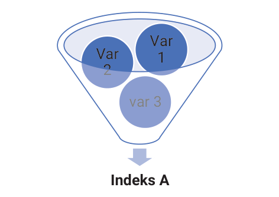
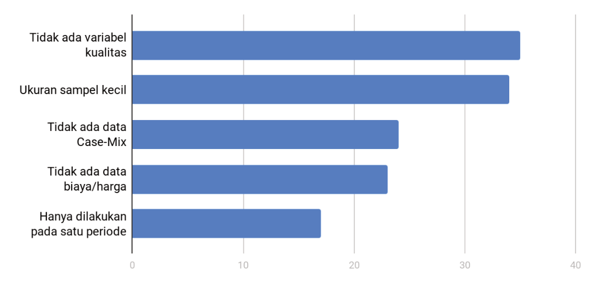

# Isu-Isu pada Pengukuran Efisiensi {#sec-isu}

Dalam melakukan analisis efisiensi fasilitas kesehatan, selain pengetahuan mengenai metodologi dan aplikasinya, peneliti juga harus memahami isu-isu yang terkait. Beberapa di antaranya, yaitu pengetahuan tentang sumber data yang bisa digunakan, aspek persiapan data, permasalahan etik, dan permasalahan metodologis yang lebih dalam. Dengan begitu, peneliti dapat melakukan analisis secara lebih baik dan bertanggung jawab, mampu menginterpretasikan hasil sesuai dengan konteks, serta menyadari adanya kekurangan dalam analisis yang dibuatnya. Oleh karena itu, bab ini akan memberikan penjelasan secara ringkas mengenai isu-isu penting yang belum dibahas pada bab-bab sebelumnya.

## Sumber Data

Pada latihan analisis efisiensi yang ada dalam Bab [IV](#sec-rasio) sampai dengan VI, pembaca sudah diberikan *dataset* yang lengkap dan bersih. Akan tetapi, pada kenyataannya, ketika melakukan analisis efisiensi secara mandiri, pembaca akan dihadapkan pada kenyataan bahwa tahap pertama yang harus dilakukan adalah mencari sumber data yang tepat. Proses tersebut dapat berupa pengumpulan data mandiri (menggunakan data primer) maupun menggunakan data sekunder (dari survei yang sudah dilakukan oleh pihak lain ataupun data administratif).

Pengumpulan data secara mandiri akan memakan sumber daya yang lebih besar. Akan tetapi, dari segi kelengkapan variabel dan kualitasnya, data primer cenderung lebih mudah dikendalikan oleh peneliti. Sementara itu, dengan data sekunder, sumber daya yang digunakan akan lebih sedikit, namun perlu disadari bahwa ketersediaan variabel dan kualitas data tidak bisa sepenuhnya dikendalikan oleh peneliti. Di sisi lain, penggunaan sumber data sekunder justru bisa meningkatkan kebermanfaatan dari survei yang sudah dilakukan sebelumnya. Oleh karena itu, bagian ini akan lebih fokus pada penjelasan mengenai data sekunder yang tersedia di Indonesia. Data tersebut di antaranya sebagai berikut.

### Riset Pembiayaan Fasilitas Kesehatan

Kementerian Kesehatan Indonesia (Kemenkes) melakukan Riset Pembiayaan Fasilitas Kesehatan Nasional atau *Health Facility Costing Study* (HFCS) pada tahun 2010. Tujuan utama dari penelitian ini, yaitu untuk memberikan pemahaman yang lebih baik tentang biaya pemberian layanan kesehatan di seluruh negeri. Studi prospektif dilakukan antara Oktober 2010 dan September 2011 di 15 provinsi dan 30 kabupaten di Indonesia. Sampel fasilitas kesehatan dipilih melalui proses *stratified random sampling* (Ensor dan Indradjaya, 2012). Survei mengumpulkan data tentang layanan, sumber daya (infrastruktur, peralatan, staf, obat-obatan, dan persediaan medis), dan pengeluaran (misalnya biaya perlengkapan kantor, pemeliharaan, dan transportasi) untuk 234 puskesmas (3%) dan 202 rumah sakit (12%) (Kemenkes, 2012e).

### Survei Sosioekonomi Nasional

Survei Sosioekonomi Nasional (Susenas) merupakan serangkaian survei sosial ekonomi multiguna skala besar yang dilakukan di Indonesia. Ini merupakan sampel perwakilan kabupaten. Pada tahun 2011, Susenas mencakup sampel yang representatif secara nasional, terdiri atas 300.000 rumah tangga dari 33 provinsi dan 497 kabupaten di seluruh Indonesia. Survei ini terdiri atas daftar rumah tangga dan informasi tambahan tentang perawatan kesehatan dan gizi, pendapatan rumah tangga, pengeluaran, pengalaman angkatan kerja, dan lain-lain.

### Survei Potensi Desa

Statistik Potensi Desa (Podes) memberikan informasi tentang karakteristik desa untuk seluruh Indonesia. Podes adalah sensus yang menyediakan informasi tentang karakteristik desa di seluruh Indonesia, meliputi jumlah populasi, sumber utama pendapatan keluarga, ketersediaan dan akses ke fasilitas kesehatan, dan tingkat kematian. Pada tahun 2011, data dikumpulkan dari 77.126 desa di 6.651 kecamatan dan 497 kabupaten. Sensus infrastruktur juga dilakukan untuk mengumpulkan informasi tentang infrastruktur publik, termasuk lembaga kesehatan di desa. Jenis fasilitas kesehatan yang dicatat, yaitu layanan kesehatan primer, pos kesehatan desa, pos kesehatan persalinan, dan pos kesehatan terpadu.

### *Dataset Indonesia Case-Based Group* (INA-CBGs)

Sejak 2007, sistem *diagnosis-related group* (DRG), yaitu *Indonesia Case Base Group* (INA-CBGs), telah digunakan untuk mengganti biaya rumah sakit di bawah skema Jamkesmas. *Dataset* INA-CBGs berisi informasi tingkat pasien yang terkait dengan demografi pasien, diagnosis, dan tarif penggantian. Data tingkat pasien dalam *dataset* INA-CBGs tidak dapat digunakan dengan model bertingkat dalam tesis ini karena data terbatas pada rumah sakit yang dikontrak dalam skema Jamkesmas (hanya 60% dari sampel dicocokkan dengan *dataset* HFCS sebagai *dataset* utama).

Namun, variabel kunci berupa kode DRG, tarif DRG, dan jenis pembuangan yang berguna untuk mewakili kerumitan pasien di rumah sakit. Untuk mempertimbangkan beban penyakit dan kualitas, keluaran rumah sakit disesuaikan menggunakan *case-mix index* (CMI) dan rasio kematian (Witter *et al*., 2000; AHRQ, 2013).

### Data Sampel BPJS Kesehatan

Pada tahun 2018, BPJS Kesehatan mengeluarkan data sampel pelayanan Jaminan Kesehatan Nasional tahun 2015–2016. Data ini berisi karakteristik peserta dan klaim pelayanan kesehatan di semua tingkat dari 1% peserta yang tercatat aktif terdaftar pada tanggal 31 Desember 2015. Pengambilan sampel dilakukan melalui metode *stratified random sampling* dengan strata dari kombinasi variabel tempat FKTP terdaftar dan kategori keluarga berdasarkan pemanfaatan pelayanan kesehatan.

Set data ini terdiri atas data sampel kepesertaan, data sampel pelayanan FKTP (fasilitas kesehatan tingkat pertama) kapitasi dan nonkapitasi, serta data sampel pelayanan FKRTL (fasilitas kesehatan rujukan tingkat lanjut). Sampel ini berisi observasi pada 1.697.452 individu, 1.733.759 pelayanan FKTP kapitasi, 104.456 pelayanan FKTP nonkapitasi, dan 906.905 pelayanan FKRTL. Secara ringkas, sumber data yang sudah dijelaskan tersebut dapat dirangkum pada tabel berikut.

| Data | Keterangan | Tahun | Penggunaan |
|:--|:--|:--|:--|
| HFCS | Fasilitas kesehatan (RS dan puskesmas) | 2010 | Variabel input dan output per fasilitas kesehatan |
| Susenas | Individu dan rumah tangga se-Indonesia | 1976, tiap tahun sejak 1978 | Variabel kontekstual: tingkat pendidikan, tingkat kemiskinan, cakupan jaminan kesehatan, dan lain-lain |
| Podes | Desa seluruh Indonesia | Sejak 1983, tiap 3–4 tahun | Variabel kontekstual: jumlah fasilitas kesehatan dan tenaga kesehatan, ketersediaan infrastruktur |
| INA-CBGs | Data INA-CBGs per kasus per rumah sakit | Sejak tahun 2007 | Variabel indeks casemix (bauran kasus) |
| Data Sampel BPJS | Sampel data klaim dari 1% peserta JKN | 2015–2016 | Rasio utilisasi peserta JKN, satuan biaya pelayanan per kasus atau kelompok kasus, dan indeks casemix di level kabupaten/kota |

: Rangkuman informasi terkait sumber data potensial untuk melakukan analisis efisiensi {#tbl-7-1}

## Persiapan Data

Dengan banyaknya sumber data sekunder yang bisa dimanfaatkan, peneliti perlu melakukan persiapan data terlebih dahulu sebelum masuk pada analisis. Tahapan ini biasanya dimulai dengan mengidentifikasi variabel-variabel yang dibutuhkan dan mengidentifikasi sumber data yang memungkinkan. Seringnya, peneliti harus menggabungkan beberapa sumber data dengan pertimbangan tertentu untuk mendapatkan variabel lengkap sesuai yang dibutuhkan. Oleh karena itu, tahapan ini merupakan hal yang cukup penting dalam melakukan semua jenis analisis, termasuk pengukuran efisiensi fasilitas kesehatan.

## Isu Metodologi

Isu ketiga yang penting untuk dipahami adalah aspek metodologis di luar pengetahuan mengenai teknik analisis efisiensi itu sendiri. Bagian ini akan membahas tentang penggunaan indeks bauran kasus atau *casemix index* yang dapat digunakan sebagai faktor penyesuai (*adjustment factor*) saat melakukan pengukuran *output*, penyederhanaan pengukuran variabel kontekstual, serta isu-isu terkait keterbatasan penelitian.

### Penggunaan *Casemix Index*

Pada beberapa bagian buku ini, sudah sering disinggung mengenai *casemix index* (CMI) atau indeks bauran kasus (IBK) sebagai variabel yang dapat mewakili kompleksitas pelayanan yang diberikan oleh suatu fasilitas kesehatan. CMI yang lebih tinggi menandakan pasien dengan kasus yang lebih kompleks dirawat dengan cara mengonsumsi sumber daya kesehatan yang lebih besar. Volume pasien CMI yang disesuaikan memungkinkan perbandingan di rumah sakit. Tarif rata-rata setiap kelompok kasus dasar bagi semua rumah sakit digunakan untuk memperkirakan CMI.

Karena ada tarif yang berbeda untuk setiap kelas rumah sakit di Indonesia, penulis menggunakan tarif rata-rata untuk setiap kelompok kasus bagi semua rumah sakit. Kemudian, CMI untuk rumah sakit (*k*) dihitung menggunakan persamaan berikut untuk layanan rawat jalan dan rawat inap.

$$
CMI_i = \frac{\left(\sum_{k=1}^{K}\overline{tarif_k} \times M_{ki}\right) \Big/ \sum_{i=1}^{I} M_i}
{\left(\sum_{k=1}^{K}\overline{tarif_k} \times \sum_{i=1}^{I} M_{ki}\right) \Big/ \sum_{k=1}^{K}\sum_{i=1}^{I} M_{ki}},
\qquad
\overline{tarif_k} = \frac{\sum_{m_k=1}^{M_k} tarif_k}{M_k}
$$ {#eq-7-1}

Adapun *tarif*~k~ adalah tarif rata-rata untuk DRG *k*, dan *M*~ki~ adalah jumlah pasien dengan DRG *k* di rumah sakit *i*.

Indikator kualitas di rumah sakit dapat dibangun menggunakan rasio mortalitas atau angka kematian (*mortality ratio*). Rasio yang lebih kecil dari satu menunjukkan kualitas yang baik. Rasio mortalitas dihitung menggunakan persamaan berikut.

$$
\begin{aligned}
mort\_ratio_i &= \frac{act\_death_i}{exp\_death_i}\\
exp\_death_i &= \sum_{k=1}^{K} death\_rate_k \times adm_{ki}\\
death\_rate_k &= death_k / adm_k
\end{aligned}
$$ {#eq-7-2}

Adapun *mort_ratio*~i~ adalah rasio kematian; *act_death*~i~ adalah jumlah aktual kematian yang terjadi di rumah sakit *i* di atas jumlah kematian yang diharapkan di rumah sakit I (*exp_mort*). Angka kematian rata-rata, *death_rate*, merupakan jumlah kematian (*death*) untuk DRG *k* dibagi jumlah admisi (*adm*) untuk DRG *k*. Jumlah admisi dan hari tidur disesuaikan dengan indikator kualitas (tingkat kematian dikali rasio kematian). *adj_admissions*~i~ *= admissions*~i~ *× CMI*~i~ *× (1 – death_rate*~i~ *× mort_ratio*~i~*)*

$$adj\_beddays_i = beddays_i \times (1 - death\_rate \times mort\_ratio_i)$$ {#eq-7-3}

Rumah sakit dengan rasio kematian yang lebih rendah meningkatkan jumlah pemulangan di rumah sakit, atau rasio kematian yang lebih tinggi mengurangi tingkat kelangsungan hidup. Indeks campuran kasus Jamkesmas dapat mencerminkan campuran kasus rumah sakit karena jumlah penerima manfaatnya yang besar. Rata-rata, berdasarkan HFCS, pasien Jamkesmas mewakili 24% pasien rawat inap dan 14% dari kunjungan rawat jalan. Empat puluh tujuh persen penerima Jamkesmas berada di tiga desil pendapatan terbawah, 32% di desil pendapatan menengah, dan 20% di desil pendapatan tiga teratas (Marzoeki *et al*., 2014). *Dataset* dipasok oleh Pusat Pembiayaan Kesehatan dan Asuransi di Departemen Kesehatan Indonesia. Penelitian ini menggunakan *dataset* INA-CBGs 2011, yang menghubungkannya dengan *dataset* HFCS menggunakan ID fasilitas kesehatan unik yang dihasilkan oleh Kementerian Kesehatan.

### Penyusunan Variabel Kontekstual

Permasalahan selanjutnya yang perlu diperhatikan, yaitu banyaknya variabel kontekstual yang tersedia dalam *dataset* dapat meningkatkan potensi terjadinya korelasi yang kuat antarvariabel, terutama saat melakukan analisis regresi multivariat (Everitt dan Hothorn, 2011). Dampaknya, hasil estimasi statistik bisa mengalami bias. Untuk mengatasi masalah tersebut, *principal component analysis* (PCA) dapat digunakan untuk membuat variabel baru yang lebih sedikit dari beberapa variabel yang saling berkorelasi (Jolliffe *et al.*, 2020).

Caranya, yaitu dengan melakukan pengelompokan variabel sebelum melakukan analisis PCA untuk tujuan interpretasi hasil. Kemudian, dengan melakukan analisis PCA, variabel-variabel tersebut diubah menjadi suatu variabel indeks baru berdasarkan kategori (misalkan indeks gangguan fasilitas kesehatan, indeks manajemen kualitas, indeks kemiskinan, indeks akses ke fasilitas kesehatan, dan indeks pendidikan penduduk). Ilustrasi dapat dilihat pada @fig-7-1.

#### Indeks A

 var 3

 Var

2

 Var

1

{#fig-7-1}

### Keterbatasan Penelitian

Berdasarkan tinjauan sistematis yang dilakukan oleh Hafidz, Ensor, dan Tubeuf (2018b) terhadap penelitian-penelitian mengenai efisiensi fasilitas kesehatan di negara-negara berkembang, terdapat beberapa keterbatasan penelitian yang perlu diperhatikan. Permasalahan yang paling sering muncul, yaitu tidak tersedianya variabel kualitas fasilitas kesehatan, ukuran sampel yang kecil, tidak adanya data *casemix*, tidak adanya data terkait harga, dan penelitian yang dilakukan pada satu waktu saja.

Sebanyak 35 studi (26%) menunjukkan kurangnya ketersediaan indikator kualitas, yang menyebabkan ketidakmampuan dalam menyesuaikan variabel *output* untuk kualitas. Tiga puluh empat penelitian (25%) menyatakan ukuran sampel kecil sebagai batasan (@fig-7-2).

{#fig-7-2}

Rata-rata, ukuran sampel fasilitas kesehatan yang dianalisis dalam studi ialah 101, dengan rata-rata 74 fasilitas untuk analisis yang dilakukan di rumah sakit dan 102 fasilitas dalam *setting* layanan primer. Jumlah rata-rata *output* adalah 3 (kisaran: 1 hingga 14); jumlah rata-rata *input* juga 3 (kisaran: 1 hingga 11). Dua puluh tiga studi (17%) menunjukkan bahwa data biaya dan harga sulit dikumpulkan. Tantangan ini mengarahkan para peneliti untuk menggunakan DEA, bukan SFA yang membutuhkan data keuangan. Kurangnya informasi campuran kasus untuk melakukan pembobotan keluaran juga dicatat sebagai keterbatasan dalam 24 studi (18%).

Temuan ini menjadi gambaran bagi para peneliti selanjutnya bahwa salah satu tantangan terbesar dalam melakukan pengukuran efisiensi fasilitas kesehatan adalah tidak lengkapnya data yang dibutuhkan. Oleh karena itu, sebelum melakukan studi pengukuran efisiensi, setiap peneliti hendaknya dapat memastikan ketersediaan data untuk melakukan analisis yang diinginkan; atau menyesuaikan pilihan teknik pengukuran sesuai dengan data yang bisa dikumpulkan. Selain itu, bagi pengambil kebijakan, temuan ini juga penting untuk memperbaiki ketersediaan sumber data administratif (kualitas layanan, pembiayaan, campuran kasus) untuk menyokong penelitian-penelitian yang lebih kuat di masa depan.

## Izin Etik atau Ethical Clearance

Seperti yang dijelaskan pada bagian A, analisis efisiensi dapat dilakukan dengan data primer (peneliti melakukan pengumpulan data sendiri) atau data sekunder dari survei yang sudah dilakukan sebelumnya oleh pihak lain. Jika analisis efisiensi dilakukan menggunakan data sekunder, peneliti tidak memerlukan izin etik untuk melakukan penelitian efisiensi. Hal ini karena pihak yang mengumpulkan data (penyurvei seperti BPS atau Kementerian Kesehatan) sudah melakukan perizinan etik sebelum melakukan pengumpulan data.

Namun, peneliti harus memperhatikan aturan penggunaan dari masing-masing data, misalnya, apakah diperlukan izin tertulis dari penyurvei atau ketentuan yang lain. Pada saat publikasi, peneliti bisa menyebutkan bahwa data yang digunakan sudah melalui perizinan etik oleh pihak pengambil data. Informasi ini bisa didapat dari buku panduan penggunaan data yang biasanya disertakan pada setiap set data sekunder. Jika informasi tertulis tidak ada maka peneliti dapat berkorespondensi dengan pihak penyurvei untuk mendapatkan keterangan lebih lanjut.

## Kesimpulan

- Terdapat beberapa isu tambahan yang harus diperhatikan oleh peneliti ketika melakukan analisis efisiensi fasilitas kesehatan. Di antaranya, pemilihan sumber data, persiapan data sebelum analisis, penggunaan indeks *case*mix, kemungkinan keterbatasan penelitian, penyusunan variabel kontekstual, dan perizinan etik.

- Analisis efisiensi dapat dilakukan menggunakan data primer maupun data sekunder. Beberapa sumber data sekunder di Indonesia yang bisa dimanfaatkan oleh peneliti, antara lain Riset Pembiayaan Fasilitas Kesehatan, Survei Sosioekonomi Nasional, Survei Potensi Desa, data INA-CBGs, dan data sampel BPJS Kesehatan.
