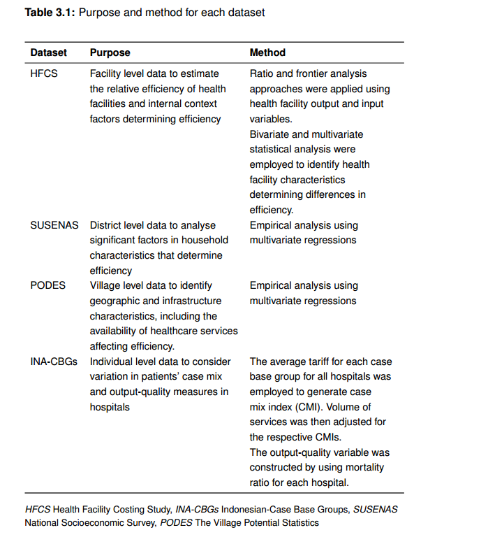
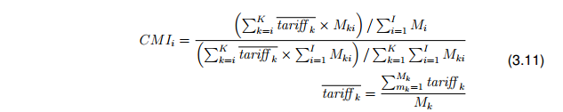
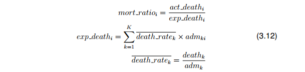
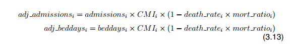

# Isu-Isu pada Pengukuran Efisiensi {#sec-isu}

## Pendahuluan

## Sumber data di Indonesia

Beberapa sumber data yang dapat digunakan dalam melakukan studi efisiensi fasilitas kesehatan di Indonesia antara lain:

### Riset Pembiayaan Fasilitas Kesehatan

Kementerian Kesehatan Indonesia (Depkes) melakukan Riset Pembiayaan Fasilitas Kesehatan Nasional (HFCS) pada tahun 2010. Tujuan utama dari penelitian ini adalah untuk memberikan pemahaman yang lebih baik tentang biaya pemberian layanan kesehatan di seluruh negeri. Studi prospektif dilakukan antara Oktober 2010 dan September 2011 di 15 provinsi dan 30 kabupaten di Indonesia.

Sampel fasilitas kesehatan dipilih melalui proses *stratified random sampling* (Ensor & Indradjaya, 2012). Survei mengumpulkan data tentang layanan, sumber daya (infrastruktur, peralatan, staf, obat-obatan, dan persediaan medis), dan pengeluaran (mis. Biaya perlengkapan kantor, pemeliharaan, dan transportasi) untuk 234 Puskesmas (3%) dan 202 rumah sakit (12%) (Kemenkes, 2012e).

{width="100%" fig-align="center"}

### Survei Sosioekonomi Nasional

Survei Sosial Ekonomi Nasional (SUSENAS) adalah serangkaian survei sosial ekonomi multiguna skala besar yang dilakukan di Indonesia. Ini adalah sampel perwakilan kabupaten. Pada tahun 2011, SUSENAS mencakup sampel yang representatif secara nasional yang terdiri dari 300.000 rumah tangga dari 33 provinsi dan 497 kabupaten di seluruh Indonesia. Survei ini terdiri dari daftar rumah tangga dan informasi tambahan tentang perawatan kesehatan dan gizi, pendapatan rumah tangga, pengeluaran, pengalaman angkatan kerja, dll.

### Survei Potensi Desa

Statistik Potensi Desa (PODES) memberikan informasi tentang karakteristik desa untuk seluruh Indonesia. PODES adalah sensus yang menyediakan informasi tentang karakteristik desa di seluruh Indonesia seperti ukuran populasi, sumber utama pendapatan keluarga, ketersediaan dan akses ke fasilitas kesehatan, dan tingkat kematian. Pada tahun 2011, data dikumpulkan dari 77.126 desa di 6.651 kecamatan, dan 497 kabupaten. Sensus infrastruktur juga dilakukan untuk mengumpulkan informasi tentang infrastruktur publik termasuk lembaga kesehatan di desa. Jenis fasilitas kesehatan yang dicatat adalah: layanan kesehatan primer, pos kesehatan desa, pos kesehatan persalinan, dan pos kesehatan terpadu.

### Dataset Indonesia Case-Based Group (INA-CBGs)

Sejak 2007, sistem *Diagnosis-Related Group* (DRG), yaitu Indonesia *Case Base Group* (INA-CBGs), telah digunakan untuk mengganti biaya rumah sakit di bawah skema Jamkesmas. Dataset INA-CBGs berisi informasi tingkat pasien yang terkait dengan demografi pasien, diagnosis, dan tarif penggantian. Data tingkat pasien dalam dataset INA-CBGs tidak dapat digunakan dengan menggunakan model bertingkat dalam tesis ini karena data terbatas pada rumah sakit yang dikontrak dalam skema Jamkesmas (hanya 60% dari sampel dicocokkan dengan dataset HFCS sebagai dataset utama). Namun, variabel kunci adalah kode DRG, tarif DRG, dan jenis pembuangan, yang berguna untuk mewakili kerumitan pasien di rumah sakit. Untuk mempertimbangkan beban penyakit dan kualitas, keluaran rumah sakit disesuaikan dengan menggunakan *case mix index* (CMI) dan rasio kematian (Witter et al., 2000; AHRQ, 2013).

## Indeks casemix

Indeks campuran kasus atau *casemix index* (CMI) yang lebih tinggi berarti bahwa pasien dengan kasus yang lebih kompleks dirawat dengan cara yang mengkonsumsi sumber daya kesehatan yang lebih besar. Volume pasien CMI yang disesuaikan memungkinkan perbandingan di rumah sakit. Tarif rata-rata untuk setiap kelompok kasus dasar untuk semua rumah sakit digunakan untuk memperkirakan CMI.

Karena ada tarif yang berbeda untuk setiap kelas rumah sakit di Indonesia, kami menggunakan tarif rata-rata untuk setiap kelompok kasus untuk semua rumah sakit. Kemudian, CMI untuk rumah sakit k dihitung menggunakan persamaan berikut untuk layanan rawat jalan dan rawat inap:

{width="100%" fig-align="center"}

di mana *tariff_k* adalah tarif rata-rata untuk DRG k, dan Mki adalah jumlah pasien dengan DRG k di rumah sakit i.

Indikator kualitas di rumah sakit dibangun dengan menggunakan rasio kematian. Rasio yang lebih kecil dari satu menunjukkan kualitas yang baik. Rasio mortalitas dihitung menggunakan persamaan berikut:

{width="100%" fig-align="center"}

di mana *mort_rasioi* adalah rasio kematian; *act_death_i* adalah jumlah aktual kematian yang terjadi di rumah sakit i di atas jumlah kematian yang diharapkan di rumah sakit I (*exp_mort*). Angka kematian rata-rata, *death_rate*, adalah jumlah kematian (*death)* untuk DRG k dibagi jumlah admisi (*adm*) untuk DRG k. Jumlah admisi dan hari tidur disesuaikan dengan indikator kualitas (tingkat kematian kali rasio kematian).

{width="96%" fig-align="center"}

Rumah sakit dengan rasio kematian yang lebih rendah meningkatkan jumlah pemulangan di rumah sakit, atau rasio kematian yang lebih tinggi mengurangi tingkat kelangsungan hidup. Indeks campuran kasus Jamkesmas dapat mencerminkan campuran kasus rumah sakit karena jumlah penerima manfaatnya yang besar. Rata-rata, berdasarkan HFCS, pasien Jamkesmas mewakili 24% pasien rawat inap dan 14% dari kunjungan rawat jalan. Empat puluh tujuh persen penerima Jamkesmas berada di tiga desil pendapatan terbawah, 32% di desil pendapatan menengah, dan 20% di desil pendapatan tiga teratas (Marzoeki et al., 2014). Dataset dipasok oleh Pusat Pembiayaan Kesehatan dan Asuransi di Departemen Kesehatan Indonesia. Penelitian ini menggunakan dataset INA-CBGs 2011, yang menghubungkannya dengan dataset HFCS menggunakan ID fasilitas kesehatan unik yang dihasilkan oleh Kementerian Kesehatan.

## Isu etik

Studi analisis sekunder kuantitatif tidak memerlukan tinjauan etik universitas (lihat Gambar A.3 dalam Lampiran A). Kumpulan data yang digunakan pada studi ini dianonimkan dan tersedia untuk umum, dan izin untuk menggunakannya telah diperoleh dari Kementerian Kesehatan Indonesia (lihat Gambar A.4, A.5 dan A.6 dalam Lampiran A) dan dari Biro Pusat Statistik (BPS) Indonesia (lihat Gambar A.7 dalam Lampiran A). BPS Indonesia tidak bertanggung jawab atas penggunaan data atau interpretasi atau kesimpulan berdasarkan penggunaan data.

## Dampak pada kebijakan di Indonesia
